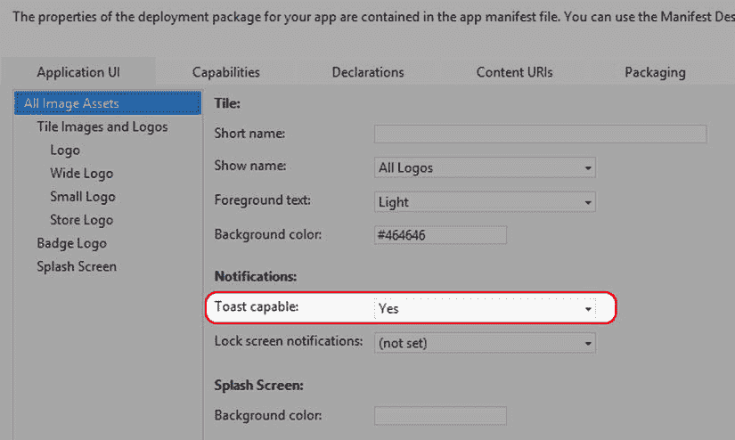
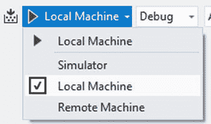
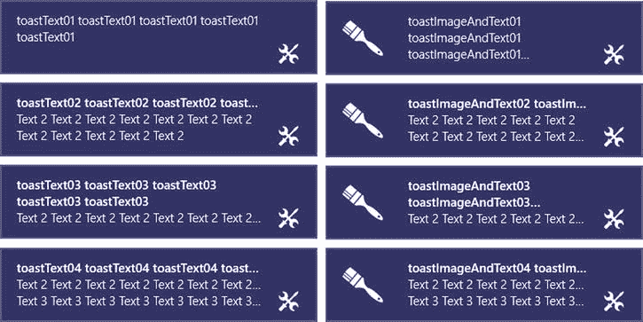

第二十一章


通知和磁贴

在我看来，Windows 8 最好的一个特点是，只要看一眼屏幕，就能获得如此多的信息。

随着 Live Tiles 的引入，应用程序可以以小块的形式向用户提供最新的信息。在许多情况下，我只需要摘要信息(“你的下一次会议是明天早上在约翰的办公室”或“现在气温 78 度，阳光明媚”)，而其他时候，它会提示我启动应用程序以获得更多细节(“约翰刚刚通过电子邮件向我发送了我们会议的议程”或“我安装的四个应用程序有可用的更新”)。此外，toast 通知是一个小矩形，在屏幕的右上角显示一条简短的消息，无论您是在开始屏幕上还是使用其他应用程序，它都是一种在发生事情时从应用程序获取更新的好方法。

在这一章中，我将介绍几种不同的方法，让你的用户可以方便地访问你的应用程序中的信息。我将介绍用于显示小更新的 toast 通知和 Live Tiles，我还将介绍用于让用户快速访问应用程序中常用屏幕的辅助 Tiles。

吐司通知

Toast 通知，有时简称为*toast*或*通知*，是从应用程序向用户提供简短、及时信息的一种很好的方式。这些通知在屏幕的上角显示为一个小矩形，无论用户在计算机上做什么，无论是使用您的应用程序、使用不同的 Windows 应用商店应用程序 、在开始屏幕上还是在桌面上，这些通知都会出现(参见[图 21-1](#Fig1) )。用户可以单击通知来激活您的应用程序；他们可以驳回通知；或者他们可以简单地忽略它，它就会消失。


[图 21-1](#_Fig1) 。Toast 通知，同时使用商店应用程序，提醒我写这一章

有几种类型的通知可用:

*   *Local* :当用户使用您的应用程序时创建并显示的通知
*   *Scheduled* :在用户使用你的应用程序时创建的通知，但是直到将来某个特定的时间才会显示，那时用户可能在使用你的应用程序，也可能不在使用
*   *Push* :从远程服务器(如 Windows Azure Mobile Services)创建并发送的通知，显示用户是否正在使用你的应用程序

本地通知

在这一节中，我将向您展示如何向 Clok 添加一个简单的 toast 通知。当用户在定时器已经运行的情况下恢复时钟时，将显示通知，告知用户定时器已经运行了多长时间。

对应用程序清单的更改

在您的应用程序可以显示任何 toast 通知之前，您必须在应用程序清单中做一个小的配置更改。这是一个很容易被忽视的简单步骤。如果忽略此步骤，则不会出现错误；创建通知的代码只是被悄悄地忽略了。在我意识到我的错误之前，我曾经浪费了大约十分钟试图找出为什么通知没有被显示。

幸运的是，这是一个简单的改变。打开`package.appxmanifest`并向下滚动到应用程序 UI 选项卡的可视资产部分。从左侧列表中选择所有图像资产，并将 Toast capable 设置为 Yes(见[图 21-2](#Fig2) )。



[图 21-2](#_Fig2) 。启用 toast 通知

此外，Windows 模拟器的一个限制是它不显示 toast 通知。在测试该功能之前，确保您的调试目标设置为本地机器或远程机器(见[图 21-3](#Fig3) )。



[图 21-3](#_Fig3) 。更改调试目标

Toast 通知模板

当决定向用户显示通知时，您必须仔细考虑必须包含哪些信息。根据你的需要，你可以从 WinRT 库中的八个模板中选择一个(见[图 21-4](#Fig4) )。



[图 21-4](#_Fig4) 。WinRT 中可用的 toast 通知模板

所有八个图标都包括在`package.appxmanifest`中为您的应用指定的小图标。其中四个模板允许您指定要包含的文本—根据您选择的模板，在一至三段之间。例如，如果您需要显示一个简短的句子，您可以选择`toastText01`模板，而`toastText02`模板将允许您指定一个标题，以及另一段将换行的文本。此外，其他四个模板提供了相同的选择，但也允许您指定通知文本附带的图像。各种模板记录在 MSDN ( `http://msdn.microsoft.com/en-us/library/windows/apps/hh761494.aspx`)上。

 **注意**虽然每段文本没有特定的字符限制，但如果某个字符串对于其分配的空间来说太长，它会被截断，并添加省略号。记住这一点，确保你展示的每一条信息都清晰简洁。

创建通知

让我们通过向 Clok 添加通知来看看这是如何工作的。要显示这八个模板中的一个，您必须创建 XML 来定义要使用的模板和要在通知中显示的值。您将更新 Clok 仪表板以显示通知 Clok 已经启动，计时器已经运行。将[清单 21-1](#list1) 中定义的函数添加到`home.js`。

[***清单 21-1。***](#_list1) 创建通知

```js
getStillRunningToastContent: function () {
    var seconds = elapsedTimeClock.winControl.timerValue;

    if (elapsedTimeClock.winControl.isRunning && seconds > 0) {
        var hours = Math.floor(Clok.Utilities.SecondsToHours(seconds, false));

        var template = notifications.ToastTemplateType.toastImageAndText02;
        var toastContent = notificationManager.getTemplateContent(template);

        // image
        var imageNodes = toastContent.getElementsByTagName("image");
        imageNodes[0].setAttribute("src", "ms-appx:///img/Clock-Running.png");

        // text
        var textNodes = toastContent.getElementsByTagName("text");
        textNodes[0].appendChild(toastContent.createTextNode("Clok is running"));
        textNodes[1].appendChild(toastContent.createTextNode(
"Clok has been running for more than " + hours + " hours."));

        return toastContent;
    }
},

showLocalToast: function () {
    var toastContent = this.getStillRunningToastContent();

    if (toastContent) {
        var toast = new notifications.ToastNotification(toastContent);
        notificationManager.createToastNotifier().show(toast);
    }
},
```

`getStillRunningToastContent`功能首先确定定时器是否正在运行以及已经过了多长时间。如果用户刚刚启动了 Clok，并且计时器仍在运行，则创建一个通知。在本例中，我选择了`toastImageAndText02`模板，它允许我在通知中指定一个图像、一个标题和一段稍长的文本。

在[清单 21-1](#list1) 中，我使用了`getTemplateContent`函数来检索一个`Windows.Data.Xml.Dom.XmlDocument`对象，该对象表示创建通知所需的 XML。然后我操纵那个`XmlDocument`对象的节点来指定应该显示的图像和文本。除了操作一个`XmlDocument`对象，您还可以构建一个包含必要 XML 的字符串，并从中创建一个通知。创建动态切片的过程遵循相同的步骤，我将在本章后面的“创建动态切片”一节中演示字符串操作技术。

 ``getStillRunningToastContent`函数返回通知，`showLocalToast`函数将通知传递给`ToastNotifier`对象的`show`函数，后者将显示通知。现在将清单 21-2 中突出显示的代码添加到`home.js`中的`setDashboardStateFromSettings`函数中。

[***清单 21-2。***](#_list2) 显示通知

```js
setDashboardStateFromSettings: function () {
    var state = localSettings.values["dashboardState"];

    if (state) {
        state = JSON.parse(state);

        elapsedTimeClock.winControl.startStops = state.startStops;
        project.selectedIndex = this.getIndexOfProjectId(state.projectId);
        timeNotes.value = state.timeNotes;

        if (elapsedTimeClock.winControl.isRunning) {
            this.startTimer();
            this.showLocalToast();
        }
    }
},
```

此外，将清单 21-3 中[突出显示的别名添加到`home.js`。](#list3)

[***清单 21-3。***](#_list3) 给通知类添加别名

```js
var appData = Windows.Storage.ApplicationData.current;
var localSettings = appData.localSettings;
var notifications = Windows.UI.Notifications;
var notificationManager = notifications.ToastNotificationManager;

var nav = WinJS.Navigation;
var storage = Clok.Data.Storage;
```

现在运行 Clok 并启动计时器，然后关闭 Clok。片刻之后，再次启动 Clok。此时，Clok 会显示一个通知，提醒你定时器正在运行(见[图 21-5](#Fig5) )。


[图 21-5](#_Fig5) 。向 Clok 用户显示通知

虽然我不会在这里介绍它，但这本书附带的源代码包括一个简单的功能，可以改善用户体验，允许用户在 Clok 选项设置弹出按钮中指定他们是否希望在 Clok 启动时看到这个提醒。您可以在本书的产品详细信息页面(`www.apress.com/9781430257790`)的源代码/下载选项卡上找到本章的代码示例。

预定通知

在上一节中，您添加了一些功能，让用户在启动 Clok 时清楚地知道计时器是否已经在运行。作为一名用户，我可能会发现这很有用，例如，当我启动 Clok 来获取到我的客户所在位置的驾驶路线时，我会想起我昨天启动了计时器。如果我已经完成了这项工作，这个提醒可能会促使我快速停止计时器，并在我记忆犹新的时候更正时间条目。

然而，当我不使用 Clok 时，情况会怎样呢？如果我正在写电子邮件或玩游戏呢？在这一节中，我将向您展示如何安排在计时器运行八小时后出现通知。

安排通知

在上一节中，您创建了一个`ToastNotification`对象，并使用`show`函数将它立即显示给用户。安排通知非常类似。在本节中，您将创建一个`ScheduledToastNotification`对象，并使用`addToSchedule`函数在未来的某个时间将它显示给用户。将清单 21-4 中[的代码添加到`home.js`中。](#list4)

[***清单 21-4。***](#_list4) 调度未来通知

```js
scheduleToast: function () {
    var reminderThreshold = 8; // hours
    var toastContent = this.getStillRunningToastContent();

    if (toastContent) {
        var seconds = elapsedTimeClock.winControl.timerValue;
        var notifyTime = (new Date()).addSeconds(-seconds).addHours(reminderThreshold);
        if (notifyTime.getTime() > (new Date()).getTime()) {
            var snoozeTime = 30 * 60 * 1000; // 30 min
            var snoozeCount = 5;
            var toast = new notifications.ScheduledToastNotification(
                toastContent,
                notifyTime,
                snoozeTime,
                snoozeCount);
            toast.id = "IsRunningToast";
            notificationManager.createToastNotifier().addToSchedule(toast);
        }
    }
},
```

 **注意**在本书附带的源代码中，我给`Date`原型添加了几个新函数:`addSeconds`、`addMinutes`和`addHours`。

这段代码使用相同的`getStillRunningToastContent`函数来定义通知。在做了一些日期和时间计算以确定计时器何时到达八小时后，从`getStillRunningToastContent`函数返回的`toastContent`对象被用来创建一个`ScheduledToastNotification`对象。此外，我还添加了可选代码，允许用户将通知“暂停”30 分钟，最多五次。可以通过忽略通知、在触摸屏上将其扫走或点击鼠标悬停在通知上时出现的×按钮来暂停通知。

如果用户点击通知，打盹将被取消；将推出 Clok 并且将显示 Clok 仪表板屏幕。如果您为定义通知的`XmlDocument`中的`toast`节点的`launch`属性指定一个值，那么您可以检查`args.detail.arguments`属性以在应用程序的激活过程中检索该值，并导航到不同的屏幕，而不是 Clok 仪表板屏幕。例如，如果您正在创建日历应用程序，单击会议提醒通知应该会在应用程序中打开该会议。关于`launch`属性的更多信息可以在 MSDN ( `http://msdn.microsoft.com/en-us/library/windows/apps/br230846.aspx`)上找到。在本章的后面，当我介绍二级瓷砖时，我将涉及一个不同但相似的主题。

在调用`addToSchedule`之前，我给`toast`对象的`id`属性赋值。该`id`属性最长可达 16 个字符，可用于引用尚未显示的预定通知。此外，如果您使用相同的`id`属性值创建另一个计划通知，新通知将替换先前定义的通知。通过为每个通知提供不同的`id`属性值，可以安排多个不同的通知。例如，如果您正在构建一个日历应用程序，您可以通过为每个通知指定不同的`id`值，为用户日历中的每个会议安排提醒通知。因为 Clok 中只有一个计时器，所以我将`id`属性硬编码为`IsRunningToast`。在下一节中，您将使用它来取消预定的通知。在取消通知之前，必须首先对其进行计划。用清单 21-5 中突出显示的代码更新`home.js`中的`setupTimerRelatedControls`函数，以调用新的`scheduleToast`函数。

[***清单 21-5。***](#_list5) 定时器启动时的预定通知

```js
setupTimerRelatedControls: function () {
    if (this.timerIsRunning) {
        this.startTimer();
        this.scheduleToast();
    } else {
        this.stopTimer();
    }
    this.enableOrDisableButtons();
},
```

现在，当计时器启动时，如果计时器已经运行了八个小时，将会出现一个通知。如果用户启动 Clok 时计时器已经在运行，他们看到的通知将与他们让计时器运行八小时时看到的通知相同。该行为允许您在创建预定通知时重用现有的`getStillRunningToastContent`函数。然而，如果你现在运行 Clok 并启动计时器，当通知最终在预定时间出现时，就不太对了(见[图 21-6](#Fig6) )。


[图 21-6](#_Fig6) 。计时器运行八小时后出现的通知

 **注意**为了更快的测试，我建议暂时将`notifyTime`变量改为`(new Date()).addSeconds(20)`。当您完成这一部分的测试时，请确保将该值改回清单 21-4 中指定的值，以防止无休止的预定通知循环。

发生了什么事？安排通知在将来显示时，您必须在安排时创建通知的内容。如果我们保持`getStillRunningToastContent`功能不变，即使计时器运行 8 小时后通知会正确显示，消息也会错误地显示运行时间减少。显示的确切值将取决于用户是否停止和恢复计时器。例如，如果他或她在中午停止计时器吃午饭，然后在午饭后恢复计时器，则消息可能指示计时器已经运行了四个多小时。要解决这个问题，需要做一些改变，以确定最终显示的消息应该是什么。我们必须添加将变量`seconds`指定为`getStillRunningToastContent`函数的参数的能力。用清单 21-6 中突出显示的代码更新`home.js`中的`getStillRunningToastContent`函数。

[***清单 21-6。***](#_list6) 指定秒为参数

```js
getStillRunningToastContent: function ( seconds ) {
    seconds = seconds || elapsedTimeClock.winControl.timerValue;

    // SNIPPED
},
```

如果没有为`seconds`参数提供值，它将遵循您之前在[清单 21-1](#list1) 中添加的逻辑，使用定时器的当前值。因此，您不必对`showLocalToast`函数做任何修改。然而，必须更新`scheduleToast`函数以将该值传递给`getStillRunningToastContent`函数。用清单 21-7 中突出显示的代码更新`home.js`中的`scheduleToast`函数。

[***清单 21-7。***](#_list7) 更新到 scheduleToast 功能

```js
scheduleToast: function () {
    var reminderThreshold = 8; // hours
    var toastContent = this.getStillRunningToastContent(reminderThreshold * 60 * 60);

    // SNIPPED
},
```

现在，当显示预定通知时，它显示正确的信息(见[图 21-7](#Fig7) )。


[图 21-7](#_Fig7) 。计时器运行八小时后出现的正确通知

 **注意**您可能希望添加一个很好的特性来改善用户体验，那就是在 Clok Options settings 弹出菜单中包含一个设置，允许用户为`reminderThreshold`变量提供一个值。

取消预定通知

您在上一节中所做的更改将安排在计时器运行八小时后出现通知。正确嗯，从技术上来说，它会安排在*运行*八小时时显示一个通知。我表述的方式略有不同，但这是一个重要的区别。如果用户将计时器停在 7 小时，现在会发生什么？如果他或她保存了时间条目会发生什么？如果他或她丢弃它会发生什么？

如果这一部分的标题还没有给出答案，就目前的情况来看，当计时器到达八小时时，通知仍然会显示。幸运的是，解决方法很简单。每当用户计时器停止时，任何预定的通知都应被取消。将[清单 21-8](#list8) 中高亮显示的代码添加到`home.js`中的`setupTimerRelatedControls`函数中。

[***清单 21-8。***](#_list8) 定时器停止时取消预定通知

```js
setupTimerRelatedControls: function () {
    if (this.timerIsRunning) {
        this.startTimer();
        this.scheduleToast();
    } else {
        this.stopTimer();
        this.unscheduleToast();
    }
    this.enableOrDisableButtons();
},
```

接下来，将[清单 21-9](#list9) 中定义的`unscheduleToast`函数添加到`home.js`中。

[***清单 21-9。***](#_list9) 从日程中删除通知

```js
unscheduleToast: function () {
    var notifier = notificationManager.createToastNotifier();
    var scheduled = notifier.getScheduledToastNotifications();

    for (var i = 0, len = scheduled.length; i < len; i++) {
        if (scheduled[i].id === "IsRunningToast") {
            notifier.removeFromSchedule(scheduled[i]);
        }
    }
},
```

如您所料，`getScheduledToastNotifications`函数获得了当前为您的应用程序安排的所有通知的列表。遍历它们，我已经识别出了与我们在[清单 21-4](#list4) 中设置的`id`值相同的那个，并把它传递给`removeFromSchedule`函数来取消它。现在，任何时候计时器停止，任何未来的通知都将被取消。

添加声音

在某些情况下，通知可能非常重要，足以抓住用户的注意力。假设您正在构建一个闹钟应用程序。如果用户睡着了，仅仅显示一个通知不足以引起他或她的注意。或者通知可能是针对用户已经指示的非常重要和及时的事情。例如，如果用户正在打电话而不是在使用计算机，您可以做些什么来提高用户看到通知的可能性？

在这种情况下，您可以考虑在通知中添加声音。将[清单 21-10](#list10) 中高亮显示的代码添加到`home.js`中的`getStillRunningToastContent`函数中。

[***清单 21-10。***](#_list10) 包括带通知的音频

```js
getStillRunningToastContent: function (seconds) {
    seconds = seconds || elapsedTimeClock.winControl.timerValue;

    if (elapsedTimeClock.winControl.isRunning && seconds > 0) {

    // SNIPPED

        // audio
        var toastNode = toastContent.selectSingleNode("/toast");
        toastNode.setAttribute("duration", "long");

        var audio = toastContent.createElement("audio");
        audio.setAttribute("src", "ms-winsoundevent:Notification.Looping.Call");
        audio.setAttribute("loop", "true");

        toastNode.appendChild(audio);

        return toastContent;
    }
},
```

这些更改会导致通知显示更长时间，并在显示时重复播放特定的声音(循环播放)。这是一个简单的改变，将对我们在 Clok 中创建的所有与定时器相关的通知生效。但是，要记住这个特性有一些限制。

您只能引用短列表中的声音。有五种非循环声音适用于简单的通知。事实上，根据你在电脑上的声音控制面板(见[图 21-8](#Fig8) )中的设置，你可能已经听到了每个通知的默认声音。我一会儿会回到这一点。


[图 21-8](#_Fig8) 。声音控制面板的声音选项卡

此外，还有 20 种更长的声音适合循环播放。这些声音适用于在聊天应用程序中接收来电的情况，类似于您的电话会响铃几次，让您有机会接听来电。这些循环声音，其中一个是我在[清单 21-10](#list10) 中使用的，不管声音控制面板中的设置如何，都将被播放，即使选择了无声音声音方案。

前五个非循环声音映射到[图 21-8](#Fig8) 中的程序事件列表中的特定项目。例如，`Notification.Default`声音对应于声音控制面板中的通知程序事件。如果用户将他或她的声音方案更改为没有为通知事件指定声音的方案，如果您将`Notification.Default`指定为要播放的声音，他或她将听不到任何声音。这最初给我造成了一段时间的困惑，因为我通常选择无声的声音方案。因此，当我指定一个循环声音时，我会听到声音，但当我指定一个非循环声音时，我听不到声音。

这又引出了另一点。我刚才提到，你可能一直听到每个通知的声音。默认情况下，除非另有说明，否则所有通知在显示时都会播放`Notification.Default`声音。如果您在计算机上选择了一种声音方案，并且该方案为通知程序事件指定了一种声音，则本章中显示的每个通知都会播放该声音。如果需要，您可以显示没有声音的通知，而不管用户选择的声音方案。为此，不是设置 toast 的 XML 定义的`audio`节点的`src`属性，而是将其`silent`属性设置为`true`。有关可指定的各种声音的更多信息可在 MSDN ( `http://msdn.microsoft.com/en-us/library/windows/apps/hh761492.aspx`)上找到。

但是，在为通知设置声音时，以及在一般情况下使用通知时，都要小心。如果用户觉得你的应用程序太吵，他或她可能会对你的应用程序感到失望。如果您觉得应该在通知中包含声音，尤其是较长的循环声音，那么允许用户指定他或她想要听到的声音(如果有的话)可能是个好主意。

推送通知

到目前为止，我已经介绍了本地通知和预定通知。在这两种情况下，通知都是在应用程序运行时创建的。另一方面，推送通知是从另一个服务器创建和发送的。例如，如果您要扩展 Clok 以支持云中具有集中存储系统的多个用户，那么当另一个用户向项目的文档库添加文档时，您可以向一个用户发送推送通知。

正如我在[第 14 章](14.html)中提到的，微软的 Windows Azure 移动服务提供了推送通知功能，此外还有许多其他功能，所有这些都在多个平台上得到支持。除了我在[第 14 章](14.html) ( `www.windowsazure.com/en-us/develop/mobile`)中提到的 Windows Azure Mobile Services 开发中心之外，还有一个将来自 Azure Mobile Services 的推送通知集成到 Windows Store 应用程序中的示例应用程序(`http://code.msdn.microsoft.com/windowsapps/Tile-Toast-and-Badge-Push-90ee6ff1`)。与我在整本书中提到的许多其他示例应用程序不同，这个示例项目在 Windows SDK 示例应用程序包中不可用，必须单独下载。

瓷砖

安装应用程序时，每个 Windows 应用商店应用程序都有一个添加到开始屏幕的磁贴。这是构建应用程序的一个要求。事实上，当你从第四章中讨论的任何 Visual Studio 项目模板中创建一个项目时，Visual Studio 会自动向你的项目添加一些默认图像，包括一个名为`logo.png`的文件，它显示在你的应用程序的磁贴上(参见[图 21-9](#Fig9) )。


[图 21-9](#_Fig9) 。每个 Visual Studio 项目都包含默认磁贴徽标

在第 23 章中，我将向你展示如何更新你的应用程序的磁贴图像和颜色，以补充我们已经在应用程序中构建的内容。然而，在本章中，我将介绍为您的应用程序添加宽切片、实时切片和辅助切片。

宽瓷砖

顾名思义，宽瓷砖比标准方形瓷砖宽。在 Windows 8 中，标准磁贴尺寸为 150×150，宽磁贴尺寸为 310×150(参见[图 21-10](#Fig10) )。


[图 21-10](#_Fig10) 。天气应用的宽瓦

添加宽瓷砖是一个简单的过程。第一步是创建一个图像。对于 Clok，我复制了一份`logo.png`文件，将其命名为`widelogo.png`，并将其添加到 Clok Visual Studio 项目的`images`文件夹中。然后我用一个图像编辑程序将图像文件的宽度增加到 310 像素。第二步，也是最后一步，是在`package.appxmanifest`中引用该文件(见[图 21-11](#Fig11) )。


[图 21-11](#_Fig11) 。在应用程序清单中设置宽平铺

如果您在应用程序清单中指定了一个宽磁贴，当您的应用程序安装后，开始屏幕上显示的默认磁贴将是宽磁贴(参见[图 21-12](#Fig12) )。用户将能够通过在开始屏幕上右键单击标准图块和宽图块，并从出现的应用程序栏中选择他或她想要的选项来在标准图块和宽图块之间切换。


[图 21-12](#_Fig12) 。宽砖

实时瓷砖

任何使用 Windows 8 超过五分钟的人都熟悉实时磁贴，即使他们不熟悉这个术语。更新开始屏幕上的磁贴以显示相关信息的技术是操作系统的一个流行特性。在这一节中，我将向您展示如何在开始屏幕上为 Clok 创建一个动态磁贴。与本章前面添加的通知类似，如果 Clok 计时器正在运行，实时磁贴会向用户一目了然地显示出来。

平铺模板

在向您展示如何创建动态切片之前，我想快速讨论一下可用于创建动态切片的模板。正如我在本章前面介绍的 toast 通知一样，有许多预定义的模板可以用来创建动态磁贴。虽然有八个模板可用于通知，但有四十六个模板可用于实时平铺，十个用于标准方形平铺，三十六个用于宽平铺。这太多了，本书无法详细介绍。一般来说，它们可以分为以下几种类型的实时切片:

*   *Text-only templates*: Similar to notifications, these have several formats, each supporting a different number of text elements, such as the example in [Figure 21-13](#Fig13). These are available for both standard and wide Live Tiles.

    

    [图 21-13](#_Fig13) 。纯文本宽模板

*   *Image-only templates*: As the name suggests, no text elements are specified as part of the template (see [Figure 21-14](#Fig14)). However, if you have a particular tile layout that cannot be achieved using any of the other templates, one option is to use an image-only template and specify an application-generated image as the content. These are available for both standard and wide Live Tiles.

    

    [图 21-14](#_Fig14) 。仅宽图像模板

*   *Text-and-image templates*: These combine images and text into a single Live Tile, as shown in [Figure 21-15](#Fig15), and are available only for wide Live Tiles.

    

    [图 21-15](#_Fig15) 。宽文本和图像模板

*   *Peek 图块模板* :这些是实时图块，可以在纯图像视图和类似于其他图块模板的视图之间来回“翻转”。[图 21-16](#Fig16) 显示了 peek 瓷砖的变化过程。


[图 21-16](#_Fig16) 。变化时宽 peek 模板的进展

需要记住的一点是，只有当用户开始屏幕上的方块设置为标准方块大小时，才会使用方块活动方块模板。同样，只有当用户开始屏幕上的图块设置为宽尺寸时，才会使用宽实时图块模板。因此，为应用程序支持的每个切片大小指定模板是一个很好的做法。我将在下一节向您展示如何做到这一点。MSDN ( `http://msdn.microsoft.com/en-us/library/windows/apps/hh761491.aspx`)上提供了这些类别中所有可用模板的完整列表。

创建实时图块

创建实时互动程序与创建通知非常相似。动态切片模板用于创建指定各种属性的 XML 文档。从上一节提到的模板列表中，我选择了一个标准的正方形模板(`TileSquarePeekImageAndText04`)和一个宽模板(`TileWidePeekImage06`)。在我向您展示如何实现这些之前，请将清单 21-11 中[突出显示的别名](#list11)添加到`home.js`。

[***清单 21-11。***](#_list11) 添加另一个别名

```js
var appData = Windows.Storage.ApplicationData.current;
var localSettings = appData.localSettings;
var notifications = Windows.UI.Notifications;
var notificationManager = notifications.ToastNotificationManager;
var tileUpdateManager = notifications.TileUpdateManager;

var nav = WinJS.Navigation;
var storage = Clok.Data.Storage;
```

接下来，将清单 21-12 中定义的两个函数添加到`home.js`中。

[***清单 21-12。***](#_list12) 功能启用和禁用实时平铺

```js
enableLiveTile: function () {
    var tileContentString = "<tile>"
        + "<visual>"
        + "<binding template=\"TileSquarePeekImageAndText04\" branding=\"logo\">"
        + "<image id=\"1\" src=\"ms-appx:///img/Clock-Running.png\"/>"
        + "<text id=\"1\">Clok is running</text>"
        + "</binding>  "
        + "<binding template=\"TileWidePeekImage06\" branding=\"none\">"
        + "<image id=\"1\" src=\"ms-appx:///img/widelogo.png\"/>"
        + "<image id=\"2\" src=\"ms-appx:///img/Clock-Running.png\"/>"
        + "<text id=\"1\">Clok is running</text>"
        + "</binding>"
        + "</visual>"
        + "</tile>";

    var tileContentXml = new Windows.Data.Xml.Dom.XmlDocument();
    tileContentXml.loadXml(tileContentString);

    var tile = new notifications.TileNotification(tileContentXml);
    tileUpdateManager.createTileUpdaterForApplication().update(tile);
},

disableLiveTile: function () {
    tileUpdateManager.createTileUpdaterForApplication().clear();
},
```

 **注意**在本章的前面，我展示了如何通过操作`XmlDocument`对象来创建通知。虽然这也是 Live Tiles 的一个选项，但是在本例中，我构建了一个包含必要 XML 的字符串。无论是创建通知还是动态磁贴，这两种技术都是允许的。

您会注意到，在`enableLiveTile`函数中，我在同一个 XML 中指定了标准的方形实时图块和宽实时图块，每个图块都在同一个`visual`元素中包含的不同的`binding`元素中。当在`enableLiveTile`函数的末尾调用`update`函数时，同时指定这两个函数将更新图块的两个版本。如果用户已经将任一尺寸的磁贴固定到他或她的开始屏幕，则静态徽标图像将被适当的动态磁贴替换。唯一剩下的步骤是在计时器运行时启用实时图块，在计时器不运行时禁用它。用清单 21-13 中突出显示的代码更新`home.js`中的`setupTimerRelatedControls`函数。

[***清单 21-13。***](#_list13) 定时器启动时启用实时磁贴，定时器停止时禁用

```js
setupTimerRelatedControls: function () {
    if (this.timerIsRunning) {
        this.startTimer();
        this.scheduleToast();
        this.enableLiveTile();
    } else {
        this.stopTimer();
        this.unscheduleToast();
        this.disableLiveTile();
    }
    this.enableOrDisableButtons();
},
```

现在运行 Clok 并启动计时器。保持计时器运行，并切换到开始屏幕。根据您锁定的瓷砖尺寸，您会看到瓷砖被标准方形活动瓷砖(参见[图 21-17](#Fig17) )或宽活动瓷砖(参见[图 21-18](#Fig18) )所取代。


[图 21-17](#_Fig17) 。克洛克的标准尺寸活瓷砖“偷看”


[图 21-18](#_Fig18) 。克洛克的宽尺寸活瓷砖“偷看”

 **注意**Windows 模拟器中不显示实时磁贴。为了测试该功能，在测试该功能之前，您必须将调试目标设置为本地机器或远程机器(参见图 21-3[)。](#Fig3)

次级瓦片

每个 Windows 应用商店应用程序都自动有一个可以固定在开始屏幕上的磁贴。单击时，它将启动应用程序并显示应用程序的默认屏幕。在上一节中，我向您展示了如何将您的应用程序的默认磁贴更改为动态磁贴，这可以为用户提供一目了然的有用信息。像默认磁贴一样，它也将显示应用程序的默认屏幕。

这一部分的主题，二级磁贴，也是类似的，它们都可以显示在用户的开始屏幕上。但是，它们是不同的，因为它们会导致应用程序在启动时加载不同的页面。您可以使用该功能在启动时自动加载应用程序的顶层部分，例如 Clok 中的时间表屏幕。您还可以使用它来显示更详细的屏幕，例如特定项目的项目详细信息屏幕。在这一节中，我们将在 Clok 中实现后一个功能，允许用户在开始屏幕上添加或删除第二个磁贴——通常称为固定和取消固定——这将允许他们只需单击一下就可以查看 Clok 中特定项目的详细信息。

向项目详细信息屏幕添加按钮

向开始屏幕添加或固定辅助磁贴需要用户的许可。您不能以编程方式将辅助磁贴添加到用户的开始屏幕，因为这是用户单击按钮的直接结果。相反，Windows 提供了一个请求用户许可的界面(见[图 21-19](#Fig19) )，当你想要添加磁贴时，你必须显示这个界面，显示在弹出控件中。


[图 21-19](#_Fig19) 。请求用户允许将磁贴固定到开始屏幕

在下一节中，我将向您展示如何显示弹出控件来请求用户添加图块的权限。在本节中，您将向项目详细信息屏幕上的应用程序栏添加一个新按钮。将来自[清单 21-14](#list14) 的代码添加到`pages\projects`文件夹中`detail.html`文件的打印按钮之前。

[***清单 21-14。***](#_list14) 添加图钉按钮

```js
<button
    data-win-control="WinJS.UI.AppBarCommand"
    data-win-options="{
        id:'pinUnpinCommand',
        label:'Pin to Start',
        icon:'pin',
        section:'global',
        tooltip:'Pin to Start',
        disabled: true}">
</button>
```

用户将点击该按钮以将项目固定到他或她的开始屏幕上。如果项目已经固定，此按钮可用于从开始屏幕移除或取消固定。在接下来的几节中，我将向您展示如何重新使用这个按钮来处理锁定和取消锁定任务。在此之前，还有几个剩余的任务需要完成，到本书的这一点应该已经很熟悉了。在`detail.js`的`ready`函数中，为这个按钮添加一个`click`事件处理程序到一个名为`pinUnpinCommand_click`的函数中，这个函数将在下一节中添加。另外，不要忘记更新`configureAppBar`功能，以便在查看现有项目的详细信息时启用该按钮。

固定辅助单幅图块

在这一节中，我将介绍将辅助磁贴添加到用户开始屏幕所需的几个步骤。首先将清单 21-15 中的[的高亮别名](#list15)添加到`detail.js`。

[***清单 21-15。***](#_list15) 添加别名

```js
var app = WinJS.Application;
var startScreen = Windows.UI.StartScreen;
var secondaryTile = startScreen.SecondaryTile;
var data = Clok.Data;
var storage = Clok.Data.Storage;
```

当创建第二个图块时，构造函数要求您提供一个`tileId`参数。该值是最多 64 个字符的字符串，可以包括字母、数字、句点或下划线字符。您将使用该字符串在整个应用程序中标识图块。在这一章的后面，我将向你展示如何使用这个值智能地处理来自二级磁贴的应用激活。您还将使用该值来允许用户取消固定磁贴。将清单 21-16 中[突出显示的代码添加到`detail.js`中的`ready`函数中。](#list16)

[***清单 21-16。***](#_list16) 为图块设置一个 id

```js
ready: function (element, options) {
// SNIPPED

    this.setCurrentProject(options);
    this.secondaryTileId = "Tile.Project." + this.currProject.id.replace(/-/g, ".");

    // SNIPPED
},
```

使用该值的另一种情况是当使用 WinRT 库来确定用户的开始屏幕上是否已经存在该磁贴时。将[清单 21-17](#list17) 中的 app bar 按钮`click`事件处理程序添加到`detail.js`中。

[***清单 21-17。***](#_list17) 处理点击事件

```js
pinUnpinCommand_click: function (e) {
    if (!secondaryTile.exists(this.secondaryTileId)) {
        this.pinToStart();
    }
},
```

如果图块不存在，则调用`pinToStart`函数请求用户允许添加图块。将清单 21-18 中[的`pinToStart`函数添加到`detail.js`中。](#list18)

[***清单 21-18。***](#_list18) 请求允许将磁贴添加到开始屏幕

```js
pinToStart: function () {
    // build the tile that will be added to the Start screen
    var uriLogo = new Windows.Foundation.Uri("ms-appx:///img/Projects.png");
    var displayName = this.currProject.name + " (" + this.currProject.clientName + ")";

    var tile = new secondaryTile(
        this.secondaryTileId,
        displayName,
        displayName,
        this.currProject.id,
        startScreen.TileOptions.showNameOnLogo,
        uriLogo);

    tile.foregroundText = startScreen.ForegroundText.light;

    // determine where to display the request to the user
    var buttonRect = pinUnpinCommand.getBoundingClientRect();
    var buttonCoordinates = {
        x: buttonRect.left,
        y: buttonRect.top,
        width: buttonRect.width,
        height: buttonRect.height
    };
    var placement = Windows.UI.Popups.Placement.above;

    // make the request and update the app bar
    tile.requestCreateForSelectionAsync(buttonCoordinates, placement)
        .done(function (isCreated) {
            // TODO
        }.bind(this));
},
```

`pinToStart`函数中的前几行创建了用户将被要求添加到他或她的开始屏幕上的磁贴。我指定了显示在 Clok Dashboard 屏幕上的相同项目图标作为此标题上的图标。用户可以更改的名称将有一个由项目和客户名称组成的缺省值，指定`showNameOnLogo`将使这个名称显示在图标下面。除了为`tileId`参数提供`secondaryTileId`，我还提供了当前项目的`id`属性作为`arguments`参数。在下一节中，我将向您展示如何在 Clok 的激活过程中使用`arguments`参数。

`pinToStart`函数的下几行用于确定请求用户许可的弹出按钮将显示在哪里。建议的做法是将弹出按钮的位置基于打开弹出按钮的应用程序栏按钮的位置。这可以防止不必要的鼠标移动，并使这个过程对用户来说更加自然。`pinToStart`函数中的最后一段代码请求用户的许可并添加图块。这是异步发生的，我们将向`done`函数添加更多的代码，以便在过程完成时更新应用程序栏。

运行 Clok 并导航到现有项目的项目详细信息屏幕。单击“锁定以启动应用程序栏”按钮，然后在打开的弹出按钮中单击“锁定以启动”按钮(参见前面的[图 21-19](#Fig19) )。几秒钟后，一个新的磁贴会出现在你的开始屏幕上(参见[图 21-20](#Fig20) )。新的磁贴会添加到开始屏幕的末尾，因此您可能需要滚动才能看到磁贴。


[图 21-20](#_Fig20) 。用户添加到他或她的开始屏幕上的第二块磁贴

您并不局限于单个副牌。您的用户可以为他们经常使用的项目添加图块。此外，除了制作静态的次级磁贴，正如我们在本节中所做的，您还可以为您的次级磁贴创建动态磁贴。为辅助切片创建实时切片的过程与为应用程序本身创建实时切片的过程几乎相同。不像在[清单 21-12](#list12) 中那样调用`createTileUpdaterForApplication`函数，而是调用`createTileUpdaterForSecondaryTile`函数，将`secondaryTileId`作为参数传递，类似于[清单 21-19](#list19) 中的代码。

[***清单 21-19。***](#_list19) 为辅助图块创建活动图块

```js
var secondaryTile = new notifications.TileNotification(secondaryTileXml);
tileUpdateManager.createTileUpdaterForApplication(secondaryTileId).update(secondaryTile);
```

从辅助图块激活时钟

此时，您可以在开始屏幕上添加辅助磁贴，但是如果您单击此磁贴，您会发现自己回到了 Clok 仪表板上，而不是查看特定项目的项目详细信息屏幕。向`default.js`中的`launchActivation`添加几行将纠正这一问题。将清单 21-20 中突出显示的代码添加到`default.js`中。

[***清单 21-20。***](#_list20) 更新了 launchActivation 功能

```js
if (args.detail.kind === activation.ActivationKind.search) {
    // SNIPPED
} else if ((args.detail.tileId.indexOf("Tile.Project.") >= 0)
        && (ClokUtilities.Guid.isGuid(args.detail.arguments))) {
    nav.navigate("/pages/projects/detail.html", { id: args.detail.arguments });
} else if (nav.location) {
    nav.history.current.initialPlaceholder = true;
    return nav.navigate(nav.location, nav.state);
} else {
    return nav.navigate(Application.navigator.home);
}
```

在`args.detail.tileId`属性中可以找到被点击的辅助磁贴的`tileId`属性。尽管在 Clok 中，我们只添加了一种类型的辅助磁贴，我还是决定使用`tileId`属性来决定如何处理辅助磁贴的激活。如果`tileId`属性的值是正确的格式，并且如果`arguments`属性的值是 GUID，那么应用程序导航到所选项目的项目细节屏幕。

 **注意**当您的应用程序启动时，您也可以通过点击一个 toast 通知来使用`arguments`属性。在这种情况下，`arguments`属性的值是在通知的 XML 定义的`launch`属性中设置的。

取消固定辅助单幅图块

假设一个用户将一个项目的辅助块钉在他或她的开始屏幕上。当项目完成时，他或她可能想要从开始屏幕上移除该图块。当然，这可以直接在开始屏幕上完成，方法是右键单击磁贴并从出现的应用程序栏中选择 Unpin from Start。在这一节中，我将向您展示允许用户从 Clok 中移除磁贴的步骤。

完成此任务的第一步是更新应用程序栏中的 Pin to Start 按钮。将清单 21-21 中定义的函数添加到`detail.js`。

[***清单 21-21。***](#_list21) 改变应用程序栏按钮

```js
updatePinUnpinCommand: function () {
    if (secondaryTile.exists(this.secondaryTileId)) {
        pinUnpinCommand.winControl.icon = "unpin";
        pinUnpinCommand.winControl.label = "Unpin from Start";
        pinUnpinCommand.winControl.tooltip = "Unpin from Start";
    } else {
        pinUnpinCommand.winControl.icon = "pin";
        pinUnpinCommand.winControl.label = "Pin to Start";
        pinUnpinCommand.winControl.tooltip = "Pin to Start";
    }
},
```

该函数被调用时，将更新应用程序栏中的`pinUnpinCommand`按钮。如果图块已经存在，按钮将被更改以指示单击时将取消固定图块。如果图块不存在，按钮将被更新，指示单击它会将图块添加到开始屏幕。现在，我们必须从几个不同的位置调用这个函数。首先，用来自[清单 21-22](#list22) 的高亮代码更新`detail.js`中的`ready`函数。

[***清单 21-22。***](#_list22) 调用函数更新 App 栏按钮

```js
ready: function (element, options) {
    // SNIPPED

    this.setCurrentProject(options);
    this.secondaryTileId = "Tile.Project." + this.currProject.id.replace(/-/g, ".");
    this.updatePinUnpinCommand();

    // SNIPPED
},
```

在清单 21-18 中的[函数中，还必须从添加到`pinToStart`函数中的`done`函数中调用`updatePinUnpinCommand`函数](#list18)。将清单 21-23 中突出显示的代码添加到`detail.js`中的`pinToStart`函数中。

[***清单 21-23。***](#_list23) 添加磁贴后调用函数更新应用栏按钮

```js
// make the request and update the app bar
tile.requestCreateForSelectionAsync(buttonCoordinates, placement)
    .done(function (isCreated) {
        this.updatePinUnpinCommand();
    }.bind(this));
```

现在，当一个项目有一个二级磁贴固定在开始屏幕上时，应用程序栏图标会变成从开始处取消固定。现在单击该按钮实际上不会做任何事情，因为`click`事件处理程序只在图块不存在时做一些事情。通过将[清单 21-24](#list24) 中突出显示的代码添加到`pinUnpinCommand_click`处理函数中来改变这一点。

[***清单 21-24。***](#_list24) 如果图块已经存在，则执行不同的操作

```js
pinUnpinCommand_click: function (e) {
    if (!secondaryTile.exists(this.secondaryTileId)) {
        this.pinToStart();
    } else {
        this.unpinFromStart();
    }
},
```

与请求向开始屏幕添加新互动程序的权限一样，您还必须请求从开始屏幕移除现有辅助互动程序的权限。`unpinFromStart`函数为你处理这个问题(参见[清单 21-25](#list25) )。该功能与`pinToStart`功能有相似之处。它确定在哪里显示请求，然后异步请求用户删除选定的图块。如果成功，调用`updatePinUnpinCommand`函数将从开始应用程序栏按钮切换回开始按钮。

[***清单 21-25。***](#_list25) 请求用户允许从开始屏幕中移除次级磁贴

```js
unpinFromStart: function () {
    var buttonRect = pinUnpinCommand.getBoundingClientRect();
    var buttonCoordinates = {
        x: buttonRect.left,
        y: buttonRect.top,
        width: buttonRect.width,
        height: buttonRect.height
    };
    var placement = Windows.UI.Popups.Placement.above;

    var tile = new secondaryTile(this.secondaryTileId);

    tile.requestDeleteForSelectionAsync(buttonCoordinates, placement)
        .done(function (success) {
            this.updatePinUnpinCommand();
        }.bind(this));
},
```

现在运行 Clok 并导航到一个项目的项目详细信息屏幕，该项目在开始屏幕上有一个辅助图块。应用程序栏中的按钮将更改为“从开始处取消固定”。点击此按钮将在弹出控件中显示删除图块的请求(参见[图 21-21](#Fig21) )。单击弹出按钮中的“从开始位置取消固定”按钮将从开始屏幕中移除磁贴，并将应用程序栏按钮切换回默认状态。


[图 21-21](#_Fig21) 。请求用户允许从开始屏幕中删除一个互动程序

Windows 的未来版本

在撰写本文时，Windows 下一版本的预览版已经发布。Windows 8.1 将推出两种新的磁贴尺寸，大(310×310)和小(70×70)。此外，将添加新的动态切片模板以支持新的大切片尺寸(小切片将不支持动态切片)。因此，模板的名称将会改变。本章中使用的名称，例如`TileSquarePeekImageAndText04`，对于 Windows 8 应用程序仍然是必需的，并且在 Windows 8.1 应用程序中也将受到支持，但在 Windows 的未来版本中可能会被删除。

作为即将到来的变化的一个例子，在 Windows 8.1 发布后的任何新开发中，当前命名为`TileSquarePeekImageAndText04`的磁贴模板应该被称为`TileSquare150x150PeekImageAndText04`。这些以及其他即将到来的变化在 MSDN ( `http://msdn.microsoft.com/en-us/library/windows/apps/bg182890.aspx`)上都有描述。

结论

随着用户对 Windows 8 越来越熟悉，他们会希望能够快速、轻松地访问信息。通过本章中介绍的简单步骤，您可以在通知和动态磁贴中提供即时信息，并使用辅助磁贴快速访问应用程序中常用的信息。并不是每个应用程序都是这些技术的完美候选，不必要的添加这些特性会让你的应用程序看起来嘈杂或者繁忙。但是，经过仔细考虑，您可以构建一个不仅能满足用户基本需求，还能改善用户体验的应用程序。`