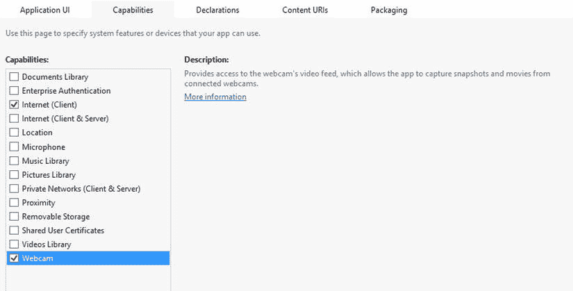
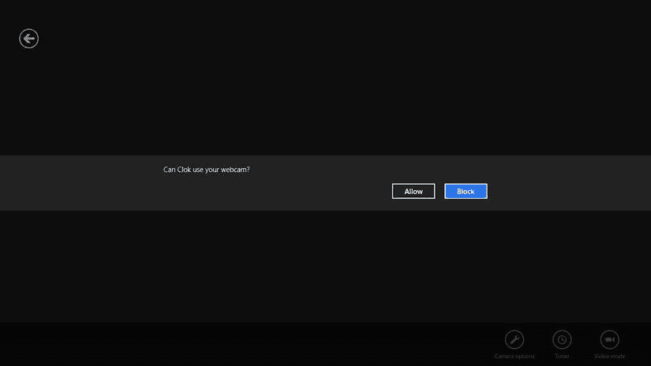
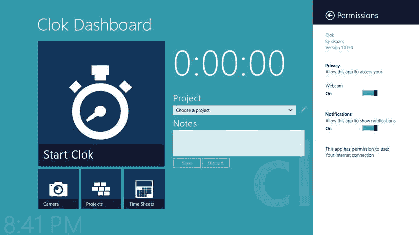
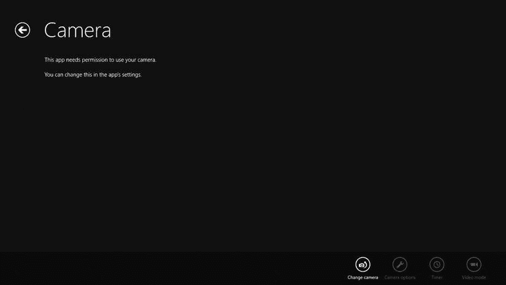
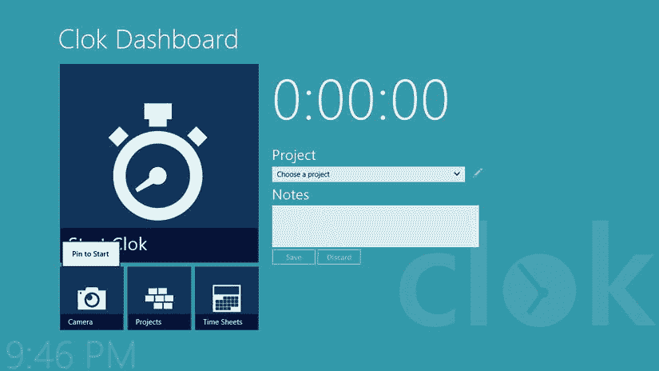
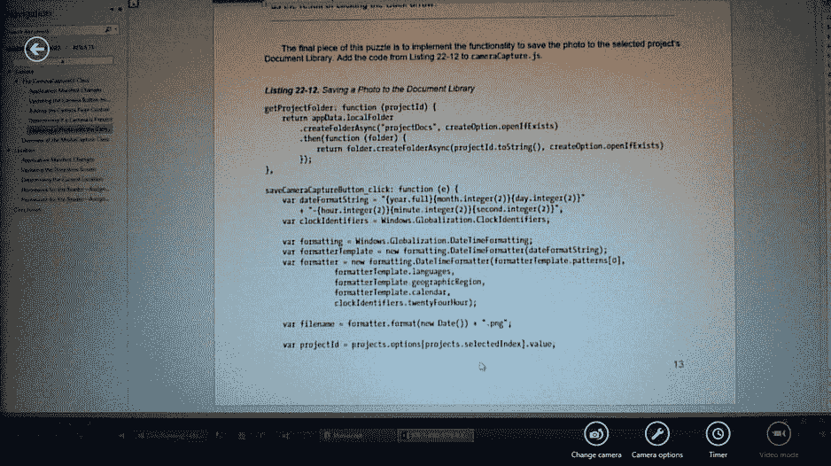
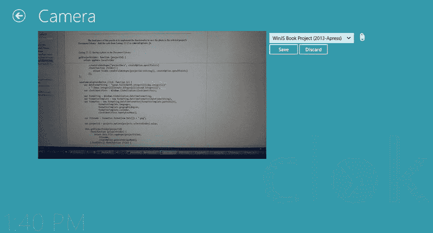

# 二十二、摄像机和位置

在撰写本文时，几乎所有的平板电脑和笔记本电脑都内置了网络摄像头。我查看了今天在一个流行的零售网站上列出的前 15 台笔记本电脑，每一台都包括一个网络摄像头。我自己的笔记本电脑有一个内置在盖子里，我的 Surface 平板电脑有两个——一个前置摄像头和一个后置摄像头。对于计算机没有内置网络摄像头的用户来说，USB 网络摄像头是一项相当便宜的投资，一些基本型号的价格不到 20 美元。

在以前的 Windows 版本中，将相机集成到应用中并不总是一个简单的解决方案。然而，在 Windows 8 中，微软创造了一种简单、直接的方式来为您的应用添加照片功能。

除了集成摄像头之外，通过利用来自 Windows 位置提供商的数据，您可以让您的应用具有位置感知能力。WinRT 使用简单的 API 公开位置数据，允许您的应用请求计算机的当前位置或处理事件以在计算机移动时接收更新。

在这一章中，我将向你展示如何将相机和位置数据集成到 Clok 中。Clok 用户将能够部署相机，将照片添加到项目的文档库。他们还将能够获得从当前位置到客户办公室的行车路线。

照相机

你参加过有人在白板上写字的会议吗？也许他们在绘制应用的用户界面，或者绘制流程图，或者只是做笔记。无论如何，当会议结束后，在另一群人进入房间参加他们自己的会议之前，可能会发生一些事情。

*   有人匆忙地试图将所有的笔记记录到纸上或他或她的电脑上的一个文档中。
*   有人在白板上用大字写下“保存”，打算在将来的某个时候重新查看笔记或图表。
*   有人掏出手机，给白板拍了张照片。

我个人用手机拍了很多白板的照片。在本节中，您将向 Clok 添加一个功能，该功能将允许用户使用平板电脑上的相机来捕捉这样的照片，并将它们添加到项目的文档库中。

 **注**在本章中，我将使用术语*网络摄像头*、*摄像头*、*照片*和*视频*。在这些例子中，我指的是连接到用户电脑的网络摄像头捕捉到的图像或视频。您将在本章中添加到 Clok 的功能将只对拥有内置网络摄像头或 USB 网络摄像头的用户可用。此外，您的计算机必须有网络摄像头，以便测试您将在此部分添加的功能。在这本书里，我不会讨论使用数码相机，比如傻瓜相机或者 DSLR 相机。

虽然已经可以使用相机应用拍摄照片，然后使用 Share charm 将其添加到文档库中，但您在本节中所做的更改将允许您从 Clok 应用中捕捉照片，而不必单独启动相机应用。在应用中使用网络摄像头有两种方法。你可以使用`CameraCaptureUI`类或者`MediaCapture`类。

CameraCaptureUI 类

`CameraCaptureUI`类允许你用相对较少的代码行，快速地为你的应用添加相机功能。摄像头捕捉功能由内置的 Windows 界面处理，在概念上与文件打开选择器非常相似。在这一节中，我将解释如何向您的用户展示这个界面，以及如何将他们拍摄的照片放入文档库中。

应用清单更改

访问连接到用户计算机的 webam 是一个潜在的安全问题。因此，您必须在项目的应用清单中指明它可能会使用用户的网络摄像头。当一个潜在用户在 Windows Store 中阅读你的应用时，这个事实就被公之于众了(见[图 22-1](#Fig1) )。


[图 22-1](#_Fig1) 。Windows 应用商店中的相机应用列表

对清单的更改是一个简单的复选框。打开`package.appxmanifest`并切换到功能选项卡。在功能列表中，勾选网络摄像头项目(参见[图 22-2](#Fig2) )。



[图 22-2](#_Fig2) 。指定网络摄像头功能

然而，即使在应用清单中有这个声明，您的应用也不能完全开放对摄像机的访问。你的应用第一次试图访问摄像机时——你将在接下来的章节中添加代码来完成——用户被提示确认他或她将允许它(见[图 22-3](#Fig3) )。



[图 22-3](#_Fig3) 。提示用户获得许可

此外，用户可以随时更改此设置，方法是打开权限设置弹出按钮并切换网络摄像头设置的值(参见[图 22-4](#Fig4) )。



[图 22-4](#_Fig4) 。用户可以随时撤销该权限

当您使用`CameraCaptureUI`类时，窗口将显示的界面将提示用户更改权限，如果他或她以前阻止了对摄像机的访问(见[图 22-5](#Fig5) )。



[图 22-5](#_Fig5) 。CameraCaptureUI 界面指示用户启用权限来使用相机

更新 Clok 仪表板屏幕上的摄像头按钮

指定了摄像头功能，下一步是给用户一个访问摄像头屏幕的方法，我们将在下一节中构建。Clok 仪表盘屏幕上的相机菜单选项已经存在，但目前尚未实现。从`home.html`中移除[清单 22-1](#list1) 中高亮显示的`notImplemented` CSS 类。

[***清单 22-1。***](#_list1) 移除高亮显示的 CSS 类

```js
<div id="cameraMenuItem" class="mainMenuItem secondaryMenuItem notImplemented ">
```

您还必须在`home.js` 中为该菜单选项定义一个`click`事件处理程序。将[清单 22-2](#list2) 中的代码添加到`home.js`中，并在`ready`函数中绑定这个`click`事件处理程序。

[***清单 22-2。***](#_list2) 点击事件处理程序获取相机菜单选项

```js
cameraMenuItem_click: function (e) {
    nav.navigate("/pages/documents/cameraCapture.html");
},
```

在本书附带的源代码中，我还为用户添加了右击相机菜单选项并将其固定在开始屏幕上的功能(见[图 22-6](#Fig6) )。因为我刚刚在第 21 章的[中谈到了这一点，所以这里就不赘述了。您可以在本书的产品详细信息页面的源代码/下载选项卡上找到本章的代码示例(`www.apress.com/9781430257790`)。](21.html)



[图 22-6](#_Fig6) 。将 Clok 相机固定在开始屏幕上

添加相机页面控件

虽然`CameraCaptureUI`类显示的用户界面是由 Windows 自己提供的，我们无法控制它提供的布局和功能，但仍然需要一个页面来允许用户预览捕获的图像并选择要添加到的文档库。在`pages\documents`文件夹中，创建一个名为`cameraCapture.html`的新页面控件。更新`cameraCapture.html`中的标题，将其改为`Camera`(见[清单 22-3](#list3) )。

[***清单 22-3。***](#_list3) 改变屏幕标题

```js
<span class="pagetitle">Camera</span>
```

当你完成建立这个屏幕时，它会在屏幕的左边显示一个捕获的照片的预览，在右边，一个下拉列表选择照片将被添加到哪个项目的文档库。用清单 22-4 中[的代码更新`cameraCapture.html`中的主`section`。如果用户的计算机没有摄像头，则会显示一条消息。](#list4)

[***清单 22-4。***](#_list4) 摄像头屏幕的布局

```js
<section aria-label="Main content" role="main">
    <div id="cameraContainer">
        <div id="cameraPane">
            
        </div>
        <div id="controlsPane">
            <select id="projects">
                <option value="">Choose a project</option>
            </select>
            <button id="goToDocumentsButton" disabled="disabled"></button>
            <br />
            <button id="saveCameraCaptureButton">Save</button>
            <button id="discardCameraCaptureButton">Discard</button>
        </div>
    </div>
    <div id="noCamera" class="hidden">No camera is available on this computer.</div>
</section>
```

和往常一样，参考图片可以作为本书附带的源代码的一部分获得。用[清单 22-5](#list5) 中的 CSS 更新`cameraCapture.css`。

[***清单 22-5。***](#_list5) 造型相机屏幕

```js
.cameraCapture section[role=main] {
    margin-left: 120px;
    margin-right: 120px;
}

.hidden {
    display: none;
}

.cameraCapture #cameraPane {
    float: left;
    width: 720px;
    height: 540px;
}

    .cameraCapture #cameraPane #capturedImage {
        max-width: 720px;
        max-height: 540px;
    }

.cameraCapture #controlsPane {
    float: left;
    margin-left: 10px;
}

    .cameraCapture #controlsPane #goToDocumentsButton {
        border: 0px;
        min-width: inherit;
        font-size: 1.5em;
    }

@media screen and (-ms-view-state: fullscreen-portrait) {
    .cameraCapture section[role=main] {
        margin-left: 20px;
        margin-right: 20px;
    }
}
```

在接下来的几节中，您将利用`cameraCapture.js`中的一些别名。与其一次添加一个，不如现在全部添加。将[清单 22-6](#list6) 中的代码添加到`cameraCapture.js`中。

[***清单 22-6。***](#_list6) 添加一些别名

```js
var appData = Windows.Storage.ApplicationData.current;
var createOption = Windows.Storage.CreationCollisionOption;
var capture = Windows.Media.Capture;
var devices = Windows.Devices.Enumeration;
var nav = WinJS.Navigation;
var storage = Clok.Data.Storage;
```

当应用处于快照状态时，Clok 的相机屏幕将不会启用。在[第 17 章](17.html)中，你增加了一个名为`DisableInSnappedView`的函数，应该是从`ready`和`updateLayout`函数中调用的。将清单 22-7 中的代码从[添加到](#list7)到`cameraCapture.js`。

[***清单 22-7。***](#_list7) 禁用抓拍视图中的相机屏幕

```js
ready: function (element, options) {
    Clok.Utilities.DisableInSnappedView();
},

updateLayout: function (element, viewState, lastViewState) {
    Clok.Utilities.DisableInSnappedView();
},
```

确定摄像机是否存在

尽管笔记本电脑和平板电脑内置摄像头越来越普遍，但很可能有些用户的电脑没有摄像头。在本节中，您将确定摄像机是否可用，并根据摄像机的存在初始化 Clok 的摄像机屏幕。

`Windows.Devices.Enumeration` 名称空间定义了许多类，您可以利用这些类为您的应用添加对各种类型设备的支持。这包括外部存储设备、音频输入和输出设备以及视频输入设备。视频设备是可以捕捉照片或视频的工具，如网络摄像头。关于这个名称空间及其包含的所有类的更多信息可以在 MSDN ( `http://msdn.microsoft.com/en-us/library/windows/apps/windows.devices.enumeration.aspx`)上找到。在这一节中，我们将利用`Windows.Devices.Enumeration.DeviceInformation`类来确定计算机是否有摄像头。将清单 22-8 中突出显示的代码添加到`cameraCapture.js`中的`ready`函数中。

[***清单 22-8。***](#_list8) 确定摄像头是否存在并初始化屏幕

```js
ready: function (element, options) {
    this.file = null;

    var deviceInfo = devices.DeviceInformation;
    return deviceInfo.findAllAsync(devices.DeviceClass.videoCapture)
        .then(function (found) {
            return found && found.length && found.length > 0;
        }, function error() {
            return false;
        }).then(function (exists) {
            this.showCameraControls(exists);
            if (exists) {
                this.bindProjects();
                capturedImage.addEventListener("click", this.capturedImage_click.bind(this));
                saveCameraCaptureButton.addEventListener("click",
                    this.saveCameraCaptureButton_click.bind(this));
                discardCameraCaptureButton.addEventListener("click",
                    this.discardCameraCaptureButton_click.bind(this));
                goToDocumentsButton.onclick = this.goToDocumentsButton_click.bind(this);
                projects.addEventListener("change", this.projects_change.bind(this));

                this.resetScreen();

                // TODO: automatically initiate capture

            }
        }.bind(this));

    Clok.Utilities.DisableInSnappedView();
},
```

这里，我使用了`findAllAsync`函数来枚举用户计算机上的所有视频捕获设备(网络摄像头)。如果有任何错误，或者没有发现错误，我稍后将展示的`showCameraControls`函数将向用户显示一条消息。然而，如果发现网络摄像头，`showCameraControls`功能将显示在[清单 22-4](#list4) 中定义的用户界面，一个活动项目的下拉列表将被填充，各种事件处理程序将被连接到它们各自的控件。这些步骤都是您通常会直接包含在`ready`函数中的典型步骤。因为这个屏幕只有在摄像机存在时才可用，所以我简单地将它们嵌套在一个条件中。在`ready`函数顶部的`file`变量将被用来保存对一个`StorageFile`对象的引用，该对象最终将从`CameraCaptureUI`接口返回。我稍后将回到这一点。

 **注意**在 Clok 中，我们已经为用户提供了向文档库中添加文档(包括图像)的其他技术。在其他应用中，如果网络摄像头不可用，您可能需要考虑提供处理图像的替代方法，如文件打开选择器。

清单 22-8 中的代码引用了一些函数和事件处理程序。通过添加清单 22-9 中[到`cameraCapture.js`的代码来定义这些。](#list9)

[***清单 22-9。***](#_list9) 摄像机屏幕的功能和事件处理程序

```js
showCameraControls: function (show) {
    if (show) {
        WinJS.Utilities.removeClass(cameraContainer, "hidden");
        WinJS.Utilities.addClass(noCamera, "hidden");
    } else {
        WinJS.Utilities.addClass(cameraContainer, "hidden");
        WinJS.Utilities.removeClass(noCamera, "hidden");
    }
},

bindProjects: function () {
    projects.options.length = 1; // remove all except first project

    var activeProjects = storage.projects.filter(function (p) {
        return p.status === Clok.Data.ProjectStatuses.Active;
    });

    activeProjects.forEach(function (item) {
        var option = document.createElement("option");
        option.text = item.name + " (" + item.projectNumber + ")";
        option.title = item.clientName;
        option.value = item.id;
        projects.appendChild(option);
    });
},

projects_change: function (e) {
    if (!this.file) {
        saveCameraCaptureButton.disabled = true;
    } else {
        saveCameraCaptureButton.disabled = !projects.options[projects.selectedIndex].value;
    }

    var id = projects.options[projects.selectedIndex].value;
    goToDocumentsButton.disabled = !ClokUtilities.Guid.isGuid(id);
},

goToDocumentsButton_click: function (e) {
    var id = projects.options[projects.selectedIndex].value;
    if (ClokUtilities.Guid.isGuid(id)) {
        nav.navigate("/pages/documents/library.html", { projectId: id });
    }
},

discardCameraCaptureButton_click: function (e) {
    this.resetScreen();
},

resetScreen: function () {
    capturedImage.src = "/img/camera-placeholder.png";
    this.file = null;
    saveCameraCaptureButton.disabled = true;
    discardCameraCaptureButton.disabled = true;
},
```

[清单 22-9](#list9) 中的大部分代码类似于你已经添加到 Clok 中的代码。我特别强调了`projects_change`事件处理程序中的一个模块，这个模块可能不会立即显示出来。仅当从下拉列表中选择了一个项目并且图像已经被`CameraCaptureUI`接口捕获时，该块才启用保存按钮。

此外，我突出显示了`resetScreen`函数。顾名思义，该功能会将相机屏幕置于准备捕捉图像的状态。除了在第一次加载屏幕和用户丢弃照片时调用该函数之外，在下一节中，您将看到在用户捕获并保存照片后如何调用该函数。

使用 CameraCaptureUI 界面捕捉照片

要完成这一功能，还需要几个步骤。您仍然需要向用户显示`CameraCaptureUI`界面，检索捕获的图像并显示它，以便用户可以预览它，并实现将图像保存到项目文档库中的功能。通过添加[清单 22-10](#list10) 到`cameraCapture.js`中的代码，可以完成这三个剩余步骤中的前两个。

[***清单 22-10。***](#_list10) 显示 CameraCaptureUI 界面

```js
capturedImage_click: function (e) {
    this.showCameraCaptureUI();
},

showCameraCaptureUI: function () {
    var dialog = new capture.CameraCaptureUI();
    dialog.photoSettings.maxResolution =
        capture.CameraCaptureUIMaxPhotoResolution.highestAvailable;

    dialog.captureFileAsync(capture.CameraCaptureUIMode.photo)
        .done(function complete(file) {
            if (file) {
                var photoBlobUrl = URL.createObjectURL(file, { oneTimeOnly: true });
                capturedImage.src = photoBlobUrl;
                saveCameraCaptureButton.disabled =
                    !projects.options[projects.selectedIndex].value;
                discardCameraCaptureButton.disabled = false;
                this.file = file;
            } else {
                this.resetScreen();
            }
        }.bind(this), function error(err) {
            this.resetScreen();
        }.bind(this));
},
```

当用户点击预览图像时，将显示`CameraCaptureUI`界面。与`FileOpenPicker`类似，`CameraCaptureUI`界面是一个由 Windows 创建和管理的对话框。使用 promises，所选择的`StorageFile`，这次包含照相机刚刚捕获的照片，可作为`done`函数的`complete`参数的一个参数。在清单 22-10 中，我已经从该文件创建了一个对象 URL，并将预览图像的源设置为该 URL。如果已经从下拉列表中选择了一个项目，保存按钮被激活，并且文件的引用被存储在[清单 22-8](#list8) 中定义的`file`变量中。如果有任何错误，或者没有拍摄照片，则调用`resetScreen`函数将屏幕上的每个控件重置为其原始状态。

用户可以很容易地单击预览图像占位符来启动照片捕捉过程。然而，如果他们只是点击了 Clok 仪表板上的相机菜单选项，或者他们可能已经钉在开始屏幕上的次级磁贴，我们可以立即向他们显示`CameraCaptureUI`界面，而不需要他们再次点击。清单 22-8 包含一个 TODO 注释。用清单 22-11 中突出显示的代码替换`cameraCapture.js`的`ready`函数中的注释。

[***清单 22-11。***](#_list11) 自动显示 CameraCaptureUI 界面

```js
if (exists) {
    // SNIPPED
    // only if navigated, not if back arrow
    if (!nav.canGoForward) {
        this.showCameraCaptureUI();
    }
}
```

 **注意**当我最初编写这个功能时，我没有在条件中包含对`showCameraCapture`的调用。然而，在点击[清单 22-4](#list4) 中添加的`goToDocumentsButton`，然后点击每个页面控件上包含的后退箭头之后，在那种情况下加载`CameraCaptureUI`界面对我来说似乎很尴尬。通过检查`WinJS.Navigation.canGoForward`属性的值，您可以确定是否加载了摄像头屏幕，这是单击返回箭头的结果。

这个难题的最后一部分是实现将照片保存到所选项目的文档库中的功能。将清单 22-12 中的代码添加到`cameraCapture.js`中。

[***清单 22-12。***](#_list12) 保存照片到文档库

```js
getProjectFolder: function (projectId) {
    return appData.localFolder
        .createFolderAsync("projectDocs", createOption.openIfExists)
        .then(function (folder) {
            return folder.createFolderAsync(projectId.toString(), createOption.openIfExists)
        });
},

saveCameraCaptureButton_click: function (e) {
    var dateFormatString = "{year.full}{month.integer(2)}{day.integer(2)}"
        + "-{hour.integer(2)}{minute.integer(2)}{second.integer(2)}";
    var clockIdentifiers = Windows.Globalization.ClockIdentifiers;

    var formatting = Windows.Globalization.DateTimeFormatting;
    var formatterTemplate = new formatting.DateTimeFormatter(dateFormatString);
    var formatter = new formatting.DateTimeFormatter(formatterTemplate.patterns[0],
                formatterTemplate.languages,
                formatterTemplate.geographicRegion,
                formatterTemplate.calendar,
                clockIdentifiers.twentyFourHour);

    var filename = formatter.format(new Date()) + ".png";

    var projectId = projects.options[projects.selectedIndex].value;

    this.getProjectFolder(projectId)
        .then(function (projectFolder) {
            return this.file.copyAsync(projectFolder,
                filename,
                createOption.generateUniqueName);
        }.bind(this)).then(function (file) {
            this.resetScreen();
        }.bind(this));
},
```

从您在第 16 章的[中创建文档库的工作中，以及从您在第 19 章](16.html)的[中添加的使 Clok 成为共享目标的代码中，您应该熟悉`getProjectFolder`函数。在根据当前日期和时间为`filename`变量生成一个值后，由`file`变量引用的照片，使用](19.html)[第 16 章](16.html)中介绍的`copyAsync`函数被复制到项目的文档库中。然后调用`resetScreen`功能，允许用户快速拍摄另一张照片。

现在运行 Clok 并点击 Clok 仪表盘屏幕上的相机菜单选项。如果你有一台相机并且已经授权 Clok 使用它，你会看到`CameraCaptureUI`界面(见[图 22-7](#Fig7) )。



[图 22-7](#_Fig7) 。即将捕获正在进行的一些工作的照片

拍照后，您将看到该照片的预览，并能够选择将其保存到哪个项目的文档库(参见[图 22-8](#Fig8) )。



[图 22-8](#_Fig8) 。预览捕获的照片

最后，为了验证一切都按预期工作，导航到该文档库。您可以选择使用相机屏幕上的回形针图标作为快捷方式。您应该可以在文档库中看到您的照片(参见[图 22-9](#Fig9) )。


[图 22-9](#_Fig9) 。捕获的照片，保存到文档库中

在本例的大部分时间里，我假设用户是另一个软件开发人员，他/她正在用自己的平板电脑运行 Clok，参加一个关于他/她正在进行的项目的会议。实际上，这个功能可以很容易地被平面设计师用来拍摄可能启发他或她的项目设计的照片，或者甚至被景观承包商用来拍摄景观项目前后的照片。用户甚至可以是捕捉他或她当前正在进行的工作的照片的作者。

媒体捕获类概述

`CameraCaptureUI`类提供了一个简单的方法来将一个附加的摄像机集成到你的应用中。然而，这个界面是由 Windows 创建和管理的，所以您对它没有任何控制权。如果你对[图 22-7](#Fig7) (前面)中显示的全屏捕捉体验不满意，那么你就不走运了。

不完全是。如果您需要对照片捕捉体验有更多的控制，那么您应该使用`MediaCapture`类，而不是使用`CameraCaptureUI`类。通过这个类，您可以将实时视频预览和图像捕捉功能嵌入到您自己的用户界面中。

我不会在本书中实现这个类，但是我会在这里简单讨论一下。在 Windows SDK 示例包(`http://msdn.microsoft.com/en-US/windows/apps/br229516`)包含的示例中，有一个叫做*使用捕获设备进行媒体捕获的示例*。这个项目展示了几个将相机集成到应用用户界面中的例子。看一看`BasicCapture.html`。在该文件中，您将看到一个如清单 22-13 中的[所示的`video`元素。](#list13)

[***清单 22-13。***](#_list13) 来自 MediaCapture 示例项目的视频元素

```js
<video width="320" height="240" id="previewVideo1" style="border: 1px solid black"> </video>
```

这是一个标准的 HTML5 `video`元素。在关联的 JavaScript 文件`BasicCapture.js`中，创建了一个名为`mediaCaptureMgr`的`MediaCapture`对象，并在该对象上设置了许多属性。一旦它被配置，来自[清单 22-13](#list13) 的`video`元素的`src`属性被设置，引用`mediaCaptureMgr`对象(见[清单 22-14](#list14) )。

[***清单 22-14。***](#_list14) 设置视频源

```js
video.src = URL.createObjectURL(mediaCaptureMgr, { oneTimeOnly: true });
```

为了从这个`mediaCaptureMgr`对象中捕获图像，调用了`capturePhotoToStorageFileAsync`函数。类似于[清单 22-10](#list10) 中的`captureFileAsync`函数，代表捕获图像的`StorageFile`对象作为`done`函数的`complete`参数的一个参数。

我在本节中排除了许多细节，但是引用的示例相当简单。如果将相机捕捉功能集成到您自己的应用的 UI 中的能力很重要，那么我鼓励您仔细看看示例项目。此外，关于`MediaCapture`类的更多信息可以在 MSDN ( `http://msdn.microsoft.com/library/windows/apps/Windows.Media.Capture.MediaCapture.aspx`)上找到。

位置

在 Windows 8 中，用户电脑的位置由 Windows 位置提供商提供。位置提供者可以使用多种不同的方法来确定计算机的位置，该位置由纬度和经度测量值以及这些测量值的准确性指示符来指示。Windows 8 中的提供商使用以下技术尝试确定位置，从最不准确到最准确:

*   IP 地址数据
*   WiFi 三角剖分〔t0〕〔t1〕
*   全球定位系统

提供商将报告可用的最精确的测量值。例如，如果 GPS 设备存在于计算机中，那么将返回这些结果，而不是 IP 地址查找的结果。MSDN ( `http://msdn.microsoft.com/en-us/library/windows/apps/hh464919.aspx`)上有更多关于 Windows 位置提供商的信息。

在这一节中，我将展示如何为用户提供一种从他们当前位置获取驾驶方向的简单方法。

应用清单更改

与相机一样，访问用户的位置是一个潜在的安全问题。您必须在项目的应用清单中指示您打算访问用户的位置。与相机一样，对清单的更改也是一个简单的复选框。打开`package.appxmanifest`并切换到功能选项卡。在功能列表中，检查位置项(参见[图 22-10](#Fig10) )。


[图 22-10](#_Fig10) 。指定定位能力

更新方向屏幕

实现这一功能只需很少的改动。第一步是在方向屏幕上添加一个按钮，用于确定用户的当前位置。将清单 22-15 中突出显示的代码添加到`directions.html`中。

[***清单 22-15。***](#_list15) 添加按钮获取当前位置

```js
<div class="formField">
    <label for="fromLocation">From</label><br />
    <input id="fromLocation">
    <button id="getLocationButton"> & #xe1d2;</button>
</div>
```

然后将清单 22-16 中的新 CSS 规则添加到`directions.css`中。

[***清单 22-16。***](#_list16) 造型按钮

```js
#locationsPane #getLocationButton {
    border: 0px;
    min-width: inherit;
}
```

虽然这个按钮还没有做任何事情，但是你可以运行 Clok 并导航到方向屏幕来看看它看起来怎么样(见[图 22-11](#Fig11) )。


[图 22-11](#_Fig11) 。获取当前位置的按钮

在下一节中，我将向您展示当用户单击这个按钮时，如何获取他或她的当前位置。

确定当前位置

如果不能确定用户的位置，让用户点击按钮是没有意义的。在本节中，您将添加一些代码，以便仅当用户的位置可用时才启用按钮，还将添加一些代码，以便在单击按钮时用他或她的位置填充 From 字段。将[清单 22-17](#list17) 中高亮显示的代码添加到`directions.js`的`ready`函数中。

[***清单 22-17。***](#_list17) 变为就绪功能

```js
printCommand.onclick = this.printCommand_click.bind(this);

this.currentCoords = null;
getLocationButton.disabled = true;
this.checkForGeoposition();
getLocationButton.onclick = this.getLocationButton_click.bind(this);

fromLocation.value = app.sessionState.directionsFromLocation || "";
```

`checkForGeoposition`函数是这个特性的主力。将清单 22-18 中[的功能添加到`directions.js`中。](#list18)

[***清单 22-18。***](#_list18) 请求用户的当前位置

```js
checkForGeoposition: function () {
    var locator = new Windows.Devices.Geolocation.Geolocator();
    var positionStatus = Windows.Devices.Geolocation.PositionStatus;

    if (locator != null) {
        locator.getGeopositionAsync()
            .then(function (position) {
                this.currentCoords = position.coordinate;
                getLocationButton.disabled = (locator.locationStatus !== positionStatus.ready);
            }.bind(this));
    }
},
```

这个函数获取名为`locator`的`Windows.Devices.Geolocation.Geolocator`类的一个实例。如果`locator`不存在，上一节添加的新按钮永远不会启用。然而，如果`getGeopositionAsync`函数返回一个有效位置，按钮被激活，坐标被存储在`currentCoords`变量中。

幸运的是，Bing Maps API 完全能够使用坐标，而不是地址，作为起点或目的地。因此，所需的最后一步是在单击按钮时用用户的纬度和经度填充 From 字段。将[清单 22-19](#list19) 中的代码添加到`directions.js`中。

[***清单 22-19。***](#_list19) 填充从字段

```js
getLocationButton_click: function (e) {
    fromLocation.value = this.currentCoords.latitude.toString()
        + ", " + this.currentCoords.longitude.toString();
},
```

现在，当您运行 Clok 并单击按钮时，您的纬度和经度将显示在 From 字段中。获取方向按钮将把这些坐标传递给 Bing Maps API，并检索从您当前位置到客户办公室的行驶方向(参见[图 22-12](#Fig12) )。


[图 22-12](#_Fig12) 。获取从当前位置到客户办公室的路线

读者的家庭作业——作业#1

如您所见，只需很少的代码，您就可以将来自 Windows 位置提供程序的数据集成到您的应用中。不过，需要记住的一点是位置数据的准确性。正如我上面提到的，位置提供者可以从许多来源检索位置数据。您将总是收到可用的最准确的数据，但是如果 IP 地址数据是所有可用的数据，则可能只精确到几英里以内。根据您的情况，您可能希望您的用户可以接受这种可能的不准确性，但是在驾驶方向的情况下，让起始位置偏离多达 10 英里并不是一个好的体验。

当使用`getGeopositionAsync`功能检索坐标时，包含了这些坐标的精度指标，以米为单位。在本书附带的源代码中，我添加了一个条件，只有当`this.currentCoords.accuracy`的值在 200 米以内时，才启用`getLocationButton`。

有关使用`Geolocator`类和其他位置相关类的更多信息，请访问 MSDN ( `http://msdn.microsoft.com/en-us/library/windows/apps/windows.devices.geolocation.aspx`)。

读者的家庭作业——作业#2

在本章中，我向您展示了如何使用`Geolocator`类的`checkForGeoposition`函数来请求用户的当前位置。`Geolocator`类还有一个名为`positionchanged`的事件，当检测到用户位置发生变化时会引发该事件。虽然我还没有在 Clok 中构建任何利用该事件的特性，但是存在一些可能性，您可以选择添加到 Clok 中。例如:

*   您可以更新方向屏幕，以便根据用户驾车前往目的地时的当前位置，突出显示路线中的当前步骤。
*   您可以添加一个 toast 通知，当用户到达他或她的一个客户端的位置时显示该通知。单击此通知可能会启动预先选择了该项目的 Clok 仪表板屏幕。

关于`positionchanged`事件的更多信息可在 MSDN ( `http://msdn.microsoft.com/en-us/library/windows/apps/windows.devices.geolocation.geolocator.positionchanged.aspx`)上获得。

结论

借助 Windows 8，微软可以轻松地将您的应用与可能连接到用户计算机的各种硬件相集成。相机和位置数据在许多现代计算机中都很容易获得，只需少量代码，您就可以在应用中使用它们。在本章中，我只触及了这个功能的表面。在许多情况下，这些简单的实现足以改善用户对应用的体验。但是，请记住，如果需要，还可以使用更高级的功能。