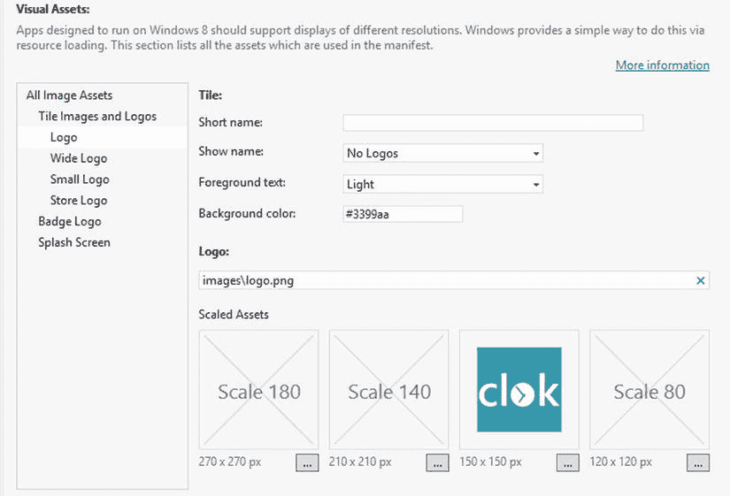
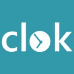
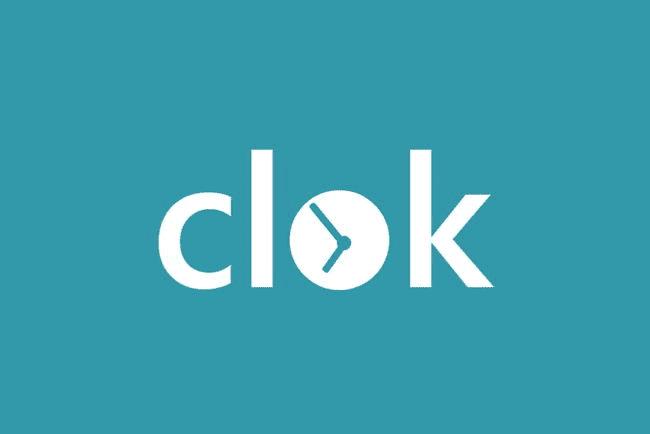
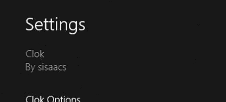
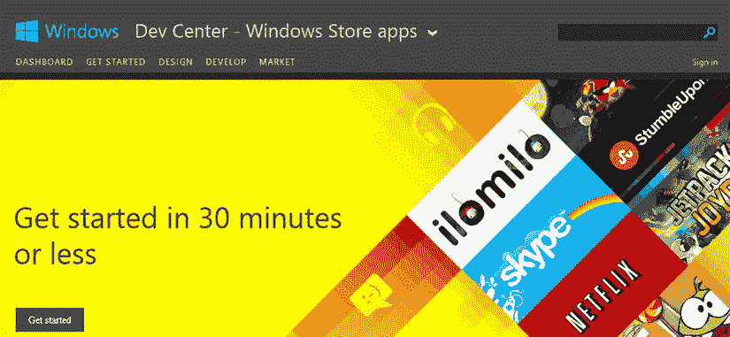
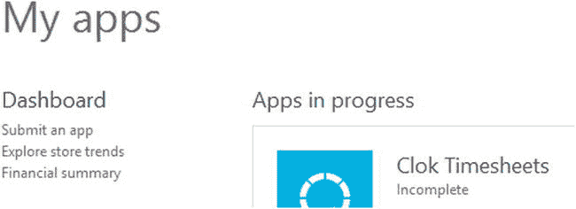
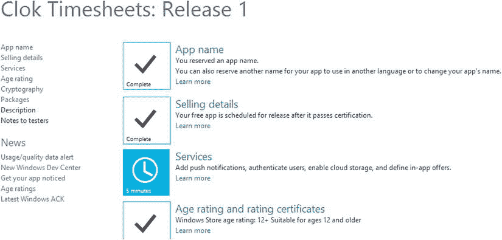
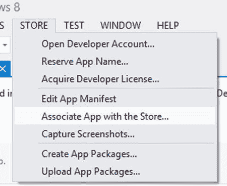

第二十三章


在 Windows 应用商店中共享应用

大多数完成一件作品的工匠不想把它藏在一个只有他们能看到的地方——他们想与其他人分享，他们能欣赏它或从中获得一些价值。对于软件应用程序和艺术品来说都是如此。在 Windows 8 之前，如果你问“我如何与其他人分享我的应用程序？”答案总是集中在创建安装包的后勤工作或者 XCOPY 部署的好处上。然而，答案很可能是没有任何迹象表明如何确保人们知道该应用程序的可用性，或者如何将该应用程序货币化，如果这是目标的话。在本章中，您将了解 Windows 应用商店，这是分发为 Windows 8 构建的应用程序的主要方法。您将了解如何为您的应用程序赋予独特的品牌、打包应用程序以供分发，以及导航提交流程。本章不包括建立开发者账户或使用 Windows StoreAPI 支持的应用内支付功能。

打造您的应用品牌

在本书中，你可能已经注意到示例应用程序 Clok 显示了相同的、不太明显的闪屏，如图 23-1 所示。这是因为闪屏图像是所有 Windows 应用程序所需的几个组件之一，并且 Microsoft 为每个新项目的每个必需组件都提供了一个默认值，以确保项目可以立即构建和运行。


[图 23-1](#_Fig1) 。默认应用闪屏

将这些通用元素替换为通过颜色、风格或图像来增加应用程序身份的替代元素，可以为最终用户创造更好的体验，并且不会给他或她留下应用程序开发人员不愿意改变默认设置的第一印象。在本节中，您将了解到`package.appxmanifest`文件的应用程序 UI 和打包标签中的品牌选项(参见[图 23-2](#Fig2) )。您可以在 Visual Studio 项目的根目录下的解决方案资源管理器中找到该文件。


[图 23-2](#_Fig2) 。package.appxmanifest 文件的应用程序 UI 选项卡

显示名称

显示名称在[图 23-2](#Fig2) 中可见，用于识别您的应用。它是一个最多 256 个字符的字符串，显示在 Windows Store 搜索结果和应用程序列表中，以及 Windows 8 和应用程序磁贴中的搜索列表中(如果尚未定义短名称)。因为这个值是向可能正在搜索应用程序的人公开显示的，所以应该注意使它具有独特性、描述性和吸引力。

默认语言

默认语言以两位数的语言代码后跟一个连字符和一个两个字母的区域性代码的形式指定应用程序的主要语言。面向英国英语用户的应用程序的默认语言是 en-UK，而美国英语用户的默认语言是美国英语。Windows 应用商店要求从有限的选项集中选择主要语言，因此在 MSDN 搜索*构建应用包*并查看可用的语言选择可能是个好主意。

支持的旋转

默认情况下，Windows 8 中的应用程序应该处理用户旋转显示屏的操作，但这适合它们，并且仍然提供有效的界面。有些应用不适合可能的旋转，开发人员可以从以下旋转列表中选择(如图[图 23-3](#Fig3) 所示)，以表明他们的应用支持什么:

*   风景
*   肖像
*   横向翻转
*   纵向翻转


[图 23-3](#_Fig3) 。旋转选项

平铺

平铺设置在应用程序 UI 选项卡的可视资源部分进行配置，它们控制 Windows 如何显示为应用程序显示的各种平铺。这些设置主要围绕各种大小的徽标，但也包括侧重于应用程序的名称显示和颜色的设置。[图 23-4](#Fig4) 显示了用于编辑主图块标志设置的视觉资产部分。



[图 23-4](#_Fig4) 。主要互动程序徽标的视觉资产部分

徽标图像显示在 Windows 开始屏幕中您的应用程序的方块上。此图像是必需的，因为即使您打算默认在开始屏幕上显示宽平铺，用户也可以选择显示方形平铺。与闪屏图像一样，徽标必须是 PNG 或 JPG 格式。它还有特定的尺寸要求，必须是 150×150 像素。除了方形瓷砖徽标外，以下位置的窗户还需要 30×30 像素的徽标:

*   在开始屏幕的搜索结果中
*   在缩小的开始屏幕中的完整应用程序列表中
*   在可搜索应用列表中

当应用程序选择提供宽图块时，将使用 310×150 像素的徽标。如果图像需要根据不同的屏幕分辨率进行缩放，可以选择为所有徽标提供额外的尺寸。

除了指定用于应用程序图块的徽标之外，您还可以控制应用程序名称的显示。这些设置允许多达 13 个字符的可选“短名称”,这可以提供缩短的应用程序名称版本，以适合磁贴。如果提供了此设置，应用程序的磁贴和通知将使用此值而不是应用程序的全名来显示。此外，您可以控制在什么情况下应用程序的名称(或简称，如果已配置)应显示在应用程序图块上。选项包括以下内容:

*   所有徽标
*   仅标准(方形)徽标
*   仅宽标志

当显示应用程序名称时，您还可以选择文本是暗还是亮。[图 23-5](#Fig5) 显示了 Clok 示例应用程序的主要磁贴标志，[图 23-6](#Fig6) 展示了开始屏幕上的 Clok 磁贴，其名称配置为使用浅色文本显示。正如您所看到的，在决定名称显示时，您必须小心谨慎，以确保您的应用程序的品牌得到维护，并且您不会以抑制可读性的徽标和文本组合而告终。



图 23-5 。克罗克快来


[图 23-6](#_Fig6) 。方块瓷砖

因为 Clok 名称实际上是 logo 的一部分，所以不需要在磁贴上显示应用名称；但是，新闻应用程序受益于将名称包含在徽标下。一个好的经验法则是让用户清楚当他们选择它时你的磁贴将启动什么应用程序，而不是不必要的冗余。接受这个建议，我将把应用程序的名字从磁贴上去掉，因为这个名字是 logo 的一部分。

闪屏

用户在启动应用程序时首先看到的是应用程序执行任何必要的初始化时显示的闪屏。应用程序必须指定闪屏图像，还可以指定显示图像的背景颜色。与平铺图像一样，这是在应用程序 UI 选项卡的“可视资源”部分完成的。大小和格式要求非常具体，因为图像必须是 620×300 像素，并且必须是 PNG 或 JPG 格式。[图 23-7](#Fig7) 显示了一个更适合 Clok 的闪屏。



[图 23-7](#_Fig7) 。Clok 闪屏

 **注**本书附带的源代码包括一个完整的项目，其中包含本章使用的所有源代码和图像文件。你可以在本书的 press 产品页面(`http://www.apress.com/9781430257790`)的 Source Code/Downloads 选项卡上找到本章的代码示例。

通知

正如您在[第 21 章](21.html)中所了解到的，诸如动态磁贴和 toast 之类的通知机制为您的应用提供了一个在用户使用其他应用时与他们联系的机会。当标记您的应用程序时，您可以指示该应用程序是否将使用 toast 通知。此外，您可以将应用程序配置为在锁定屏幕激活时显示通知。这些通知可以显示为 24×24 单色徽章图像，也可以显示为宽标题 toast 通知。如果应用程序配置为在锁屏通知中显示磁贴和文本，则必须在磁贴品牌选项中指定宽磁贴徽标。

发布者显示名称

当您创建开发人员帐户以在 Windows 应用商店中发布应用程序时，您需要填写的字段之一是发布者显示名称。您在商店的顾客将会看到这个名字。此外，您的项目必须配置为使用相同的值。您可以在`package.appxmanifest`文件的打包选项卡上为您的项目设置发布者显示名称(参见[图 23-8](#Fig8) )。


[图 23-8](#_Fig8) 。设置发布者显示名称

除了显示在 Windows 应用商店中之外，此值还显示在应用程序的“设置”面板中。在更新发布者显示名称字段后，比较[图 23-9](#Fig9) (我们在[第 9 章](09.html)中创建的设置窗格)和[图 23-10](#Fig10) 中的版本。



[图 23-9](#_Fig9) 。原始设置窗格，来自[第九章](09.html)


[图 23-10](#_Fig10) 。更新的设置面板

设置弹出按钮

你可以选择添加到你的应用程序中的另一个好方法是在每个`SettingsFlyout`控件的标题上添加一个小图标。您可以向每个弹出按钮添加相同的图标，但是，我们将向每个弹出按钮添加不同的上下文图标。将[清单 23-1](#list1) 中的高亮代码添加到我们在[第 9 章](09.html)中创建的`about.html SettingsFlyout`控件中。

[***清单 23-1。***](#_list1) 给设置弹出按钮添加标题图标

```js
<div class="win-ui-dark win-header" style="background-color: #000046;">
    <button type="button" class="win-backbutton"
        onclick="WinJS.UI.SettingsFlyout.show()">
    </button>
    <div class="win-label clok-logo">About Clok</div>
    
</div>
```

运行应用程序并激活设置面板中的关于 Clok 选项。你会看到标题的右边显示了一个图标(见[图 23-11](#Fig11) )。


[图 23-11](#_Fig11) 。更新的设置弹出按钮

为了完成这一步，在`options.html`中添加一个类似的行，将图像文件名从`about-icon.png`改为`options-icon.png`。

导航提交流程

在我描述如何创建您将要提交的包之前，讨论提交应用程序的过程似乎有点不太合适，但是提交过程通常是从在您开始编写应用程序代码之前保留应用程序名称开始的。当完成的应用程序包准备好提交时，它将恢复。在这一节中，我将讨论提交过程中的不同步骤。

提交申请的第一步是通过点击仪表板菜单项在 Windows 开发中心(`http://dev.windows.com`)创建一个 Windows 开发者账户(参见[图 23-12](#Fig12) )。如果您已经有一个开发人员帐户，您将能够登录以查看仪表板。如果您还没有开发人员帐户，您将能够完成创建一个帐户的步骤，然后继续操作仪表板。



[图 23-12](#_Fig12) 。Windows 开发中心

一旦你建立了个人资料，提交申请的过程就可以开始了。[图 23-13](#Fig13) 显示了当前正在进行的我的应用的仪表板，以及提交应用的链接。顾名思义，您应该单击该链接开始。



[图 23-13](#_Fig13) 。我当前正在运行的应用程序

从现在开始，您只需按照提交向导的步骤进行操作。[图 23-14](#Fig14) 显示了一个正在进行的 Clok 提交。



[图 23-14](#_Fig14) 。Clok 提交正在进行中

在每一步之后，我将在下面简要介绍，图 23-14 中的清单将会更新，以指示还剩下哪些步骤。请注意，尽管必须完成所有步骤才能向 Windows 应用商店提交应用程序，但并不要求按顺序完成所有步骤。举个例子，我在服务步骤之前完成了年龄评定步骤。

应用名称

注册的应用程序名称部分是在编写应用程序之前开始提交流程的两个最重要的原因之一。在此步骤中，您可以指定将在 Windows 应用商店中标识您的应用程序的名称。完成该步骤可确保您选择的名称尚未被使用或保留，并为您提供一年的名称保留期，在此期间您可以完成申请并提交，而不必担心是否有人使用了您选择的名称。

销售详情

在销售细节步骤中，您可以选择是否以及如何从您的应用程序中赚钱。这可以包括让你的应用程序免费可用，提供有时间或功能限制的试用版，或者通过广告或应用内购买来赚钱。如果您选择销售您的应用程序，您必须为该应用程序选择一个定价等级，通常从 1.49 美元到 4.99 美元不等。对于第一笔 25，000 美元的销售额，微软保留 30%的商店费用，然后商店费用减少到 20%，留给开发者 80%的净收入。

服务

在服务功能步骤中，您定义应用程序是否应接收来自服务器的推送通知，并生成服务器将用于向您的应用程序发送通知的身份信息。除了保留名称的好处之外，获得在这个步骤中生成的值以包含在您的应用程序代码中是在编写应用程序代码之前开始提交过程的第二大原因。

年龄分级

此步骤用于指定应用程序用户的预期或适当年龄。Windows 应用商店不接受包含成人内容的应用程序。不允许被指定或未被评级但有价值的申请，PEGI 16 或 ESRB 成熟评级。您可以上传第三方分级证书或通过分配 Windows 应用商店年龄分级来进行自我分级。

密码术

在这一步中，您需要指出您的应用程序是否使用了加密技术。这一点很重要，因为许多国家对加密软件或使用加密组件的软件有进出口限制，您在此处的选择将影响您的应用程序可用的地理区域。

根据您的应用程序的加密需求，如果您将加密用于除密码加密之外的其他用途，您可能需要提供出口商品分类编号(ECCN)。如果您没有，您将被引导到工业和安全局的网站，以获得有关如何找到一个的更多信息。


包装

在此步骤中，您将上载在 Visual Studio 中创建的完整应用程序包。提交页面允许您使用浏览按钮导航到计算机上的包，或者将包从 Windows 资源管理器窗口拖放到浏览器页面。

描述

在此步骤中，您将为每种支持的语言输入应用程序的描述。这种描述是必须的，并且将在你的应用程序的营销中使用，因此它以一种鼓励潜在用户选择你的应用程序而不是其他可能做相同或相似工作的应用程序的方式描述你的应用程序是很重要的。在此步骤中，您还需要提交至少一个屏幕截图，用于推广您的应用程序、版权信息和支持联系信息。除了这些必需的元素之外，您还可以选择包括以下内容:

*   描述性要点
*   关键词
*   附加许可条款
*   其他截图和宣传图片
*   应用程序网站和隐私政策的链接

测试人员注意事项

提交到 Windows 商店的每个应用程序都将经过一系列自动测试，以确保符合微软的指导原则，并且还将由微软测试人员手动审查质量和内容。如果这些测试人员需要信息，比如登录凭证，以便成功地运行应用程序，您可以在这里为他们提供注释。此处的字符数是有限的，因此如果您的笔记需要的空间超过分配的空间，您可以提供一个指向其他说明的 URL。重要的是要意识到测试人员可能会有很多应用程序要测试，所以你让他们的工作越容易，他们测试你的应用程序的心情就越好。

最终提交

为测试人员输入注释后，您有机会检查并最终确定您的提交。从现在开始，这个过程就不在你的掌控之中了。应用程序将通过自动测试运行，并在决定是否接受您的应用程序进入商店之前进行人工审查。开发人员门户中的仪表板可用于查看您正在进行的任何提交的当前状态。

 **注**本章讨论了提交过程，但并未深入探讨评估您提交作品的要求。要查看当前要求，请在 MSDN 搜索主题 *Windows 8 应用认证要求*。本主题涵盖了 Windows 8 应用程序的技术和内容相关要求。

打包您的应用程序

如前一节所述，打包应用程序以提交到 Windows 应用商店的第一步是在应用商店中保留应用程序名称。创建应用程序名称后，您可以使用 Visual Studio 商店菜单中的“将应用程序与商店项目相关联”(如图 23-15 所示)将当前项目与您预订的 Windows 商店元数据相关联。该元数据包括包显示名称、包名称、发布者 ID 和发布者显示名称。



[图 23-15](#_Fig15) 。将应用程序与 Windows 应用商店关联

除了将项目与 Windows Store 中保留的应用程序名称相关联之外，Store 菜单还提供了一个捕获屏幕截图选项，该选项在我在第 9 章中讨论的模拟器中启动您的应用程序，并包括其自己的屏幕捕获工具。使用[图 23-16](#Fig16) 中所示的摄像机图标调用该命令。必须捕获至少一个屏幕截图才能提交，这些图像将用于 Windows 应用商店以及 Microsoft 用于推广您的应用程序的任何其他材料。


[图 23-16](#_Fig16) 。相机图标

完成应用程序并准备提交到 Windows 应用商店后，创建应用程序包菜单项将启动一个简短的向导，该向导将为您创建必要的包文件。选择上传应用程序包将打开开发者门户的 web 浏览器窗口，并允许您在包步骤继续应用程序提交流程，此时您将上传您已创建的包。

结论

在本章中，您学习了如何宣传您的应用程序的独特品牌，以及如何保留名称和提交应用程序以在 Windows 应用商店上提供。如果你有一个应用程序要与世界分享，你应该开一个开发者账户，保留你的名字，开始用你的技能创造下一个伟大的应用程序。