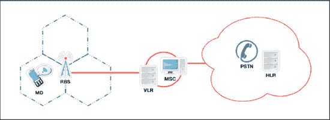
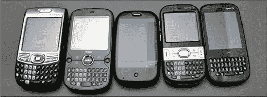
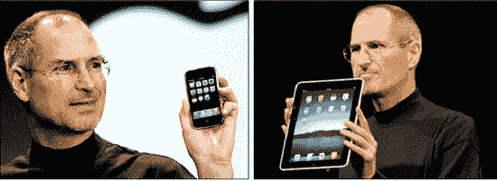
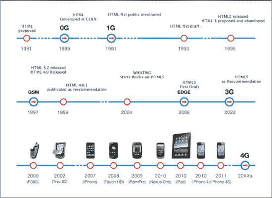

## 前言

> “千里之行始于足下。。."

-老子

### 移动设备的发展

对于那些每天生活和工作都与技术打交道的人来说，这是一个令人兴奋的时代，无论他们是从出生开始就使用技术的年轻人，还是像许多其他人一样，不得不适应技术。

这是一个激动人心的时刻，因为近年来没有其他技术像移动设备的发展一样如此显著地改变了我们的生活。

因为了解了过去，你就能更好地理解现在，并帮助创造未来，所以在本书中，我们将在讨论如何实现这一目标之前，先介绍一下智能手机的简史，手里拿着我们心爱的 iPhone 或 iPad。

#### 卑微的开始:早期的移动网络

一切都始于 1908 年，当时肯塔基州默里的内森·b·斯塔布菲尔德获得了第一个无线电话专利。

40 年后，零代(0G)手机问世。它们主要用作汽车电话，旨在将汽车中的移动用户连接到固定公共电话网络。

第 0 代没有被正式归类为移动设备技术，因为它不支持在呼叫(切换)期间自动改变信道频率，这将允许用户从一个小区(目前的无线电基站覆盖区域)移动到另一个小区。

**图一。** *零一代:移动车载电话(20 世纪 60 年代)*

20 世纪 60 年代，贝尔系统公司推出了一种新的全双工甚高频/超高频无线电系统，随后由美国电话电报公司改进，称为“改进的移动电话服务”(IMTS)，带来了许多改进，如直接拨号而不是通过接线员连接，以及更高的带宽。

第一代(1G) *蜂窝系统*开发于 20 世纪 60 年代末至 70 年代初，是模拟的，仍然基于 IMTS 技术。这些系统是“蜂窝”系统，因为覆盖区域被分成更小的六边形区域，称为“小区”，每个小区由一个低功率发射机和接收机提供服务。

**注:**蜂窝系统是由许多无线电小区组成的无线电网络，每个小区至少由一个固定位置的收发器(既是发射器又是接收器的设备)服务，该收发器称为基站。这些小区覆盖不同的区域，组合起来提供比一个小区更大范围的无线电传输。

The simple structure of the cellular *mobile-radio network* consists of the following:

*   PSTN:公共交换电话网
*   HLR:归属位置注册
*   MSC:移动交换中心
*   VLR:游客位置登记
*   RBS:无线电基站

**图二。** *普通(且简单)的个人通信服务(PCS)网络架构*

移动通信的 1G 模拟系统在 10 世纪 70 年代经历了两个关键的改进:微处理器的发明和移动电话与基站之间控制链路的数字化。

**注:**微处理器将计算机中央处理器(CPU)的大部分或全部功能集成在一个集成电路(IC 或微芯片)上。

1973 年，摩托罗拉大学的马丁·库珀博士发明了第一部现代便携式手机。传说他的第一个电话是打给他的竞争对手贝尔实验室的研究主管乔尔·恩格尔，告诉他他们之间的竞争结果。

十年后的 1983 年，摩托罗拉推出了第一款商用手持移动电话，名为 DynaTAC。这款砖状手机重 28 盎司(0.8 千克)，价格“仅为”4000 美元。

历史记录:马丁·库珀是世界上第一部手机——摩托罗拉·戴纳塔克手机的发明者，他的第一个想法来自于 20 世纪 60 年代著名的电视连续剧《T2》中詹姆斯·t·柯克船长通过他的通讯器说话。

在当今世界，在旅途中通话似乎很正常，但回到 20 世纪 60 年代初，当《星际迷航》首次播出时，大多数人的手机只能通过线缆工作。

#### 扩展手机的覆盖范围:GSM 设备

第二代(2G)数字蜂窝系统于 20 世纪 80 年代末首次开发。这些系统不仅数字化了控制链路，还数字化了语音信号。

新系统以更低的成本向消费者提供了更好的质量和更高的容量。GSM(全球移动通信系统，最初为专用移动通信集团)是第一个使用 *TDMA 协议*(时分多址)作为其信道接入方法的商业运营数字系统。

**注**:信道接入方式允许连接到同一多点传输介质的多个终端通过发送和接收来共享其容量。

*通道接入方案*的基本形式如下:

*   FDMA:频分多址
*   时分多址
*   码分多址
*   SDMA:空分多址

GSM 网络率先实现了低成本的“短消息服务”(SMS)，也称为文本消息，此后它也得到其他移动电话标准的支持。新的 GSM 标准还包括全球紧急电话号码功能。这个三位数的号码是本地化的，一些国家的各种紧急服务有不同的紧急号码。一些常见的号码是 112、999 和 911。

20 世纪 90 年代，随着新的信息传输方式的出现，新一代 100-200g 的小型手持设备开始取代砖头大小的手机。这种变化之所以成为可能，要归功于技术进步，包括更小的电池和更节能的电子设备。20 世纪 90 年代是摩托罗拉公司及其著名的 MicroTAC 手机的辉煌岁月，这款手机于 1989 年发布，并在近十年的时间里一直是地位的象征。

1997 年，新的 GPRS(通用分组无线业务)扩展了 GSM 系统的分组数据能力，1999 年，又扩展了称为 EDGE(GSM 演进的增强数据速率)的更高速数据传输协议。这两个新版本的 GSM 协议分别被称为 2.5G 和 2.75G 网络。

同年，诺基亚推出了 7110，这是第一款支持 WAP(无线应用协议)的终端，首次允许手机直接上网。"协议的一小步，却是人类的一大步."

**注:** WAP 1.0 标准，发布于 1998 年，描述了一套完整的手机上网软件栈。诺基亚也是 WAP 标准的创始成员之一。

WAP 浏览器提供基于计算机的网络浏览器的所有基本服务，但是被简化为在移动电话的限制内操作。用户可以连接到用 WML(无线标记语言)编写或动态转换成 WML(无线标记语言)的 WAP 站点，并通过 WAP 浏览器访问它们。

在 1992 年发布了第一款手机(诺基亚 1011)后，21 世纪初，诺基亚从摩托罗拉手中夺取了移动设备市场的控制权，目前有 12 亿部手机在使用，超过 806 种不同的设备在生产和销售，仍然领先于其他国家。

**图 3。** *第二代:GSM 设备(90 年代)*

#### 又向前迈进了一步:UMTS 设备

第三代(3G)系统承诺更快的通信服务，包括随时随地的语音、传真和互联网，以及无缝的全球漫游。3G 技术是对国际电信联盟 IMT-2000 规范的回应，最初被认为是一个单一、统一的全球标准，但实际上 3G 世界已经分成三个阵营: *UMTS* 、 *CDMA2000* 和 *TD-SCDMA* 。

**注:**UMTS 标准如下:

*   **UMTS:** 基于 W-CDMA 技术，是以欧洲为中心，使用 GSM 的国家普遍首选的解决方案。UMTS 由也负责 GSM、GPRS 和 EDGE 的 3GPP 组织管理。
*   CDMA2000: 这是早期 2G CDMA 标准 IS-95 的衍生产品。CDMA2000 的主要支持者在美洲、日本和韩国的 GSM 区域之外。它由 3GPP2 管理，3GPP 2 独立于 UMTS 的 3GPP。
*   **TD-SCDMA:** 这项技术由大唐和西门子公司在中国开发。

第一个(预商用) *3G 网络*于 2001 年在日本开发，支持高速移动(例如车辆)的 144 千比特带宽、384 千比特(例如校园内)和固定使用(例如室内)的 2 兆比特带宽。

**注:** 3G 系统旨在为全球移动提供广泛的服务，包括电话、寻呼、消息、互联网和宽带数据。 *3G 网络*的简单结构包括以下内容:

基于 IP 的网络
PSTN:公共交换电话网
CN:核心网
UTRAN: UMTS 陆地无线接入网
VLR:访问者位置寄存器

**图 4。** *普通(且简单)的个人通信服务(PCS)网络架构*

3G 协议的最新发展是 HSDPA(高速下行链路分组接入)，于 2005 年开发，称为 3.5G。3.5G 是 W-CDMA 下行链路中基于分组的协议数据服务，数据传输速率高达 8–10 Mbits。

#### 扩展智能手机的移动功能

第一款*智能手机*名为 Simon，由 IBM 于 1992 年设计，并于当年在拉斯维加斯举行的计算机行业贸易展 COMODEX(计算机经销商展览会)上作为概念产品展示。

西蒙于 1993 年向公众发布，并由南方贝尔公司出售。除了作为一部手机，它还包含日历，地址簿，世界时钟，计算器，记事本，游戏，以及邮件和传真功能。

下一次尝试是在 1996 年，由诺基亚进行的，它的移动设备叫做“通信器”这款独特的掌上电脑风格的智能手机是与惠普合作的成果，结合了早期成功和扩展的惠普个人数字助理(PDA)和当时诺基亚最畅销的手机。诺基亚 9000 Communicator 是第一款真正的智能手机，其操作系统名为 GEOS 3.0。

2000 年发布的爱立信 R380 是第一款作为“智能手机”销售的手机，也是世界上第一款触摸屏手机。R380 拥有通常的 PDA 功能和一个大触摸屏，结合了创新的翻盖，因此它也可以用作普通手机。它也是第一款商业化的 Symbian OS (5.0)手机。但是，它不能运行本地第三方应用程序。

**图 5。***3G 一代:智能手机(2000 年代)*

**注:**智能手机没有行业标准定义，但我们可以将其视为“提供高级功能的移动电话，运行完整的操作系统软件，为应用程序开发人员提供标准化的界面和平台。”

来源:智能手机应用程序

2002 年，Handspring 发布了 Palm OS Treo 智能手机，利用全键盘将无线网络浏览、电子邮件、日历和联系人管理器与移动第三方应用程序相结合，可以下载或与计算机同步。

同样在 2002 年，RIM 发布了黑莓手机，这是第一款针对无线电子邮件应用进行优化的智能手机。到 2009 年 12 月，它已经拥有了 3200 万用户。

#### 重新定义移动范围:下一代协议

第四代(4G)系统是 3G 的继任者，旨在为移动和固定用户提供高达超宽带(千兆位速度)互联网接入的广泛数据速率。这个新项目的名称是 LTE(长期演进),是对 UMTS(通用移动电信系统)架构的一系列增强。

LTE 规范提供了至少 100 兆比特的下行链路峰值速率和至少 50 兆比特的上行链路，并且 RTT(往返时间)小于 10 毫秒

但除了这些数字，LTE 草案最重要的一点是“说服性网络”，它描述了一个无定形的、目前完全假设的概念，用户可以同时连接到几种无线接入技术，并可以在它们之间无缝移动(垂直切换)。接入技术可以是 Wi-Fi、UMTS、EDGE 或任何其他未来的接入技术。

**注:**垂直切换是指网络节点改变其用于接入支持基础设施的连接类型，通常是为了支持节点移动性。

4G 网络将基于 OFDM(正交频分复用)协议，并可能使用智能天线。

**注意:**智能天线是具有智能信号处理算法的天线阵列，用于识别空间信号特征，例如信号的到达方向(DOA ),并使用它们来跟踪和定位移动设备上的天线波束。

移动 WiMAX (IEEE 802.16)移动宽带接入标准也被称为 4G，并提供 128 Mbits 下行链路和 56 Mbits 上行链路的峰值数据速率。

#### 高级人机交互:触摸屏设备

2007 年 6 月 29 日，当苹果在“MacWorld 大会暨博览会”上推出第一款 iPhone 时，移动市场发生了不可逆转的变化。在苹果公司的 iPhone 引领下，越来越多的触摸屏手机开始出现在市场上。

触摸屏越来越受欢迎，在手机上变得越来越普遍，这有助于使手机使用起来更加直观、舒适和高效。

具有直观用户界面的手机可以快速方便地访问各种应用程序和服务。另一方面，许多具有有用和创新功能的智能手机和高端手机在商业上失败了，仅仅是因为它们的用户界面过于复杂，难以方便使用。

**注:**触摸屏是一种电子视觉显示器，可以检测显示区域内触摸(通常是手指或笔)的存在和位置。

触摸屏技术有几种类型:

*   电容式(用于 iPhone)
*   电阻的
*   表面声波
*   应变仪
*   光学成像
*   分散信号技术
*   声学脉冲识别
*   双向屏幕上的编码 LCD

2008 年 11 月 11 日，HTC 生产了“Touch HD”，这是一款屏幕比其前辈大得多的设备。这款设备和所有其他 HTC 设备一样，运行 Windows Mobile 和 HTC 专有的用户界面 TouchFLO 3D。

2009 年 6 月 6 日，Palm 发布了 Palm Pre，这是一款基于 webOS 的智能手机，配有多点触摸屏和滑动 QWERTY 键盘，webOS 是 Palm 基于 Linux 的新操作系统。

历史提示:QWERTY 键盘布局是由 Christopher Latham Sholes(1819-1890)在 19 世纪 70 年代早期设计和创造的，他是一位住在威斯康星州密尔沃基的报纸编辑和印刷商。这种布局的名称来自键盘顶行左侧的前六个字符。

资料来源:维基百科

2010 年 1 月 5 日，谷歌推出了“Nexus One”，这是一款基于谷歌开源移动操作系统 Android OS 的触摸屏技术智能手机。与苹果 iPhone 一样，大电容触摸屏能够处理多点触摸手势。

不幸的是，对于竞争品牌来说，苹果的真正秘密不像许多人认为的那样只是触摸屏，而是 iPhone 通过触摸屏技术能够实现的东西:全新的用户界面体验。

我说“不幸”是因为尽管任何品牌都可以利用最新的先进“投影电容”技术，但不是每个品牌都有像 iOS 这样的操作系统，来实现所有的服务和杀手级应用程序，这有助于使 iOS 设备独一无二。

这就是为什么，从操作系统的角度来看，苹果至少领先所有其他竞争对手几年，这就是为什么一个优秀的开发团队，即谷歌的人，首先专注于开发其 Android 操作系统，然后是 Nexus 系列智能手机。

**注:**在本书的后面，我们将分析这项技术如何改变了用于构建每个专用于移动世界的用户界面的范式。现在要记住的关键思想是，你需要实现的结构越复杂，与用户交互的界面设计就必须越简单。

**图 6。** *史蒂夫·乔布斯展示 iPhone (2007 年)并介绍 iPad (2010 年)*

2010 年 1 月 27 日，苹果推出 iPad，填补了 iPhone 和 MacBook 之间的空白。苹果 iPad 运行 iOS 3.2(当时称为 iPhone OS)，分辨率为 1024x768 像素，并提供针对这一新环境优化的新原生应用。

iPad 的屏幕由单片多点触控玻璃组成，没有上下左右。没有单一的方向，因此可以根据用户的需求进行定位。这确实是苹果 iPad 背后的大事情，这就是为什么，如果有了苹果 iPhone，我们能够实现新的设备体验，有了 iPad，我们将能够把这种体验带给成千上万的潜在用户，他们直到现在还从未想过在他们的生活中拥有一台“计算机”。

**阅读笔记:**如果你想分析多点触控技术将如何影响台式电脑的未来，以及我们的生活将如何根据这场革命而改变，请跳到最后一章。

我喜欢把 iPad 想象成移动生态系统的 Wii。任天堂 Wii 受到了铁杆游戏玩家的批评，但他们没有意识到的是，任天堂 Wii 是为除他们之外的所有人准备的。

**引用:**“我们都希望事情变得更简单，现在这里有一个简单的事情。我认为这将是一个巨大的成功。”

苹果公司的联合创始人史蒂夫·沃兹尼亚克。

2010 年 6 月 7 日，苹果发布了最新版本的 iPhone，名为 iPhone 4，一切都改变了。iPhone 4 运行第四代 iPhone OS 固件，最初于 2010 年 6 月 21 日发布，并更名为 iOS 4。苹果的新智能手机引入了 FaceTime，视频通话功能，高清视频录制和多任务处理，用户可以同时使用多个应用程序。

**注意:**多任务和 iOS5 只在 iPhone 4 S、iPhone 4、iPhone 3G S、iPad 和 iPad2 上运行。iPhone 2G 的最新固件版本是 2010 年 2 月 2 日发布的 3.1.3，iPhone 3G 的最新固件版本是 2010 年 11 月发布的 4.2.1。

iPhone 4 S 和 iPhone 4 的分辨率为 960 x 640，基于苹果公司开发的新视网膜显示屏，326 ppi。它被称为视网膜显示器，因为它超出了视网膜感知不超过 300 ppi 的能力。

**图 7。** *移动设备历史时间轴*

出于这个原因，也多亏了触摸屏技术，未来对于那些想为 iPhone 甚至 iPad 设计和开发的人来说充满了机会。

## 简介

> “唯一真正的发现之旅。。。不是去陌生的地方，而是拥有另一双眼睛。。."

-马塞尔普鲁斯特

### 谁需要这本书

这本书是为想要开始设计或开发 iOS 用户界面或 iOSWebApps (iPhone、iPod Touch 和 iPad)的设计者和/或开发者而写的。

这本书是本着简单的思想编写的，目标是带你参与苹果移动设备设计和开发的整个过程，实现一个名为“商店”的真实用例

您将使用 HTML5、CSS3 和 JavaScript 等 web 标准进行设计和开发，并且阅读本书不需要任何这些技能。我们将从基础开始使用 HTML5 和 CSS3。我们将提供一个 JavaScript 速成班，也将使用 JavaScript 框架使事情变得更容易和更快。

### 你将从这本书中学到什么

我们将这本书分成三个逻辑部分，以便实现更好的学习导向路径。

在第一部分中，我们将介绍移动网络设计和开发的基础，以及如何超越它们。

在 **[第一章](01.html)** “思考移动触摸”中，你将学习如何以面向移动的方式思考，学习移动设备的演变，分析苹果的独特风格。

在 **[第 2 章](02.html)** “面向 iOS 设备的敏捷项目构建”中，您将学习如何通过从基本策略到草图和原型的步骤来实现移动信息架构。我们还将展示 iOS 移动设计的系统方法，首先介绍内容输出方法，然后介绍页面模型和用户界面模型，包括 iPad 使用的新的反向方法。你也会看到苹果设备的可访问性和可用性。

在 **[第 3 章](03.html)**“iOS 设备的 web 开发”中，您将学习如何使用 Web 标准和一些有用的工具来更快速、更轻松地开发您的 iOS Web app。将向您介绍我们将在案例研究中使用的框架，并且，通过分析 NativeApps 和 WebApps，您将看到使用 web 标准的 web 开发模型与使用 Cocoa Touch 和 Objective-C 的 SDK 开发模型之间的差异。您还将看到设计和开发 WebApp 的不同层次的方法。

**注意:**这本书主要关注 iOS 的设计和开发，使用了 HTML5、CSS3 和 JavaScript 等 web 标准；因此，我们不会在本书的任何项目中使用 Cocoa Touch 框架或 Object-C 语言。

在第二部分的**中，我们将深入探讨 iPhone 和 iPad 的设计，分析方法、最佳实践和一些有助于加快工作流程的有用工具。**

在 **[第 4 章](04.html)**“iOS 设备的用户界面设计”中，您将开始真正的移动 iOS 用户界面设计过程，使用 iPhone 和 ipad 设备，还将介绍 iOS 用户界面设计过程的认知方法背后的概念。将向你介绍正负接口和主动-被动接口的概念；你会看到感知法则，色彩心理学，以及如何在 iOS 设计中使用最常见的阅读模式。最后，我们将分析 iPhone 和 iPad 用户界面的单一元素。

在 **[第五章](05.html)**“iPhone UI 设计:简单思考”中，你会深入到 iPhone 用户界面设计过程中，你会学到这种特殊方式设计用户界面的概念和规则。您将看到如何从草图阶段开始，使用笔和纸，并进入设计阶段，使用 Adobe Fireworks，分析用例用户界面的每个图形元素。

在 **[第六章](06.html)**《iPad UI 设计:反向思考》中，你会深入到 iPad 用户界面设计中，你会学到这种特殊方式设计用户界面的概念和规则。将向您介绍反转简单的概念，您将看到如何对 iPad 用户界面元素进行优先排序、造型和分组。您将看到简单-复杂悖论的关键点，您将看到如何从草图阶段开始，使用笔和纸，并进入设计阶段，使用 Adobe Fireworks，分析我们的用例用户界面的每个图形元素。

在第三部分中，我们将开始扩展 iOS 设备、iPhone 和 iPad 的网络标准开发。

在 **[第七章](07.html)**“WebKit 的 Web 标准:最大化移动 Safari”中，我们将开始比较 iPhone 和 iPad，我们将展示混合网页和专用网页的优缺点。我们将接近 HTML5 这样的 web 标准，呈现 HTML4 中重新定义的标签和全新的标签，如<画布>、<视频>和<音频>，使用这些标签为我们的 WebApp 用例添加功能。我们将用所有新的 3 级属性来介绍 CSS3，用一个真正的速成班来分析 JavaScript，也分析 BOM(浏览器对象模型)和 DOM(文档对象模型)。

在 **[第 8 章](08.html)** “原生 iOS 环境开发”中，您将学习如何开发 WebApp，从视觉基础上模拟 iOS 环境，如进入全屏模式，添加跳板图标，或与地图、电话、短信或电子邮件应用程序等 iOS 服务进行交互。您将了解 iOS 设备中的触摸事件和手势交互，还会看到一些自定义触摸事件处理程序的示例，包括方向更改事件。在本章的最后，你将看到如何扩展我们用例所使用的 iOS Web 框架。

在 **[第九章](09.html)** “原生 iOS 设计实现”中，我们将学习网络概念和 iOS 网页背后的代码。您将学习如何模拟原生的 iPhone 界面，观看逐步实现 WebApp 中每个用户界面元素的代码，或者学习如何模拟新的 iPad 界面。在这两种情况下，我们将以一个真实的案例研究结束。

在 **[第十章](10.html)** “优化 iOSWebApp”中，我们将介绍如何优化我们的 WebApp 或移动网页以及我们环境中使用的所有资产。您将了解如何优化您的 WebApp 性能，最大限度地减少带宽使用，如何使用 web 标准最佳实践优化您的 WebApp 代码，以及如何压缩您的 WebApp。您还将了解如何优化 WebApp 的可用性，解决可能影响用户的最常见的可用性问题。您将了解如何使用新的 HTML5 缓存清单功能使您的 WebApp 离线可用，在本章的最后一部分，您将了解如何使用 Google 的新移动 SEO 工具，以及如何以面向搜索引擎的方式设计您的 WebApp。

在 **[第 11 章](11.html)** “测试 iOSWebApps”中，您将看到 web 开发生命周期，并了解如何使用敏捷方法测试您的 WebApp 或 iPhone 或 iPad 的移动网页。我们将展示如何选择正确的测试以节省您的预算，如何用统一建模语言(UML)组织您的测试，以及如何以正确的方式评估您的测试结果。这一章将以一些真实的例子结束。

在第四部分中，我们将探讨基于网络的移动设备的未来，这场革命将如何改变我们的日常生活，以及这项技术将如何影响台式电脑的未来。

在 **[第 12 章](12.html)** “最大化 iOSWebApps 市场”中，我们将展示如何最大化 iOSWebApps 市场。你将学习如何使用不同的方法来推广你的 WebApp，比如 beta testers。您将了解如何将您的 WebApp 提交到 Apple WebApp 门户和其他第三方门户，以及如何利用社交网络的病毒式传播来接触所有潜在用户。在本章的最后一部分，你会看到一些将你的 WebApp 货币化的工具。

在 **[第 13 章](13.html)** “超越移动网络，展望无处不在的计算”中，我们将关注移动网络背后，讨论移动设备和无线通信的爆炸。我们还将分析多点触摸屏技术的下一代可用性，桌面计算机的未来将如何改变，以及它将如何改变我们的日常生活。

### 这本书会把你带到哪里？

阅读这本书，你将掌握整个设计和开发流程；你将对现实世界中 iOS 设计和开发的整个工作流程有一个全面的了解；作为一名设计师和/或开发人员，你将确切地知道“做什么和如何做”。

这本书会给你一个面向移动的心态，一个苹果移动设备特性的坚实知识，以及设计和开发过程中涉及的所有 web 标准的知识。

掌握了本书中使用的概念和技术，你将迈出作为设计师和开发者的第一步，在这段旅程结束时，你将准备好在 iOS 上开始你自己的第一个移动项目。

### 你将如何开始，然后你将如何使用你所学到的东西？

这本书的结构是非常面向学习的，因为整本书的结构是基于 iOS 设计和开发中使用的真实工作流，并在本书中通过一个名为“商店”的真实用例来实现。

阅读每一章，你将经历这个工作流程，除了学习 web 标准、特定技术、工具以及设计和开发所需的一切，你还将体验学习在每个面向移动的项目中使用的真正的工作流程。