## 第二章

## 面向 iOS 设备的敏捷项目构建

> “…给我印象最深的是我们认为人们使用网站的方式和他们实际使用网站的方式之间的差异。”
> 
> ——史蒂夫·克鲁格

移动策略和信息架构过程是项目流程中最重要的两个变量。通过这些过程，您构建了网站或 web 应用程序的基础。接下来的一切都建立在你在那个阶段创造的基础之上。

因此，本章涵盖了这些重要过程的许多基本细节，首先定义一个移动策略，然后展示如何实现信息架构过程。

接下来，您将学习信息架构过程中的三个主要步骤，以及如何在设计 iOS web 应用程序时调整这些步骤。我将讨论这种方法的“黄金法则”,以及可用性和易访问性在这个过程中是如何相互作用的。

在本章的最后一部分，我将研究 iPhone 和 iPad 的设计模型，并分析它们的用户界面元素。

### 实施移动信息架构

在我们阅读这本书的过程中，你将跟随一个视觉流程(见[图 2–1](#fig_2_1))，这样你就能清楚地知道我们在任何给定的时间点都在哪里，以及我们将如何到达我们想要去的地方。移动项目流程的第一步是分析阶段。在此阶段，您将定义您的移动战略。你的项目越大，这第一步就越重要。规划一个合理的移动策略可以减轻项目的主要风险。

**图 2–1。** *移动项目流程-步骤 1.1:信息架构*

在第一步分析之后，您就可以开始信息架构过程了。您的角色是为移动环境解释内容。在移动信息架构过程中，您需要发现您想要交付或提供的信息或服务的种类，将这些信息与用户的需求相匹配。该过程包括根据每个用户的环境确定要使用的适当元数据结构。

用户的即时环境是移动环境和桌面环境的主要区别，在桌面环境中，用户与信息的交互总是相同的，从不改变。

**注意:**正如您将看到的，使用移动应用程序与使用桌面项目没有什么不同。我将详细介绍一下这个过程，以确保您能看到全貌。

#### 什么是信息架构，为什么它很重要？

信息架构(也称为 IA)是每个项目的基础，根据 Richard Saul Wurman(来自 AIA(美国建筑师协会)全国会议，1976)的说法，我们可以将信息架构师定义如下:

*   组织数据中固有模式的个人，使复杂的信息变得清晰。
*   一个创建信息结构或地图的人，允许其他人找到他们个人的知识之路。
*   新兴的 21 世纪专业职业的一员，致力于时代的需求，专注于清晰性、人类理解和信息组织的科学。

不能仅仅因为你的新网站或网络应用程序有好看的视觉设计或提供市场上最新的服务就保证成功，因为如果信息架构不良，一个设计良好的产品仍然可能失败。从桌面到移动，信息架构是几乎每个项目中最被低估的步骤之一。

在使用移动信息架构的过程中，我们不仅要定义信息的结构，还要定义用户在特定环境中与信息的交互方式。

信息构建不是一个固定的过程；它可以适应不同的环境，优化努力和成就之间的比例。以下是我个人对这一过程的看法，分 9 个阶段呈现。

##### 信息架构的九个阶段

完整的信息架构流程由九个阶段组成:

*   信息研究，
*   信息管理，
*   内容架构(CA)，
*   体验设计(XD)，
*   用户体验(UX)，
*   信息设计(ID)、
*   可用性工程(UE)，
*   交互设计(ID)，以及
*   人机交互(HCI)。

在第一个 IR(信息研究)阶段之后，从 IM(信息管理)到 HCI(人机交互)，围绕圆圈顺时针移动(参见[图 2–2](#fig_2_2))，细节的相对深度增加。

在即时消息阶段，顾问关心的是很少的细节，而不是大局。

**图 2–2。** *信息架构流程:从设计到实现*

很明显，在这个过程中有迭代的空间(就像在大多数现代开发方法中一样)，但是一般来说，随着时间的推移，细节的级别会提高。

现在该详细看看九相了。

###### 信息研究(IR)

这是收集信息的第一步。这是一个至关重要的阶段，因为未来的决策将使用以下信息:

*   使用的技术，
*   市场分析，
*   竞争对手对比，
*   输出文档，以及
*   项目要求。

###### 信息管理(IM)

这是这一过程的战略部分。此活动的目的是规划组织管理信息的总体方法。信息管理方法包括

*   使用的技术，
*   头脑风暴，
*   流程图，
*   流程图，
*   路标
*   信息管理策略，
*   输出文档，
*   信息管理规范，以及
*   移动战略。

###### 内容架构(CA)

在这里，您可以在一个相当宽泛的层次上设计网站或应用程序中的内容，以及这些内容的结构和组织方式。为此，您可以依靠

*   使用的技术，
*   内容外方法，
*   语义标记，
*   网站地图，
*   思维导图，
*   蓝图，
*   灰色方框线框，
*   泳道图表，
*   电子原型，
*   输出文档，以及
*   内容规范。

###### 体验设计(XD)

这从资产之外的更广阔的角度看待设计，并考虑用户将拥有的总体体验。该过程包括以下内容:

*   使用的技术，
*   整合营销活动，
    *   多渠道战略，
    *   客户生命周期计划，
    *   客户关系管理策略、
    *   流程图，
    *   站点地图，以及
*   输出文档，
    *   体验设计规范。

###### 用户体验(UX)

在这里，您可以根据不同的用户上下文来设计网站或应用程序内容的组织方式:

*   使用的技术，
*   线框，
*   纸上原型，
*   电子原型，
*   输出文档，
*   用户体验规范等。

###### 信息设计(ID)

这是设计信息传达方式的实践，无论是文本还是图形:

*   使用的技术，
*   纸上原型，
*   页面模板，
*   线框，
*   输出文档，
*   信息设计规范等等。

###### 可用性工程(UE)

这主要是通过设计模式来设计用户体验。

**定义:**设计模式

在给定的环境中，对一个经常发生的问题的可重用的解决方案。

设计模式不是可以直接转换成代码的成品设计。它是如何解决一个问题的描述或模板，可以在许多不同的情况下使用。“(维基百科)

如果我们应用一个迭代过程，UE 也可以利用在 HCI 级别进行的研究来解决可用性问题。毕竟，重点更多的是关于界面的以下细节，而不是美学:

*   成果和人工制品，
*   详细的线框，
*   纸上原型，
*   电子原型，
*   流程图，
*   输出文档，以及
*   可用性工程规范。

###### 交互设计(ID)

在这个阶段，您开始设计一个用户界面，使用户能够与站点或应用程序进行交互。以下是可以用来改进交互设计的工具:

*   成果和工件
*   情节串连图板
*   交互序列图
*   交互式原型
*   状态图
*   输出文档
*   交互设计规范

###### 人机交互(HCI)

这是最详细的活动，涉及用户如何与计算机系统或移动设备交互的科学和机制。

*   成果和工件
*   任务分析
*   用户场景
*   电子原型
*   输出文档
*   人机交互规范

##### 面向 iOS 设计和开发的敏捷且优化的信息架构流程

苹果应用商店的范例给了许多个人开发者单独开发他们的应用程序的机会，或者至少可以组成小团队。根据我的经验，从事中小型项目的单个设计师或小型开发团队不需要遵循并严格应用信息架构过程中定义的所有阶段。当然，IA 流程中的所有原则都很重要，但是您可以将它们分组到几个活动中，这样既节省了工作时间，又不会降低效率。

我真的相信敏捷流程，一个适用于 iPhone 和 iPad 的敏捷且优化的信息架构流程是确保工作时间和结果之间平衡的最佳方式。

在您的 iPhone 和 iPad 优化项目流程中，信息架构包括以下阶段。

1.  信息研究使用的技术:竞争对手比较
2.  信息管理(IM)
    使用的技术:头脑风暴、流程图、路线图
3.  内容架构(CA)
    使用的技术:内容输出、网站地图、思维导图、国标线框
4.  体验设计(XD)
    使用的技术:流程图、网站地图、国标线框
5.  用户体验(UX)
    使用的技术:线框图，纸上原型
6.  信息设计(ID)
    使用的技术:线框、纸原型、页面模板
7.  可用性工程(UE)
    使用的技术:纸质原型，电子原型，流程图
8.  交互设计(ID)
    使用的技术:交互序列图
9.  使用的技术:电子原型

**注意:**敏捷流程在每一步结束时都会向团队的所有成员发出反馈请求。只有当你是自由职业者时，你才可以忽略这个要求。然而，在团队中工作时，你不应该忘记这一点。

如您所见，您在不止一项活动中使用了 IA 流程中的常用技术，因为在工作时间和结果之间建立良好平衡的最佳方式是遵循两条原则:

*   为移动环境选择最灵活和优化的技术。例如，在第四个 UX 阶段，使用纸质原型而不是电子原型。
*   使用流程中最常见的技术。例如，通过使用纸质原型，您可以为第四个 UX 阶段、第五个 ID 阶段和第六个 UE 阶段“重用”您的工件。

**注意:**我所说的“重用”并不是指您将一个过程中的完全相同的工件用于另一个过程，因为当在 IA 过程中前进时，您的工件的详细程度会增加。

重用同一个工件意味着从最初的工件开始，并对其进行开发以使工件进化，并在项目流程的后续步骤中使用这种工件进化，从而避免了为流程的每个步骤实现和使用新技术的成本。

至此，您已经看到了整个信息架构过程。现在，您还知道如何修改这个过程，以便在中小型项目中优化您的工作时间。现在，让我直观地展示一下这一切。

在[图 2–3](#fig_2_3)中描述的流程直观地显示了在信息架构过程中在哪里应用 IA 技术重用。

**图 2–3。** *针对 iPhone 和 iPad 设计优化的敏捷信息架构流程*

要明确的是，敏捷流程通常是更好的选择，尤其是对于一个大项目，但这里的关键点是，在中小型项目中，我们不需要按照整个 IA 流程来设计和开发我们的产品。

##### 信息构建的三个主要过程概述

九个信息架构阶段包含在三个主要流程中(如[图 2–4](#fig_2_4)所示):

*   发现，
*   分析，以及
*   建筑。

在发现过程中，您开始收集有关网站或应用程序市场环境的信息。这个过程包括 IR 阶段。

在分析过程中，您可以通过规划制定移动战略的正确方法，开始处理收集到的信息。分析过程包括信息管理(IM)阶段。

架构流程是完成设计工作的地方。架构过程包括体验设计(XD)、内容架构(CA)、用户体验(UX)、信息设计(ID)、可用性工程(UE)、交互设计(ID)和人机交互(HCI)阶段。

**图 2–4。** *信息架构框架中的三个过程*

正如您到目前为止所看到的，移动信息架构与您可能设计的桌面项目架构没有太大的不同。我只补充了一点:用户上下文。

用户环境(如[图 2–5](#fig_2_5)所示)是一个改变用户体验的过滤器。

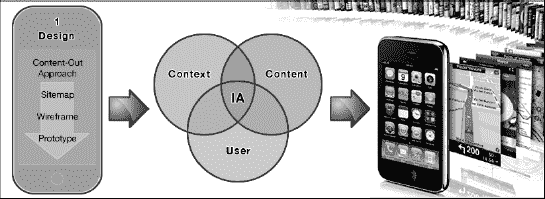

**图 2–5。** *信息架构框架:内容、上下文和用户*

想象一下，躺在沙发上平静地阅读 RSS 阅读器上的最新信息，想想那是什么感觉。现在，想象一下同样的经历，在地铁里，或者更糟，在早上 7:30 拥挤的公交车上。

通过描绘这些场景，您可以理解当用户体验的环境发生变化时，用户的体验也会发生巨大的变化。

**例子:**同一个上下文可以有不同的实例。

`- Context: “Reading RSS Feeds”
- Context instances: Sofa RSS Reading, Walking RSS Reading, Subway RSS
Reading, and Bus RSS Reading`

出于这个原因，小心地对上下文实例建模是我们项目中的一个关键因素。在分析阶段，犯了一个错误而忘记了一个具体的实例会花费“1”，但是同样的错误在设计阶段会花费“10”，在开发阶段会花费“100”。

在分析阶段，忘记一个实例的上下文结果是一个相对较小的错误，因为我们总是可以拿起笔，向我们的上下文实例清单中添加一个条目。使用来自分析阶段的不完整信息来设计用户界面意味着设计的界面可能永远不会满足所有用户的需求。基于设计糟糕的界面开始开发阶段意味着发布一些用户永远无法利用的服务。信息构建过程中的错误成本可以在[图 2–6](#fig_2_6)中看到。

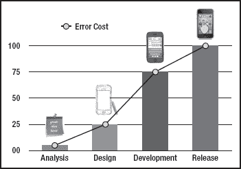

**图 2–6。** *信息构建过程中的错误成本*

因此，一旦你在项目流程中走得更远，事情就会改变。如果您需要在项目流程中后退一步，以便处理信息架构中的错误，那么整个项目流程将会受到截止日期和时间范围的影响；或许在延期期间，甚至商业目标也会改变。

现在，您可以看到如何使用该流程的敏捷和优化版本来优化每个 IA 阶段花费的工作时间。

#### 遵守移动战略的黄金法则

手机是一种不同的媒介，由一套不同的规则管理。但是，一旦您定义了敏捷信息架构过程，您就可以开始遵循一些黄金法则来处理一般的架构案例。

##### 了解用户及其需求

试着了解用户是谁，他们从网站或 web 应用程序中寻找什么，以及当他们使用它时他们实际上在哪里。

##### 考虑移动性的设计

我已经讨论了上下文实例，理解上下文在创建任何移动产品时都是至关重要的。预测用户环境可能很困难，因为不可能预测所有可能影响用户体验的情况。

以移动用户为目标确保你的产品可以在任何时间任何地点使用。一旦你清楚地记住了应用程序的目标，试着描绘出所有可能的应用场景，然后就潜在用户通常的移动应用环境采访他们。

##### 不转换，创造

简单地将桌面网站或网络应用移植到移动设备上是一个很大的错误。我们必须创造新产品，而不是为小屏幕重新构思。专门为移动设备创建而不是转换体验，可以让用户更快、更友好地获取信息。

##### 保持简单

如果有一条规则我们绝对不能忘记，那就是这条:iPhone 和 iPad 是智能电脑，但人们希望以简单的方式使用它们。人们(经常)在做其他事情时使用苹果移动设备，如走路、说话、听音乐或演讲、开车(请不要这样做！)，等等。人类的认知资源是有限的，如果我们在其他功能活动中使用这些资源的一部分，我们将无法同时管理像典型的桌面用户界面这样的复杂结构。遵循这个原则，你的应用程序越简单，用户的移动体验就越好。如果你理解了这一关键点，你也开始欣赏苹果在 iPad 上使用 iOS 而不是完整版 OSX 的决定。

#### 内容-出方法

网站是用来传递信息的。在网络的早期，设计对网站的存在没有任何作用。今天，我们仍然将内容视为网站或 web 应用程序最重要的部分，一切都必须从这里开始(如图[图 2–7](#fig_2_7)所示)。

内容外方法是一种全新的方法，内容向设计者展示最终的布局应该是怎样的。设计师利用这些内容来设定他们可能性的边界，使整个过程变得更容易、更快。

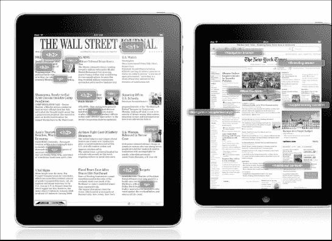

**图 2–7。** *HTML W3C 兼容标记(左)及其在华尔街日报和纽约时报网站上的语义标记实现(右)*

内容输出方法与语义标记密切相关。这种技术的目标是使用适当的语义元素来标记 web 内容的结构。这些元素是根据它们的意义来使用的，而不是因为它们在视觉上的表现方式。

从上到下，这是语义的一般层次。

1.  导航(主)
2.  品牌区域
3.  主要内容
4.  补充内容
5.  导航(辅助)
6.  网站信息

**注:**这些 mantic 方法是 W3C“Web Accessibility Initiative”(WAI)发布的“Web Content Accessibility Guidelines 2.0”(wcag 20)的一部分，旨在支持开发更易访问的 Web 内容。

以下是我们每次采用内容外包方法时使用的一些步骤。

1.  定义内容。
2.  将内容转换为 HTML5。
3.  使用语义标记来设置内容层次结构。
4.  使用灰框线框来分配布局空间和比例。
5.  设计和样式的布局。

换句话说，在构建网页的过程中，所有内容都必须在任何标记、线框或 CSS3 样式发生之前生成并转换为 HTML5。一旦你把我们所有的内容放到一个非样式化的网页中，你就可以自由地继续这个过程，思考哪种设计最适合你的内容。

#### 用站点地图表示信息架构

一旦您完成了信息研究和信息管理阶段，并使用内容外方法构建了项目的基础，您就可以表示信息并在内容架构和体验设计阶段工作，如[图 2–8](#fig_2_8)所示。

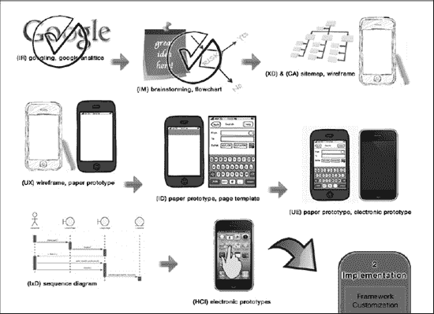

**图 2–8。** *阶段 3 和阶段 4 的敏捷信息架构过程:表示信息架构*

在使用内容外方法定义内容之后，我们用来定义移动信息架构的第一个项目是站点地图。它直观地展示了我们所有的内容是如何联系在一起的，并为用户如何浏览信息空间提供了一条清晰的路径。

移动站点地图与 web 上使用的站点地图没有什么不同，但是有一个重要的区别，我们将在下面看到。

##### 犯错的机会有限

信息架构师总是在争论宽和深的站点地图哪个是最好的选择。像计算机科学中的其他事情一样，这个选择从来不是非黑即白的。

**注意:**内容架构是您开始插入内容的地方，显示它是如何组织的。组织你的内容的最好的工具是线框，但是你在线框中插入的所有内容将是你之前在站点地图上表示的内容的实现。

在桌面站点地图上，你可能决定选择宽的或深的站点地图来满足特定的网站需求，如图 2–9 所示。在移动站点地图中，您只有一个选择:宽站点地图。出现这种情况是因为用户体验与桌面完全不同，一切都应该在 2 到 4 次线性点击中实现。

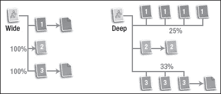

**图 2–9。** *宽(左边的结构)和深(右边的结构)场地图的视觉对比*

想象一下，用你的 iPhone 浏览一个具有图 2–10 所示结构的页面，其中两个结构在导航的主要级别都有三个链接。通过浏览宽结构并选择链接号 1，您有 100%的机会为我们的信息选择正确的路径。通过浏览深层结构并选择 3 号链接，你只有 33%的机会选择正确的路径，如果你选择 1 号链接，你的机会下降到 25%。

现在，想象一下在一个典型的网站中你可能会面对多少个链接。用户做出错误选择的风险有多大？如果坐在台式电脑前的用户走错了路，他们一眼就能看到如何返回主导航层。但对于 iPhone 来说，这不是在你的(二元)生活中寻找平静的正确方式。

在这一阶段，您通过在非常基础的层面上测试用户将与网站或 web 应用程序进行哪些类型的交互来建立用户体验的基础。

**注:**我们可以将用户体验中的*交互*定义为每当人类使用界面以实现目标或获取资源时，发生在人类与人类界面之间的一种行为。

通过处理表示站点地图结构的内容架构，您也开始处理(即使是间接的)用户体验。

##### 提供显示导航路径的方向

在移动用户体验中提供方向是一个关键因素，因此记住我们需要在每个页面上显示页面标题和导航路径是很重要的。对于两级结构和选项卡式导航菜单，我们可以省略导航路径，因为在这种情况下，页面标题和导航路径提供相同的信息。使用基于标签的界面，我们需要突出显示当前页面的标签，就像在 You Tube 的视频页面上那样。).

**注意:**在页面中显示导航路径意味着显示从 A 点到 b 点的某个站点地图路径。如果您愿意，您可以将导航路径视为单个站点地图实例。

移动用户可用于浏览的认知资源数量有限，很容易体验到迷失在空间中的感觉。如果我们的用户界面不是基于标签，我们可以使用面包屑来达到同样的目的，并避免用户的挫折感。

如果我们有一个很宽的站点地图，我们可以在界面中插入几个选项卡或者插入一个下拉菜单。iPhone 和 iPad 可以很好地处理这种菜单，即使它包含一长串选项。在[图 2–10](#fig_2_10)中，我们有两个标签导航和下拉菜单的好例子:谷歌和*纽约时报*。

**图 2–10。** *标签式菜单和下拉式菜单的好例子:谷歌和纽约时报*

#### 用线框勾画信息架构

网站地图显示了信息空间中的内容是如何组织的。现在，是时候使用你的第二个信息架构工具:线框来改善用户体验了。目前，您正处于敏捷信息架构流程的第四阶段，如[图 2–11](#fig_2_11)所示。

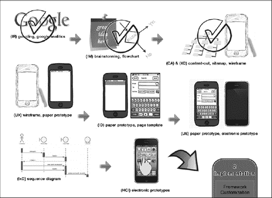

**图 2–11。** *敏捷信息架构过程第 4 阶段:勾画信息架构*

使用线框，你在页面上展示信息，使信息空间变得有形。使用线框为站点地图提供了视觉效果，并定义了用户如何与体验交互。

第一种方法是用一些手绘草图来勾画线框结构，如[图 2–12](#fig_2_12)所示。我相信徒手设计，当我需要创造一些东西时更是如此，因为创造过程与手工活动密切相关。

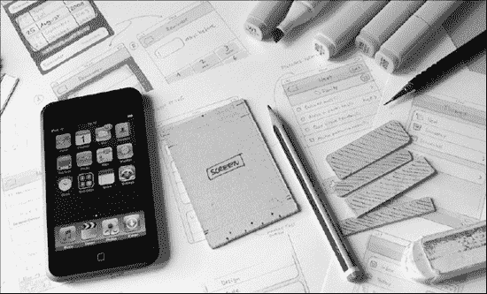

**图 2–12。** *一个手工绘制 iPhone 或 iPod 线框的工具(图像培养代码)*

一旦你的想法变得更加具体，你可以用一张打印出来的纸来更详细地重新设计结构。

我发现线框是最有价值的可交付信息，因为它们清楚地传达了布局思想，并且因为你可以在项目流程的下一阶段重用那些可交付的部分:原型。

线框的唯一缺点是它们不能传达复杂的结构；这就是原型的用武之地。

#### 通过原型可视化交互

原型制作听起来可能是多余的或耗时的，许多开发人员更喜欢跳进去开始编码，但是正如前面提到的，原型开始发挥作用是因为在有了线框结构之后，您需要处理细节。

有了原型，你就处于第 5、6、7 和 8 阶段(见[图 2–13](#fig_2_13))，在这些阶段你可以进入信息设计、可用性工程、交互设计和人机交互阶段。

**图 2–13。** *敏捷信息架构过程的第 5、6、7 和 8 阶段:可视化信息架构*

在原型上工作也减少了设计阶段的许多主要风险，最终节省了您的时间和金钱。

原型(纸质的和电子的)也是设计、迭代和集体讨论概念的最快可能方式。一旦一个原型被创造出来，就有了一个坚实的基础(即使是草图形式)可以讨论，这就把概念带入了生活。

开发团队中典型的原型迭代路径是

1.  勾画出你的想法，
2.  向团队展示，
3.  与团队一起评论，
4.  让它活起来，然后
5.  回到步骤 1(重复这个过程)。

如果你设计一个网站，你可以使用线框结构来制作页面模板。

继续你的敏捷设计和开发方法，你会看到使用原型的两种方式:纸质和电子。

##### 纸上原型

最基础的是纸质原型(如图 2–14 所示)，我们可以通过使用模板工具在打印出的线框上制作，以设计精确的用户界面，甚至可以用纸笔手绘结构草图。

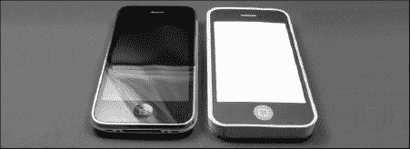

**图 2–14。** *一个纸质原型工具与一个真实的 iPhone 对比*

纸质原型在测试阶段也很有用。使用它让你有机会在可用性测试阶段重用你的工作。你将在第 11 章中更深入地了解这项技术。

##### 电子原型

下一个层次是电子原型。使用这个工具，您可以分析原型结构的行为。使用电子原型，您可以模拟人机界面交互，并在编码之前获得有效的反馈。

一个好的解决方案是使用基于 HTML5、CSS 和 JavaScript 的轻量级结构，用临时内容和数据填充。将这个原型结构加载到您的设备上会产生最接近最终产品的体验，因为您可以看到屏幕上会显示多少内容。使用远程文件和带有电子原型的服务器，您还可以开始处理加载时间和网络延迟。电子原型对于在可用性工程阶段继续你的可用性工作也很重要，在这个阶段你使用更详细的原型作为基础。

电子原型也有助于支持人机交互阶段，在这一阶段，您可以使用交互序列图进行人机交互和交互设计。

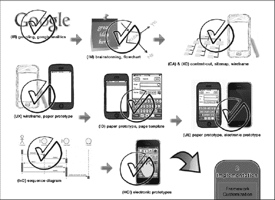

**图 2–15。** *一个完整的敏捷信息架构过程*

在第三章第一节中，我介绍了为 iPhone 和 iPad 构建网站和网络应用程序的框架。一旦您理解了框架结构，您就能够定义一个模板来加速电子原型的实现阶段。

### 手机设计的系统方法

正如您在移动信息流程中看到的，实现目标的最佳方式是设定一条从您所处的位置到目标位置的路径。在设计阶段，没有 IA 流程中的九个阶段，但仍然有一个系统的方法来专注于路径并优化整个工作流程。

设计时有两个重要的阶段:可访问性和可用性。可访问性和可用性是密切相关的，但是更重要的考虑是让所有用户都可以访问你的网站或 web 应用程序，然后设计和优化它的可用性。

#### 苹果设备中的辅助功能

根据 W3C 的定义，网页可访问性是指让所有能力水平的人都能访问网站和网络应用程序的实践。MWBP(移动网络最佳实践)和 WBP(网络最佳实践)之间有重叠，因为在大多数情况下，他们有类似的障碍和类似的解决方案。移动网页可访问性旨在解决的两个最重要的需求是视觉和听觉需求。

**注:**2008 年 12 月 11 日，WAI(网络无障碍倡议)发布了 WCAG 2.0 作为推荐标准。WCAG 包含一套关于内容可访问性的指导原则，主要针对残疾用户，但也针对所有用户设备，包括高度受限的设备，如移动电话和智能手机。

解决(至少)视频和音频需求将使您的网站或 web 应用程序对您的大多数潜在用户都是可访问的，正如在[图 2–16](#fig_2_16)中可以看到的。但不幸的是，这并不总是容易实现的，有时甚至许多知名和成功的产品至少在某种程度上缺乏可访问性。

**图 2–16。** *三种辅助功能服务:缩放(左)、画外音(中)、黑底白字(右)*

W3C WCAG 2.0 提供了使您的网站或 web 应用程序更易访问的指南。不幸的是，在撰写《WCAG》时并没有考虑触摸屏设备，但以下几点背后的大部分概念都适用于 iPhone 和 iPad。

*   正确使用标准技术。
*   提供手指友好的导航结构。
*   在每个网页上提供方向信息。
*   提供字体大小控制。
*   在文本、图像和背景之间提供良好的对比度。
*   提供高对比度版本的网页。
*   提供网页的语音版本，如[图 2–17](#fig_2_17)所示。

iPhone 和 iPad 有一些新功能，使残疾用户可以使用它们。例如，残疾用户不会被迫记住长键盘组合来找到他们要找的东西:要选择和打开一个项目，用户需要点击或双击它。为了让用户从这些功能中受益，设计者和开发者必须了解这些功能，以便优化内容和服务。

##### 画外音

这一功能使您的 iPhone 或 iPad 成为第一个基于手势的屏幕阅读器，使用户能够与屏幕上的项目进行物理交互。VoiceOver 与 iPhone 和 iPad 的触摸屏配合使用，让用户可以直接与屏幕上的对象进行交互。这使得视力受损的用户能够访问内容并在站点地图上确定自己的方向。

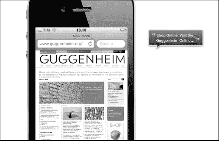

**图 2–17。** *辅助功能:画外音*

VoiceOver 是一种设备功能，独立于您的网站或 web 应用程序，让您无需付出任何特别的努力即可受益；然而，为了避免给用户带来令人沮丧的导航体验，必须应用良好的用户界面设计实践。很快，您将研究好的用户界面实践。

##### 语音控制

除了手势之外，您还可以使用语音命令来播放音乐或拨打电话。您只需按住主屏幕按钮，聆听音频提示，并说出地址簿中的姓名或 iTunes 播放列表中的艺术家姓名。

##### 缩放

通过此功能，如图 2.18 所示，用户可以放大整个 Spotlight 或解锁屏幕，或任何其他本地或购买的屏幕应用程序。

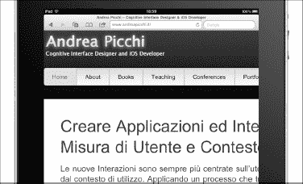

**图 2–18。** *辅助功能:缩放*

一旦启用，用三个手指双击即可立即放大和缩小 200%，用户可以双击并拖动三个手指，在 100%和 500%之间动态调整放大倍数。

##### 黑底白字

喜欢高对比度的用户可以使用此选项将显示改为黑底白字，如[Figure 2–19](#fig_2_19)所示。这种反极性效果适用于所有应用，包括 Home、Unlock 和 Spotlight。

**图 2–19。** *辅助功能:黑底白字*

iPhone 和 iPad 的颜色菜单非常适合这种颜色反转，但是如果你的网站或网络应用程序使用的颜色对比度不够，结果就不会令人满意。为了防止这种副作用，在设计用户界面时，使用具有足够对比度的调色板。

##### 字幕

iPhone 和 iPad 都支持播放开放字幕、隐藏字幕和字幕。字幕出现在屏幕上，就像用户可以在电视上看到的隐藏字幕一样。您可以使用适当的工具创建自己的。

##### 听觉、视觉和振动警报

这些选项向用户提供听觉和视觉警报。用户可以为电话呼叫、新的文本消息、新的和已发送的电子邮件以及日历事件设置这些提醒。

##### 无障碍软件功能

从 iOS5 开始，苹果对 iOS 设备的可访问性进行了几项重大改进。这些新功能使行动不便、有听力、视力或认知障碍的人更容易充分利用他们的 iOS 设备。首先，增加了一种新的方式来添加某些功能，让用户通过触摸触摸屏上的特定点来快速回忆它们。使用这个新菜单，用户可以访问一些设置功能，甚至可以绕过 Home 按钮立即返回到仪表板。

一个相关的功能是使用 LED 闪光灯和可定制的来电振动。当有人打电话给 iPhone 时，LED 闪光灯会打开，自定义振动会开始。新的辅助触摸功能使用户能够将手势定制为宏快捷方式。苹果还增加了一个说话选择功能，带有一个可调的语速滑块，用于发声文本选择。甚至更老的功能也得到了改进，例如 VoiceOver 现在包括自定义元素标签。

#### iOS 设备的可用性

可用性专家 Jakob Nielsen 认为，“可用性是一种质量属性，用来评估界面的易用性。”虽然易访问性主要影响一部分用户，但是可用性影响所有的用户。

在信息研究中仔细和深思熟虑的工作可以减轻潜在的可用性问题，例如图 2–20 中所示的问题。2008 年，Create with Context 对 iPhone 可用性进行了一项有趣的研究，名为“人们如何真正使用 iPhone ”,该研究表明设计师和开发人员有时很难预测用户行为。

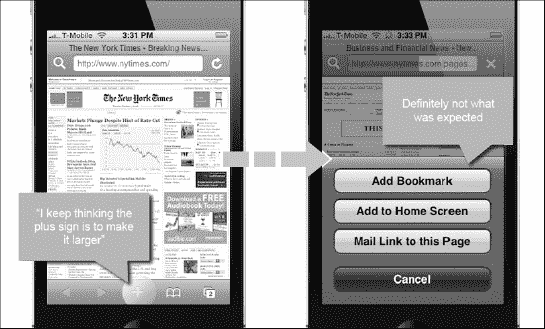

**图 2–20。** *可用性研究:人们如何真正使用 iPhone(图片:结合上下文创建)。*

Create with Context 的研究得出了 iPhone 设计和开发的八条通用规则，这些规则现在也适用于 iPad。这些规则如下:

*   利用习得的行为。“哦，这就像日历一样”
*   避免交互不一致。
    “这太奇怪了，取消通常是在那边”
*   跨部件提供清晰的概念链接。这个按钮一定和那个盒子有关，因为它们紧挨着
*   在动作部件之间留出空间。
    “天哪，我不是故意发那条短信的！”
*   意外过擦的计划。“我总是不小心切换到不同的屏幕”
*   不要完全依赖多点触控。“当我另一只手拿着东西时，很难做到这一点”
*   为点击提供视觉反馈。“它按下那个按钮了吗？我不确定”
*   提供交互启示。很明显，你应该左右滑动

**注:**在
`[http://www.slideshare.net/createwithcontext/how-people-really-use-the-iphone-presentation](http://www.slideshare.net/createwithcontext/how-people-really-use-the-iphone-presentation).`的 Slideshare 上可以看到该研究的完整介绍

如需下载 PDF，请访问
`[http://www.createwithcontext.com/how-people-really-use-the-iphone.html](http://www.createwithcontext.com/how-people-really-use-the-iphone.html)`。

这些问题既是产品可用性的基础，同时又很难预防，因为你掌握的东西越多，你就越不能站在新手的角度考虑问题。这就是为什么伟大的教授如此罕见的原因之一。

##### 什么时候进行可用性研究

到目前为止，您已经看到了为了向尽可能多的用户提供良好的用户体验，可访问性和可用性在您的项目中是多么重要。这里，最重要的问题是:你应该什么时候在可用性上工作？

我可以确定一些关键时刻，在这些时刻，对可用性的仔细研究可以提高你的项目的整体感知质量。这些要点如下:

1.  **Before Starting the Project**

    您需要收集有关竞争对手的信息，并了解他们如何解决特定的应用问题来实现项目目标。

    您需要理解用户应用程序上下文，并找出如何优化它们。

2.  **Before Starting to Design**

    如果你改编了一个桌面网站或者一个网络应用程序，你需要决定从网页结构中保留什么(因为它可以在移动环境中工作)和丢弃什么(因为它不能)。创建站点地图以测试和分析网站或 web 应用程序内容结构。

3.  **In the Design Phase**

    区分所有网页内容的优先级。

    使用线框、纸质原型和电子原型来表示站点地图。

4.  **In the Test Phase**

    使用原型来测试用户体验的水平。

您可以看到可用性原则是如何应用于项目流程的许多阶段的。在下一章，我将介绍一个清单，它可以帮助你在项目中获得高水平的用户体验。

##### iPhone 和 iPad 可用性的差异

iPhone 和 iPad 运行 iOS，它们共享相同的导航模式，但它们使用不同尺寸元素的不同显示器在一定程度上改变了用户对用户界面的感知，从而导致用户体验的可用性和质量发生变化。

这就把我们带到了 iPad read-tap 字体不对称的话题上。在每一个 iPhone 网站或网络应用程序上，如果字体太小而无法阅读，那么它也太小而无法触摸。

**注意:**这里，当我说“字体”时，我指的是所有基于字体的结构，比如导航栏、侧菜单、表单、简单段落等等。

在 iPad 的世界里，这并不是在每种情况下都会发生。有时字体大到可以阅读，但太小了不能触摸。在这种情况下，我们说字体不是手指友好的。在本书中，您将看到如何使用 CSS3 样式表处理这种情况。

从可用性的角度来看，这在 iPhone 和 iPad 上设置了一个重要的界限。另一个重要的区别是 iPad 视窗中没有底部栏。

如果没有底部栏，用户体验的质量会降低，因为导航结构的这一部分丢失了。用户可以解决这种情况，轻按状态栏以快速滑动到页面顶部，并访问 Safari 栏中的导航结构。不幸的是，并不是所有的用户都知道 iOS 的这个特性，当他们寻找导航结构的时候，经常会努力向上滑动到顶部。

当你把你的 iPhone 和 iPad 网页放在上下文中时，这是要记住的两个要点。在下一节中，您将会看到在项目流程中的什么地方和什么时候您需要应用您的可用性原则。

##### 移动设备可访问性和可用性清单

以下是在设计项目时要寻找的易访问性和可用性项目的一般列表。

**可访问性**

*   合理的现场装载时间
*   足够的文本与背景对比度
*   易于阅读的字体大小/间距
*   节约使用额外的 JavaScript
*   `Alt`图像标签
*   自定义未找到/404 页面
*   优化的打印样式表
*   优化的本地设备服务集成
*   针对不同 iPhone 型号的优化布局
*   纵向和横向的优化布局
*   纵向和横向的优化图像
*   提供了到标准站点的链接

**可用性:导航**

*   易于识别的主导航
*   导航标签清晰简洁
*   合理数量的按钮/链接
*   链接到主页的公司徽标
*   手指友好的链接和图标
*   一致且易于识别的链接
*   突出显示的当前位置
*   页眉中的后退按钮
*   描述性文本内链接
*   自定 spotlight 屏幕图标
*   相关错误信息的返回
*   易于访问的站点搜索

**可用性:内容**

*   宽站点内容地图结构
*   页面设计中的负空间
*   清除可视页面层次结构
*   优先内容
*   折叠上方的关键内容
*   解释性 HTML 页面标题
*   主要标题清晰且具有描述性
*   款式和颜色一致
*   少用文本强调
*   有意义且用户友好的 URL

重要的是，在你的下一个项目中，从这个总列表开始，你要根据对你的项目来说最重要的东西，把你自己的可用性清单联系起来。

#### iPhone 页面模型

iPhone 页面模型是指每个 iPhone 页面的基本构建块。每一个网站，web 应用，甚至原生应用都是基于这个概念，所有的 iPhone 内容都是一栏一个线性结构。

使用页面模式时，iPhone 支持 320° 480 和 480° 320 的纵向和横向，iPhone 2G、3G 和 3GS 支持 163 ppi(每英寸像素), iPhone 4 支持 326 ppi 的 640° 960 和 960° 640。每个方向都有它的优点；一般来说，纵向更适合列表，而横向使大多数内容更容易阅读。

页面模型是网站或 web 应用内容共享的概念结构，通过屏幕显示在一个叫做*可视区域*的区域内，如图[图 2–21](#fig_2_21)所示。

iPhone 页面模型基于五个部分。

*   品牌区域
*   导航(主)
*   内容
*   导航(子)
*   网站信息

**注意:**在原生应用程序(使用 Objective-C 和 Apple SDK 开发)和模拟原生 iPhone 用户界面的 web 应用程序中，品牌区域和导航部分通常合并到一个没有导航的标题中。

每次用户与链接交互时，都会在屏幕的可视区域内加载一个新页面(可视区域将在下一节“iPhone 用户界面”中分析)，旧页面将被完全替换。这在纵向和横向视图中都会发生。

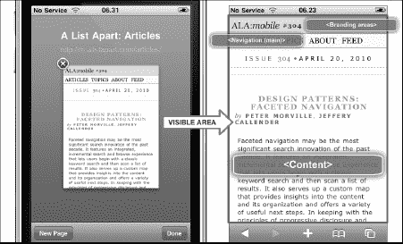

**图 2–21。** *带有语义标记的缩略图(左)和全屏视图(右)中的 iPhone 页面模型*

iPhone 结构页面也是持久的，这意味着当用户从纵向切换到横向时，它会保持其结构不变。这个概念听起来可能相当明显，但是当我分析 iPad Block 模型时你会看到，它不是一个固定的规则。

现在我们已经了解了 iPhone 页面模型，是时候分析它的用户界面了。

#### iPhone 用户界面

iPhone 用户界面是一个基于图标和触摸的软件，在电容式触摸屏显示器上工作。这个接口由两个逻辑部分组成。

*   本地用户界面(NUI)
*   可视区域

NUI 和可视区域一起占据了整个可用的屏幕区域。从上到下，iPhone 屏幕区域由四个不同的部分组成。

*   状态栏(NUI 的一部分)
*   网址栏(NUI 的一部分)
*   可视区域
*   底部酒吧(NUI 的一部分)

NUI 由出现在 iPhone 页面顶部或底部的所有元素组成。在各种本地或 web 应用程序上使用不同类型的 NUI，但对于移动 Safari Web 浏览器，只有三种，如[表 2—1](#tab_2_1) 中所总结的。

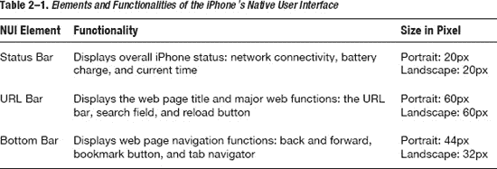

在纵向和横向模式之间切换时，状态栏和地址栏的大小不变，但底部的栏从纵向模式下的 44px 变为横向模式下的 32px，如图[图 2–22](#fig_2_22)所示。这意味着可用的可视区域没有固定的大小。

如前所述，每部 iPhone 的页面都显示在屏幕的可视区域内。可视区域不会占据 100%的可用屏幕，因为 NUI 在纵向视图中会占据 124 像素，在横向视图中会占据 112 像素。

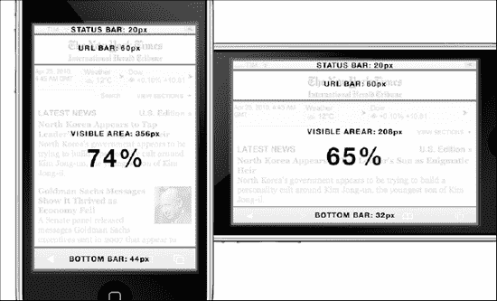

**图 2–22。** *带地址栏的纵向和横向视图中可用的可视区域数量*

**注意:**在 iPhone 上，用户总是可以选择在地址栏下方显示调试控制台，从可视区域窃取 50 个像素。

这个事实很重要，因为根据 iPhone 的方向，我们有不同数量的屏幕可用空间。尽管 iPhone 4 的 Retina 显示屏分辨率更高，但它的显示区域在状态栏、地址栏和底部栏等用户界面元素之间将具有相同的比例和相对大小。从用户的角度来看，除了拥有一个清晰度更好、可读性更高的屏幕，他或她与 iPhone 4 的交互方式不会有任何改变。在[Figure 2–23](#fig_2_23)中，我们可以看到新的 Retina 显示屏显著提高了清晰度和锐度。

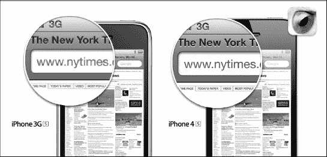

**图 2–23。** *视网膜显示器传递的分辨率*

[表 2—2](#tab_2_2) 显示了所有 iPhone 型号在每个方向上 3.5 英寸可用屏幕的百分比。

#### iPad 积木模型

iPad 内容是基于块模型概念构建的。整个页面不再是内容的构建块；这个概念基于内容页面中的块。在 iPhone 上，信息是线性显示的，而 iPad 上的内容主要基于两栏布局的一些不同变化。

iPhone 和 iPad 支持两种方向，但与旧款 iPhone 的 163 ppi 和 iPhone 4 的新 Retina 显示屏的 328 ppi 相比，768×1024 的纵向和 1024×768 的横向(均为 132 ppi)的清晰度有点低。就像 iPhone 一样，每种方向都有其优势，但这次不是在空间方面，因为可用的屏幕空间足以轻松完成几乎所有事情，无论使用哪种视图。

iPad 令人兴奋的新东西是双方向选项和新的屏幕分辨率让我们能够设计两种布局。我们可以针对屏幕分辨率优化两种布局，并可以在每种设计中添加或删除资产。

正如 2007 年第一代 iPhone 问世时一样，一个很好的例子和隐含的指导方针直接来自苹果设计师。在[图 2–27](#fig_2_27)中，我们可以看到原生笔记应用程序如何使用块模型来呈现两种不同的布局。横向视图中的用户与基于两个块的布局进行交互，其中他或她可以在左侧块中查看待办事项列表，在右侧主块中查看所选待办事项列表条目。

**图 2–24。** *一个两块模型应用的例子:iPad 的注意事项*

正如上一节所介绍的，iPad 的信息结构不像 iPhone 那样是严格持久的。正如我们到目前为止所看到的，这对我们来说不是一个问题，而是一个令人兴奋的机会。

**注意:**在这种情况下，两个块在两列中，但这种相等并不总是成立的。在其他情况下，添加或删除的块(纵向或横向)可能是一个补充导航、某种行动按钮或其他有用的东西。

查看笔记应用程序，我们可以看到在纵向视图中缺少的块包含一些用户可能需要的有用信息，即使他或她在纵向视图中。因此，提供对该块的访问总是一个好的做法，即使它没有以给定的方向显示。

苹果设计师再一次为我们提供了一个简单的解决方案:使用一个弹出菜单，通过标题应用程序中的一个按钮即可访问。因此，我们无需改变方向就可以访问这部分信息，如图[Figure 2–25](#fig_2_25)所示。与 iPhone 一样，所使用的块模型显示在可视区域内。

**图 2–25。** *一个两块模型应用的例子:纵向视图访问横向内容*

iPad block 模型也基于相同的五个部分:

*   品牌区域，
*   导航(主)，
*   内容，
*   导航(子)，以及
*   网站信息。

当用户与链接交互时，我们的行为更类似于我们在与桌面页面交互时看到的行为。由于 iPad 支持 768×1024 或 1024×768 的原生分辨率，大多数设计师并不觉得有必要为这种设备设计和开发一种特定的优化结构。

在开发者社区，我们谈论了很多关于如何优化网页的问题，对于新的苹果设备，我们看到了关于如何实现 HTML5 标记或使用 HTML5 视频播放器而不是 Adobe Flash player 的指南。

为了与 iPhone 完全兼容，网站总是需要一个完全不同的版本，但只需修改一些代码，你就可以将你的网页内容变成完全兼容 iPad 的内容。问题是，为鼠标导航设计的网站对于有视力问题或手指稍大的移动用户来说可能是糟糕的体验，如图[Figure 2–26](#fig_2_26)所示。

在这一点上，我们只能依靠移动 Safari 提供的缩放功能来获得愉快的体验，但对我来说，这不是展示设计师如何发挥创造力并利用他们的想法改善用户日常生活的最佳方式。

**图 2–26。** *官方时间网站:拥有一个支持 iPad 的网站并不意味着我们的工作做对了*

现在我已经讨论了 iPad block 模型，您可以开始分析它的用户界面了。

#### iPad 用户界面

iPad 运行与 iPhone 相同的操作系统(iOS)；因此，我们有几乎相同的用户界面外观和感觉。iPad 用户界面仍然由两个逻辑部分组成，但在以下方面有所不同。

*   本地用户界面(NUI)
*   可视区域

NUI 和可视区域再次占据了整个屏幕区域，但这次是从上到下。iPad 的屏幕区域由三个不同的部分组成。

*   状态栏(NUI 的一部分)
*   网址栏(NUI 的一部分)
*   可视区域

**注意:**像 You Tube 或 iTunes 这样的一些原生应用使用了底部条，就像我们在 iOS UI 中看到的那样。这个底部条的高度为 48px，用于向用户提供高级选项。

NUI 由出现在 iPhone 页面顶部或底部的所有元素组成。作为苹果设备的设计者和开发者，我们对 Safari Web 浏览器界面感兴趣，因为我们的网站和 Web 应用程序将在这个应用程序中呈现。

即使在 iPad 上，我们也有不同类型的 NUI 用于各种本机或 web 应用程序，但对于移动 Safari Web 浏览器，只有两种(第三种是可选的)，如[表 2—3](#tab_2_3) 中所总结的。

T2】

可视区域仍然没有占据 100%的可用屏幕，因为 NUI 在纵向和横向视图中都占据了 66px。结果是，有了 URL 栏，我们在纵向视图中有 94%的可视区域可用，在横向视图中有 92%的可视区域可用。没有了 URL 栏，我们几乎达到了 100%的屏幕可用性；我们有 98%的纵向和 97%的横向。

**注意:**在 iPad 上，用户可以随时选择在地址栏下方显示书签栏，从可视区域窃取 28 个像素。

与 iPhone 相比，我们可以注意到两个方向上的可用可视区域都有显著的相对增加，如图[图 2–27](#fig_2_27)所示。

**图 2–27。** *在带有地址栏的纵向和横向视图中可用的可视区域数量*

凭借 9.7 英寸的显示屏和几乎 100%的可用屏幕空间，我们有空间大幅改善移动用户体验，并提供前所未有的交互程度。[表 2—4](#tab_2_4) 显示了可用屏幕的百分比。

#### 苹果手机设计工具

本章中使用的工具既有购买的也有免费的。这个列表展示了一些有用的工具，您可以利用它们来设计您的下一个网站或 web 应用程序。

### 总结

在这一章中，你开始了作为一名移动设计者和开发者的旅程。从信息架构过程及其九个步骤开始，我说明了过程的每个步骤最适合使用哪些工具，定义了典型的、更复杂的 IA 过程的敏捷变体。

我在 Apple device design 中介绍了可访问性，您看到了如何以及使用哪些硬件和软件功能来解决可访问性问题。

在本章的最后一部分，我讨论了 iPhone 和 iPad 的可用性，展示了如何处理它，并且我提供了一个可用性检查清单，用于在跳到实现阶段之前控制项目。我还展示了 iPhone 和 iPad 用户界面及其内容的范例:iPhone 页面模型和 iPad 块模型。

最后，我提供了一个本章中使用的工具列表，以帮助设计师完成他或她的下一个移动项目。