# 四、iOS 设备的用户界面设计

> *“简单是终极的复杂”*

莱昂纳多达芬奇

用户界面设计阶段是整个项目中最重要的阶段之一。用户界面是 WebApp 中一切的基础:内容、功能和所有类型的服务都是通过组成用户界面的元素来访问的。

在这一章中，我们定义了什么是触摸屏生态系统中的界面。我们探索积极和消极空间的概念，因为它在用户界面设计阶段发挥作用，并看看感知规则如何帮助我们在头脑中概念化我们的界面设计。

我们讨论颜色心理学理论，建议你如何以一种有效和令人愉悦的方式组合颜色，并看看颜色如何影响用户的情绪。然后我们检查用户阅读模式，看看你如何用你的界面设计来影响他们。

在这一章的最后一部分，我们检查了用户界面设计过程的所有阶段，然后我们在三个不同的项目中实现它:一个与 iPad 兼容，一个具有特定于 iPad 的类似本机的结构，一个仅用于 iPhone 的类似本机的结构。

### 用户界面设计

大多数设计师都把简单放在第一位，我们也是。我们重视简单的事情，因为它们很容易做我们需要的所有事情，没有一件事情我们不需要。简单就是和谐。人们引用莱昂纳多·达·芬奇的话说:“简单是终极的复杂。”当你坐在电脑前设计你的用户界面时，你应该记住这句话。简单就是优雅。

这些年来，我们看到了苹果风格的变化，逐渐形成了自己对“简单”的诠释。在[图 4–1](#fig_4_1)中，你可以看到周围的世界是如何被这种风格影响的。

**图 4–1。** *不同品牌，相同款式:苹果(左)和 Palm(右)。*

Palm 是一家大公司，它沿着苹果开辟的道路改变了营销品牌的方式。就连其他公司的最新广告，比如微软，也是受到这种思维方式的启发。简单正迅速成为基于触摸屏显示器的新技术革命的基础。

完成了项目流程步骤 0 中的分析阶段后，我们进入步骤 1 中的设计阶段。在这个阶段，我们开始处理我们的界面。正如我们从[图 4–2](#fig_4_2)中看到的，用户界面设计是整个设计阶段的一个子步骤，在此阶段设计和批准的所有东西都在项目流程的下一个阶段开发，称为“实现”

**图 4–2。** *项目流程背景下的用户界面设计阶段*

本章讨论的用户界面设计过程是基于*简单性*的。在介绍了一些重要的主题后，如负空间和正空间、主动空间和被动空间、色彩心理学背后的理论以及阅读模式，我们讨论了如何从兼容的第一步(兼容的 WebApp)到完全兼容的类似本机的方法。

在开始之前，我们需要引入一个重要的新概念:“界面”这个词在触摸屏生态系统中到底意味着什么？现在让我们来看看。

#### 什么是接口？

作为设计师，你对*用户界面、*的概念很熟悉，但是在我们周围有很多种界面。每当我们有一个想要控制或与之互动的对象时，在这个对象和我们自己之间就会有某种*界面*。这个界面给了我们一个简单的方法来实现我们的目标。

**定义:**界面

两个系统之间的交互点。

**定义:**用户界面

计算机应用或操作系统的可视部分，用户通过它与计算机或软件进行交互。

对于像 iPhone 或 iPad 这样的设备，我们有两种界面，如图[Figure 4–3](#fig_4_3)所示:

*   **软件界面**
*   **硬件接口**

iOS 为我们提供了一些不同的软件界面，每种不同的 iPhone 视图都有自己特定的类型。地址簿样式视图使用具有边对边链接的典型列表方法界面，关于我们样式视图可以使用圆角矩形方法。

**图 4–3。***iPhone 的接口类型:软件接口(左)和硬件接口(右)。*

在软件接口之下，我们有一个由硬件接口提供的更原始的交互层。这些软件和硬件接口使用户能够与设备的各个方面进行交互。使用[Table 4–1](#tab_4_1)中显示的硬件接口，您可以调整麦克风和扬声器音量，打开和关闭设备，并且通过触摸屏使用操作系统提供的所有软件接口。

当我们在 iOS 设备上使用任何一种移动软件时，我们也会使用触摸屏进行交互。在我们的触摸屏环境中，显示器也是一个硬件接口。这是很重要的一点，因为它直接将我们引向一种新的范式，这种范式是我们以前从未在传统桌面或旧的移动电话方法中见过的:一切都是界面。

#### 一切都是一个界面

这是什么意思呢？用这些词，我们指的是 iOS，因为它的触摸屏功能，你的软件中的每个部分都变成了一个界面。在这一章中，我们将看到如何设计每一个技术上可触摸的 WebApp 部件，而不仅仅是桌面范例过去使用的“经典界面”。

使用触摸屏，您可以缩放、挤压、滚动以及做其他手势动作。这些手势使用户能够与整个视口中包含的所有对象进行交互，换句话说，就是与 WebApp 的所有可见部分进行交互。[Figure 4–4](#fig_4_4)展示了如何使用触摸屏设备，即使是内容也必须被视为一个界面，在这种情况下是一个被动界面。

**图 4–4。***iPhone 的接口种类:主动接口(左)和被动接口(右)。*

在经典的导航范例中，当你使用鼠标(或老式手机中的操纵杆)时，你通常只指向或选择 WebApp 的可链接部分。没有人试图点击一个*死区*并期望会发生一些动作。

**注:**单词*死区*指布局内不可点击的区域。因为它是不可点击的，所以布局的死区部分不会给用户提供任何级别的交互。

一旦你理解了这个重要的概念，你就会意识到你的界面的每一部分，以及你的 WebApp 的每一部分，都需要精心设计。

从现在开始，我们将使用*主动界面*作为我们界面中可触摸或可点击的部分，我们将使用*被动界面*作为我们布局中仅仅可触摸(可缩放)的部分。请记住，主动界面基于软件功能(链接)，被动界面基于硬件功能(触摸屏显示)。在[图 4–4](#fig_4_4)中，你可以看到 iPhone 和 iPad“兼容”网站中的主动和被动界面。

作为设计师，意识到这个概念可以极大地提高你的设计技能，并提升你的项目所提供的用户体验水平。

新的触摸模式也改变了你的界面和布局的要求，所以现在的问题是，你应该如何设计你的触摸界面和布局？

您的触摸界面和布局设计基于:

*   **对颜色的认知运用**
    利用颜色获得的情绪强化了品牌信息。
*   **新的视觉层级**
    优先考虑界面和布局，针对触摸屏设备进行优化。
*   **一种新的触摸屏阅读模式结构**
    在原生和兼容项目中优化触摸屏 UX。
*   **被动和主动消极空间的认知运用**
    主动和消极空间都是基于感知规律。

现在你知道了要使用的工具，问题是，“你想用这些工具达到什么目的？”

在设计你的界面和布局时，你应该努力做到:

*   **统一**
    在界面和布局元素之间创造和谐。
*   **平衡**
    利用界面和布局元素创造视觉平衡。
*   **层次**
    区分界面和布局元素的优先级。
*   **主导权**
    在界面和布局元素上创造焦点。

所有这些概念理解起来都很重要。但是意识到它们，认识到它们，并在你的设计中使用它们完全是另一回事，需要实践。

**图 4–5。** *用户界面设计阶段的工具和目标。*

首先，我们为这个新的触摸范例引入一个基本概念:负空间概念。你可以看到这个简单的想法是如何彻底改变你的设计风格的，以及它与触摸屏范式的密切关系。

###### 用户界面设计中的感知规则

感知规则是每一种设计师的基础。这些规则是过滤器，用于生活中的互动，是我们经验的基础。这些规则的作用是解释和整合来自外部环境的单一刺激成为一个单一的连续形式。

为 Apple 设备设计界面时，为了实现设计的特定目标，了解这些规则非常重要。有时候，你可能想传递激情、能量、简单，或者只是极简主义者。感知的规则帮助你在质量方面取得更好的结果，并使整个过程更加容易。

邻近定律指出，感知场中的邻近元素被感知为单一实体。您可以使用此规则为设计创建基于语义的组或实体。

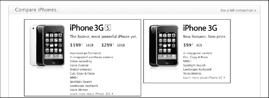

**图 4–6。** *两列设计中的邻近定律。*

相似性定律表明，感知领域中的相似元素根据其几何形状、颜色或尺寸被视为同一实体的一部分。您可以使用此规则来创建非邻近元素之间的设计一致性。

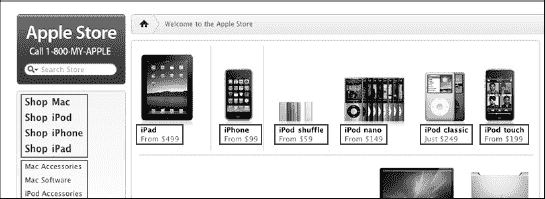

**图 4–7。** *网站菜单和产品细节中的相似法则。*

连续性定律表明，感知领域中的连续元素被感知为结合成一个具有模式和方向的单一实体。您可以使用此规则来创建和添加视觉图案和连接到设计中。

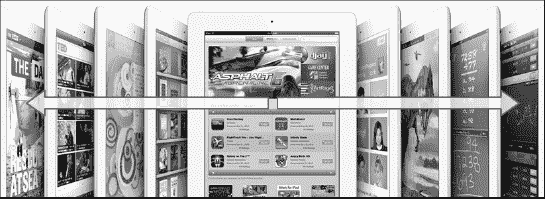

**图 4–8。** *盖流设计中的连续性定律。*

闭合定律表明，感知领域中的某种元素被感知为某种形式，即使某些视觉信息缺失。我们可以使用这个规则在物理上不可能的地方创造视觉形式或元素到设计中。在[图 4–9](#fig_4_9)中，你可以看到几乎所有的角落都被物理地打开了(图 4–9 中的红圈)，但是头脑使用闭合法则，填补了这个信息空白并感知到了连续的线条(和形式)。

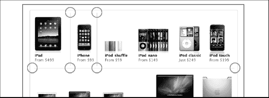

**图 4–9。** *版面设计中的闭合定律。*

共同命运法则表明，在感知领域中具有相同方向的元素被感知为单一的运动实体。您可以使用此规则来创建运动并为设计添加方向。

**图 4–10。** *聚光灯设计中的共同命运法则。*

图形背景关系法则表明，感知领域中的元素被感知为其形式与背景的结合。你可以使用这个规则来创建单个元素之间的联系，创造优势，并在设计中增加对比。

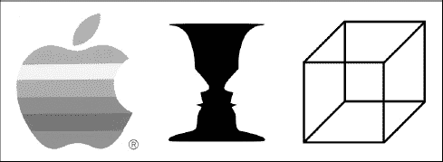

**图 4–11。** *标志设计中的图底关系法则。*

过去的经验法则表明，感知领域中的元素是根据我们过去的经验及其意义来感知的。过去的经验储存在长期记忆中，当前的经验与已经储存的信息进行比较。图 4–12 中显示了一个示例。这个词并不完整，但是根据以往的经验法则，你能够确定正确的词是“iPhone4”你可以使用这个规则来优化每一种与设计和用户体验相关的视觉感受。

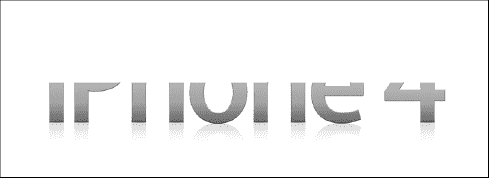

**图 4–12。** *以往标志设计经验法则*

#### 负空间

在第三章中，我们开始理解为什么界面和布局中的空间是如此重要的考虑因素。用户使用手指执行操作，需要更多的物理空间，以便以舒适的方式与您的界面交互。

此外，正如你在上一节学到的，考虑你看到的每一个图形都与一个背景有关。对我们设计师来说，这意味着我们界面或布局的每一部分都与其周围的空间有着密切的关系。利用这个空间，你可以极大地改变用户的情感效果，改变用户体验的水平。

出于我们的目的，*负空间*，也称为空白，一般可以定义为某个页面或界面中未被内容占据的区域。对于设计师来说，负空间是页面上特定项目之间的空间，不必是白色或纯色；它可能包含渐变、图案或背景对象。

**定义:**负空间

图像主体周围和主体之间的空间。当周围的空间，而不是主体本身，形成一个有趣的或艺术相关的形状时，负空间可能是最明显的。负空间的使用是艺术构图的一个关键要素。

设计一个网页或用户界面包括采用不同的对象，并以一种逻辑的、功能的和吸引人的方式来排列它们。要记住的关键概念是，你的界面的吸引力远远超出了你所使用的设计元素；你还必须考虑到这些元素周围的负空间的美学质量。

每个元素占用的物理空间与页面上的所有其他项目相关。这个物理空间有自己的规则。这些规则，从简单到复杂，都依赖于上下文。它们都有一个共同的关键点:它们都受到负空间的影响。

**图 4–13。** *标志设计中完美运用负空间的范例(图片 Richard Fonteneau)。*

你需要学习的第一件事是如何在你的界面或布局中看到负空间。你必须做的是重新训练你的大脑，不仅要看内容，还要看内容的反面。如果你认为一个元素是一个项目和项目周围的空间的组合，你的大脑使用一个称为图形背景的*定律的过程，将项目和它周围的负空间组合起来，以表示该元素。*

尽管你现在已经熟悉了负空间背后的概念，但是为你的设计决定正确的负空间数量需要大量的视觉敏感度和技巧。基本上，适量的负空间取决于三个因素:

*   **你想要获得的心情**
    (作品集网站比在线杂志需要更多的空间)
*   **要传递的信息量**
    (因为负空间很贵)
*   **您为**
    设计的媒体(iPhone、iPad、台式电脑、打印机等，可能需要不同的数量)

在了解如何处理负空间之前，你需要考虑在我们的设计中可能很重要的两种情况:

*   **主动负空间**
    (用于将观者从一个元素引向另一个元素)
*   **被动消极空间**
    (用于创造平衡、和谐、呼吸的空间)

现在，我们提供一些方法来帮助更容易地使用这个强大的工具。

##### 被动否定空间

这种负空间对于获得某种情绪和强化品牌背后的信息非常重要。在[图 4–14](#fig_4_14)中，你可以看到苹果网站上使用了大量的被动否定空间。苹果广泛使用这种技术，以正确的方式推广和传播其品牌。在这一点上，重要的是要记住，有效利用负空间不仅仅是数量的问题，而是恰当利用的问题。有时候增加更多的空间是一个好主意，而在其他时候，你会想在你的设计中吃掉一些空白的空间。

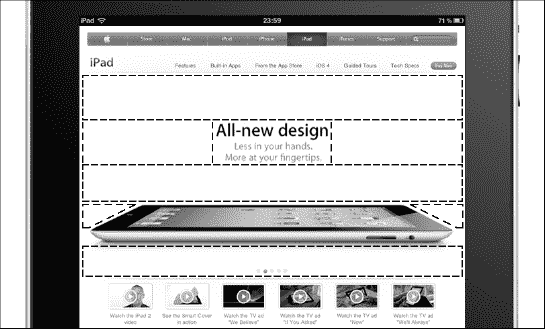

**图 4–14。** *苹果官方网站上被动否定空格的使用。*

在这个例子中，为了改进你的界面和布局设计，你需要分析当前负空间的数量和适当性，然后决定哪些区域过多，哪些区域过少。在苹果网站的例子中([图 4–14](#fig_4_14))，你可以看到大量的固体消极空间是如何创造出一种经典、优雅和高档的氛围的。

被动负空间还能达到什么目的？

###### 创建单独的内容组

你可以用消极空间来分隔不同的信息组或区域，用更少的空间来分隔相似的组，用更多的空间来分隔差异更大的组。您还可以通过配置使用的空间量来创建子分组。

通常，这种技术在元素上同时使用边距和填充值。在[Figure 4–15](#fig_4_15)中，您可以看到适量的消极空间是如何创建独立的内容组的，其中每条内容都由一幅图像和一段文字描述组成。

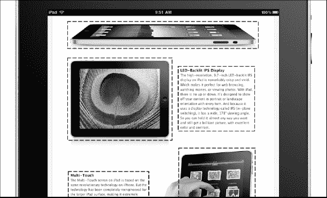

**图 4–15。** *利用负空间创造群体内容，消除视觉紧张。*

###### 消除视觉紧张

当一个形状与其他形状不平衡时，它在美学上受到影响，用户对这种不平衡关系的认知反应是视觉紧张。看[图 4–16](#fig_4_16)(并与[图 4–15](#fig_4_15)进行比较)，注意当你看这些形状时，你的眼睛会自动转向哪里。

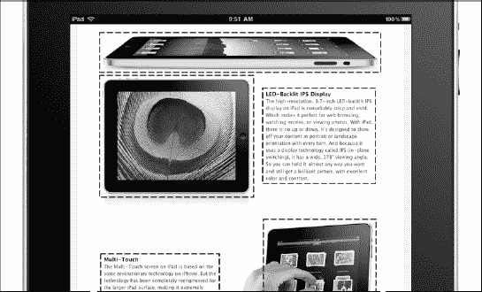

**图 4–16。** *两组内容之间视觉张力的例子。*

你的眼睛可能会自动进入[图 4–9](#fig_4_9)的左上部分，在那里两组内容之间的不平衡关系造成了视觉上的紧张。

可以利用被动负空间，让眼睛得到一些休息，消除视觉紧张。通常，这种技术在布局元素之间使用边距值。您可以在[Figure 4–16](#fig_4_16)中看到如何创建独立内容组的示例。

###### 聚焦一个元素

你可以使用消极空间来突出你界面或布局中的一个重要元素。一个典型的例子是将徽标放在远离导航栏的地方(反之亦然)。这样，你就给了这个元素需要被用户注意的空间。

使用这些技术，通常在突出显示的元素和元素设计的其余部分之间使用边距值。

**图 4–17。** *利用负空间来突出一个元素并创造优势。*

###### 创造优势

你可以使用消极空间在你的界面或布局中创造元素优势。一般来说，你可以结合使用负空间和其他技术来实现元素优势，但是一个很好很简单的技巧是让一个元素吃掉另一个元素的负空间。这样做的元素往往会脱颖而出，如果布局或界面元素的间距相等，这种技术会更加有效。

通常，这种技术在主要元素和相邻元素之间使用负的边距值。您可以在不使用任何边距值和不处理元素的透视和位置的情况下实现相同的视觉效果，如图[Figure 4–18](#fig_4_18)所示。

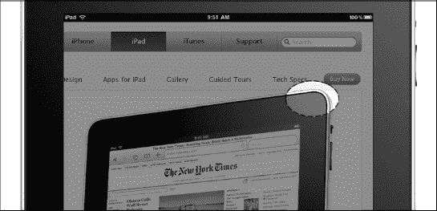

**图 4–18。** *通过吃负空间实现元素变色的图形方式*

###### 提高阅读体验和理解

你可以使用消极空间来改善用户的阅读体验和理解。当用户试图在旅途中操作移动设备时，由于繁忙的现实世界的环境和干扰，他/她总是难以理解其内容。在 iPhone 和 iPad 上实现良好的阅读体验和用户理解同样重要，但是，因为它的屏幕小得多，所以在 iPhone 上保持高质量的用户体验尤为重要。

通常，这种技术不仅控制字符的大小，还通过使用单词和字符之间的行高、单词间距和字母间距值来控制被动负间距。在[图 4–19](#fig_4_19)中，你可以看到`line-height`属性的使用如何增加文本的可读性，并在布局中给你更多的喘息空间。

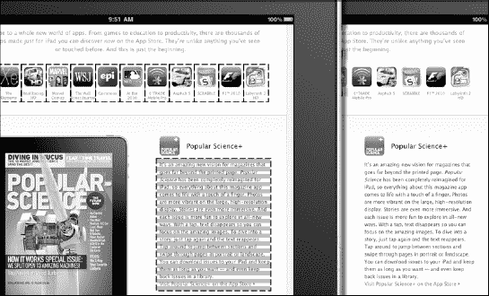

**图 4–19。** *手指友好的图标和间距良好的段落。*

###### 提供高水平的用户体验

你可以使用消极空间来设计触摸友好的界面和布局。在你的 WebApp 中，一切都是一个界面，因为手指比鼠标指针需要更多的空间，所以负空间起着重要的作用。每一个界面最大的敌人是由非触摸友好设计产生的挫折感。这个问题在兼容的 WebApp 中比在类似本机的 web app 中更常见，因为用于类似本机的基于界面的项目的框架保证了用户舒适的导航。

通常，这种技术对主要内容部分使用一个`line-height`值，并在组成界面的元素组之间使用一个边距值。在[图 4–11](#fig_4_11)中，你可以看到对于一个兼容的网站来说，图标是多么的方便手指操作。整个突出显示的区域都是可触摸的，元素的`width`为 73px，`line-height`为 1.5em。通过这种结构，实际上很难在错误的地方点击。

##### 主动负空间

一旦你用被动负空间定义了你的内容，就该用主动负空间为用户定义导航路径了。积极的负空间对于抓住用户的注意力和引导用户浏览你的 web 应用的内容非常重要。

通过预测用户的导航路径，您可以优化内容，从而优化用户体验。在[图 4–20](#fig_4_20)中，你可以看到在苹果网站中，粗体风格是如何被用来将注意力引向内容的关键点的。在这种情况下，活动负空间是由粗体样式创建的空间，换句话说，粗体样式在所有粗体字符周围添加的空间。

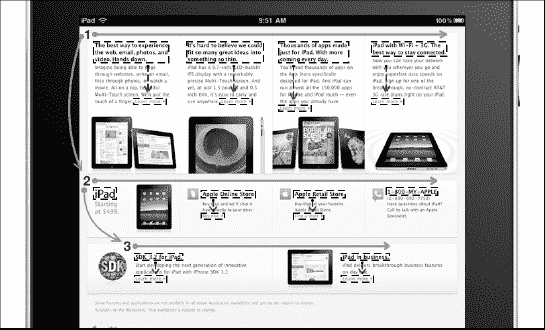

**图 4–20。** *苹果官方网站中负空格和正空格(虚线矩形)的使用。*

活动负空间形状在内容内部创建一个路径。在[图 4–20](#fig_4_20)中，你有三个不同的线性路径(从左到右)，用户可以自由地从一个路径跳到另一个路径，但总是在粗体字形成的“游泳线”内。

归根结底，你可以在你的作品(界面或布局)中增加更多的空间，以更好地强调或组织内容，并为用户创建某种路径导航。

主动负空间的先决条件是正确使用被动负空间，因为如果内容太复杂，用户的认知过程就不可能在内容中创建任何类型的导航路径。在这些情况下，由于高水平的背景噪音，大脑无法分离出任何类型的模式来决定如何阅读内容。

#### 色彩心理学

色彩心理学是设计理论中一个复杂的课题。你在界面和布局中使用的颜色会显著影响用户对你的 web 应用的看法。

**注意:**正如你在[第二章](02.html#ch2)中读到的，如果你想保证你的Web 应用的高度可访问性，颜色也是基本要素。当你选择你的调色板时，你必须像记住你的品牌信息一样记住这一点。

本书没有深入讨论这方面，但是为了设计简单有效的界面，你需要知道如何使用这个强大的工具来强化你的信息。

颜色可以用三种方式描述:

*   **顾名思义**
*   **因其纯度**
*   **通过其亮/暗值**

根据这种三向方案，用于描述颜色的一些术语是:

*   **色相**
    一个物体的实际颜色。绿色是一种色调，红色、黄色、蓝色、紫色等等也是。
*   **强度**
    一种颜色的亮度或暗度。向颜色添加白色或黑色会降低其强度。强烈和高度饱和的颜色具有高色度。
*   **饱和度**
    一种色调的纯净程度。纯色是高度饱和的。当添加灰色时，颜色变得不饱和。
*   色度
    相对于灰色的色调纯度。当颜色中没有灰色阴影时，颜色具有高色度。给一种色调添加灰色阴影会降低其色度。
*   **亮度**
    一种颜色反射的光量的量度。向色调中添加白色会使其更亮，并增加其值或亮度。因此，添加黑色会使其更暗，并降低值或亮度。
*   **色调**
    将灰色加入某一色调的结果。阴影和色彩是极端的色调。
*   **阴影**
    把黑色加到一个色调上产生较暗色调的结果。
*   **淡色**
    将白色加入某一色调以产生较浅色调的结果。

在[Figure 4–21](#fig_4_21)中，您可以观察孟塞尔配色方案，了解价值、色调和色度是如何协同工作的。

**图 4–21。** *蒙塞尔配色方案(image Jacobolus)。*

艾伯特·亨利·芒塞尔(1858-1918)是一位美国画家、艺术教师，也是芒塞尔颜色系统的发明者，这是一种早期的尝试，旨在创建一种精确的颜色数字描述系统。

颜色通常使用色轮呈现，分为两个基本组:

*   **暖色**
    红色、橙色、黄色
*   **冷色调**
    蓝色、紫色、绿色

暖色唤起了从温暖、舒适、惬意到愤怒和侵略的各种情感。通常，冷色被描述为平静和安宁，但也可以与悲伤或冷漠联系在一起。

使用颜色作为触发器，你可以在用户的体验中引导他/她的注意力，并在你的内容中创建一个视觉(阅读)路径。

##### 颜色如何影响用户情绪

重要的是要记住颜色的含义来源于人类历史，这意味着有些含义是世界上所有的人所共有的，而另一些则是某些文化所特有的，可能会随着时间的推移而改变。

尽管在不同的文化中颜色的含义有所不同，但是颜色有许多共同的因素。对我们来说，最重要的因素是用户对颜色的反应是即时的、无意识的，并直接影响他的情绪。下面，我们介绍了所有基本颜色的含义，以帮助你在设计用户界面时选择正确的颜色。

###### 蓝色

这种颜色被认为是值得信赖、可靠和忠诚的。蓝色是天空和海洋的颜色，被认为是我们生活中不变的一部分。它唤起休息，使身体产生镇静的化学物质。尽管如此，并不是所有的蓝色都是宁静和稳重的；电蓝色或亮蓝色变得富有活力和戏剧性。

蓝色是最没有性别区分的颜色，对男性和女性都有同样的吸引力。

身体和精神上的影响如下:

*   刺激平静
*   刺激冷却
*   鼓励和帮助直觉

###### 绿色

这种颜色在人眼可见的光谱中占据了更多的空间。绿色是自然界中最普遍的颜色，从森林到石灰的天然绿色被视为宁静和清新，具有冷色调和暖色调(蓝色和黄色)的自然平衡。

身体和精神上的影响如下:

*   促进放松
*   刺激平滑
*   提供一种更新、自我控制和和谐的感觉

###### 黄色

这种颜色闪耀着乐观、启迪和幸福。金黄色带着积极的意义，通常是乐观、活力和创造力。

身体和精神上的影响如下:

*   刺激精神活动
*   刺激记忆
*   鼓励交流

###### 红色

这种颜色比其他任何颜色都更有个性。红色是公认的兴奋剂，令人兴奋。这种颜色的数量直接影响到感知的能量水平。红色吸引注意力，敏锐地使用这种颜色作为强调可以立即将注意力集中在某个特定的元素上。

身体和精神上的影响如下:

*   激发能量
*   增加热情
*   鼓励行动和信心
*   提供一种免受恐惧和焦虑的保护感

###### 橙色

这种颜色是红色的近亲，比光谱中的任何其他颜色都更有争议。橙色可以带来积极和消极的联想，通常会引起人们更强烈的“喜欢它”或“讨厌它”的反应。有趣而艳丽的橙色散发出温暖和能量，一些色调，如赤土色，具有广泛的吸引力。

身体和精神上的影响如下:

*   激发创造力
*   激发活力和热情
*   鼓励社会化

###### 紫色

这种颜色体现了红色刺激和蓝色平静的平衡。这种二分法可能会导致不安或不安，除非清楚地定义其含义。此时，紫色呈现出其底色的特征。紫色给人一种神秘和高贵的感觉，通常被认为是富有创造性和古怪的。

身体和精神上的影响如下:

*   刺激平静
*   鼓励创造力
*   给人一种灵性的感觉

###### 棕色

这种颜色代表稳定、可靠和平易近人。棕色是地球的颜色，与所有自然或有机的事物联系在一起。

身体和精神上的影响如下:

*   唤起稳定
*   给人一种健康的感觉
*   提供一种有序感

###### 白色

这种颜色代表纯洁、干净和中性。通过与明亮的光线联系在一起，白色也与清洁和安全相关。

身体和精神上的影响如下:

*   刺激和帮助头脑清晰
*   实现新的开始
*   鼓励我们清除杂乱或障碍
*   唤起思想或行为的净化

###### 灰色

这种颜色是永恒的，实用的，坚实的。灰色是智力、知识和智慧的颜色，可以与任何颜色很好地混合，但过度使用会带来一种失落或沮丧的感觉。如果在银色底色中使用，这种颜色可以与聪明和坚强的性格联系在一起。

身体和精神上的影响如下:

*   唤起传统主义和严肃性
*   给人一种期待的感觉
*   给人一种聪明和智慧的感觉

###### 黑色

这种颜色具有权威性和强大的力量。黑色能唤起强烈的情感，它的过度使用会让人不知所措。

身体和精神上的影响如下:

*   唤起一种潜力和可能性的感觉
*   给人一种不显眼的感觉
*   给人一种神秘和正式的感觉

当你为一个网站或Web 应用设计界面时，分析用户在与你的用户界面交互时可能想要做的每一个可能的任务是很重要的。有些任务在特定的环境下工作得最好，而另一些则在完全不同的环境下完成得更好。这方面的一个例子可能是一个在线购物车，在你的界面中使用过多的黑色可能会不经意地产生一种不祥的神秘感，潜在地增加了用户的退房率。在[Table 4–2](#tab_4_2)中，我们总结了一些与颜色相关的情绪和感觉。

##### 如何组合颜色

一旦你知道每种颜色的含义，显而易见的问题是你如何为你的设计选择正确的颜色？简单的答案是，你应该总是选择一种或多种颜色来强化设计信息，但是如果你想为你的设计创建一个基于几种颜色的调色板，会发生什么呢？你怎么能把多种颜色放在一起呢？

我们有三种类型的模式来帮助我们为您的设计创建调色板。

###### 单色配色方案

该图案使用不同深浅的单一颜色(参见[图 4–20](#fig_4_20))。结果是一个舒缓和令人愉快的调色板，令人赏心悦目，特别是在蓝色或绿色色调。

###### 类比配色

此模式使用色轮上彼此相邻的颜色。

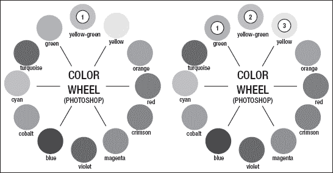

**图 4–22。** *一个单色配色方案的例子(左)和类似的配色方案(右)。*

###### 补色方案

该图案使用从色轮上相对位置选择的高对比度颜色(参见[图 4–21](#fig_4_21))。结果是以一种赏心悦目的方式将暖色和冷色结合在一起。

###### 分割互补色方案

这种模式使用一种颜色，然后再使用两种与初始颜色的补色相邻的颜色。

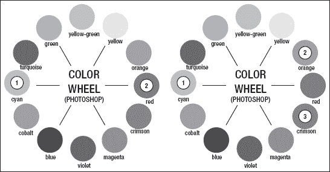

**图 4–23。** *一个补色方案的例子(左)和分割补色方案(右)*

###### 三色配色方案

该模式使用色轮周围等间距的三种颜色(参见[图 4–22](#fig_4_22))。结果是一个和谐的配色方案。

###### 四色配色

此图案使用色轮上矩形角上的颜色。

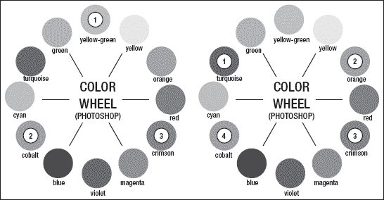

**图 4–24。** *一个三色配色方案(左)和四色配色方案(右)的例子。*

使用这六种模式，你可以根据各种颜色创建许多调色板。在[图 4–24](#fig_4_24)中，你可以看到一个如何根据三色和互补色方案选择颜色的例子。

在本章的最后，我们推荐一些工具来为你的调色板选择或生成颜色。然而，记住某种颜色背后的含义总是很重要的。为了与你的Web 应用品牌保持一致，你需要选择正确的颜色。

#### 界面层次结构

主动界面的主要作用是在内容的不同部分之间建立联系，而对于被动界面来说，是为整个内容提供一个总体结构。除此之外，主动和被动界面都有一个更重要的作用:引导用户。

界面引导用户浏览你的内容。你的界面也必须有优先级，因为你内容的不同部分也有优先级。当你设计用户界面时，引导用户浏览你的内容是一个重要的目标。

您用于类似 iPad 原生版本的优先内容是您桌面内容的适当子集，而您用于类似 iPhone 原生版本的优先内容是您 iPad 内容和桌面的适当子集。

当我们介绍移动信息架构的概念时，您看到了在移动设备中区分内容的优先级是多么重要。但是，在实现可视化层次结构时，如何区分界面的优先级呢？

**注意:**视觉层次在页面设计中是用来帮助浏览者处理信息的。视觉层次是大多数人看到和识别内容元素的顺序。

除了本章前面介绍的主动和被动空间的使用，你现在将学习其他工具可以帮助你在主动和被动界面中实现视觉层次。

通过调整元素的视觉权重，可以在设计中创建层次结构。更大的视觉权重通常被视为更重要且更容易被用户注意到，而较小的视觉权重被视为不太重要。

*   **尺寸**
    较大的元素承载更多的重量，集中用户的注意力。
*   一些颜色被认为比其他颜色更有分量。红色似乎是最重的，而黄色似乎是最轻的。
*   **密度**
    增加某个空间的元素数量，赋予那个空间更多的权重。
*   **值**
    较暗的物体比较亮的物体重量大。为什么红色被认为是最重的颜色还不知道。
*   **负空间**
    利用感知法则，你可以创造出许多层次的等级体系。

正如你从[Figure 4–26](#fig_4_26)中看到的，层级有助于给你的主动和被动界面以秩序。等级优先级与通信接口并帮助通信。在[图 4–26](#fig_4_26)中，你可以看到右边的层次结构加重了阅读体验。这对用户的认知资源产生了额外的需求，并导致不太令人满意的用户体验。

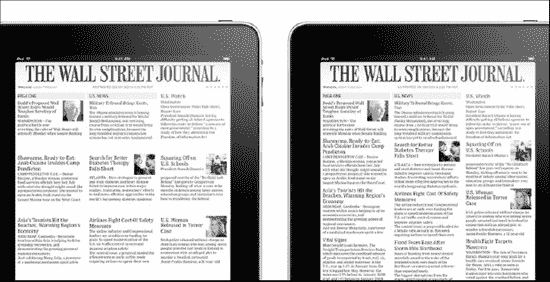

**图 4–25***好的内容层次结构(左)和坏的内容层次结构(右)之间的区别。*

创建我们的层次结构应该从对页面目标的深思熟虑开始。只有当你理智地决定了你的页面的层次结构，你才应该尝试视觉设计这个层次结构。

#### 阅读模式

我们第一次在 WebApp 上运行可用性测试时，我们总是会惊讶地收到结果。事实是，用户阅读模式与你设计界面时的预期完全不同。

实际上,“阅读模式”一词是恰当的，因为用户实际上并不阅读网页，他们只是浏览网页。他们浏览网页，寻找引起他们注意的单词或短语。现在的问题是:用户为什么要这么做？我们可以提出几个答案。

*   用户通常很匆忙
    用户浏览网页的动机是希望节省时间，因为他知道答案就在附近，而他的目标只是发现他需要看哪里。
*   用户知道他/她不需要阅读所有内容
    用户知道大多数时候他/她只对页面提供的部分内容感兴趣。出于这个原因，用户将只寻找相关的内容，而忽略他/她认为不相关的所有其他部分。
*   **用户过去已经学会使用其他媒体进行扫描**
    用户在过去阅读杂志、报纸或书籍的经历中，已经学会扫描内容以找到他们感兴趣的部分。

注:阅读模式因不同文化采用的不同阅读方向而异。重要的是要记住，我们在这一节中讨论的内容只适用于从右向左的阅读文化。

尽管用户扫描内容而不是阅读内容，但在从左到右阅读的世界中，我们仍然可以隔离出一些阅读模式。这些模式受内容中出现的图像的影响很大，但有趣的是，用户倾向于在我们的 WebApp 上使用“F”或“Z”模式来阅读，而不是使用微观或宏观线性模式。这意味着我们对内容有两种不同的主要方法，都基于用户在 10 年或 20 年或更长时间的内容浏览中所采用的惯例。

用户被训练去关注某些地方，因为那里通常是最重要的信息所在。因此，重要的是要记住，如果我们在设计界面时背离了这些传统的模式，那么我们就要承担风险。

##### Z 字形图案

Z 阅读模式是我们在阅读网页内容时想到的典型模式。通常，我们从徽标所在的左上角位置开始，然后下降到内容的第一段，从这里开始 Z 移动。

如果用户在阅读完段落的第一行后对内容感到满意，他将继续阅读并跳转到同一段落的下一行。

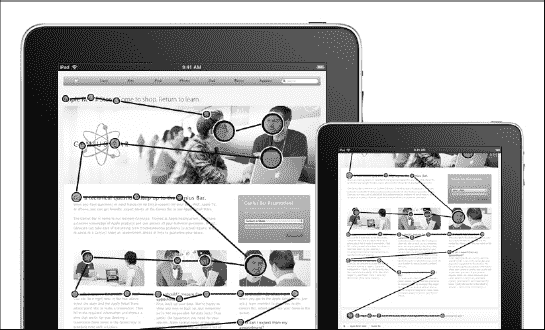

**图 4–26。** *苹果天才吧页面中的 Z 形图案。*

当用户读完段落的第一行后，发现内容不是他想要的，故事就改变了。在这种情况下，用户将直接跳到下一段的第一行或下一部分内容。

这改变了每个 Z 子模式的高度和组成整个 Z 读取模式的 Z 子模式的数量。在[图 4–27](#fig_4_27)中，我们可以看到 Z 模式是如何根据用户是否对段落的第一行感兴趣而变化的。

###### Z 形图案的含义

Z 模式与纸质报纸、杂志或期刊的经典阅读模式密切相关，并具有相同的含义:

*   **用户可以从一个段落跳到另一个段落**
    如果用户对段落的第一行不感兴趣，他会跳到下一个段落的第一行或者下一组内容。
*   **用户总是会看图案的左下方**
    设计师可以确信用户会看内容的某一部分，他可以通过在这个区域放置一些重要的号召按钮来利用这些信息。

Z 模式在非专家用户中更常见，或者更普遍的是当用户发现感兴趣的内容时。尽管这通常不是最常见的模式，但记住这一点很重要，因为每当用户发现一点感兴趣的内容时，他/她就会倾向于切换到这种模式。这意味着用户可以从不同的图形开始，然后切换到 Z 图形，再返回到原来的图形。

##### F 形图案

F 读取图案通常由两个水平条纹和一个垂直条纹组成。F 也可以代表快速，因为这是用户在匆忙模式下使用的典型模式。

这种模式由三种眼球运动组成:

1.  用户在内容区域的上部水平移动阅读。这个元素构成了 F 的顶栏。
2.  然后，用户将页面向下移动一点，并在更短的第二次水平移动中开始阅读。这个元素构成了 F 的下横杠。
3.  用户在垂直移动中扫描内容的左侧。这个元素构成了 F 的垂直词干。

在这种模式下，用户的阅读模式并不总是恰好由三部分组成，也不总是像字母 F 一样，但是即使有不同的变化，我们也可以很容易地识别出该模式。

**图 4–27。** *苹果支持页面中的 F 形图案。*

任何熟悉面向对象编程的人都可以看出，F 读取模式就像超类，不同的用户行为就像超类的不同实现。

###### F 形图案的含义

F 模式的含义表明，为了优化用户体验，在设计阶段遵循指导方针是多么重要。这些影响如下:

*   用户不会逐字逐句地通读内容
    穷尽式阅读很少见，尤其是在互联网研究期间。一些用户可能会阅读你的大部分内容，但大多数人不会。
*   最重要的信息必须在前两段陈述
    这是唯一能让用户真正阅读内容的方法。多读第一段可能会让用户更深入地理解内容。
*   以承载信息的词语
    开始段落，这是因为“F”字形的主干比顶部的横条更难抓住用户的注意力。在这部分模式中，用户只阅读段落的第一个单词。
*   **在左侧插入用户界面最重要的链接**
    F 模式从左到右降低用户注意力；用户界面最右边的链接不太可能被注意到。

关于阅读模式的一个重要因素是它也可能受到浏览环境的影响。如果用户寻找包含数字的东西，例如价格，F 模式可以转换成“E”或“Comb”模式。

##### 阅读模式中的图像

图像是网页设计的强大工具。通过使用正确的图像，你可以解释一个概念或唤起一种感觉，从而提高用户体验的水平和向用户传递正确信息的可能性。

工具有两种使用方式，一种是好的，另一种是坏的。使用错误的图片会浪费布局中的空间，迷惑用户，打破他没有建设性目的的阅读模式。

什么能真正抓住用户的注意力，把他吸引到一个图像上？根据诺曼·尼尔森集团的最新研究，用户选择观看的图像具有以下特征:

*   **高对比度和高质量**
    明快而多彩。
*   **裁剪而不是叠加缩小**
    必要时适合一个小空间。
*   **易于解读和近乎标志性的**
    当都不过分详细。
*   **与内容高度相关**
    到页面的内容。
*   **具有磁性特征**
    当一个形象充满魅力时。

磁性特征在图像中很重要，但是什么样的图像是磁性的呢？磁性图像包括以下内容:

*   平易近人的笑脸
*   人们看着摄像机
*   性解剖学
*   开胃的食物
*   明确的指示或信息
*   形状动态

在选择你的图片时，你也需要知道用户忽略了什么样的图片。这些类型的图像具有以下特征:

*   低对比度和低质量
*   冷酷，虚伪，或者过于圆滑
*   为空间而忙碌
*   普通的，或明显的股票艺术的人或物体
*   与内容无关
*   乏味的

当你在布局中使用糟糕的图像时，用户会认为它们是他/她浏览内容的障碍。它们改变了用户的阅读模式，吸收了额外的认知资源，并且通常会降低用户体验的质量。

##### 影响阅读模式

关于阅读模式的规则是适用于大多数情况的通用规则。有趣的是，在某些情况下，我们可以使用一些强大的视觉层次来影响阅读模式。

在[Figure 4–29](#fig_4_29)中，我们可以看到，在某些情况下，强烈的视觉层次会扰乱用户焦点，打破“F”或“Z”模式规则。在这个例子中，一切都是有意设计的，以优化品牌信息而不损害用户的阅读体验。

强烈的视觉层次引导用户从页面标题，通过图像，到突出的页面子标题，最后，到网站的子部分。这些类型的设计技术对于任何想把他们的设计技能提升到一个新的水平的人来说都是很重要的，因为它们可以决定一个好的设计和一个专业的设计之间的差别。

**图 4–28。** *眼球追踪测试(左)和对应的热图(右)。*

正如我们在[图 4–29](#fig_4_29)(右图)中看到的，眼球追踪测试通常用热图来表示。热图是数据的图形表示，其中二维表中变量的值用颜色表示。热图为眼球追踪测试表增加了第三个维度，用红色表示大数值，用蓝色表示小数值。

硬币还有另一面。正如斯坦·李所写的“强大的力量也必然带来巨大的责任。”这是真的，因为如果设计师没有意识到这些规则，他将冒无意中改变阅读模式的风险，并通过在页面上加入不必要的信息来损害界面层次。换句话说，访问者可能在找到他们要找的东西之前就离开了页面，因为他们可能认为它不在内容中。

历史笔记:斯坦·李是一位美国作家、编辑和回忆录作者，他将复杂的自然主义角色和完全共享的宇宙引入了超级英雄漫画。

**定义:**共享宇宙是一个由不止一个作者贡献的虚构宇宙。(来源维基百科)

作为这一部分的最后一点，我们想指出的是，如今用户没有针对触摸屏设备的优化阅读模式，至少没有针对任何大于 iPhone 3.5 英寸显示屏的设备的优化阅读模式。iPad 的 9.7 英寸显示屏将在未来几年内改变用户的浏览习惯，Safari Mobile 打破垂直阅读流的能力也将改变这一点，这使用户能够通过双击或缩放内容从一点跳到另一点。这种趋势很可能会创造一种新的平板阅读流，由许多微 F 和 Z 阅读模式组成。

作为设计师和开发者，你需要注意收集尽可能多的反馈。如今，用户是建立设计下一代触摸屏用户体验的新方法的唯一可靠信息来源。

##### 阅读模式指南

到目前为止，我们已经介绍了 F 和 Z 路径，这是最常见的用户阅读模式。我们看到，在某些情况下，为了实现特定的目标，改变这些模式是非常有用的。

眼球追踪研究揭示了人们如何阅读网站和Web 应用并与之互动的有价值的信息。我们可以从这些研究中学到一些优化我们界面的策略。

这些策略总结如下:

*   **左上角的标识效果最佳**
    正如我们在本节的第一部分所看到的，用户多年来一直被训练在页面的左上角寻找特定种类的信息，比如品牌标识。只有闻名世界并立即被用户认可的著名品牌，才有机会打破这一规则。
*   **标志下的标语提高了一般页面的理解**
    这与前一点有关。当用户看着徽标时，下面的标语会让他更好地理解徽标，并有更好的机会理解内容，他离开页面的可能性也会更小。
*   页面顶部的导航效果最好
    作为主要的导航，水平的导航条比垂直的导航条效果更好。
*   **头条必须在 1 秒以内抓住注意力**
    你需要以一种快速的方式抓住用户注意力，瞬间切入正题。
*   标题比图片更能吸引用户的眼球
    如果你使用一个强有力的标题，你可以支配任何其他的影响力，甚至是来自图片的影响力。在[图 4–27](#fig_4_27)中，你可以看到为了避免干扰标题“iPod Touch ”,标题的重量比图片轻了很多。
*   **纯粹的阅读模式只适合“折叠之上”**
    今天，滚动一页不再是 90 年代沮丧和困惑的来源。现在，使用触摸屏设备，用户可以比使用鼠标更快地向下滚动页面。这意味着“折叠线以下”的阅读模式变得更加不可预测。如果你的设计因为用户的某些眼球运动模式而有效，你必须确保你设计的每一个重要元素都在你的 WebApp 的第一个可见部分，在那里用户用更高的关注度来“阅读”内容。
*   用户通常只浏览标题的前几个字
    这意味着长标题不好用。在这些情况下，用户在决定是否继续阅读之前会先浏览前几个单词。因此，用最有趣、最具煽动性的词语放在标题前面是很重要的。
*   **人们浏览左侧一列标题**
    这与前一点有关。当出现标题或链接列表时，用户将向下扫描列表的左侧，查看前几个单词，以找到他/她感兴趣的内容。用户不必从头到尾阅读每一行。出于我们之前讨论过的同样的原因，你需要在前面插入最引人注目的词语。
*   **更大的字体改善用户体验**
    如果用户没有被强迫放大和缩小，他/她的挫折感会降低，而用户体验会反过来得到改善。在 iPhone 上实现这种方法并不总是可能的，但是在设计 iPad 兼容的 WebApp 时，这是一个需要记住的重要要求。
*   **短文鼓励阅读**
    大块的字体看起来气势汹汹，难以阅读。出于这个原因，最好将内容组织成一个想法流，而不是大的、不同的段落。
*   **段落间更多的负空间有助于集中用户注意力**
    如果用户在你的内容中搜索某样东西，段落间有“足够”的空间会暗示一个着陆点，强调下一段的第一行。
*   对于不熟悉的或概念性的信息，多媒体比文本更有效
    或者换句话说，“一张图片胜过千言万语”阅读依赖于人们对主题的理解。用户对某个主题越不熟悉，如果您使用多媒体消息而不是文本，他/她会理解得越快越容易。
*   **阅读模式末尾的行动号召按钮效果最佳**
    行动号召按钮的自然位置是在阅读模式的末尾。该按钮可以放置在内容的末尾和/或单个段落的末尾。
*   **强烈的视觉层次可以影响用户的阅读模式**
    通过给图片或标题添加一些权重和动态，我们可以改变阅读模式的结构。

这些策略中的大多数在桌面和鼠标环境以及触摸屏和手指环境中都有效，因为用户在这个等式中不是变量而是常数。变量是用户用来与软件接口交互的硬件接口。在接下来的段落中，我们将会看到在某些情况下这是如何稍微改变用户体验的。

同样重要的是，在可能的情况下，继续使用这些惯例和习惯进行设计，以提供桌面 PC 用户体验和新的触摸屏用户体验之间的平稳过渡。剩下的就交给时间的流逝和人类的自然进化了。现在，我们准备看看用户界面的设计过程。

#### 用户界面设计流程

这个过程包括一些你已经在[第 2 章](02.html#ch2)中看到的步骤。你通过规划界面来开始这个过程。你勾画出它的结构，研究用户和界面之间交互的层次和类型。您创建界面的美感，并最终为开发阶段生成可交付成果。如果您还记得在[第 2 章](02.html#ch2)中介绍的信息架构过程，您将顺利地完成以下阶段。

##### 研究

研究阶段经常被误解和忽视；有时是因为我们的预算很少，有时只是因为它比流程中的其他阶段更不明确。

尽管如此，事实是，没有良好的研究，你不能真正理解你的界面的需求，或者对你的市场竞争对手以前做了什么有一个想法。更糟糕的是，你不清楚你想要的界面交互的层次和类型。

正如您之前在[第 2 章](02.html#ch2)中看到的，在此阶段收集的信息对于最终结果至关重要，这一点上的错误会极大地影响整个过程。

##### 结构

设计我们的接口结构时，您需要考虑两种情况:

*   **活动界面**
    基于活动链接的界面——例如导航栏
*   **被动界面**
    基于被动负空间的界面——例如，页面布局

首先，使用负空间的概念设计被动界面，选择哪些布局区域将填充一部分内容，哪些将保留空白。如你所知，由于认知和互动的原因，负面区域在我们的布局中很重要。

一旦你定义了布局的正负空间，你就可以开始设计活动界面并勾画其内容结构。upi 使用的工具是一个流程图，然后是一个网站地图来规划活动界面的内容。

为了与我们的内容输出方法保持一致，一旦你对界面的内容有了清晰的想法，你就开始组织它的视觉结构。视觉结构是用线框和纸原型绘制的。

##### 审美

一旦你知道了界面的结构，你就可以深呼吸，记住感知的规则，享受下一步:设计界面的美感。这通常是每个设计师最满意的部分。对于这一步，您使用您首选的图形设计程序。在下一节中，我们假设您将使用 Adobe Fireworks，但这取决于您的选择。重要的是要记住，处理界面的美学部分意味着处理设计风格和排版。

##### 互动

一旦界面的结构和设计达到了你的审美要求，你就需要致力于它们与用户的互动。在这个阶段，使用序列图来开发用例，并使用电子原型在真实环境中测试它们。如果你需要为你的界面开发一个简单的用例，没有复杂的上下文，你只是想知道“用户会做什么”，你可以使用用例图，既省时又省力。致力于界面的交互意味着致力于导航元素、表单元素、音频和视频元素以及基于负空间的被动界面。

##### 交付物

当你的交互设计工作的艺术部分完成后，你需要为下一阶段的开发制作可交付物。为了完成这个过程的最后一步，你需要设计构图、电子原型和风格指南。

###### 设计构成

设计构图是展示整个界面的艺术品，由主动和被动界面组成。该交付件也用于向客户展示项目的状态，因为它是最终成为你的 WebApp 的一张图片。

###### 电子原型

电子原型是我们基于 HTML5、CSS3 和 Javascript 的设计的交互版本。我们在互联网上有几个可用的框架，可以帮助我们开发我们的电子原型，而不用浪费太多时间。在本章的最后一段，你会发现界面设计过程中使用的工具。

###### 风格指南

通过设计风格指南，你可以确保品牌将进入下一个发展阶段。样式指南就像页面模板，设计者在其中展示如何将设计的某些部分应用于页面，而不考虑可变内容。

如果你是一个独立的设计师和开发人员，你可以跳过一些可交付的东西，比如设计构图或电子原型，但是我们仍然建议你制作一些风格指南，以防你将来需要回到你的项目。样式参考线帮助您避免因忘记项目的信息、样式或其他细节而可能发生的错误。

**图 4–29。** *将移动信息流程应用于界面设计流程。*

正如您可能注意到的，我们应用了我们在移动信息架构过程中使用的相同过程。事实上，界面设计过程是移动信息架构过程中的一个小循环，并且基于相同的模式。

在下一节中，我们将实现界面设计流程，并为 WebApp 设计一个 iPhone 和 iPad 兼容的布局。

### iPhone 和 iPad 兼容的用户界面设计

要使 WebApp 兼容 iPhone 和 iPad，它必须满足苹果设备兼容性的第一级要求。正如你在[第 3 章](03.html#ch3)中看到的，为 iPhone 和 iPad 做好准备并不意味着拥有 HTML5 和 CSS3 兼容的布局；这意味着它是以面向触摸屏的方式设计的。

从 iPhone 开发的角度来看，这个问题不太重要，因为尽管 Safari Mobile 在过去三年中彻底改变了移动浏览体验，但为了让用户体验到与 WebApp 的优化交互，需要一个真正的原生布局。出于这个原因，如果一个 WebApp 没有针对 iPhone 进行触摸屏优化，也不是一件坏事。兼容版本不是 iPhone 的主要信息来源，因为在大多数情况下，相同布局的原生版本也会发布。

当我们使用 iPad 时，情况发生了变化，因为 9.7 英寸的显示屏提供了 1024768 像素的分辨率。这意味着兼容的布局可能是 WebApp 移动战略的合理选择。类似 iPad 原生版的布局总是能为用户提供最好的用户体验，但对于 iPad 来说，兼容版本仍然能提供次好的东西。

现在，让我们(重新)设计一个面向触摸屏的苹果官方网站，同时确保应用前面介绍的所有原则。苹果网站设计得很好。从美学的角度来看，它是无可挑剔的，到目前为止，我们已经在几乎所有的设计示例中使用了它，尽管事实上它并不是非常面向触摸屏，也没有尽可能地进行认知优化。

#### 研究

研究阶段基于许多技术，从简单地使用搜索引擎寻找竞争对手到先进的市场研究技术。在这个阶段，您使用流程图和站点地图，以便对内容及其部署有一个直观的表示。

研究阶段旨在了解三点:

*   竞争对手对比
    确定实际设计与竞争对手相比有多大不同。这是一项广泛的研究任务，涵盖从品牌到市场预测的许多领域，比较从提供的服务到用户体验的一切。
*   **弱点研究**
    找出设计结构中的弱点。
*   **设计的改进**
    确定改进实际设计的方法。

在研究苹果网站用例时，我们忽略了竞争对手的比较，因为苹果品牌是市场上最漂亮、最实用的品牌之一，不需要改进。在这个用例中，我们直接进入要点 2:弱点研究。

当我们从可用性，尤其是触摸屏可用性的角度来看待事物时，情况就不同了。弱点研究告诉我们的关于苹果网站的第一件事是，它的三栏布局结构还有待改进。

这个结构由一个主要的内容区域组成，它的两边都有一个窄的侧栏。三栏结构过去是，现在仍然是博客和在线商店的流行选择。世界上最著名的两家商店就是基于这种布局:苹果商店和亚马逊。

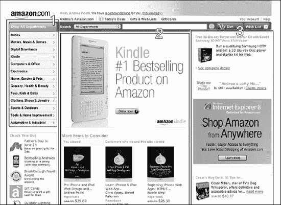

**图 4–30。*Amazon.com 使用的***三栏布局结构。

从逻辑的角度来看，三栏布局似乎是一个不错的选择，因为它使我们能够隔离三种不同的内容。在博客中，通常在左栏有一个菜单或各种与网站相关的链接，在右栏有各种各样的广告。

近年来，许多博客已经将它们的结构转换成更实用的两栏布局，但同样的事情并没有发生在大多数在线商店网站上。在两栏布局中，我们通常在左栏显示主菜单和其他与网站相关的链接，在右栏显示带有一些促销横幅的购物车。

我们可以将三栏布局的优点总结如下:

*   对称会令人愉悦
*   三列提供了三个不同的内容区域
*   居中的主要内容有助于用户关注它

以下是三列布局的缺点:

*   对称不利于视觉内容的层次结构
*   对称性消耗了用户更多的认知资源
*   两个侧边栏会引入视觉噪音，分散内容的注意力
*   三栏布局使阅读模式不可预测

除了这些布局问题，当用户需要使用像 iPhone 这样的小屏幕设备与活动界面进行交互时，也缺乏可用性。在这种情况下，用户经常不得不使用缩放功能来增加内容的可读性。

用 iPad 浏览是一个不同的故事，因为拥有 9.7 英寸显示屏的 iPad 用户可以同样好地浏览兼容的和类似原生的 web 应用。在这种情况下，用户对兼容内容和类似原生内容的可用性有很高的期望。

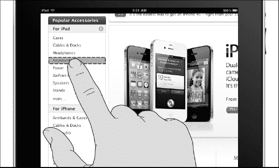

**图 4–31。** *用户必须放大才能与侧边栏的链接进行舒适的触摸互动。*

正如我们在前一章中建议的，链接必须是手指友好的，可触摸的，而不强迫用户使用缩放功能，因为缺少负空间会增加触摸错误点的风险。在结构阶段，我们看到如何在当前用例中克服这个问题。

通常在研究阶段结束时会产生一份报告。通常这份报告是用来给客户看的，但在这种情况下，它仅供我们参考。我们可以将研究阶段的结果总结如下:

*   **网站信息**
    苹果专卖店([www.apple.com](http://www.apple.com)
*   **强点**
    利用版块模型页面
    利用视觉层次
    品牌和身份
*   **弱点**
    三栏布局结构
    大部分活动界面不支持触摸
*   **改进点**
    两列布局结构的使用
    主动界面上被动负空间的使用

现在我们已经收集了所有的信息，我们对项目中什么可行，什么不可行有了更好的了解，我们准备进入下一步:(重新)设计。

#### 结构

研究阶段告诉你关于设计你需要知道的一切，因为你开始知道它的弱点和如何改进它们。第一步是使用两列布局的线框技术来绘制结构草图，但重要的是要记住您想要实现的目标。

结构阶段需要实现以下目标:

*   **提供更好的布局结构**
    两栏布局为呈现和查找内容提供了更好的结构，使用户能够节省有限的认知资源来理解内容，而不是寻找内容。
*   **提供一个触摸友好的界面**
    使普通用户无需使用缩放功能即可浏览内容，提高了用户体验水平。

在下一节，我们将看到如何实现这些目标，设计一个触摸友好的布局，然后致力于触摸友好的排版。

##### 触摸屏布局

此时，您需要记住现有设计的优点，并保持结构中的一切正常工作。你应该保持原来的块结构，因为它非常适合任何一种具有缩放功能的触摸屏设备，并且以这种方式工作，你就不必改变每个内容块之间的被动负空间。

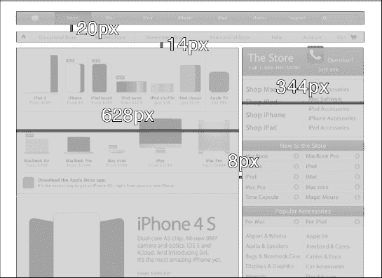

**图 4–32。** *新 iPad 的两栏布局结构基于旧网页的三栏布局。*

在[图 4–34](#fig_4_34)中，我们可以看到，从上到下，我们没有触及 980x38 像素的主导航栏([图 4–34](#fig_4_34)，数字 1)，同样也没有触及这个导航栏和面包屑栏之间的空间。

我们采用面包屑栏，在不改变其 30 像素高度的情况下，我们将其转换为 980 像素的二级导航栏([Figure 4–34](#fig_4_34)，Number 2)，添加了几个链接到各种 Apple Store 实例。

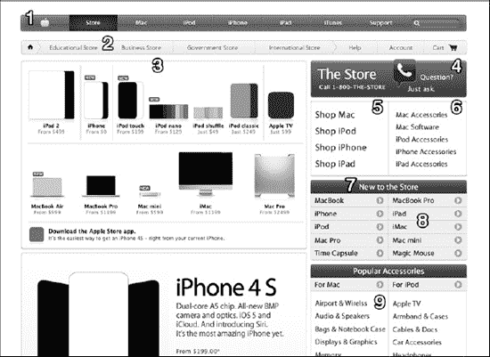

**图 4–33。** *新的两列布局结构基于旧的三列布局。*

我们将主要内容([Figure 4–34](#fig_4_34)，number 3)移到了左边，并保留了 8 像素的装订线。我们以语义方式合并了两个侧栏。我们没有将它们并排放置，而是将每个侧边栏及其内容分组到一个由两列框组成的侧边栏中。使用这个框，用户可以很容易地一目了然地找到关于主题的信息，而不用像在旧设计中那样向下滚动。

在侧边栏中，我们将框标题([图 4–34](#fig_4_34)，数字 7)的高度从 24 像素增加到 32 像素，子标题行([图 4–34](#fig_4_34)，数字 8)的高度从 24 像素增加到 30 像素。我们还改变了侧边栏框内的排版，这将在接下来讨论。

##### 触摸屏排版

到目前为止，你已经尝试通过增加结构的不同高度来为用户的手指创造一个更舒适的空间，直到你达到 30 像素的最小高度。如第 3 章所示，考虑到用户的平均手指尺寸，30 像素的目标是非常安全的。如果有机会，你可以在我们的布局中为每个单独的空间设置 40 像素的下限，但在这种情况下，如果不引入打破设计的光视觉平衡的风险，这是不可能的。

从上到下，我们改变主导航栏中的字体大小([图 4–35](#fig_4_35)，编号 1)，将值从 12 像素增加到 14 像素，在次导航栏中([图 4–35](#fig_4_35)，编号 2)，将值从 10 像素增加到 12 像素。

**图 4–34。** *(重新)设计新的两列布局结构的顺序。*

在侧边栏主菜单中，我们将字体侧边从 14 像素更改为 16 像素，并将左栏的行高设置为 20 像素([图 4–35](#fig_4_35)，数字 5)，将右栏的字体大小设置为 14 像素，行高为 18 像素([图 4–35](#fig_4_35)，数字 6)。

在侧边栏标题中([Figure 4–35](#fig_4_35)，number 7)，我们将字体大小从 12 像素增加到 14 像素，行动号召圈的大小从 13 像素增加到 16 像素。在侧边栏框的内容列表部分([图 4–35](#fig_4_35)，数字 9)，我们将字体大小从 10 像素增加到 12 像素，并将行高设置为 20 像素。

#### 审美

设计的审美部分也差不多；我们想改变一些东西，以便它们在新的结构中更好地工作。

我们将呼叫中心图标集成到侧边栏主标题中([图 4–35](#fig_4_35)，编号 4)，并且在将侧边栏主标题从页面左侧移到右侧后，我们移除了搜索引擎框，以避免设计中的冗余。在(重新)设计的右边部分，侧边栏主标题位于主导航栏之下，主导航栏已经包含了自己的搜索引擎框。

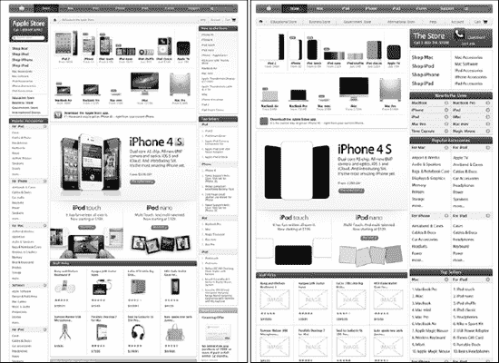

**图 4–35。** *前(左)后(右)的(重新)设计。界面更易访问，对手指更友好。*

侧边栏主标题中的呼叫中心图标([图 4–35](#fig_4_35)，数字 4)使用了我们在[图 4–10](#fig_4_10)中看到的相同技术，用于在视觉层级中创造优势并吸引用户的注意力。图标占据了侧边栏主标题和次级导航栏之间的一些空白空间。

#### 互动

到目前为止，我们所做的是为了保证一个触摸友好的交互，在大多数情况下，不需要使用任何缩放功能。增加字体大小值、重置行高值和增加侧边栏中的行间距使用户能够触摸每个链接，而不会有点击错误位置的风险。这些简单的变化对用户体验的质量产生了巨大的影响。

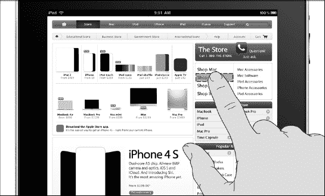

**图 4–36。** *(重新)设计的 Pad 界面现在为用户提供了舒适的触摸交互。*

一旦所有的接口都准备好被测试，你需要开发一些用例，然后使用序列图或者用例图来实现它，如果我们处理低复杂度的情况。[图 4–35](#fig_4_35)展示了两个用例的用例图:购买新 iPhone 和搜索新 iPhone。

**图 4–37。** *一个表示用户界面交互的 UML 用例图的例子。*

请注意，用户图标不是标准图标。我们使用这个图标有两个原因。首先是因为，在可能的情况下，我们在工作时总是试图不冒犯我们的眼睛，因此我们避免了那种通常被当作标准的“我们是个人电脑”风格。第二是因为这些图仅供我们自己参考，或者至少供我们的小团队参考。如果我们需要与我们的团队分享我们的图表，或者当我们为一家大公司工作时，我们必须使用标准符号。

下一步是使用电子原型测试用例。为了做到这一点，我们需要使用 HTML5、CSS3 和 Javascript 框架。通过使用电子原型，我们可以对我们界面的真正手指友好功能有一个现实的想法。如果由于某种原因，我们必须在没有时间或预算的情况下继续进行任何电子原型测试，我们必须确保至少用纸质原型进行一些快速测试。

#### 交付物

当交互阶段完成时，我们需要为过程中的下一个阶段准备可交付成果:实现。如果你是独自工作，只有当你需要在项目发布几个月后回到项目中时，可交付成果才是有用的，这样你可以一眼就记住关于你的设计的要点。当你在一个团队中工作时，你必须确保你的可交付物“为我们说话”，并且清楚地展示你的设计，避免在开发人员的头脑中有任何可能的怀疑。

如前所述，你产生了三种可交付物:设计作品、设计风格指南和电子原型。设计组合，顾名思义，显示了您的设计的组成，设计风格指南使用模板显示了如何将我们的设计应用于各种类型的页面。如果你有一个重要的信息要传递，你也可以分析，解释，或突出你的设计的一个特定部分，添加注释和描述。电子原型以互动的方式展示了设计是如何工作的。我们和开发人员在实现的启动阶段使用相同的原型。

### iPad 原生式用户界面设计

设计一个 iPad 版本的网站和Web 应用并不重要，因为你正在创建 iPhone 版本。如果兼容版本具有触摸屏优化结构并提供高质量的用户体验，最重要的是首先将精力集中在设计 iPhone 版本的内容上。

iPad 的浏览功能使用户能够通过任何桌面内容获得高水平的用户体验。然而，为 iPad 用户开发一种类似本土的体验应该永远是你的首要任务。类似本机的结构总是提供更高级别的用户体验。

在不久的将来，你将会看到许多类似 iPad 的 WebApps，所以我们建议你不要忽略这个选项，但是一定要把它包含在你的项目路线图中。

#### 研究

当您执行兼容版本的研究阶段时，您正在同时处理我们计划的所有版本。这是因为我们在其他 iPad 版本和后来的 iPhone 研究步骤中重复使用了我们的研究结果。这样，我们优化了预算，节省了资金和时间，并在流程中摊销了固定成本。

市场研究告诉我们，我们的内容的哪一部分应该插入我们的 iPad 版本，哪一部分最好留给兼容版本。

#### 结构

当你在本地版本的站点或应用上工作时，你不能像以前在兼容版本中那样重新设计结构。兼容版本专注于改进结构，以提供手指友好的用户体验。这里，重点在于如何根据类似本机的结构来区分内容的优先级。

如何对你的内容进行优先排序是一个依赖于市场研究的选择，而不是由设计师决定的。当研究阶段已经确定了哪些部分的内容要包含，哪些部分要留给桌面版，只有这样你才能开始组织原生式的布局。

与 iPhone 原生版本相比，iPad 原生版本可以提供很大一部分桌面内容，在某些情况下，它可以包含所有桌面内容。当这种情况发生时，我们的工作只是给它一个类似原生的优化结构，而不必削减任何东西。

**图 4–38。***iPad 原生两栏布局结构及其(重新)设计顺序。*

如[图 4–39](#fig_4_39)所示，从上到下，从左到右，你将商店菜单([图 4–39](#fig_4_39)，数字 1)插入顶部位置，以使用户能够从他/她的第一次触摸中选择一个上下文化的路径。

紧接着，我们插入选项来更改商店及其配置([图 4–39](#fig_4_39)，数字 2)，然后我们插入选项来直接访问服务支持([图 4–39](#fig_4_39)，数字 3)。

主内容与侧边栏中的链接无关，它显示了英雄形象([图 4–39](#fig_4_39)，数字 4)，在它的下面，是所有入门级产品([图 4–39](#fig_4_39)，数字 5)，带有指向它们特定页面的链接。这个区域与兼容的和原始的设计完全相同，因为它是整个站点中对手指最友好的部分。

#### 审美

iPad 的原生结构在内容栏中提供了大量空间。主要目标是与强大的品牌美学保持一致，并能够提供优化的结构。在 iPad 版本中，这很简单，因为我们只需要将其缩放到内容栏大小，工作就完成了。这一次，9.7 英寸 iPad 显示屏提供的空间让我们的工作变得简单了。

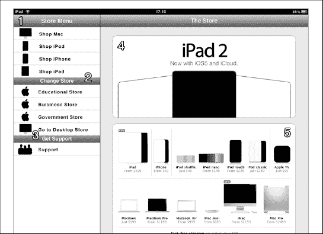

**图 4–39。** *我们 Apple Store 用例的 iPad 原生(重新)设计。*

在内容栏([Figure 4–40](#fig_4_40)，number 4)中，从上到下插入英雄图像，该图像在兼容版本中起到介绍页面的作用。正如我们所说的，风格与您在原始版本和兼容版本中看到的完全相同。

在英雄图像下方，插入入门级产品盒。每个产品都有其可触摸的整个可视区域，就像在内容栏中插入另一个菜单一样。通过这种方式，我们可以在商店菜单中插入必要的条目([图 4–40](#fig_4_40)，数字 1)，减少用户体验中的认知噪音。

#### 互动

在这个阶段你需要做的是测试你的界面的一致性，看看使用这些界面的用户是否能够访问他/她正在寻找的特定内容。我们可以基于最重要的用例建立一些初步的测试来检查用户界面的一致性和用户体验的质量。

**图 4–40。** *(重新)设计的 iPad 原生界面提供了目前最高水平的用户体验。*

使用类似原生结构的最大优势是，您的内容有一个坚实的基础。然而，这并不能阻止我们插入错误的内容，错误的链接，或者使用错误的排版。我们必须注意这些细节，因为它们正是我们在这个阶段测试的内容。

#### 交付物

在流程的最后，您需要根据设计组合、风格指南和电子原型，生成与兼容版本相同的可交付成果。

### iPhone 原生用户界面设计

iPhone 原生界面是提供优质用户体验的唯一方式，因为原生界面是优化 3.5 英寸内置 iPhone 显示屏使用的唯一解决方案。不幸的是，苹果商店提供了令人难以置信的大量内容，因此在这个例子中，优先级迫使我们做出一些艰难的决定。

当你对内容进行优先排序时，就像你在每个移动Web 应用中必须做的那样，你会被迫删除一些重要的部分。这是撰写本文时苹果网站的 iPhone 版本尚未开发的主要原因。你可以做的是对其内容进行优先排序，如果用户正在寻找 iPhone 版本所不提供的东西，就提供一个桌面版网站的链接。

#### 研究

关于 iPad 研发过程中的研究阶段的说法仍然适用于兼容版本。在 iPhone 界面设计过程中，研究阶段更迫切地需要解决内容优先级的问题。我们只使用最重要的内容，就像我们对 iPad 版本所做的那样，我们甚至可能改变展示顺序。

一旦市场研究告诉你你的内容的哪一部分将被包含在你的 iPhone 版本中，是时候进入下一步了。

#### 结构

在 iPhone 原生版本上工作，正如在 iPad 原生版本上所做的那样，我们不能改变结构，因为该结构是原生解决方案的优势。正如你在[第二章](02.html#ch2)中看到的，iPhone 采用了一种叫做“iPhone 页面模型”的结构。

结构阶段旨在实现以下目标:

*   **将原始品牌应用到 iPhone 页面型号**
    在兼容版本和 iPhone 版本之间建立联系非常重要，这样可以确保品牌贯穿整个设计。
*   **提供内容的优先部分**
    如果我们想要保持高质量的用户体验，你不能把你所有的内容都插入到 iPhone 页面模型中。你需要区分内容的优先次序，选择最重要的部分，剩下的部分留给兼容的版本。
*   **使用合适的链接结构**
    合适的链接结构能让用户以一种舒适的方式访问你的内容，即使有大量的信息。
*   **为用户提供方向**
    在移动环境下，用户很容易在我们的站点地图内迷失方向，当有大量内容时这种概率更大。

你所做的，甚至比你在 iPad 原生版本中所做的更大程度上，是为你的原生结构优先化你的内容。这一次，用户只能看到内容中最重要的元素。如果需要，桌面版本的链接会引导他/她找到其他部分。

**注意:**我们总是尽量避免深度移动网站地图，因为(移动)用户很容易迷失方向。当出于某种原因，你别无选择时，重要的是使用适当的导航结构，并使用面包屑或其他技术清楚地显示导航路径，如[第 2 章](02.html#ch2)所述。

从上到下，我们找到了品牌区域([图 4–43](#fig_4_43)，数字 1)，在这个区域中，我们设计了面包屑，以便为用户提供方向。从语义上来说，品牌区域还包含下面的部分，称为“英雄形象”([图 4–41](#fig_4_41)，数字 2)。英雄图像直观地表示了页面的主要信息，并且在用户每次加载页面时会变成其他图像之一。在这种情况下，您有三个可用的英雄图像。

**图 4–41。***iPhone 原生的一栏式布局结构及其(重新)设计顺序。*

在品牌区域下面，您设计内容区域，采用边到边导航([Figure 4–41](#fig_4_41)，number 3)，只有三个基本选项。因为 iPhone 版本是自动加载的，所以您需要给用户切换回兼容版本的能力，或者如果他/她需要，直接访问支持页面。如果用户需要进入商店，他可以触摸第一个链接，商店主页就会加载。

**注意:**在现代网页设计中，你总是试图避免介绍页，但在这种情况下，我们保留了原始设计的结构，使用介绍页来提供一个大的视觉信息。

在页面的末尾，有站点信息部分。你使用苹果在移动页面中使用的相同方法，像极简主义的 MobileMe，只插入苹果标志，没有任何补充信息。

#### 审美

当我们在一个移动版本的网站上工作时，比如苹果商店，这个网站有很强的品牌，很多性感的视觉吸引力和很棒的设计，审美阶段成为工作中最容易的部分。在这种情况下，我们需要做的只是保持桌面网站的外观和感觉，并在不破坏它的情况下适应较小的屏幕。

类似原生版本的(布局)规则甚至比 iPad 版本更严格。这里几乎没有空间来进行花哨的设计，但是感知法则仍然帮助我们为你的用户提供更好的视觉层次和令人愉快的外观。

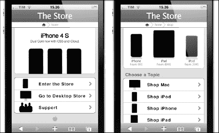

**图 4–42。** *我们 Apple Store 用例的 iPhone 原生(重新)设计。*

品牌区域保留了为 iPad 兼容版本设计的侧边栏主标题([图 4–35](#fig_4_35)，编号 4)的样式，面包屑位于其下方。我们总是在品牌区域插入英雄形象。下面，我们将相同的样式应用到内容区域。

通常，设计师不会在 iPhone 版本中使用太多空间来显示图像，因为 3.5 英寸显示器中有限的可用空间通常被视为需要解决的问题，而不是机会。通过这种(重新)设计，我们希望打破这一规则，我们很高兴地报告，由苹果开发的最新(原生)应用 Apple Store 使用了相同的方法。

#### 互动

如果美学阶段受到类似本机结构的严格布局规则的限制，则相同的规则使交互阶段的工作更容易，因为它们提供了一些专门开发的标准结构，使用户能够与移动设备进行舒适的交互。

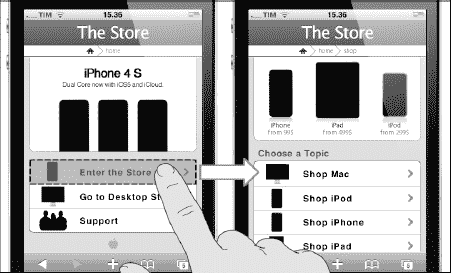

**图 4–43。** *(重新)设计的 iPhone 原生界面提供了现在最高水平的用户体验。*

正如我们对 iPad 版本所做的一样，我们只需要测试对类似原生环境所提供的接口的正确使用。如果用户触摸一个链接想要访问一个特定的信息并且成功了，这意味着你的界面工作正常，你做得很好。如果这不起作用，您可以尝试插入不同的接口部分，就像您可能在拼图玩具中插入不同的部分一样，直到一切都正常工作(至少在测试上下文中)并且您已经创建了一个语义正确的结构。

#### 可交付成果

在流程结束时，如果您在项目中创建了兼容的 iPad 和 iPhone 版本，您可以选择将所有可交付成果一起发送给开发团队，但这仅在处理小项目时才可行。对于一个更大的项目，在可能的情况下，在团队的不同部分之间创建某种并行的工作流总是更可取的。

#### 用户界面设计工具

本章中使用的工具包括应用和 web 应用两种类型。Table 4–3 列出了一些你可以用来设计下一个用户界面的有用工具。

T2】

### 总结

在这一章中，我们介绍了界面设计过程。您已经看到，为触摸设备设计意味着采用不同的界面设计理念，因为每种设备都为用户提供缩放功能，因此一切都变得可触摸，一切都变成了界面。

我们引入了一个新概念，定义了触摸屏设计过程中的主动和被动界面，并了解了如何使用它们来优化 WebApp 内部的结构。

按照这种新的方法，我们还探索了主动和被动负空间的使用，色彩心理学的基础，以及色彩如何影响用户的情绪。

我们介绍了视觉层次的概念，这是最常见的用户阅读模式，并讨论了如何使用强大的视觉层次来影响这些模式，并在您的设计中实现特定的目标。

在第二部分，我们使用 Apple Store 用例进行兼容设计。我们展示了负空间和触摸导向排版的使用，以优化苹果平板电脑及其 9.7 英寸显示屏的桌面网站的用户体验。在第三部分中，我们使用了相同的方法，但是面向我们的 Apple Store 用例的 iPad 本地版本。始终遵循相同的界面设计流程，我们在第四部分设计了一个 iPhone 版的苹果商店网站。