## 第八章

## 原生 iOS 环境开发

> 我的目标不是死时成为世界上最富有的人，而是晚上睡觉时说，我们做了一些了不起的事情。
> 
> —史蒂夫·乔布斯

在本章中，我们将了解如何在 iOS 环境中工作，如何在我们的 WebApp 中模拟它，以及如何优化它的使用。

首先，我们将建立一个环境，在本地网络上测试我们的工作。接下来，我们将介绍一个视口，看看我们如何优化它来开发全屏 web 应用。我们将解释如何创建一个跳板图标，作为原始应用，以及如何定制一个启动图像。

我们将指定将用户从桌面重定向到我们的 iPhone WebApp 和从我们的 iPhone WebApp 重定向到桌面的 JavaScript 代码，并解释一旦用户接近我们的 WebApp，如何模拟本地链接和设计元素行为。

我们还将了解如何与 iPhone 功能交互，如电话、邮件和 GPS，以及如何处理用户手势交互和设备方向变化。

### 设置环境

在将 aWebApp 放在一个公共的、实时的 web 服务器上之前，最好在一个私有环境中工作，使用一台台式计算机上的服务器。这种配置将使开发和测试阶段更加容易。

为了做到这一点，我们需要执行以下步骤:

1.  在/用户/用户名/站点/我的共享文件夹中创建一个文件夹
2.  前往系统偏好设置共享
3.  启用服务 Web 共享

**注:**iPhone 或 iPad 和台式电脑必须连接到同一个 Wi-Fi 网络，才能使用本地 URL 地址建立连接。

从现在开始，我们将把所有内容保存在这个本地文件夹中，并使用本地 URL 来访问它:[http://desktopip address/~ folderName](http://desktopIPaddress/~folderName)。

**图 8–1。** *共享框首选项。*

[Figure 8–1](#fig_8_1)显示了带有要启用的服务和要使用的 IP 地址的共享框。[Figure 8–1](#fig_8_1)显示的 IP 地址与我的台式电脑相关；你的将有相同的结构，但会略有不同。

一旦设置好网络环境，就需要一个符合 HTML5 的编辑器。不幸的是，目前可用的编辑器并不都与 HTML5 语法兼容；在开始项目之前，一定要检查 HTML5 的兼容性。

### 定义视口

视窗是用户在看 iPhone 或 iPad 显示屏时看到的矩形区域，代表了网页设计领域的一个重要概念。视口尺寸由两个值定义:设备宽度和设备高度。正如我们在前面章节中了解到的，不同型号的 iPhone 有不同的显示分辨率；尽管如此，所有 iPhone 型号的设备宽度和设备高度值默认设置为相同的值。在纵向和横向模式下，总会有一个 320 × 480 px 的视口区域。这种方法确保了即使使用双像素分辨率，视窗元素之间的比例也保持不变，如图[Figure 8–2](#fig_8_2)所示，确保现有的 iPhone WebApps 继续按预期运行。

`<meta name="viewport" content="width=640"/>`

即使刚刚显示的代码没有指明，您仍然可以在 Retina 显示设备上拥有“完整的 100%真实像素”。

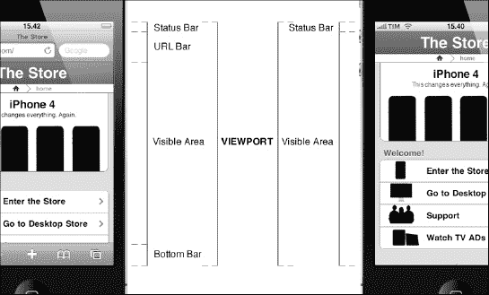

**图 8–2。** *非 WebApp(左)和 WebApp 模式(右)下的 iPhone 视窗及其部分。*

视区的默认值设置为 980 像素的宽度；这个值就是具有固定宽度结构的兼容 WebApp 应该设置为 980 px 宽的原因。此外，当 viewport 标签不存在时，Safari 会将页面加载为 980 px 宽的页面，并将其缩小到 viewport。这相当于以下视区元标记声明:

`<meta name="viewport" content="width=980; user-scalable=1;"/>`

具有 980 px 默认值意味着旧 iPhone 型号将按大约 3.06:1 或 2.04:1 的因子缩小该值，而 iPhone4 将按 2.04:1 或 1.02:1 的因子缩小。此外，对于 iPhone 和 iPad web 的设计者和开发者来说，最好的选择是使用 viewport metatag 来让网页适合设备的宽度；在[表 8–1](#tab_8_1)中可以看到视窗元标记属性。

为了实现这一点，需要使用一个称为设备宽度的常数。以下示例显示了一个 WebApp 的典型 viewport 元标记，它具有两个元键:name 和 content。

`<meta name="viewport" content="width=device-width; initial-scale=1.0;
  maximum-scale=1.0; user-scalable=no;"/>`

这个元键内容有多个由逗号分隔的属性。常量 device-width 指的是浏览页面的设备的宽度。这意味着该值将因设备而异，如下例所示:

*   宽度=768(设备宽度，以像素为单位，适用于 iPad on)
*   width = 480(iphone 4 的设备宽度，以像素为单位)
*   宽度= 320(iPhone 2G、2G、3GS 的设备宽度，以像素为单位)

您还可以决定使用常量 device-height 来匹配设备的高度而不是宽度。

另一个属性 initial-scale 设置网页加载后的初始缩放比例。默认值 1 将页面设置为 iPhone 显示分辨率。

最后一个属性 user-scalable 设置用户使用屏幕上的收缩手势缩放的能力。当设置为*否*时，不允许变焦。对于每个本地 iPhone 和 iPad WebApp，用户可伸缩性属性应该设置为*否*，而对于 iPad 兼容项目，应该设置为*是*。

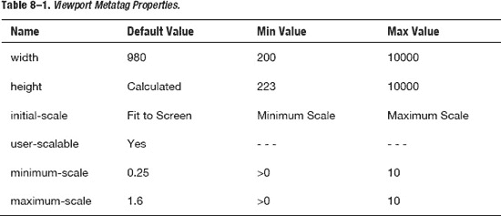

最后，请记住，viewport metatag 不会以任何方式影响桌面 web 页面的呈现。

### 全屏模式应用

本机应用和 WebApp 之间的第一个也是主要的美学差异是后者中 Safari URL 栏的存在。使用 Safari 及其引擎 WebKit 提供了一种控制这种情况的方法。

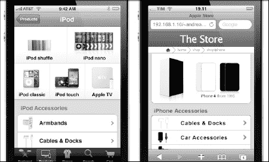

**图 8–3。** *非 WebApp 模式下原生应用(左)和 WebApp(右)的对比。*

使用支持 apple-mobile-web-app 的元标签，您可以指定浏览器来隐藏地址栏，从而为用户提供类似本机的外观和感觉。

`<meta name="apple-mobile-web-app-capable" content="yes" />`

只有当网页从跳板中的链接启动时，全屏模式才起作用。我们将在下一节中看到如何向 iPhone 或 iPad 跳板添加网页。

iPhone 和 iPad 的状态栏是固定的，我们无法隐藏它。尽管如此，我们可以使用下面的元标记来改变它的外观:

`<meta name="apple-mobile-web-app-status-bar-style" content="black-translucent" />`

只有在先前声明了全屏模式元标签时，此元标签才起作用；否则它将被浏览器忽略。最好的方法总是根据应用的调色板来选择状态栏的样式，但是如果你想增加可见区域，唯一的选择就是使用黑色半透明的版本。从 iOS4 开始，跳板中的默认状态栏样式被设置为黑色半透明。

### 添加跳板图标

原生应用和 WebApp 的第二个区别是，原生应用是从主屏幕启动的，也称为跳板。我们可以通过设计一个定制的图标并在跳板上添加一个网页快捷方式来复制这种本机模式，然后直接从那里启动页面。

定制的跳板图标具有一些特定的特征；有些是“必须的”，而有些只是“应该的”，可以被认为是最佳实践。

*   尺寸:57 × 57 像素(iPhone 2G、3G、3GS)(必需)
*   尺寸:114 × 114 像素(iPhone 4 开启时)(必需)
*   尺寸:72 × 72 像素(iPad，iPad2)(必需)
*   角:90 度
*   风格:没有光泽或光泽
*   姓名:apple-touch-icon.png
*   姓名:apple-touch-icon-precomposed.png
*   格式:可移植网络图形(PNG)(必需)
*   位置:根目录(必需)

如果我们想阻止 Safari 给我们的图标添加像光泽和光亮这样的效果，我们需要使用 apple-touch-icon-precomposed.png 这个名字。

当自定义图像准备就绪时，我们可以使用以下元标记将其链接到网页:

`<link rel="apple-touch-icon" href="/apple-touch-icon.png"/>`

即使从理论上讲，不同的页面可以使用不同的跳板图标，但是强烈建议你在所有的网页上只使用一个图像——一个 WebApp，一个跳板图标。

**图 8–4。** *添加一个跳板(主屏幕)图标。*

用户可以使用 Safari 底部栏中的加号按钮“+”将跳板图标添加到他们的 iPhone 或 iPad 主屏幕，然后单击“添加到主屏幕”按钮，如[Figure 8–4](#fig_8_4)所示。

### 应用启动图像

一个网站，更常见的是一个 web 应用，需要几秒钟才能完全加载。我们可以使用启动图像来弥补这种延迟，启动图像也称为闪屏，在网页加载时显示。

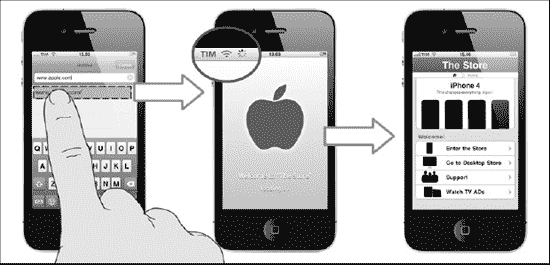

**图 8–5。** *行动中的 WebApp 启动画面。*

根据我们需要从图像中切掉状态栏使用的 20 像素空间的原则，这种图像必须有特定的尺寸。启动图像通常是肖像图像，为 PNG 格式，并具有以下尺寸:

*   320 × 460 px (iPhone 2G、3G、3g)
*   480 × 940 像素(iPhone4 开启时)
*   768 × 1004 像素(iPad，iPad2)

一旦我们有了启动映像，我们需要使用下面的元标记来链接它:

`<link rel="apple-touch-startup-image" href="/startup-image.png">`

至于跳板图标，如果我们用 metatag 链接，启动图像不需要放在根目录下；然而，这被认为是最佳实践。

### 应用重定向

当我们为 iOS 开发一个类似原生的 WebApp 时，我们需要记住，就可用性而言，这个优化的移动版本在大多数时候并不是用户的首选。

在 99%的情况下，当用户访问您的索引网页时，首先会发生的是 web 服务器向 web 客户端发送标准桌面版本。此外，我们需要知道用户何时从移动设备浏览，以便将他重定向到我们内容的特定移动版本。

我们可以使用两种技术之一来实现这一点:JavaScript 或 CSS。这些不是唯一可用的解决方案；我们可以非常有效地从服务器(例如 Apache 或 PHP)获得相同的结果，但是在本文中，我们将重点放在更广泛意义上的 web 标准上。因此，我们将只展示 HTML、CSS 和 JavaScript 解决方案。

我建议您在项目中使用 JavaScript 代码，但是记住在其他一些情况下，通过媒体查询进行 CSS 检测也是很有帮助的。

`<link rel="stylesheet" media="all and (max-device-width: 480px)" href="iphone.css">
<link rel="stylesheet" media="all and (min-device-width: 481px) and (max-device-width:
1024px) and (orientation:portrait)" href="ipad-portrait.css">
<link rel="stylesheet" media="all and (min-device-width: 481px) and (max-device-width:
1024px) and (orientation:landscape)" href="ipad-landscape.css">
<link rel="stylesheet" media="all and (min-device-width: 1025px)" href="ipad-
landscape.css">`

在这个例子中，我们使用了三个 CSS 文件——一个用于 iPhone，两个用于 iPad。我们还为台式机使用了 ipad-landscape.css 文件，最小宽度为 1025 px。

假设我们为桌面和 iPad 用户的项目开发了一个兼容版本，下面的代码将在兼容索引网页中用于将 iPhone 用户重定向到 iPhone 原生版本。

``

JavaScript 代码将在设备“用户代理”上进行测试，检测 iPhone 和 iPod 用户。我们还需要确保 iPad 或桌面用户不会意外地浏览到 iPhone 版本，因此我们需要检测这些使用另一小段 JavaScript 代码的用户，但这次是在 iPhone 网页上。

``

这一次，JavaScript 代码将检测 Macintosh、Linux 和 Windows“用户代理”,并将这些桌面用户重定向到他们的特定版本。

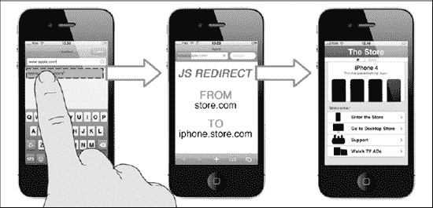

**图 8–6。** *WebApp 重定向在行动:从桌面到移动(iPhone)版本。*

### 设置头部

到目前为止开发的所有代码都将被插入到我们网页的`<head>`中。现在是时候鸟瞰整个`<head>`部分了。以下代码是基于 iWebKit 5.0.4 的 Apple Store 用例的`<head>`。

`<head>
<meta charset="utf-8">
<meta name="apple-mobile-web-app-capable" content="yes" />
<meta name="viewport" content="minimum-scale=1.0, maximum-scale=0.6667,É
 width=device-width, user-scalable=no" />
<meta name="description" content="The Store iPhone Use Case" />
<link rel="apple-touch-startup-image" href="pics/startup-image.png" />
<link rel="apple-touch-icon" href="/apple-touch-icon.png" />
<link rel="stylesheet" type="text/css" media="screen" href="css/style.css" />

<title>The Store</title>

</head>`

代码故意不包含任何类型的 SEO 元标记，因为我们将在第 10 章的[中介绍这个主题。现在，我们将跳转到我们网页的`<body>`部分；在下一节中，我们将看到如何与苹果移动设备提供的本地服务进行交互。](10.html#ch10)

### 本地链接仿真

默认的 Safari mobile 行为为每个被点击的链接提供一种透明的高亮颜色作为活跃状态。当设计一个网站时，这个特性可能是有用的，但是当在一个 WebApp 上工作时，可能有许多设计良好的按钮，这个特性在视觉上不会有吸引力。我们可以使用下面的 CSS 规则覆盖这个默认的 Safari 行为:

`* {
        -webkit-tap-highlight-color: rgba(0,0,0,0);
}`

此 CSS 规则的语法使用“*”符号，以便将其附加到所有活动的设计元素。我们包含了使用 alpha 通道的 RGBA 代码，并为元素指定了总的透明颜色。

### 原生文本仿真

Safari 的一个便利功能是它能够自动调整文本大小，并将其重新格式化，以便在小屏幕上使用。默认情况下，iOS 会覆盖网站的字体大小，以允许用户在缩放段落时阅读文本时不会出现任何问题。当设计一个类似本机的 WebApp 时，我们不需要这个特性，可以用下面的规则禁用它:

`* {
        -webkit-text-size-adjust: none;
}`

类似原生的 WebApp 是为在 iPhone 上使用而设计的，不需要 Safari 的任何帮助来提高可读性。

### 原生元素仿真

浏览网站时，复制和粘贴功能很有用，但对于活动链接状态，它对 WebApp 不太有用。这个特性在所有的设计元素上都是有效的，甚至可以选择网页的标题栏。下面的 CSS 规则为用户创建了一个更加舒适和类似本机的环境。

`* {
        -webkit-user-select: none;
}

.copiable {
        -webkit-user-select: text;
}`

为此，可以使用两个不同的 CSS 规则来禁用所有设计元素和文本上的复制和粘贴功能，使用另一个规则来创建 CSS 类，该类仅针对复制和粘贴功能实际上有用的一些特定情况。该规则的实施取决于所提供的内容的种类；如果我们有很多“可复制”的文本，有时颠倒一下规则是有用的。

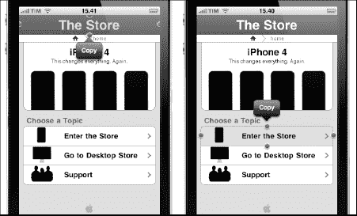

**图 8–7。** *原生设计元素仿真:无用的复制和粘贴特征在起作用。*

当我们使用 WebApp 时，另一个有用的禁用功能是默认的 Safari 标注行为。每次用户触摸并按住链接等元素时，浏览器都会显示一个包含链接信息的标注，例如在另一个窗口中打开它。我们可以使用以下 CSS 规则禁用标注行为:

`* {
        -webkit-touch-callout: none;
}`

我们希望防止这种行为，因为 WebApp 中使用的链接通常专用于内部导航，我们希望防止用户使用它并转到外部。如果这个规则设置为 *none* ，用户可以持有任何链接或图片，只要他/她想要，而不会得到默认的 Safari 行为。

### 本地滚动模拟

iOS5 (beta2)最重要的特性之一是支持溢出滚动的新 CSS 规则。到目前为止，滚动原生应用和滚动类似原生的 web 应用在动力上有明显的区别。对于那些想要模仿 iOS 应用的本机外观的人来说，这种行为是一个障碍。

这个新规则提供了一种在固定大小(宽度和高度)的 HTML 元素(例如 main

)中滚动内容的本地方式，并减少或消除了由实现自定义滚动所导致的 GPU 开销。该规则的实现如下:`.scrollableElement
{
  overflow-y: scroll;
  -webkit-overflow-scrolling: touch;
}`

位置固定和溢出滚动规则将改变 iPhone 上的布局设计方式，在本机外观和感觉模拟过程中又向前迈出了重要一步。

### 原生 iOS 服务交互

服务交互是开发 web 应用而不是原生应用的缺点之一。之前，我们介绍了这种选择的利弊；在本节中，我们将只关注我们能做什么以及如何实现它。

WebApp 能够与 iOS 提供的最重要、最常用的服务进行交互:电话、邮件、短信和地图。这种类型的用户交互是使用

`<a href="protocolServiceScheme:protocolParameter>linkName</a>`

在下一节中，我们将看到如何实现这些特殊类型的链接，为我们的 WebApp 添加额外的交互级别。

#### 电话应用

我们可以使用以下链接语法向电话应用添加链接:

`<a href="tel:1–305-555–5555">Call 1–305-555–5555</a>`

使用这种语法，Safari 会自动在你的网页上创建一个电话链接。如果手机应用没有安装在设备上，如在 iPad 和 iPod 中，当触摸这种类型的链接时，我们会收到警告消息。

另一个好的做法是检查 iPhone 代理，以防止这种类型的错误。检查 iPhone 代理过滤对服务的访问，仅允许具有电话功能的 iPhone 用户。以下代码使用 JavaScript“onclick”事件处理程序执行这种类型的检查:

`<a href="tel:1–305-555–5555"  onclick="return (navigator.userAgent.indexOf('iPhone')É
 != -1)">1–305-555–5555</a>`

iOS 仅对 RFC 2086 协议提供部分支持。这意味着，如果号码包含“*”或“#”等特殊字符，设备将不会尝试呼叫该号码。这是因为出于安全原因，iOS 没有实现`tel`方案中的所有特殊字符。

默认情况下，iOS 号码检测是打开的；有时，您不希望某些号码被解释为电话号码。在这种情况下，关闭 iOS 号码检测，在`<head>`部分添加以下元标记，告诉 iPhone 忽略它。

`<meta name ="format-detection" content ="telephone=no">`

需要注意的是，如果电话号码在

#### 邮件应用

您可以使用以下链接语法向邮件应用添加链接:

`<a href="mailto:info@andreapicchi.it">Andrea Picchi</a>`

Safari 会自动创建一个链接，指向将在新窗口中打开的邮件应用。您也可以使用以下语法将文本直接嵌入链接将打开的电子邮件表单中:

`<a href="mailto:info@andreapicchi.it?subject=Book%20Feedback&body=É
Keep%20Up%20the%20Good%20Work!">Send a Feedback to Andrea Picchi</a>`

iOS 实现了 RFC 236 中指定的`mailto`方案，并允许您使用一些可选的 mailto 属性，如[Table 8–3](#tab_8_3)所示。

从上一个代码示例中可以看出，HTTP 约定要求使用“？”人物(？主题=...)作为第一个属性，使用“&”作为其他跟随者属性(& body=...).

#### 短信应用

我们可以使用以下链接语法向 SMS 应用添加链接:

`<a href="sms:1–305-555–5555">1–305-555–5555</a>`

`sms`方案会告诉 Safari 打开短信应用。与邮件应用不同，使用`sms`方案，我们不能添加文本。

目标电话号码是一个可选参数，如果我们只想用一个空白页打开 SMS 应用，我们可以使用以下语法:

`<a href="sms:">Launch the SMS Application</a>`

至于电话应用，如果设备上没有安装短信应用，就像 iPad 和 iPod 的情况一样，当触摸这种类型的链接时，我们会收到一条警告消息。

`<a href="sms:1–305-555–5555"  onclick="return (navigator.userAgent.indexOf('iPhone')É
!= -1)">1–305-555–5555</a>`

上述代码执行与 tel 协议相同的代理检查，以防止 iPod 用户访问基于基带的服务。

#### 地图应用

您可以使用以下链接语法向地图应用添加链接:

`<a href="http://maps.google.com/maps?q=cupertino">Cupertino</a>`

地图应用没有自己的`maps`方案，地图链接是使用常规 HTTP 协议语法指定的。Safari 将 HTTP 请求重新路由到位于 maps.google.com 的 Google 地图服务器，然后使用地图应用打开其 HTTP 响应。

与邮件应用一样，我们可以使用“？”来组合参数，以便为地图应用提供更多信息性格。下面的例子展示了我在意大利托斯卡纳的办公室:

`<a  href="http://maps.google.com/maps?q=via+dell+olmo+50,É
+livorno,+italy+(Andrea+Picchi's+Office)&t=h&z=7">Andrea Picchi's Office</a>`

“+”字符用于向应用传递由多个单词组成的短语，而圆括号用于创建标签。“t”参数用于指定具有“h”值的混合地图，而“z”将缩放级别设置为 7。

Google Maps 应用有一个很长的参数列表，但是 Maps 应用并不支持所有的参数。iOS 支持的谷歌地图参数如[表 8–4](#tab_8_4)所示。

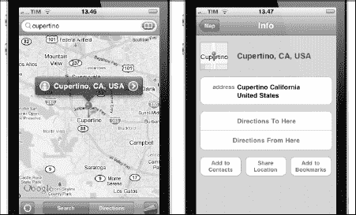

**图 8–8。** *地图应用:美国加州库比蒂诺。*

### 触摸事件和手势交互

以前，我们看到鼠标指针不是手指，为手指而不是鼠标指针设计是多么不同。这里，我们需要做另一个范式转换，就像我们对指向概念所做的那样。

用户使用手势浏览网页，并模仿他们以前使用鼠标的行为。因此，手指动作和手势必须模仿鼠标事件。在触摸时代之前，网页上的每一个事件都只由鼠标的移动触发；按钮翻转、下拉菜单和简单链接只是这种类型交互的几个例子。

然而，手指动作生成的事件流与鼠标指针生成的事件流不同，手指事件流是由一次或多次手指触摸生成的，这取决于所选元素是可触摸的、不可触摸的还是可滚动的。

**注意:**每当我们使用“可触摸”这个词时，我们指的是一个“可点击”的设计元素，如链接、下拉菜单或任何在网页结构中触发标准鼠标事件的元素。

如果手指触摸了不可触摸的设计元素，则会生成事件或将事件添加到手势事件流中。出于这个原因，在为 iOS 设计时，我们需要从“面向鼠标的设计范式”切换到更合适的“面向可触摸的设计范式”。

#### 触摸事件范例:触摸不是点击

可触摸元素由与事件处理程序相关联的设计元素定义。使用基于鼠标的 web 范例，我们可以将其定义为一个可点击的元素。

单指用户操作、双指用户操作和更复杂的手势都是在 Safari Mobile 使用的 WebKit 引擎之上构建的。WebKit 引擎在这个游戏中扮演了主要角色，提供了类似于原生 iOS SDK 内置的手势支持的触摸支持。每当用户的一个或多个手指触摸基于 iOS 的设备的电容式显示屏时，就会触发这些类型的事件。

单点和多点触摸事件模拟经典的鼠标导航，触发与鼠标相关的事件，而手势事件是在鼠标模拟事件之外捕获的，提供了额外级别的交互和可能性。WebKit 引擎和电容式显示器支持三种类型的事件:

*   *单点触摸事件*:由电容式显示屏上一次一次的单点触摸组成，这种类型的事件相当于 99%的基于鼠标的动作。我们将在[表 8–5](#tab_8_5)中看到这些事件。
*   *多点触摸事件*:由显示屏不同部分的两个或多个同时触摸组成。我们将在[表 8–6](#tab_8_6)中看到这些事件。
*   *手势事件*:由一个或多个触摸事件加上手指在电容式显示器上的特定移动组成；手势事件可使用七个 DOM(文档对象模型)事件类实现，如[表 8–7](#tab_8_7)所示。

##### 单点触摸事件

所有基本的和与浏览相关的鼠标事件通常由一两次手指触摸触发，如表 8–5 和 8–6 所示。

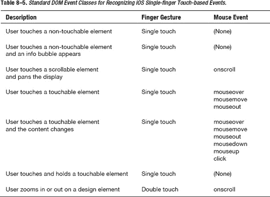

在[表 8–5](#tab_8_5)中表示的五个单指触摸动作中的三个用[图 8–9](#fig_8_9)中的流程图直观地表示出来。

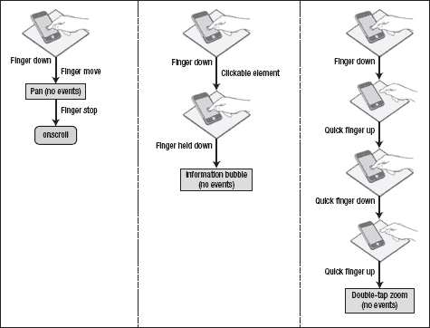

**图 8–9。** *对比加班单指动作(流程图来自官方 Safari 参考)。*

##### 多点触摸事件

相比之下，有两个手指的触摸事件，在浏览会话中不经常使用，但对于提供可靠的用户体验来说同样重要。[表 8–6](#tab_8_6)显示了双指触摸事件。

在[表 8–6](#tab_8_6)中表示的三个双指触摸动作中的两个用[图 8–10](#fig_8_10)中的流程图直观地表示出来。

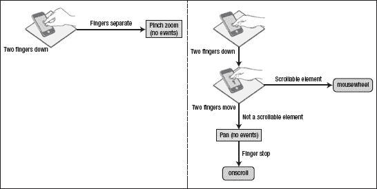

**图 8-10。** *对比加班双指动作(流程图来自官方 Safari 参考)。*

##### 手势事件

手势可以由显示器上的单指或多指移动组成。到目前为止看到的单点和多点触摸动作更多地与鼠标事件相关，并模拟标准的面向鼠标的浏览会话。除了用户体验的大幅提升，这只是触控时代的一个方面——回溯兼容。真正起作用的是 Safari 和苹果 iOS 提供的手势支持，以及 iPhone 3.5 英寸和 iPad 9.7 英寸电容显示屏提供的手势支持。

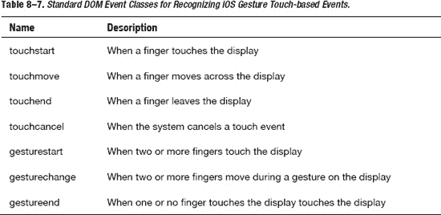

手势由一个或多个手指移动组成，手势事件是由这些单个或多个手指移动触发的触摸的集合。[Table 8–7](#tab_8_7)显示了该上下文中涉及的触摸和手势事件。

为了使用触摸或手势事件，我们需要将它们转换成单独的触摸。这可以通过使用每个事件的对象属性来实现。每个事件都是一个对象，每个对象都有属性。使用[Table 8–8](#tab_8_8)中显示的对象属性，我们可以触及手势事件中的每一个触摸。

因为事件对象产生标准数组，所以我们可以使用 JavaScript 数组函数和语法来访问这些属性。这意味着，如果我们想要网页上所有触摸对象的数组，我们可以使用下面的 JavaScript 语法:

`event.touches;`

如果我们想访问网页上的第一个触摸对象，我们可以使用下面的 JavaScript 语法:

`event.touches[0];`

我们知道我们需要访问单点触摸对象来操作手势事件，但是下一步呢？正如每个事件对象都有自己的属性一样，每个触摸对象都有自己的属性。

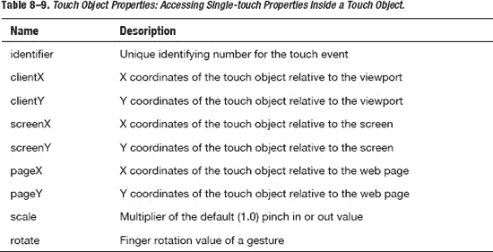

在这种情况下，如果我们想知道网页上第一个触摸对象的确切坐标，我们可以使用下面的 JavaScript 语法:

`event.touches[0].pageX;
event.touches[0].pageY;`

一旦我们访问一个单点触摸对象，我们就可以使用它的属性，如[Table 8–9](#tab_8_9)所示，来创建各种类型的手势交互。

结合 JavaScript 代码和 CSS 属性，我们可以创建自定义触摸处理支持。每次我们编写自定义触摸处理支持时，一个好的做法是禁用默认的 Safari 行为。这将是下一节的主题。

#### 原生和定制触摸事件处理程序

在上一节中，我们看到典型浏览会话中使用最多的事件是与鼠标行为模拟相关的事件。其中一些众所周知的活动是单指平移、缩放捏放和取消捏放，以及触摸并按住。我们还说过，Safari Mobile 支持的、与此类活动相关的大多数 DOM 事件都是由苹果 iOS 原生处理的，并且是免费提供的。

除了这些本地支持的事件之外，有时项目需要一种自定义多点触摸和手势事件的方法。在这种情况下，我们可以关闭默认的 Safari 行为，让开发人员有机会实现他的花式触摸和手势支持。例如，要防止在 iOS 2.0 中滚动元素，请按如下方式实现 touchmove 和 touchstart 事件处理程序:

`function touchMove(event)
        {
        // prevent scrolling on this element
                event.preventDefault();
        … … …
        }`

类似地，我们可以防止张开和合拢手势，实现如下的 gesturestart 和 gesturechange 事件处理程序:

`function gestureChange(event)
        {
        // disable browser zoom in and out
                event.preventDefault();
        … … …
        }`

如果我们为 touchmove 和 touchstart 事件处理程序实现该函数，我们将阻止 WebApp 中的滚动，而如果我们为 gesturestart 和 gesturechange 实现该函数，我们将阻止打开和关闭收缩。

#### 创造可触摸的设计元素

触摸事件流是单次触摸的集合，我们知道设计元素必须是可触摸的，才能在手势动作期间加入这个流。如果我们想要与 Safari 认为不可触摸的设计元素进行交互，该怎么办？

`Element Name`

付出了向代码添加非语义元素的代价，我们可以通过向元素添加一个空的 click 处理程序，将不可触摸的元素转换为可触摸的元素，如前面的代码所示。如果元素在语义 HTML5 标签中，我们可以用它来代替语义空的元素。以下示例显示了如何在通用的

元素中注册手势事件的处理程序:`

`

在 HTML5 代码中注册处理程序后，我们可以使用 JavaScript 和以下语法实现我们的处理程序:

`function gestureStart(event) {
        /* Handler Javascript Code Here */
}

function gestureChange(event) {
        /* Handler Javascript Code Here */
}

function gestureEnd(event) {
        /* Handler Javascript Code Here */
}`

在下一节中，我们将看到一种特殊类型的手势事件；这种手势不与电容式显示器交互，而是与整个设备交互。这个手势是众所周知的和广泛使用的设备方向变化。

#### 方向改变事件

有了 iPhone，更有了 iPad，用户可以根据自己的需要不断改变设备的方向。使用 WebApp 的框架，我们可以依靠它来支持方向变化。每次用户改变设备方向时，框架都会处理它并为我们改变布局。此外，对于一个可靠的开发人员来说，了解幕后是什么以及如何为特定的项目需求更改或添加定制行为是非常重要的。

我们可以看到设备方向的变化是一种特殊的手势，用户用他/她的整只手在整个设备上进行交互。方位变化事件由加速度计通过硬件测量。除了通知方向发生了变化，iOS 还在窗口对象中维护了一个特殊的“方向”属性，其四个值如[表 8–10](#tab_8_10)所示。

窗口对象内部的方向值总是反映当前的设备方向。下面的代码向添加了一个方向处理程序，并实现了 updateOrientation JavaScript 方法来显示当前方向。

`<!DOCTYPE HTML>
<head>
<title>Orientation Change Test</title>

</head>
        <body onorientationchange="updateOrientation();">
        

</body>
</html>`

每次发生 orientationchange 事件时，都会调用 updateOrientation 方法，并更新< div id="output" >元素中显示的字符串。

#### 方位变化媒体查询

使用 orientationchange 事件是实现任何基于设备方向的切换的可靠方法，但不是唯一的方法。orientationchange 事件也为开发人员提供了选项，但是在某些情况下，我们可以不使用 JavaScript 来完成类似的事情。在这种情况下，我们将描述如何使用媒体查询。

媒体查询是由检查某些媒体特征的一个或多个条件的一个或多个表达式组成的媒体类型。这个概念与 orientationchange 使用的概念相同；将会改变的是所使用的语言及其语法。

用于 Apple Store 用例的 iWebKit 框架采用了相同的方法。下面的一小段代码展示了这个 framework style.css 文件中的一个例子。

`@media screen and (max-width: 320px)
{
        #topbar {
                height: 44px;
        }
        #title {
                line-height: 44px;
                height: 44px;
                font-size: 16pt;
        }
}`

如前所述，开发三个不同版本的 WebApp 以优化 iPhone、iPad 和桌面 PC 的硬件和软件特性，或者至少为 iPhone 开发一个移动版本，为 iPad 和桌面 PC 开发一个兼容版本，一直被认为是最佳实践。此外，下一个例子显示了一个一般情况，我们需要为同一个 web 页面处理七个 CSS 样式表。

`@media only screen and (device-width: 320px) and (orientation: portrait) {
        /* CSS Rules for iPhone 2G, 3G, 3GS in Portrait Orientation */
}

@media only screen and (device-width: 480px) and (orientation: landscape) {
        /* CSS Rules for iPhone 2G, 3G, 3GS in Landscape Orientation */
}

@media only screen and (device-width: 480px) and (orientation: portrait) {
        /* CSS Rules for iPhone4 in Portrait Orientation */
}

@media only screen and (device-width: 960px) and (orientation: landscape) {
        /* CSS Rules for iPhone4 in Landscape Orientation */
}

@media only screen and (device-width: 768px) and (orientation: portrait) {
        /* CSS Rules for iPad in portrait orientation */
}

@media only screen and (device-width: 1024px) and (orientation: landscape) {
        /* CSS Rules for iPad in Landscape Orientation */
}

@media only screen and (device-width: 980px) {
        /* CSS Rules for Fixed Width Desktop and iPad Compatible Version */
}`

Retina 显示屏及其 480 × 960 px 的显示分辨率使 iPhone 外壳的媒体查询代码稍微复杂了一些，迫使我们再添加两个外壳。在 Retina 显示屏之前，我们一直使用最小设备宽度和最大设备宽度来瞄准 iPhone 320 × 480 px 分辨率的情况。

现在，不再可能使用此选项，因为当设备宽度属性的值为“480”时，无法知道它是横向方向的旧 iPhone 2G、3G 或 3GS 还是纵向方向的新 iPhone4。此外，我们将纵向和横向测试添加到媒体查询中，当“设备宽度”设置为 480 px 时，创建两个新的案例来识别 iPhone 型号。

### 扩展 iOS 框架

框架是开发人员的圣杯；它们减少了开发时间，提供了构建网页所需的所有工具。框架提供了设计和开发我们的项目需求所需的构件。

因为完美是不可能的，有时候一个框架并不能满足我们所有的需求。在这些情况下，我们无法用我们的框架提供的构件来设计和开发我们特定的项目需求。当我们面临这种情况时，唯一的解决方案是扩展框架，添加和开发我们需要的东西。

iWebKit 框架在根目录中包含许多文件；关注以下内容:

*   css: //样式表目录
*   图像:// ui 图像
*   index.html: //索引网页
*   javascript: // js 框架目录
*   拇指://网页图像

当我们开发一个项目时，我们总是需要寻找更新，包括框架核心功能和项目细节。因为开发人员可能会随时发布新版本的框架，所以我们必须尽可能地维护原始的框架结构。

如果框架更新没有显著改变其核心功能及其文件夹和文件结构，我们将很容易更新我们的 WebApp。不改变原来的框架文件和结构将允许我们上传整个框架，只覆盖一些文件和目录。

这里有一个实际的例子，说明当我们开始设计苹果商店用例时会发生什么。上下文如下:

*   *问题*:实现 Apple Store 用例。
*   *解决方案*:使用框架核心函数模拟本地应用行为。使用框架构建块来设计网页结构。当我们需要添加或设计框架模板不提供或不支持的东西时，扩展框架。

iWebKit 框架提供了一些模板，但是我们的“商店”用例与它们完全不同。因此，我们需要扩展我们的框架。我们要做的是使用框架提供的相同文件夹(保持框架目录结构不变)，并且，不是修改原始框架文件，而是添加我们需要的内容(为将来的框架更新做好准备)。尽管如此，这种方法的缺点是覆盖许多规则而不是替换它们会给框架增加更多的代码和来自我们 WebApp 的更多 HTTP 请求。正确的方法将由 WebApp 环境决定。

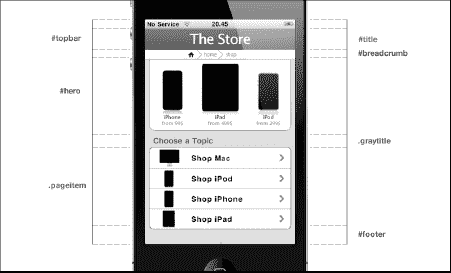

**图 8–11**。*苹果商店用例:商店主页结构。*

我们将处理 HTML5 结构，并将新文档与所有其他网页一起保存在根目录中。随后，我们将开始设计布局，处理保存在“css”文件夹中的 CSS 样式表。此外，我们将在“pics”文件夹中保存布局设计的所有附加图像。

*   #顶栏(预定义定制)
*   #标题(预定义定制)
*   #面包屑(根据草图设计)
*   #英雄(根据草图设计)
*   。灰色标题(预定义未修改)
*   。页面项目(预定义定制)

在[Figure 8–11](#fig_8_11)和前面的列表中，我们可以看到我们如何使用一些预定义的框架结构，只做了一些定制，同时我们需要添加一些从头开始设计的结构。

### 编码资源

不幸的是，市场上只有少数符合 HTML5 的编辑器。[Table 8–11](#tab_8_11)指出了本章中使用的一个 HTML5 编辑器和一个有效的免费替代软件。

以下是本章介绍的三个网络标准的官方资源。如果您不熟悉这些技术中的一种或多种，我建议您继续使用以下官方资源来构建您的 web 标准基础。

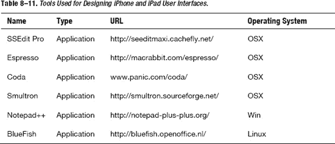

### 总结

在本章中，我们介绍了 WebApp 的基本特征。首先，通过一些例子，我们看到了如何建立一个开发环境，然后我们介绍了典型的 web 应用特征。

我们展示了 WebApp 最重要的原生 iOS 应用以及如何与其服务交互，展示了模拟原生环境所需的所有步骤。

我们介绍了触摸事件范例，以及如何使用单点和多点触摸事件来模拟传统的鼠标浏览会话。我们还看到了更复杂的手势事件，以及在我们需要为 WebApp 开发自定义手势处理时如何防止它们。

最后，我们看到了一种特殊的手势，即设备方向的改变，如何通过 JavaScript 使用它，以及如何通过媒体查询实现类似的功能。我们看到了何时以及如何扩展框架来实现框架本身没有定义和支持的功能。