## 第十一章

## 测试 iOS WebApps

> 成为质量的衡量标准。有些人不习惯期望优秀的环境。
> 
> —史蒂夫·乔布斯

在上一章中了解了如何优化我们的 web 应用后，我们现在进入测试阶段。在介绍了生命周期和敏捷测试方法之后，我们将看到如何组织一个测试，首先创建一个用例，然后是测试它所需的资产。

我们将执行一项测试，然后学习如何使用特定类型的反馈(如设计或情感反馈)和变量(如使用的触摸次数、错误次数和预计到达时间)来评估它。

### Web 开发生命周期

在应用开发中，我们可以应用两种主要类型的生命周期:瀑布生命周期和迭代-增量生命周期。*瀑布生命周期*被定义为一个顺序开发模型，每个阶段都有明确定义的可交付成果。在瀑布生命周期中，从一个阶段到另一个阶段的反馈很少。

**图 11–1。** *瀑布式生命周期(左)和迭代-增量式生命周期(右)。*

*迭代-增量生命周期*是通过周期(迭代)定义的，在更小的时间部分(增量)中开发。与瀑布生命周期相比，迭代-增量生命周期在适应变更的新需求方面具有更大的灵活性。[图 11–1](#fig_11_1)展示了瀑布和迭代增量生命周期之间的图形比较。在下一节中，我们将看到如何在实现阶段结束时接近测试阶段。

### Web 应用测试

在我们简化的工作流程中，当我们退出开发阶段时，我们直接进入测试阶段。特别是在迭代的生命周期中，不同级别的测试应该出现在过程的所有阶段。正如我们现在所理解的，根据项目环境和需求，不同的项目流程可以用不同的生命周期来实现。

我们还将了解到，每个项目阶段都至少与一个其他阶段重叠；测试阶段也是如此。

在我们的工作流程中，如[图 11–2](#fig_11_2)所示，测试阶段在实施阶段之后和发布阶段之前进行。它用于对性能、可访问性、可用性以及更一般的用户体验进行测试。

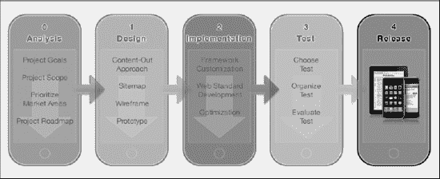

**图 11–2。** *项目流程:简化版本，仅在流程结束时有测试阶段。*

测试方法取决于网站或 web 应用的性质。一般来说，按照项目流程中的具体时刻，我们可以选择不同类型的测试。在下一节中，我们将看到测试的敏捷方法，这对于单个开发人员或小型开发团队来说更为舒适。

### 敏捷测试

在项目流程的第一步，我们使用线框来实现内容的早期版本。从线框来看，下一步是创建纸质原型，以更好地了解我们未来网页的内容和布局。

*纸上原型测试*是第一级有用的测试，以确定我们的设计在用户体验方面是否正确。这种类型的测试是廉价的，因为它可以由单个设计者准备和执行，而不需要任何特定的工具。纸上原型测试可以识别用户界面设计和内容相关的问题。

纸上原型测试可以很容易地确定用户在浏览过程中是否在寻找特定的按钮或试图定位自己。纸质原型测试还可以显示我们的内容是否在正确的位置，并向用户提供正确的信息。

在进入开发阶段之前，在设计阶段进行纸上原型测试([图 11–3](#fig_11_3))。这些测试通常由设计人员执行，并且基于用于定义网站或 web 应用设计的相同草图。

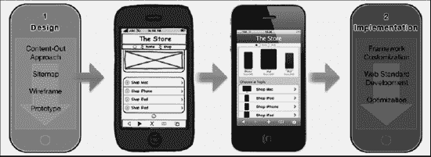

**图 11–3。** *在流程的设计和实现阶段之间执行的纸质测试。*

敏捷测试的第二个层次是电子原型测试。这些测试是设计者在设计阶段的最后一步。因为每一步通常都与下一步略有重叠，所以这种类型的测试可以由设计人员准备，由开发人员执行。电子原型也可以由设计者和开发者准备和使用，允许设计者将工作介绍给开发者，开发者将使用电子原型作为他/她的工作的起点。

如果电子原型在移动设备上运行，它为用户提供了几乎相同的体验，并且是可靠的。它也可以在台式机上运行，并提供良好的反馈。真实移动场景和任何其他电子原型的区别在于环境。

**图 11–4。** *一个真实的环境可以极大地改变用户体验(图片错过 HG)。*

在旨在评估真实移动体验的实验室测试中，环境会造成显著差异([图 11–4](#fig_11_4))。解决问题的最佳方法是对设计进行初步的纸上原型测试，对功能和服务进行电子原型测试，然后开发一个网站或 web 应用的 alpha 版本，以便在真实环境中进行测试。

这些类型的测试实际上是免费的，因为纸质和电子原型已经作为项目工作流程的设计阶段的常规步骤而产生。

### 热图测试

另一种设置和执行起来既简单又便宜的测试是*热图伪测试。*我们使用前缀“pseudo ”,因为真正的热图测试需要眼睛追踪工具，而大多数开发团队都没有这些工具([图 11–5](#fig_11_5))。

作为这种技术缺乏的解决办法，我们可以使用许多使用启发式算法的公司提供的在线服务(例如，Feng-GUI)来代替真实的眼球追踪。这些启发式算法通常是准确的，并且连同它们的可用性和可访问性一起，提供良好的反馈。

通常，使用在线热图服务的流程是标准的，包括以下步骤:

1.  注册热点图服务的帐户。
2.  插入绝对路径或上传网页的打印屏幕。
3.  下载图像格式的热图。

一些服务类似于谷歌分析，并提供一个插入网页的脚本。登录我们的帐户后，我们可以查看网页统计数据和热图。这种类型的服务应该被认为是准确的，因为我们可以分析真实用户的网页。

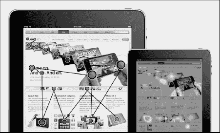

**图 11–5。** *眼球追踪测试(左)和相应的热图(右)。*

我们在第 4 章中介绍了热图技术来分析阅读模式，以展示优秀设计的基本要素，以及什么会对用户体验产生负面影响。关键是热图可以揭示设计错误，并在设计阶段给出早期反馈。通过观察热图，我们可以确定用户的注意力是否会被一些不需要的设计元素所劫持。通过使用热点图，我们可以测试我们的设计元素层次，并检查阅读模式是否正确地遵循了内容。

我们还应该注意到，与 9.7 英寸的 iPad 环境相比，热图测试在 iPhone 这样的小显示器环境中提供的信息较少。尽管有这个缺点，热图测试仍然提供了关于我们设计的重要信息，帮助防止设计错误在项目流程中传播。

### 组织测试

为了产生可靠的反馈，必须计划和组织每个测试的每个细节。我们选择的敏捷方法是基于*工件回收，*允许我们处理在之前的工作流程阶段使用的想法和资产。工件回收方法有助于保持准备阶段尽可能的精益。在接下来的章节中，我们将会看到如何计划和创建用例，以及如何执行测试。

#### 创建用例

要记住的主要事情是，纸上原型(如图[图 11–6](#fig_11_6)所示)是面向设计的，在设计测试中效果最好，这意味着它们在设计细节上提供了更可靠的反馈。电子原型也可以对设计细节给出反馈，但是因为它们在网站或应用提供的部分或全部功能和服务的特定级别上实现，所以它们主要用于收集关于功能和服务的反馈。

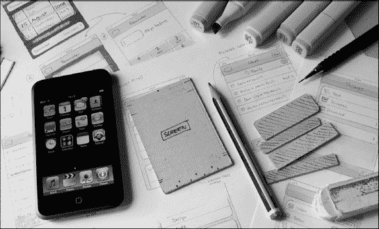

**图 11–6。** *为用例开发纸质视图(图片再发布媒体)。*

准备阶段的第一步是创建一个用例。当在网站或应用上工作时，我们可以想象一个具有特定用户动作路径的浏览会话。也许我们想测试联系页面是否容易到达，或者某个特定的服务是否有用。在这个阶段，想象力和经验是你最好的朋友。

通常，文本用例与用例图结合使用，以便更好地理解分析阶段的项目需求。在测试阶段，这种组合仍然提供了最好的结果，因为图表可以被看作是用例的图形总结，提供了“谁做什么”和“谁与什么交互”的概念，而描述提供了对参与者(用户)和系统(用户界面、服务器等等)之间的交互所涉及的各个步骤的更好理解。

##### 创建文本用例

现在我们正面临一个岔路口，因为设计师和开发人员通常拥有不同的背景知识，使用不同的工具。不是所有的设计师都知道 UML，然而几乎所有的开发人员都知道这种有用的建模语言；几乎每个面向对象的项目都使用它。

对于那些不了解 UML 的人来说，文本用例方法提供了展示和组织测试所需的一切；熟悉 UML 提供的工具肯定会对项目流程的分析和测试阶段有所帮助。

UML 超出了本书的范围。然而，在这一章中，我们将介绍两种表示用例的方法:文本的和视觉的。在这一节中，我们将呈现表示 UML 用例的文本方式，而在下一节中，我们将使用图表可视化地这样做。

**注:** UML 代表*统一建模语言*，是一种用于软件工程的标准化通用建模语言。UML 包括各种类型的可视化模型，但是出于我们的目的，我们只展示其中的两种:

*   文本用例
*   用例图

一本可以用简单的术语向你介绍统一建模语言提供的所有工具的简单的书是由 Mike Fowler 写的 *UML 精华*。

欲了解更多信息，请访问[http://martinfowler.com/books.html](http://martinfowler.com/books.html)。

当与团队一起工作时，我们通常使用文本和图形工具来表示一个用例。如果你是一个单独的设计者或开发者，你可以选择你喜欢的工具，假设你已经清楚地记住了项目的每个方面和细节。

创建用例最简单和最直观的方式是文本方式。第一步是为您的用例编写标题，选择与用户的任务、细节层次、参与者和所使用的设备相对应的标题，它标识了上下文。“主要成功场景”是我们用例的标题。第二步是定义*场景*，按照一系列步骤编写我们的用例主体，其中*角色*(用户)执行许多动作来实现他或她的目标。每一步都代表系统(用户界面、服务器等)和参与者(用户)之间的交互。下面是一个取自我们的苹果商店用例的文本用例的例子。

**致电 Apple Store 支持部门**

**水平:**海平面(又名用户目标水平)

**行动者**:用户

**设备:** iPhone

1.  用户通过选择支持链接来浏览菜单。
2.  用户通过选择联系我们链接来浏览菜单。
3.  用户通过选择“1-800-275-2273”链接来浏览菜单。
4.  该设备要求确认对号码“1-800-275-2273”的呼叫
5.  用户拨打支持电话。

在一个用例中，有五个不同级别的细节，从上到下显示在下面的列表中:

1.  云级别(总结目标)
2.  风筝水平(总结目标)
3.  海平面(用户目标高度)
4.  鱼类水平(子功能目标)
5.  平静级别 _ 子功能目标)

我们可以通过设置不同的级别来处理不同级别的细节，如下例所示:

**呼叫支持**

**等级:**风筝等级

**行动者**:用户

**设备:** iPhone

1.  用户转到联系人页面。
2.  用户点击支持号码。
3.  设备要求确认。
4.  用户呼叫支持。

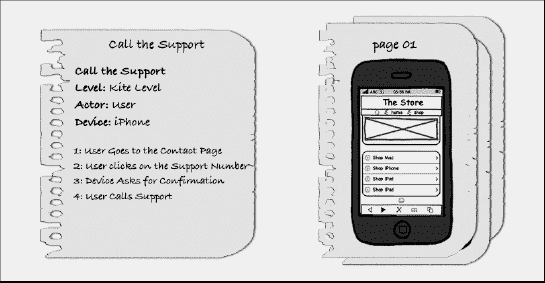

**图 11–7。** *用例:文本用例及其在纸上原型上的实现。*

在我们项目流程的第一阶段，称为*分析*，文本用例被用来识别我们项目的需求，但是它现在可以在测试阶段被重用，以比较文本用例的预期行为和原型测试的真实用户行为。我们的文本用例中的每个条目都应该与用户完成任务所执行的动作相匹配。[图 11–7](#fig_11_7)展示了名为“呼叫支持”的用例

##### 创建用例图

一个*用例图*是系统边界及其与外部世界交互的可视化表示。那些从外部世界与系统互动的人是行动者。参与者可以是用户，也可以是另一个系统。

系统由显示系统边界的正方形或矩形表示。每一个用例都被表示为一个包含用例名称的椭圆形。演员由程式化的人类代表，其下有一个身份。

用例图使用因子分解方法，这意味着一个用例可以包含另一个用例，如图 11–8 所示。当一个用例包含另一个用例时，一个箭头指向它，显示单词`<<include>>`。

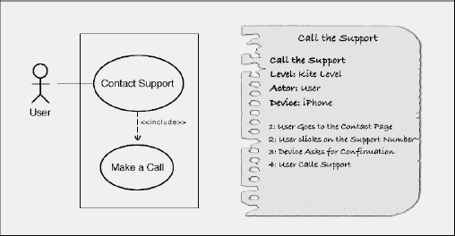

**图 11–8。** *用例:图表和文字描述之间的比较。*

在我们的例子中，联系支持用例包括另一个用例，叫做“打电话”如果我们参考文本描述的海平面细节，联系支持用例代表点 1 和 2，而拨打电话用例代表点 3、4 和 5。在风筝级别的细节中，只有点 1 属于联系支持用例，而点 2、3 和 4 属于打电话用例。

用例图通过组织和为每个测试提供可视化的参考，在测试阶段发挥功能性的作用。

#### 创建资产

当文本用例图和用例图准备好了，我们就可以开始处理测试资产了。我们需要准备两种不同类型的资产:一种是纸质原型，另一种是电子原型。

##### 纸上原型

纸质原型直接受到设计阶段使用的纸质原型的启发，甚至是从其回收的。基本上，我们需要为用例的每一步设计一个纸上原型，这意味着纸上原型和文本描述中的编号点有一一对应的关系，如图[Figure 11–9](#fig_11_9)所示。

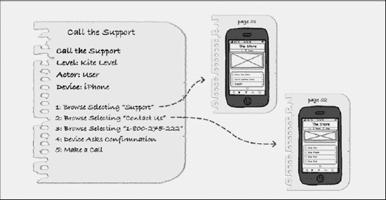

**图 11–9。** *两个文本用例条目和两个纸上原型之间的一对一关系。*

每个纸上原型代表测试中特定时刻的视图，就像一帧是电影剪辑中特定时刻的视图一样。纸上原型总是使用一些颜色来减少大脑中对一张简单的纸的感知和一个完全工作的设备的真实图像之间的差距。如果您使用图形程序来选择纸张的颜色和设计，一个好的方法是使用 Pantone 颜色表，如果您使用手工方法，则使用 Pantone 笔。

##### 电子原型

电子原型的设计和开发是进入实施阶段之前的最后一步。只要你没有跳过这个阶段，你就应该为测试阶段准备好一个电子原型。

一般来说，电子原型不能提供最终版本所提供的 100%的功能；这种测试的目标是执行检查，以防止错误并避免它们在实现阶段的传播。

然而，在 web 环境中，电子原型基于与最终版本相同的技术(HTML5、CSS3 和 JavaScript)，因此这种类型的原型通常非常接近将要发布的最终产品(如图[图 11–10](#fig_11_10)所示)。

**图 11–10。** *文本用例(左)和 WebApp 视图(右)。*

在[第 2 章](02.html#ch2)中，我们建议使用一个框架插件来轻松开发我们项目的电子原型。无论我们选择哪种方法，概念总是相同的:创建 HTML5、CSS3 和 JavaScript 模型，以便能够测试特定的功能或特定的服务。根据电子原型提供的功能和服务的级别，我们可以执行不同级别的测试，并获得不同级别的反馈。

### 执行测试

一旦资产完成，并且假设用户准备好了，我们就可以开始执行原型测试。任何有一张桌子和两把椅子的房间都是进行纸质原型测试的理想场所。

纸质测试和电子测试看起来不同，资产不同，测试者在测试中的角色不同，甚至反馈的等级也不同，但是这两种测试背后的思想是相同的。两者都可以归类为*面向任务的测试*。我们将在接下来的章节中看到同样的想法是如何驱动这些测试的。

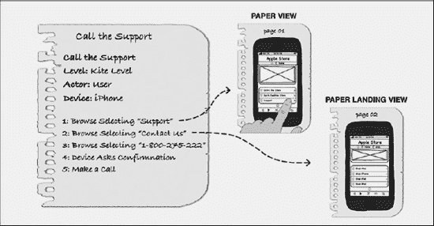

**图 11–11。** *论文原型测试:论文视图与论文落地视图的关系。*

在这些测试中，*纸质视图*是一个实体纸质页面(一项资产)，而*纸质登陆视图*(另一项资产)是一个链接目标页面。“Landing”是一个相对前缀，用于增加交流的层次，更好地理解两个页面之间的上下文和关系，这在我们需要分析和讨论测试结果时很有用。

#### 纸上原型

我们需要与用户一起执行的用例由一个开始用例的*短语*或*命令*来表示，并在精神上引导用户完成他的动作。参考我们的呼叫支持用例，开始测试的一个好短语或命令是通过电话联系支持。

**呼叫支持**

**水平:**海平面(又名用户目标水平)

**行动者**:用户

**设备:** iPhone

**订单:**通过电话联系支持人员(针对用户)

1.  用户通过选择支持链接来浏览菜单。
2.  用户通过选择联系我们链接来浏览菜单。
3.  用户通过选择“1-800-275-2273”链接来浏览菜单。
4.  设备要求确认对“1-800-275-2273”号码的呼叫。
5.  用户拨打支持电话。

一旦我们向用户介绍了订单，我们就向他展示第一个和最初的纸张视图([图 11–11](#fig_11_11))，如我们之前看到的那样，由[图 11–9](#fig_11_9)中的“第 01 页”表示。我们要求用户在体验过程中说出自己的想法，以及他所做的每一个动作。测试人员记录所有描述用户体验的评论。

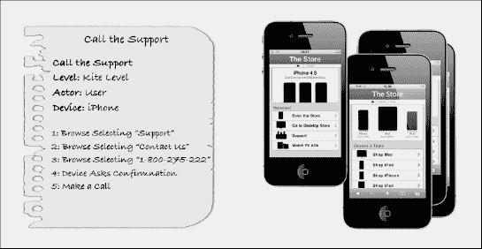

**图 11–12。** *纸质原型测试:用于驱动纸质测试的文本描述。*

用户与纸张原型进行交互，而测试人员的角色是用与用户行为相关的视图替换纸张视图。在我们的示例中，如果用户触摸支持链接，测试人员会将第 01 页所代表的纸张替换为第 02 页所代表的新登录纸张视图，如[图 11–13](#fig_11_13)所示。

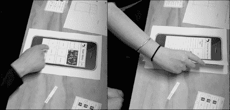

**图 11–13。** *纸张原型测试:测试者改变纸张视图(图片塞缪尔·曼)。*

在最佳情况下，原型测试将在用户能够完成他的任务时结束，在最坏的情况下，当他退出时结束。在任何情况下，测试人员都必须记录用户的体验，描述用户如何完成一项任务或者为什么失败。

#### 电子原型

在尽可能多地从纸上原型测试中学习之后，我们准备执行称为*电子原型测试*的电子变型(参见[图 11–14](#fig_11_14))。测试程序保持不变；改变的是用户体验的水平和测试人员测试在纸上原型测试阶段还没有实现的功能和服务的可能性。

电子测试可以使用台式计算机来执行，如果您使用 Fireworks 插件，就是这种情况。您通常希望使用带有移动用户代理的浏览器作为测试环境。

**图 11–14。** *电子原型测试:用于驱动电子测试的文本描述。*

当然，因为网站或应用通常共享用于开发电子原型的相同技术，所以这种测试的更好版本可以直接在移动设备内部运行。在这种情况下，我们可以有一个电子原型，它提供从大约 0%到大约 100%的不同级别的功能或服务。

仅用于测试设计和反馈水平，但几乎不提供任何功能和服务的电子原型与纸质原型不可同日而语。提供大多数可用功能和服务的原型会产生与发布版本相当的反馈水平。

在电子原型测试的桌面和移动版本中，测试人员扮演的角色与他在纸质原型测试中扮演的角色相同，只是他在测试过程中不会手动更改视图。测试人员在记录用户体验的同时，给用户分配一些要完成的任务。

### 评估一项测试

一旦所有的原型测试完成，我们需要对我们收集的数据和反馈进行工作，以评估测试和项目。重要的是要记住，测试的反馈只和测试模型一样可靠。这意味着您的原型必须尽可能地模拟或代表最终版本。

问题是，在这种情况下，短路是显而易见的，我们需要使用看起来像最终版本的原型资产，以便获得可靠的反馈。但是，我们确实执行了原型测试，以了解如何设计最终版本和/或在实施最终版本之前验证实际设计是否正确(参见[图 11–15](#fig_11_15))。底线是测试只是测试，可靠性是基于在不完整的原型上执行的测试。

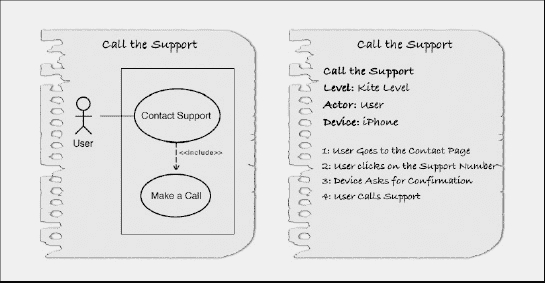

**图 11–15。** *纸质原型测试:测试人员用来执行和评估测试的两类资产。*

这一事实在纸张原型测试中更加明显，纸张很少代表真实的用户界面，糟糕的颜色或细节以不同的方式与作为每个用户体验基础的认知感知进行交互。这些都与设计的内在层次有关——唐纳德·诺曼在*情感设计*中解释了设计的三个层次之一(行为和反思)。未能与设计的内在层次建立联系，会导致无法预期真实的用户体验，因为它忽略了原型在特定环境下能引起用户的效果水平或情感反应。

**注:**唐纳德·诺曼是认知科学、设计和可用性工程领域的学者，也是尼尔森诺曼集团的联合创始人和顾问。

欲了解更多信息，请访问[http://www.jnd.org/books.html](http://www.jnd.org/books.html)。

相比之下，电子原型与最终版本共享相同的技术，因此测试和反馈会更加准确。准确性的百分比可以根据原型中实现的功能和服务的数量而变化。

### 变量和反馈评估

一般来说，一个测试可以有从非常简单到非常复杂的结构。复杂的测试会返回丰富而准确的反馈，但也需要资源和努力，这通常超出了小型开发团队的范围，更不用说单个设计师或开发人员了。

继续使用敏捷方法，我们使用几个变量和反馈类型，以便清楚地了解我们的设计、功能和服务能在用户心目中引发什么样的体验。

#### 触摸次数

要管理的第一个变量是用户完成任务所需的触摸次数。触摸次数由从内容树的起点到终点的 s *最短路径树* (SPT)定义。起点可以是我们的主页或内容树中某处的另一个页面，用于执行更具体的任务。[图 11–16](#fig_11_16)显示了呼叫支持用例的必要步骤。路径看起来很简单，但是由[图 11–16](#fig_11_16)表示的简化的内容树并没有表示网页之间的内部链接。

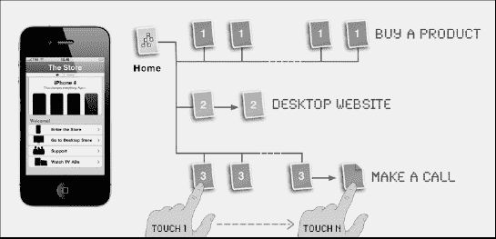

**图 11–16。** *用来完成呼叫支援任务的触动次数。*

SPT 算法用于其他更复杂的领域，但在我们的用例中，通过计算站点地图或内容树中完成任务所需的触摸次数，可以轻松实现相同的概念。触摸次数由测试人员在用例纸描述中报告，作为参考。

#### 错误数量

第二个变量是用户在完成任务时犯的错误数量。有两类错误:

*   **触摸错误**。当用户触摸错误的链接时([图 11–17](#fig_11_17)左)。
*   **触摸误识别**。当用户触摸不可触摸区域时([图 11–17](#fig_11_17)右)。

当用户触摸了错误的链接时，这意味着他或她触摸了将他或她带离终点的链接，并且该链接不属于任务的最短路径。这种类型或错误可能是用户或设计的错误。

测试人员需要确定设计是否正确，用户是否犯了由环境或其他原因引发的错误，或者错误的设计是否引发了用户的错误。

**图 11–17。** *用户(触摸)错误的类型:错误链接(左)和不可触摸区域(右)。*

当用户触摸不可触摸的区域时，认为他/她触摸了链接，这是不同的。在 99%的情况下，错误是由设计错误引发的。设计错误可能意味着缺乏用户导向，或者仅仅是错误的用户界面设计。无论如何，这种类型的错误提醒我们注意一些我们在设计阶段明显忽略的细节。

#### 预计到达时间

第三个变量是*预计到达时间* (ETA) ( [图 11–18](#fig_11_18))，用户完成任务所需的时间。ETA 是针对知道内容树并能够通过任务的测试人员计算的。

通常，经验丰富的测试人员会将最短路径时间作为测试的下限。下限定义了最佳值，这是一个实际上用户在测试中几乎从未匹配过的标准。用户越接近这个估计的时间，他或她就能更好地完成任务，并且(大概)用户体验的水平就越高。

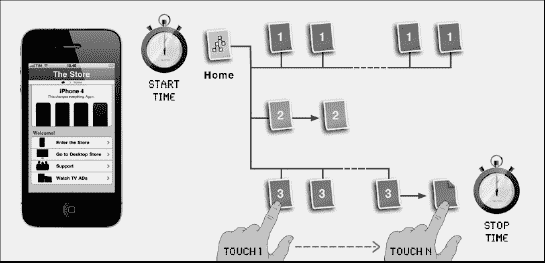

**图 11–18。** *呼叫支持用例:计算预计到达时间(ETA)。*

ETA 在用例文件描述中报告，作为测试人员的参考。

#### 收集反馈

除了这三个变量，测试人员还可以从用户的评论中收集三种类型的反馈。

##### 设计反馈

第一种反馈是关于用户界面质量的设计反馈。在本书的设计部分，我们了解到，在面向触摸的世界里，设计的每一部分都是一个收集关于每个设计元素的反馈的界面。[图 11–19](#fig_11_19)展示了同一个用户界面的两种不同的情感反馈。

**图 11–19。** *调用支持用例:同一界面两种不同的设计反馈。*

虽然这种类型的反馈在纸质原型测试中可以用来表明我们设计的正确性，但如果在电子原型测试期间收集，它会更有分量，因为实现的接口几乎与发布版本相同，并且信息包含更多有用的细节。

##### 期望反馈

第二种类型的反馈是*期望反馈*关于用户的设计和服务期望。每当用户登陆一个不符合他期望的网页或点击一个链接，认为它代表一个与实现的服务不同的服务时，就收集这种类型的反馈。[图 11–20](#fig_11_20)显示了当用户在链接后对登陆页面有不同的心理表征时会发生什么。

**图 11–20。** *购买 iPhone Dock 用例:期望与登陆页面中的设计不符。*

这种类型的反馈在纸质和电子原型测试中的权重几乎相同。这些测试有助于理解我们的设计、功能和服务在语义上是如何在用户的头脑中表现出来的，以及这种意义是否符合我们最初的计划。

##### 情感反馈

最后一种反馈是*情感反馈*关于用户在测试过程中的内心感受。这种类型的反馈在电子原型测试阶段更重要，甚至在纸质原型测试阶段也不经常收集。

情绪反馈由两种类型的刺激触发。一个是绝对的，由颜色、设计元素和所有与项目身份相关的事物触发。在[图 11–21](#fig_11_21)中，iPhone 代表了这种刺激。

另一种类型的反馈是*相对*，涉及环境和这种类型的刺激在用户内心世界引发的变化，如图[图 11–21](#fig_11_21)所示。“环境”一词指的是属于人类用户之外的物理世界(除了移动设备)的一切。

**图 11–21。** *情绪反馈由两种类型的刺激触发:绝对刺激和相对刺激。*

这种类型的反馈可以在测试过程中给出关于用户内心世界的重要信息。作为来自我们网站或应用的全球交流的一部分，这种感觉非常重要。为了测试一个相对的刺激，比如环境，我们需要直接在移动设备上实现一个电子原型，并走到外面，允许用户界面加入真实世界。

#### 评估技术

评估一个测试可能很困难，尤其是在处理大量数据和大范围项目时。为了获得可靠的数据，我们可以应用描述统计学的统计方法。在执行原型测试之后，我们不再需要这种类型的方法，敏捷方法仍然可以提供可靠的值，而不涉及繁重的计算和复杂的数学技巧。

##### 测试变量评估

评估原型测试中涉及的变量的更简单的方法是计算每个变量的出现次数，并将其与实际测试中的出现次数进行比较。在 UML 中，用于估计(或表示)来自用例测试的期望值的实体被称为 Oracle。在我们的测试中，Oracle 由一组用自然数表示的变量值来表示。

在我们的原型测试中，有三个自然数与三种类型的变量相关:一个是触摸次数，一个是错误次数，一个是到达时间。

最简单的方法是为测试中必须匹配的每个变量设置一个下限。[图 11–22](#fig_11_22)显示了用例文本描述中变量值的文本表示。在我们的示例中，我们将这些值设置为等于通过的测试(用户离呼叫支持链接还有四次触摸)，这意味着测试将通过或失败。

**图 11–22。** *一个关于变量值的文本用例。*

一旦我们为每个变量设置了最小值，我们需要为测试设置*变量的模态操作符*。可变模态运算符为每个变量设置一个动词，显示期望值应该如何匹配。通常，只使用少数模态运算符。我们用两个词来表达我们的目的:“必须”和“应该”

模态运算符显示变量值*是否必须*匹配，或者只有*应该*匹配才能通过测试。我们只给出一个原型测试的简单例子:对于更复杂的项目和测试，为每个变量添加一定程度的匹配是一个好主意。

我们的用例测试只需要执行四次触摸就可以通过，没有触摸错误。ETA 变量的“should”属性表示这个变量的值不是通过测试的“必须”条件。在某些情况下，通过包含一些已通过案例的子集，设置每个变量的匹配百分比，可以获得更可靠的结果。

##### 测试反馈评估

使用变量时，最重要的是知道如何设置它们。这个难的部分做完了，剩下的就是对比数据了。这种方法技术性更强，但不需要测试人员具备大量的技能或经验。

一个完全不同的场景是反馈评估。这是因为我们没有可以比较的数字，我们的经验将发挥重要作用。由于这个原因，我们可以引入任何实验方法或技术来评估反馈，只要我们指定了程序。

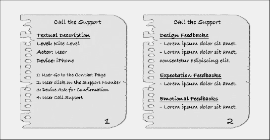

**图 11–23。** *带有用户反馈注释的文本用例*

收集三种类型的反馈。[图 11–23](#fig_11_23)显示了我们如何记录用户反馈的例子。当一切就绪后，我们需要记住每个反馈都有分量。反馈的权重是它相对于上下文的内在价值。用户可能会报告对我们的界面感到困惑，但特定环境中的压力水平可能是认知资源减少的结果，或者这些模式可能受到另一个应用或一些环境变量的制约。因此，需要测试人员的经验和实践来从用户的反馈中收集可靠的信息。

### 测试资源

Table 11–1 提供了本章中用于测试我们项目的一些工具。

### 总结

在这一章中，我们看到了计划测试阶段的重要性，以及如何在整个项目流程中执行这个阶段——而不仅仅是在过程的末尾。

我们首先展示了热图如何成为设计师和开发人员的可靠反馈来源。然后我们引入了纸质和电子原型。我们看到了这两种类型的测试如何帮助测试人员收集不同类型的反馈。

我们讨论了如何通过从流程流的先前步骤中应用工件回收来组织测试。我们看到了如何使用不同层次的细节来创建测试和用例。我们使用了 UML 符号，引入了用例文本描述和用例图。

然后我们看到了如何用纸质和电子原型进行测试。我们看到了如何创建和回收资产，以及电子原型是在设计的早期阶段执行的，而电子原型是在设计阶段的末期执行的，然后才进入实现阶段。

我们还看到了电子原型，因为它与 web 站点或应用共享相同的技术，所以可以在办公室之外的真实场景中测试项目。

最后，我们看到了如何评估一个测试以及这个过程中涉及的变量和反馈类型。我们提出了评估中使用的三种变量(触摸次数、错误次数和预计到达时间)和三种反馈(设计、期望和情感反馈)。