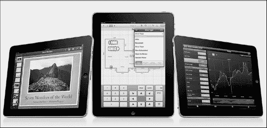
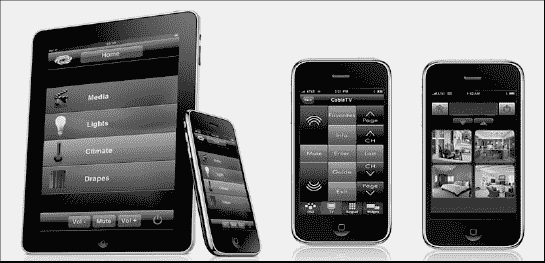
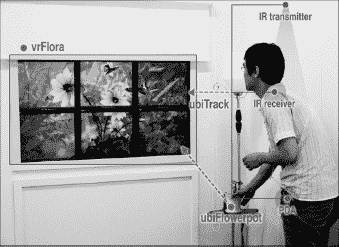
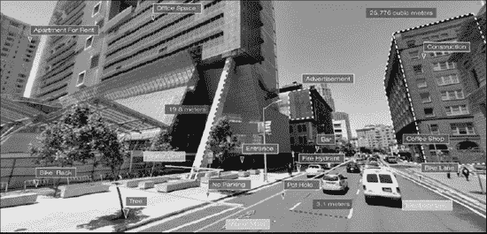
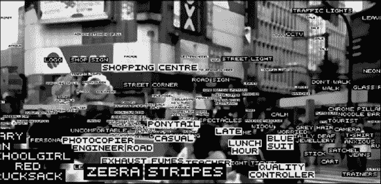

# 十三、超越移动网络，展望无处不在的计算

> 那些疯狂到认为自己可以改变世界的人，才是真正改变世界的人。

史蒂夫·乔布斯

### 移动设备、无线和蜂窝通信的激增

2011 年，谷歌首席执行官埃里克·施密特博士在棕榈泉举行的美国商业协会活动上发表主题演讲时，提供了一些关于移动使用的惊人预测。

“我们谈论的一切和你将要听到的一切都在说，‘做移动业务’，”施密特宣称。“我们从内部观察图表，它的发展速度比我们所有的预测都要快。这是未来，每个人都会适应。”

据世界上最具革命性的公司之一的首席执行官施密特称，在未来几年内，将有 15 亿至 20 亿人联网。“这是一个包含所有人的愿景。施密特继续说道:“只要你有某种移动设备，就不会因为你有多少钱而有所区别。

与任何其他技术的预期扩张相比，这些数字似乎非常巨大，但事实是，根据 ITU(联合国国际电信机构)最近的一篇文章，移动使用的增长已经超过了谷歌首席执行官的崇高预测。“随着世界人口超过 68 亿，近三分之一的人在网上冲浪，”国际电信联盟市场信息和统计负责人 Susan Teltscher 说。就连美国总统巴拉克奥巴马(Barack Obama)也表示，他计划将无线设备的广播频谱扩大一倍，主要是为了应对不断增长的移动设备市场。

新的和即将到来的移动视频应用将有助于弥补移动和媒体中心设备的巨大流量需求的大部分。例如，iPhone 和 iPad 上的 FaceTime 将极大地影响全球的网络功能。

根据思科全球移动数据流量预测和最近的摩根士丹利报告，到 2015 年，地球上几乎每个人都将拥有一台移动设备，平板电脑的渗透将有助于将平均移动连接提高到每月 1.118 兆字节。增长率最高的是印度，为 158%，中东和非洲的年增长率为 129%。其次是其他国家和地区，如拉丁美洲、亚太地区、南非和墨西哥。

虽然在不久的将来，媒体中心和台式电脑等家庭设备将留在现有网络上，随着时间的推移，这些网络将得到改善，但智能手机和平板电脑等移动设备将不得不等待迁移到即将到来的 4G 技术，他们将需要这些技术来有效地运行新的基于视频的应用。

### 触摸屏和多点触控技术带来的下一代用户体验

本节标题中的关键术语是“用户体验”多点触摸技术给每个人——私人用户和专业开发人员——带来了新的好处和机会。这种技术的影响如此之大，以至于现在我们认为它是电子史上的一次革命。[Figure 13–1](#fig_13_1)展示了多点触控设备上可用的新应用环境的一些示例。

乍一看，这场革命的基础似乎是多点触摸屏技术，但正如你在本书中所学的，一切都发生在用户的头脑中。从这个角度来看，触摸屏仅仅是一个触发器，而不是事件。事件是用户体验的改变。

这种改进的用户体验来自新的多点触摸模式，移动用户可以通过多点触摸屏技术的发展来利用这种模式。这一进步从根本上改变了环境和用户之间的关系。这是新的多点触摸用户体验的进化链。

**图 13–1。** *多点触控技术设备上的新应用环境*

### 新技术、新可用性和新机遇

当第一代 iPhone 在 2007 年推出时，移动社区受益于能够提供新的浏览体验的设备。在 2007 年之前，用手机或其他移动设备上网远没有今天这么愉快。因此，移动市场开始以令人难以置信的速度增长，甚至四年后，它仍在快速增长。

2007 年，为苹果新设备开发软件的唯一方法是编写 Web 应用，但许多国家还没有为这种类型的革命做好准备。除了 HTML5 缓存功能，所有的 Web 应用在某种程度上都依赖于互联网接入，许多国家都无法提供廉价的 24/7 契约来满足用户的新需求，从而限制了设备的巨大潜力。

2008 年，苹果发布了第一个 SDK 和第二代 iPhone。与此同时，iPhone 应用商店向成千上万新的原生应用敞开了大门。这些新的应用为旧的任务带来了新的模式，提供了新的和改进的用户体验。这些原生应用增强的可用性改变了用户习惯，创造了全新的习惯，将 iPhone 带到了以前没有蜂窝或移动设备的地方。

这场革命已经开始，但直到 2010 年苹果推出 iPad 才告结束。以 iPhone 的 3.5 英寸小显示屏为代表的最后一个障碍终于被克服了。新的 9.7 英寸多点触摸显示屏提升了用户体验水平，为网络浏览树立了新的标准。它能够打入 iPhone 因其小显示屏而无法进入的市场。

iPad 革命每天可见。医生、教授、律师和音乐家，以及航空公司和汽车厂等公司已经将新平板电脑融入到他们的日常活动或零售产品中，提高了他们工作和产品的质量，并创造了新的活动类型。

新的和改进的可用性和用户体验水平使得计算机历史上第一次有可能将电子设备带给所有类别的用户，甚至是那些以前无法接触到的用户。一类是儿童。对他们来说，使用基于多点触摸的界面比使用基于鼠标的界面更自然。这使得平板电脑能够在早期用于许多类型的学校活动，在这些活动中，由于认知和后勤原因，使用 PC 是不切实际的，如图[Figure 13–2](#fig_13_2)所示。

**图 13–2。**

 *另一个新的类别是老年用户——以前从未使用过电脑或者很难使用电脑的人。我相信你能想出这样一个例子:一位父母在拿到 iPad 之前无法上网，但在拿到 iPad 后立即开始上网，没有任何问题。我母亲就是这样一个人。她从来不会用电脑，现在她像个极客一样上网，看 YouTube 上的新闻频道，查看天气预报，阅读当地报纸。

然而，多点触摸革命还远未完成，为了与这场革命保持一致，当这些小型移动设备鼓励创建更大的基于触摸屏的系统时，这一过程中的下一个重大步骤将会发生，这些系统最终将进入我们的工作和家庭环境。我们已经习惯于在科幻电影和电视剧中看到的计算机饱和的未来也许并不像我们想象的那么遥远。

### 多点触摸屏革命将如何改变下一代计算

世界正处于移动网络革命的中心。在这场革命中，我们可以识别出两股截然不同的力量:智能手机和平板电脑。这个结论看似显而易见，但其含义比你想象的要深刻。

一方面，iPhone 等移动设备改变了许多用户的生活方式，给他们带来了新的工作方式或简单地完成普通任务的方式。在任何其他设备之前，智能手机推动了我前面提到的巨大网络增长，这些设备引领了计算机历史上最激动人心的技术革命之一。

的确，一些应用，比如 YouTube，可以在小屏幕上完美运行，比如 iPhone 的屏幕；其他应用，如网飞，在 iPad 的 9.7 英寸显示屏上看起来更好。这也将有助于视频应用的宽带需求增长。

更大尺寸的视频并不是 iPad 这样的平板电脑的唯一重要特征。除了更大的显示屏，平板电脑还拥有触摸屏界面和便携功能。在平板电脑出现之前，唯一能够从互联网发送和接收数据的移动设备是笔记本电脑，使用笔记本电脑对用户来说是一种不同的体验。

**图 13–3。** *快思聪(左)和莎凡特(右)的家庭自动化应用*

这种新方法为用户带来了大量创新应用，如[图 13–3](#fig_13_3)所示。许多公司开始熟悉平板电脑，以便将其功能集成到公司的项目中。开发家用产品的开发者首先意识到了让他们的产品与 iPad 兼容的可能性。媒体中心、家庭监控系统和其他类型的远程控制系统只是这种产品的几个例子，并且将来会有更多的这种产品。

#### 从家用到普适计算和环境智能

家庭和房屋自动化是移动设备和用户环境之间的一种新型连接的两个方面，这种连接导致了所谓的“无处不在的计算”。普适计算到底是什么？

1991 年，马克·魏泽在他的开创性论文“21 世纪的计算机”中指出,“最深刻的技术是那些消失的技术。他们将自己编织进日常生活的肌理中，直到与日常生活无法区分。”这是普适计算背后的核心概念。

80 年代是微处理器的十年，以个人电脑为标志。那是我们真正制造计算机的十年。90 年代是网络和通信的十年，是人们将计算机连接在一起的十年。它以万维网为象征。2000 年代是个人电脑变成小型设备并变得便携的十年。它首先被笔记本电脑所象征，然后被智能手机所象征。现在的十年，电脑无处不在，无处不在，无处不在。世界的每一个部分都已经连接到网络上，可以通过网络进行搜索，并且可供用户使用。图 13–4 展示了一个普适计算的例子。这个项目叫做 vrFlora，在 UbiComp 大会上展示过。它显示了适合用户情况的自适应响应。

**图 13–4。***ubi comp 大会上的 vrFlora 项目(图片来源:Sejin Oh)*

当我们意识到计算机变得看不见的时候，无处不在的计算时代就到来了。在这个时代，人们不再是严格意义上的“使用者”，而是“主体”当人和计算机从单向关系转变为双向关系时，用户就成了主体。换句话说，主体被技术使用的方式和他们自己使用技术的方式一样。受试者可以走在街上，与连接到 GPS 卫星的智能手机的触摸界面进行互动；同时，他或她可以通过监控摄像头的视频接口进行观察，并通过生物识别系统的传感器接口进行监控。

普适计算的原始实现的一个例子可以在增强现实应用中看到，这些应用可以在 iPhone 和 iPad 上运行(见[图 13–5](#fig_13_5)和[13–6](#fig_13_6))。这些 AR 应用已经向用户体验的新范式迈出了第一步，但它们产生的数据流仍然只向一个方向流动:从对象到用户。

**图 13–5。** *一个增强现实的实现(image Earthmine)*

随着计算机变得越来越小，它们的并行处理呈指数增长，无处不在的计算将带来一种新型的环境，这种环境能够与一个主体进行双向交互，发送和检索数据，并实现所谓的“环境智能”。当万维网和它的用户(主体)之间的桥梁完成时，计算世界将进入一个新的时代。

今天，我们可以用移动设备做很多事情，包括智能手机和平板电脑，来构建一个小小的未来。网络是“无处不在范式”中涉及的每一个设备之间的链接，这为每一个设计者和开发者带来了令人兴奋的机会，因为天空是无处不在计算的极限。

记住，“……那些疯狂到认为自己可以改变世界的人，才是真正改变世界的人。”

**图 13–6。** *将一个环境中的物体转化为一个界面中的物体(图像纤维设计)。*

#### 电信和普适计算的资源

在下表中，我列出了一些资源，您可以从中获得更多关于电信、移动市场的实际增长以及无处不在的计算的新方面的信息。

### 总结

在这一章中，你看到了移动革命的下一步是什么，以及无处不在的计算将会变成什么。这是结合新网络能力和新移动技术的下一步发展。

首先，您看到了第一次移动革命远未结束，它仍然会导致移动市场和宽带需求的增长。

接下来，您发现了新的触摸屏技术将如何培养新一代的可用性，以及这将如何为设计师和开发人员带来新的机遇。

您还会读到触摸屏革命将如何改变下一代计算，以及家用和环境智能如何成为下一个进化阶段的一部分。

最后，我分析了普适计算在过去几十年中的发展，并介绍了新的普适计算范式将如何改变用户角色的关键概念，改变用户与周围技术的交互方式，并将他或她变成一个系统。*