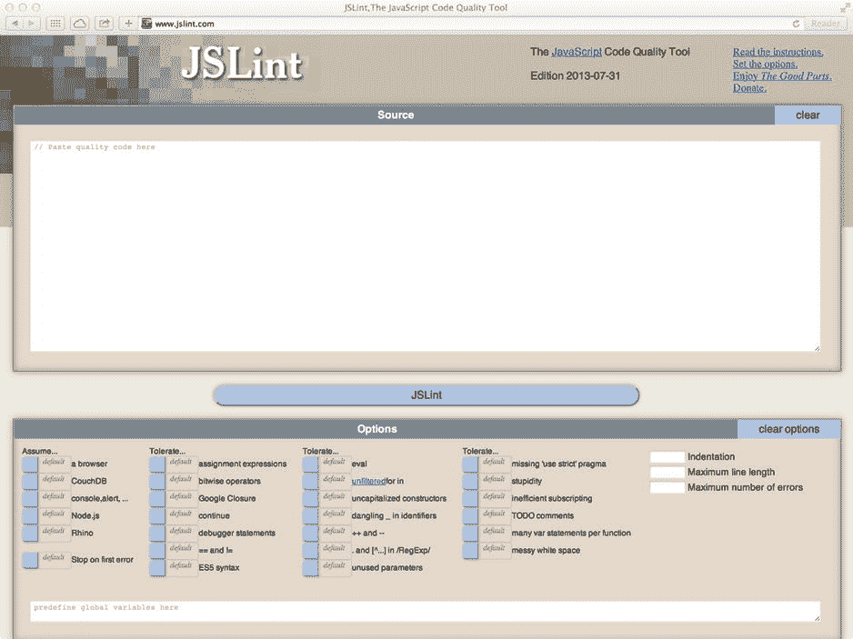
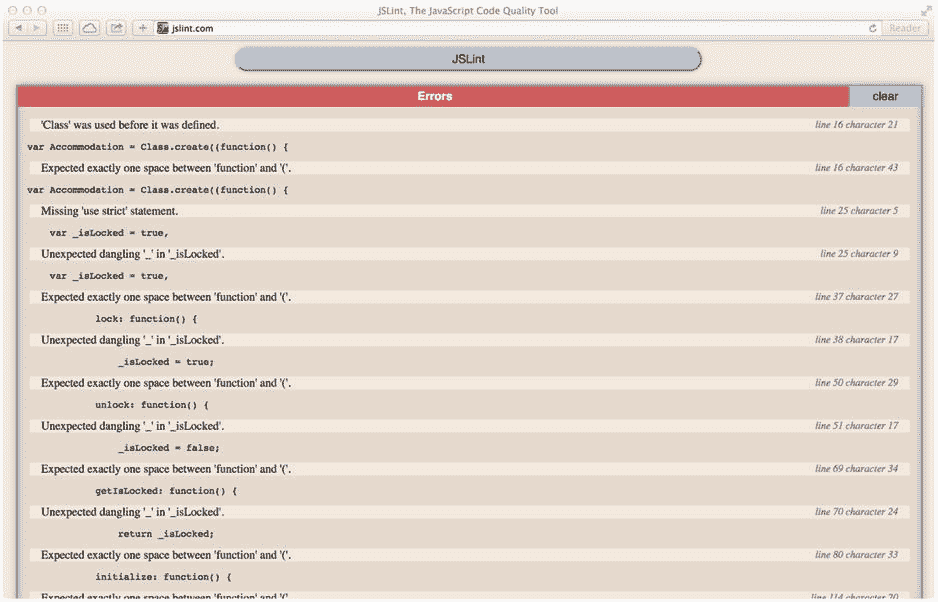
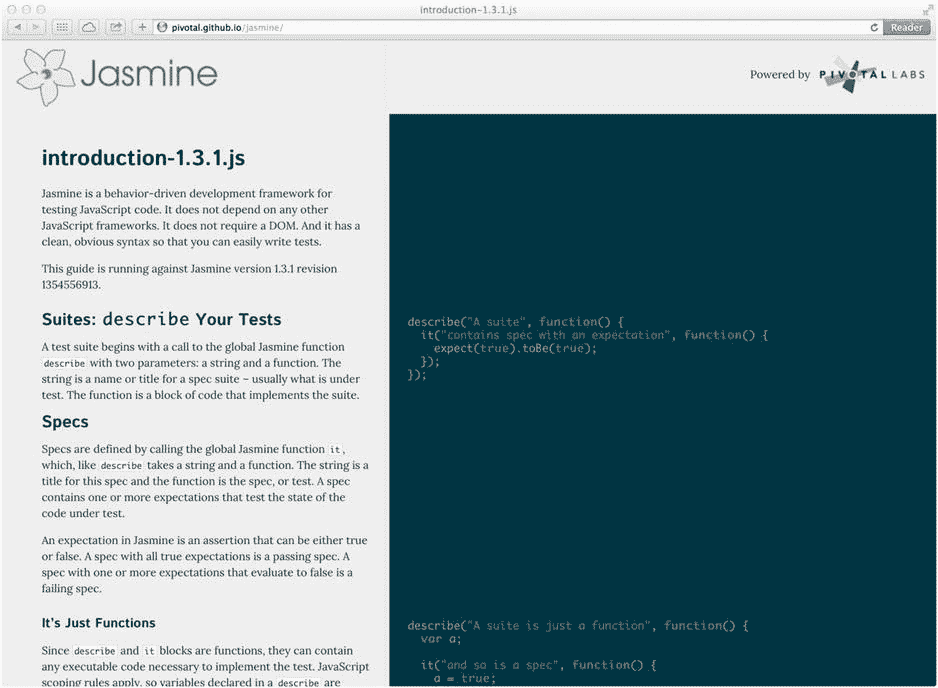
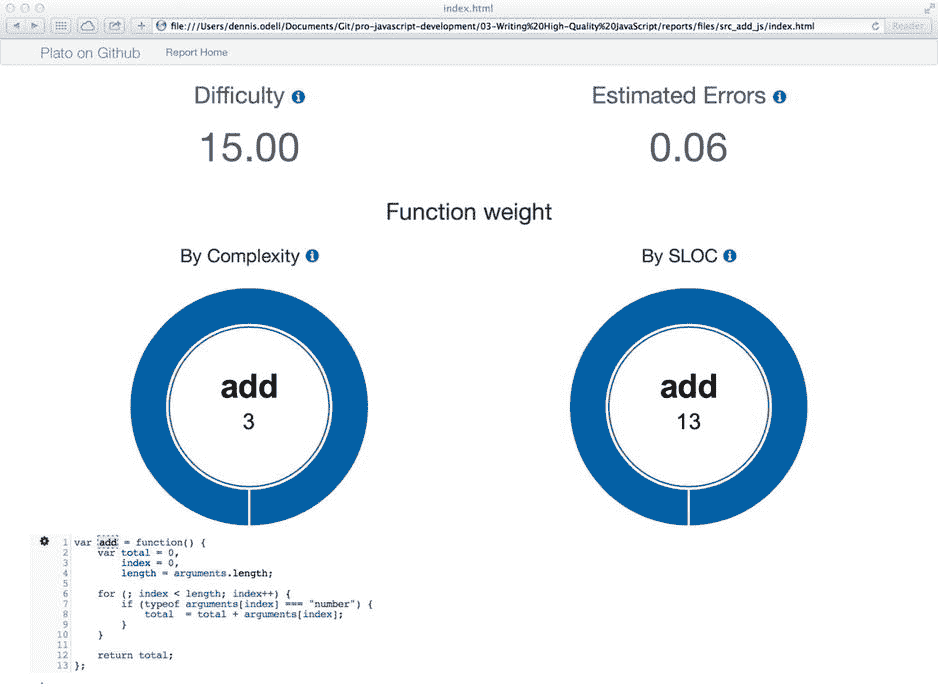

# 3.编写高质量的 JavaScript

没有没有错误的软件这种东西，运行你的软件的系统的未知越多，出错的可能性就越大。作为 JavaScript 开发人员，我们编写的代码可以在至少五种主要的 web 浏览器上运行，其中大多数都有相当快的发布时间表。将这种移动目标与浏览器中 JavaScript 代码的一个错误有可能停止该页面中所有其他 JavaScript 的运行这一事实结合起来，您可以看到我们编写高质量、无错误代码所面临的挑战。

本章的目的是帮助您编写高质量的 JavaScript 代码，并向您展示如何对您在页面中执行的代码充满信心。我将向您介绍代码分析工具、单元测试的原则以及如何处理运行时错误。最后，我将向您展示如何衡量您的代码质量，以便对其进行持续改进。

## 执行静态代码分析

寻找代码中潜在错误的最佳第一步是在第一次运行代码之前，使用代码分析工具检查代码。这种类型的分析称为静态分析，因为代码是作为静态文本文件而不是在执行的上下文中进行检查的。

使用这种方法，可以向您强调常见的错误来源和编码陷阱，这样它们就不会出现在您正在运行的代码中，从而可能引入 bug。这种形式的代码分析可以检测到的一系列问题包括缺少分号、使用未定义的变量，更重要的是，使用 JavaScript `eval`方法来执行字符串，就好像它们是 JavaScript 代码一样——这在代码安全性方面是一大禁忌，因为它可能会允许恶意代码在您的代码上下文中执行。通过确保这些潜在的危险操作不会出现在您的代码中，您可以增强信心，减少软件中出现错误的机会。现在让我们来看看几个比较常见的 JavaScript 静态代码分析工具。

### 杰林特

静态代码分析工具在其他编程语言中已经存在了一段时间。随着 20 世纪 70 年代早期 C 语言的出现，出现了相当基本的编译器，它们将 C 语言编写的代码转换成在计算机处理器上运行的机器代码。一些程序员编写的代码可能会引入错误，而编译器没有发现这些错误。这导致了一个名为 lint 的静态代码分析工具于 1979 年发布，允许开发人员在编译前检查他们的代码，以降低发布错误软件的风险。

雅虎的道格拉斯·克洛克福特创造了一个工具来对 JavaScript 代码做类似的事情，允许在发布代码之前检查已知的错误，他以 C 语言的原始工具命名这个工具为 JSLint。他通过在线表单提供了这个工具，你可以在 [`http://www.jslint.com`](http://www.jslint.com/) 复制并粘贴你的 JavaScript 代码。

图 3-1。

The JSLint homepage. Paste your JavaScript code into the box to check its quality

如果您尝试分析 JSLint 中的一些代码，您会发现自己因为编写了被认为质量很差的代码而受到了惩罚。事实上，使用清单 2-5 中的代码，在被检查的 29 行 JavaScript 代码中总共发现了 16 个错误。项目主页宣称 JSLint“会伤害你的感情”，在这句话听起来正确之前，检查你的代码质量并不需要很多尝试。

仔细查看产生的错误列表，如图 [3-2](#Fig2) 所示，可以发现大多数错误是由于在`function`关键字和其后的左括号字符之间没有空格字符。就我个人而言，我更喜欢在使用了`function`关键字之后不留下任何空格；然而，这正是开发这个工具的道格拉斯·克洛克福特喜欢的编写代码的方式。因此，默认情况下会启用该特定规则。我们将很快看到如何改变应用的规则，以便忽略这个特定的约束。

图 3-2。

The results of running code from Listing 2-4 in JSLint don’t make for happy reading

其他错误包括:我们在使用类对象之前没有定义它，缺少用于强制首选 ECMAScript 严格模式的`"use strict"`语句，我们在变量名的开头使用了下划线字符，以及在定义之前调用了`alert`方法。后一个错误可能看起来很奇怪，因为警报可以在任何浏览器中工作。它被标记的原因是因为它不是官方 JavaScript 语言规范的一部分；它只是由浏览器制造商添加到他们的软件中，允许开发者提供弹出消息。JSLint 希望您的代码不包含特定于浏览器的 JavaScript，这样它就可以在任何支持该语言的环境中正确运行。

在 JSLint 站点上的错误列表下面，有一个标题为 Options 的部分，其中包含许多复选框，允许为您的代码覆盖默认的规则集。尝试设置选项控制台、警报。。。、dangling _ in 标识符、杂乱的空格到`true`，然后再次运行 JSLint 工具；您应该会发现错误列表现在已经缩短了。向下滚动到页面的最底部，您会发现一个标题为 JSLint 指令的部分，其中包含一个特殊格式的 JavaScript 注释。您可以在代码中为每个文件设置不同的规则，方法是将其中一个指令放在文件的顶部。该指令以`/*jslint`开始，然后是通过 JSLint 运行时应用于该文件的选项列表，后面是一个`true`或`false`值，分别指示该选项应该被启用还是禁用；多个选项用逗号分隔。对于我们选择的选项，我们收到以下指令:

`/*jslint devel: true, nomen: true, white: true */`

我们可以将这个指令复制并粘贴到文件的顶部，不管 JSLint 页面上的设置状态如何，这些都是 Lint 时应用到文件的选项。有关可应用选项的完整列表及其目的和背后的原因，请通过 [`http://bit.ly/jslint_opts`](http://bit.ly/jslint_opts) 在线浏览文档。

设置了这些选项后，我们仍然需要解决剩下的两种类型的错误。首先是缺少对`Class`对象的定义，在这种情况下，它存在于一个单独的文件中。我们可以使用另一个特殊格式的注释来指示 JSLint 关于从其他文件中声明的全局变量，我们向该注释提供变量的名称和一个`true`或`false`值，分别指示该变量是在该文件中赋值还是只读。对于我们的`Class`对象，指令看起来是这样的:

`/*global Class: false */`

在代码文件顶部的现有指令之后添加这个代码，可以在再次执行 JSLint 时从列表中删除错误。这就留下了 ECMAScript 5 的严格模式缺乏执行力的问题。这是我们应该在代码中解决的问题，启用严格模式，以减少代码运行时发生错误的可能性。JSLint 强调了这个特殊的疏忽，这使得它的使用非常值得，可以提高最终 JavaScript 代码的质量，让我们对它更有信心。基于清单 2-5 的最终修改后的源代码如清单 3-1 所示。为了简洁起见，这里以及将来的代码清单中已经删除了文档注释。

清单 3-1。传递 JSLint 的示例代码，在特殊格式的注释块中设置了特定的选项

`/*jslint devel: true, nomen: true, white: true */`

`/*global Class: false */`

`var Accomodation = Class.create((function() {`

`"use strict";`

`var _isLocked = true,`

`publicPropertiesAndMethods = {`

`lock: function() {`

`_isLocked = true;`

`},`

`unlock: function() {`

`_isLocked = false;`

`},`

`getIsLocked: function() {`

`return _isLocked;`

`},`

`initialize: function() {`

`this.unlock();`

`}`

`};`

`return publicPropertiesAndMethods;`

`}()));`

`var House = Accomodation.extend({`

`isAlarmed: false,`

`alarm: function() {`

`"use strict";`

`this.isAlarmed = true;`

`alert("Alarm activated!");`

`},`

`lock: function() {`

`"use strict";`

`Accomodation.prototype.lock.call(this);`

`this.alarm();`

`}`

`});`

对于大型项目来说，通过 JSLint homepage 为每个文件运行代码并不总是很方便，因为这会给工作流增加相当多的开销时间。幸运的是，Yahoo 的开发人员 Reid Burke 为 Node.js 应用框架开发了一个 JSLint 版本，可以在您自己的机器上从命令提示符运行。我们将在下一章更详细地讨论 Node.js，但是现在，如果你还没有安装它，请访问网站 [`http://nodejs.org`](http://nodejs.org/) 下载并安装这个框架。

安装 Node.js 及其关联的 NPM 工具后，在命令提示符下运行以下命令，将 JSLint 工具安装到您的计算机上。请注意，Mac 和 Linux 用户可能需要在命令前面加上`sudo`才能对该命令应用管理员权限:

`npm install jslint -g`

现在，您可以从命令提示符下在任何目录中运行该工具；只需导航到包含代码文件的目录，并运行以下命令来 lint 文件夹中的每个 JavaScript 文件:

`jslint *.js`

要了解如何使用自定义选项和其他设置配置该工具，请通过 [`http://bit.ly/jslint_node`](http://bit.ly/jslint_node) 在线访问该工具的 GitHub 项目。

### JSHint(联合提示)

JSHint 代码分析工具与 JSLint 有更多的共同之处，而不仅仅是相似的名称；它实际上是原始 JSLint 代码的一个分支，允许对用于分析 JavaScript 代码的选项进行更大的定制。它是作为一个社区驱动的工作，通过其网站 http:// jshint 进行组织和贡献的。com 。与 JSLint 一样，您可以通过复制并粘贴到其主页上的在线表单中来检查您的代码，并配置您希望如何分析代码的选项。

JSHint 项目始于 2011 年，是对社区内部感觉 JSLint(最初的 JavaScript 静态代码分析工具)变得过于固执己见的反应。JSLint 试图实现的一些规则实际上只是其创建者道格拉斯·克洛克福特喜欢的代码风格规则，人们认为代码分析工具应该更多地关注于发现语法和其他错误，这些错误会阻止代码正确运行，而不是因为格式问题而拒绝让代码通过。

将清单 2-5 中的代码提交到 JSHint 主页上的表单中会产生一系列错误，其中许多与 JSLint 之前报告的错误类似。用 JSHint 报告的错误和用 JSLint 报告的错误有两个显著的区别。首先，JSHint 不会抱怨在关键字`function`和其后的左括号之间使用空格字符，这纯粹是 JSLint 工具作者的编码偏好。其次，JSHint 产生了一个额外的错误，让我们知道我们正在定义一个新变量`House`，这个变量在文件的其余部分中没有使用。

为了让 JSHint 知道我们很高兴我们声明了一个在同一个文件中没有使用的变量，并且我们在代码中使用了`alert`方法，我们可以在文件的顶部放置一个特殊格式的注释，以类似于 JSLint 的方式，设置在分析中使用的选项:

`/*jshint devel:true, unused:false */`

可通过 [`http://bit.ly/jshint_opts`](http://bit.ly/jshint_opts) 在在线文档网站上获得选项的完整列表，并且有许多选项。

为了让 JSHint 知道我们在别处声明的全局`Class`对象变量，我们可以使用与 JSLint 相同的注释:

`/*global Class */`

包括清单 3-1 中的适当的`"use strict"`命令，以及文件顶部的这些特殊格式的注释，允许代码通过 JSHint 静态代码分析。

可以在命令行上使用 JSHint，就像使用 JSLint 一样。要安装，只需确保安装了 Node.js，并在命令提示符下执行以下命令:

`npm install jshint –g`

然后，您可以从任何文件夹中运行 JSHint，就像使用 JSLint 一样:

`jshint *.js`

除了命令行工具，JSHint 背后的团队还提供了一系列其他可能的方法来使用该工具，包括作为通用文本编辑器和 ide 的插件，如 Sublime Text 和 Visual Studio，以在您键入时提供实时代码检查。插件的完整列表可以通过 [`http://bit.ly/jshint_install`](http://bit.ly/jshint_install) 在他们的网站上获得。

### Google 闭包编译器和 Linter

Google 在 2009 年底开源了一些他们内部用于 JavaScript 开发的工具，统称为 Closure Tools。其中包括一个名为 Closure Library 的 JavaScript UI 库，一个名为 Closure Templates 的 JavaScript 模板解决方案，以及一个名为 Closure Compiler 的完整优化和代码检查工具。2010 年，他们增加了第四个工具，Closure Linter，用于根据一组样式规则验证 JavaScript 代码。这些工具中的前两个我们将在后面的章节中介绍。目前，我们对后两者感兴趣。

闭包编译器的主要目标是让 JavaScript 代码下载和运行得更快。它解析和分析、删除未使用的代码，并尽可能地重写以减少结果代码的大小。它是将 JavaScript 文件优化到尽可能小的最佳工具之一，这意味着它可以在最终用户的浏览器中更快地下载和执行。由于其解析能力，它还可以识别 JavaScript 中的语法错误，以及突出潜在的危险操作，这是它作为静态代码分析工具的有用之处。

要使用 Closure 编译器来分析和优化您的代码，尝试通过 [`http://bit.ly/closure_compile`](http://bit.ly/closure_compile) 将您的代码复制并粘贴到在线表单中，然后按下编译按钮。优化后的代码将出现在页面右侧的“已编译代码”选项卡中。通过分析发现的任何 JavaScript 语法错误或潜在的编码危险分别列在 errors 和 Warnings 选项卡中，供您采取措施。如果您愿意，该工具可以使用 Java(通过 [`http://bit.ly/closure_install`](http://bit.ly/closure_install) 在线安装说明)以及基于 REST 的 Web 服务 API 在命令行上运行，以便集成到您自己的系统中(通过 [`http://bit.ly/closure_api`](http://bit.ly/closure_api) 在线使用说明)。

Closure Linter 的主要目标是分析和比较代码文件的编写方式和 Google 自己的 JavaScript 风格指南，最新版本可以通过 [`http://bit.ly/google_style`](http://bit.ly/google_style) 在线获得。除了报告它发现的问题，它还包含一个工具，如果可能的话，可以自动修复它发现的错误。谷歌内部使用它来确保 Gmail 和 Drive 以及其他产品的代码遵循相同的编码风格规则。

要使用 Closure Linter 根据 Google 的 JavaScript 风格指南检查您的代码，您必须首先通过 [`http://bit.ly/dl_py`](http://bit.ly/dl_py) 将应用框架 Python 下载并安装到您的计算机上。Mac 和 Linux 用户可能已经在他们的操作系统中安装了这个。Windows 用户还需要通过 [`http://bit.ly/py_easy`](http://bit.ly/py_easy) 安装 Python 的简易安装包。安装完成后，执行以下命令将 Closure Linter 安装到您的机器上。请注意，Mac 和 Linux 用户可能需要在命令前加上`sudo`来授予安装的管理权限:

`easy_install`[`http://closure-linter.googlecode.com/files/closure_linter-latest.tar.gz`T3】](http://closure-linter.googlecode.com/files/closure_linter-latest.tar.gz)

要对一个目录中的所有 JavaScript 文件运行该工具来报告您对 Google 风格指南的遵守情况，请在命令提示符下执行以下命令:

`gjslint *.js`

如果您希望只针对单个文件，也可以用特定的文件名替换`*.js`。然后，该工具会在命令窗口中列出它发现的问题。如果您想尝试自动修复这些问题，请执行以下命令，用它们的修复覆盖您的文件:

`fixjsstyle *.js`

通过简单地在文件目录上运行后一个命令，您可以用最少的努力更新您的代码来遵循 Google 的风格指南。如果您想了解该工具的更多信息，请通过 [`http://bit.ly/linter_howto`](http://bit.ly/linter_howto) 访问在线文档网站。

### 选择静态代码分析工具

在这一章中，我们已经看了一些比较常见的 JavaScript 静态代码分析工具。选择哪个工具适合您的项目取决于您特别希望检查什么。只需选择使用本章中介绍的任何工具，就可以确保语法错误和常见的编程错误被捕获，从而提高代码的质量，并增强运行时减少错误发生的信心。此外，您需要决定您希望仔细检查多少代码样式和格式，因为这才是真正需要做出决定的地方。我个人更喜欢 JSHint，因为它更侧重于语法检查，而不是特定的编码风格，我知道它不会妨碍我编写和发布代码。您的需求可能不同。研究并尝试每种工具，找出最适合您、您的团队成员和您的项目的工具。

## JavaScript 中的单元测试

一旦您习惯了使用静态代码分析来让您确信您的 JavaScript 是高质量的，那么是时候进入确保高质量 JavaScript 代码的下一个层次了:单元测试。如果您将 JavaScript 文件中的每个函数编写为一个单独的行为单元，由输入和输出组成，并执行一个清晰的、文档化的操作，那么单元测试就是一个 JavaScript 函数，它使用不同的输入依次执行您编写的每个函数，并检查输出是否与预期的相匹配。

清单 3-2 中的 JavaScript 函数将传递给它的所有数字相加。

清单 3-2。一个简单的函数，将传递给它的任何数字相加

`var add = function() {`

`var total = 0,`

`index = 0,`

`length = arguments.length;`

`for (; index < length; index++) {`

`total  = total + arguments[index];`

`}`

`return total;`

`};`

对这种函数的单元测试将使用几个不同的输入来运行该函数，包括将输入留空等边缘情况，以确保原始函数以预期的方式运行，并为每个输入组合生成适当的结果。通过以这种方式严格测试代码库中的每个函数，您可以提高代码的质量，并且当这些经过单元测试的函数在您的系统中运行时，您可以更加确信您的系统将按预期运行。

### JavaScript 的单元测试框架

虽然您可以自己编写代码来对自己的代码进行单元测试，但是从这一领域的其他人的工作中获益并使用一个已建立的单元测试框架来测试您的代码是有意义的。在撰写本文时有几个这样的框架可用，包括 QUnit ( [`http://bit.ly/q_test`](http://bit.ly/q_test) )、Mocha ( [`http://bit.ly/mocha_test`](http://bit.ly/mocha_test) )和 Jasmine ( [`http://bit.ly/jas_test`](http://bit.ly/jas_test) )。每一个都以相似的方式工作，由包含框架代码的 JavaScript 库文件、包含要测试的 JavaScript 代码的文件和包含要针对该代码运行的单元测试的文件组成，该框架代码被设计用于需要包含框架库文件的 HTML 页面中。当在浏览器中打开 HTML 页面时，测试会自动运行，并在屏幕上显示详细的结果，包括测试通过和失败。因为这些框架彼此相似，所以我将带您了解如何只使用 Jasmine 框架为您的代码编写单元测试，这是我个人对这项任务的选择。

### 使用 Jasmine 进行 JavaScript 单元测试

Jasmine 单元测试框架允许您将一系列针对单个函数或方法的单个测试组合在一起；然后，可以将组集合再次组合在一起，以便一起测试相关的代码。测试组被称为套件，单个测试被称为规格。您的代码库中的每个文件通常都应该有一个相关的测试套件文件，组合到一个单独的文件夹中，我通常将其命名为`spec`。

Tip

尝试使用与相关代码文件相同的名称来命名您的测试规范文件，并加上–spec。例如，一个名为`add.js`的代码文件可能有一个名为`add-spec.js`的相关测试套件文件。

图 3-3。

The Jasmine unit testing framework project homepage features extensive documentation

一个简单的套件文件可能如清单 3-3 所示，它针对清单 3-2 中定义的`add()`函数执行了两个单独的测试。

清单 3-3。一个简单的测试规范文件

`describe("The add function", function() {`

`it("Adds 1 + 2 + 3 together correctly", function() {`

`var output = add(1, 2, 3);`

`expect(output).toEqual(6);`

`});`

`it("Adds negative numbers together correctly", function() {`

`var output = add(-1, -2, -3);`

`expect(output).toEqual(-6);`

`});`

`});`

清单 3-3 中的代码使用 Jasmine 的`describe()`函数将`add()`函数的单元测试组合在一起，用字符串`"The add function"`描述组中的测试，并将组中的单个单元测试包装在一个单独的匿名函数中。每一个单元测试都是用 Jasmine 的`it`方法定义的，用一个前面带 it 的字符串来描述，并且包含一个对`add()`函数的调用，用 Jasmine 的`expect()`函数检查它的返回值。然后通过调用`toEqual()`函数将它链接起来，这是一个匹配器的例子，一个 Jasmine 函数，它检测并比较测试的输出是否与预期的结果匹配。我们在清单 3-3 中使用的匹配器函数`toEqual()`，检查函数调用的结果是否与我们已知的操作值完全匹配。

为了运行测试规范来测试我们的功能，在执行测试之前，我们需要一个网页来加载 Jasmine 框架、源文件和测试文件。通过 [`http://bit.ly/jas_dl`](http://bit.ly/jas_dl) 下载 Jasmine 的最新版本，您将获得框架本身和一个名为`SpecRunner.html`的示例 HTML 文件，该文件名为 spec runner，包含一些要运行的示例源文件和示例测试。用我们自己的替换示例源文件和测试，我们可以更新 HTML 页面，如清单 3-4 所示，来加载我们的测试。我假设您已经将您的源文件命名为`add.js`并将您的规范命名为`add-spec.js`，并且这些文件与规范运行程序包含在同一个文件夹中。

清单 3-4。一个 Jasmine spec runner HTML 文件，配置为加载和运行我们的单元测试

`<!DOCTYPE HTML PUBLIC "-//W3C//DTD HTML 4.01 Transitional//EN"`

`"`[`http://www.w3.org/TR/html4/loose.dtd`](http://www.w3.org/TR/html4/loose.dtd)T2】

`<html>`

`<head>`

`<title>Jasmine Spec Runner</title>`

`<link rel="shortcut icon" type="image/png" href="lib/jasmine-1.3.1/jasmine_favicon.png">`

`<link rel="stylesheet" type="text/css" href="lib/jasmine-1.3.1/jasmine.css">`

``

``

``

``

``

`</head>`

`<body>`

`</body>`

`</html>`

在 web 浏览器中加载这个 HTML 页面将自动执行单元测试，在屏幕上显示结果，指示通过或失败。运行清单 3-4 中的 spec runner 的输出表明所有测试都通过了，如图 [3-4](#Fig4) 所示。

图 3-4。

Running the spec runner from Listing 3-4 indicates that all tests passed

当编写单元测试时，重要的是只编写证明代码正确运行所必需的测试；这将涉及对一组正常的、预期的输入至少进行一次测试。您还应该测试边缘情况，即提供不寻常或意外输入的情况，因为这些情况将迫使您考虑在发生这种情况时代码中会发生什么，从而在潜在错误影响最终用户之前捕获它们。在我们的`add()`函数的例子中，明智的做法是测试当没有输入时会发生什么，或者当提供非数字输入时会发生什么。我们知道我们的功能不会以这种方式被心甘情愿地使用；然而，在边缘情况下，我们试图保护我们的代码免受意外的，以及故意的误用。

让我们扩展清单 3-3 中的测试规范，添加一个测试用于没有输入的情况，另一个测试用于提供非数字输入的情况。在前一种情况下，当没有提供输入时，我们希望输出为`0`,而在后一种情况下，我们希望添加所有提供的数字输入，并忽略任何非数字输入。

清单 3-5。清单 3-2 中的`add()`函数的单元测试

`describe("The add function", function() {`

`it("Adds 1 + 2 + 3 together correctly", function() {`

`var output = add(1, 2, 3);`

`expect(output).toEqual(6);`

`});`

`it("Adds negative numbers together correctly", function() {`

`var output = add(-1, -2, -3);`

`expect(output).toEqual(-6);`

`});`

`it("Returns 0 if no inputs are provided", function() {`

`var output = add();`

`expect(output).toEqual(0);`

`});`

`it("Adds only numeric inputs together", function() {`

`var output = add(1, "1", 2, "2", 3, "3");`

`expect(output).toEqual(6);`

`});`

`});`

在我们的 spec runner 中运行这些新的单元测试显示，前三个测试成功完成，由页面顶部的绿色圆圈表示，如图 [3-5](#Fig5) 所示，但是第四个测试失败，由红色叉号表示。每个失败的单元测试的标题下列出了失败的详细信息。在这里，我们期望在最后的单元测试中函数输出是`6`是不正确的，实际产生的输出是`"112233"`，所有提供的输入的字符串连接。

图 3-5。

Running the spec runner with the unit tests from Listing 3-4 shows that one test fails

现在，我们的单元测试揭示了我们代码中的一个潜在问题，这可能导致在现实世界的网页中使用该代码时出现错误，我们需要返回并修改清单 3-2 中的原始`add()`函数，以便为非数字输入生成我们期望的输出。我们将加法封装在一个`if`语句中，该语句检查输入参数是否是一个数字，如果是，则允许加法，如果不是，则拒绝加法。

针对清单 3-6 中更新后的`add()`函数再次运行 spec runner，会为每个测试生成一个通过，这让我们相信在页面中使用它时不太可能出现错误。

清单 3-6。更新清单 3-2 中的 add 函数来处理非数字输入

`var add = function() {`

`var total = 0,`

`index = 0,`

`length = arguments.length;`

`for (; index < length; index++) {`

`if (typeof arguments[index] === "number") {`

`total  = total + arguments[index];`

`}`

`}`

`return total;`

`};`

Tip

只为您自己编写的代码编写单元测试。您不应该为您不负责的第三方库或其他脚本编写测试；这是图书馆代码作者的责任。

当在具有不同输入的网页中运行代码时，您可能会遇到其他情况，即对于给定的输入显示出意外的输出。如果发生这种情况，在修改您的函数以纠正问题之前，您应该使用您发现导致页面错误的确切输入集创建一个单元测试，以便重现该问题。然后，您应该重写代码，直到您的所有单元测试(包括新测试)都通过。从那时起，通过将这个新的单元测试留在规范中，您可以确保在将来更新原始函数的代码时，可以再次捕捉到错误。

Tip

当选择第三方库用于您的页面时，考虑给那些采用单元测试原则的库额外的权重。这将使您确信您的页面中的所有代码都已经过单元测试，并且发生错误的可能性变得更小。

基于虚拟机的在线测试服务 Browserstack ( [`http://bit.ly/brow_stack`](http://bit.ly/brow_stack) )和 Sauce Labs ( [`http://bit.ly/sauce_labs`](http://bit.ly/sauce_labs) )能够在多个不同的 web 浏览器和操作系统上同时自动运行单元测试，并向您报告结果。您可能会认为这是手动运行测试的一个有价值的替代方法。这两项服务都提供了基本的免费选项供您开始使用。

#### 其他匹配者

到目前为止，我们编写的单元测试是基于一组给定的输入，产生一个精确的数字输出。为此，我们使用了茉莉匹配器`toEqual()`。您可能正在测试的函数很可能需要其他更具体类型的比较，在这种情况下，Jasmine 为您提供了许多其他匹配。

为了查明函数调用的结果是否与特定情况相反，您可以将属性`not`与另一个匹配器组合在一起，如下所示:

`expect(output).not.toEqual(6);`

要比较函数结果和正则表达式，使用`toMatch()`匹配器。如果每次运行时输出可能不一样，这一点特别有用:

`expect(output).toMatch(/[a-s]/);`

`expect(output).not.toMatch(/[t-z]/);`

如果您想与真值、假值或空值进行比较，请使用`toBe()`、`toBeTruthy()`、`toBeFalsy()`或`toBeNull()`匹配器:

`expect(output).toBe(true);`

`expect(output).not.toBe(null);`

`expect(output).toBeTruthy();`

`expect(output).not.toBeNull();`

`expect(output).toBeFalsy();`

如果您需要找出一个单元测试输出值是否有一个`undefined`值，使用`toBeDefined()`匹配器:

`expect(output).toBeDefined();`

`expect(output).not.toBeDefined();`

如果您需要确定函数的数组结果是否包含特定的值，您应该使用`toContain()`匹配器:

`expect(output).toContain("Monday");`

`expect(output).not.toContain("Sunday");`

当测试包含数学运算的函数时，对于相同的输入并不总是产生相同的输出，您可以使用匹配器`toBeGreaterThan()`或`toBeLessThan()`:

`expect(output).toBeGreaterThan(2);`

`expect(output).not.toBeLessThan(3);`

第三个数学匹配器`toBeCloseTo()`，允许您确定函数的浮点(一个带小数位的数字)输出是否接近一个期望的数字，直到特定的小数位，作为第二个参数传递给匹配器:

`expect(3.1415).toBeCloseTo(3.14, 2); // true`

`expect(3.1415).toBeCloseTo(3, 0); // true`

如果您的函数在其输入参数无效的情况下抛出错误，您可以在单元测试中用`toThrow()`匹配器检查这一点:

`expect(output).toThrow();`

`expect(output).not.ToThrow();`

最后，如果 Jasmine 的核心匹配器都不能满足您的需求，您可以编写自己的自定义匹配器函数来满足您的特定需求。相关文档可通过 [`http://bit.ly/new_matchers`](http://bit.ly/new_matchers) 在线获取。

从这些例子中你应该已经注意到，Jasmine 的核心匹配器函数是以这样一种方式命名的，该语句可以被理解为几乎是用简单的英语编写的。这意味着，只要稍加练习，为您的代码编写单元测试就会变得简单，并且您会发现自己越来越多地这样做，增强了您对代码的信心，即代码是以最高质量编写的，并且在页面上运行时不太可能导致错误。

#### Jasmine 的其他特性

在这一章中，我们已经了解了使用 Jasmine 的基本知识，让单元测试在您的函数上运行，并根据给定的一组输入检查它们的输出是否符合预期。Jasmine 的能力远远超出了我们在这里讨论的范围，包括在每个测试运行前后运行特定的设置和拆卸代码的能力，对包括 JavaScript 定时器在内的异步操作的支持，从其他位置模拟您没有明确测试的对象的能力，等等。我鼓励通过 [`http://bit.ly/jas_test`](http://bit.ly/jas_test) ，使用这个令人印象深刻的单元测试框架的完整在线文档，为自己进行实验和研究。

## 处理运行时错误

到目前为止，我们已经看到了如何使用静态代码分析和单元测试来提高您的代码质量，以及您在运行时不会产生错误的信心。然而，有时当代码运行在单元测试没有预料到的页面上时，确实会发生错误。如前所述，如果确实发生了这种情况，您需要添加一个新的单元测试来涵盖这种情况，以便将来可以捕捉到它，但这对于试图使用您的页面的用户没有帮助，他们对页面停止正常运行感到沮丧。幸运的是，JavaScript 为我们提供了一种在运行时捕捉错误的方法，允许我们以这样的方式处理错误，以确保代码的其余部分不会因此而阻塞。通过编写代码来捕捉和解决潜在的错误，您可以确保对代码有更大的信心，确保它在运行时不会产生意外的错误，避免用户失望，这意味着您的代码质量可以被认为是非常高的。

### JavaScript 的本地错误类型

运行 JavaScript 代码时会出现六种类型的错误:语法错误、类型错误、范围错误、求值错误、引用错误和 URI 错误。

当 JavaScript 代码无法被正确解析时，就会发生语法错误，这可能是由于误用了语言规则，或者更有可能是由于杂散字符进入了代码的错误部分，这意味着它对浏览器不再有意义:

`var PI = ; // throws a syntax error as JavaScript was expecting a value between = and ;`

当操作中使用的值不是该操作预期使用的类型(例如，字符串、数字、布尔值)时，或者当方法用于错误数据类型的值时，将发生类型错误。在许多情况下，发生这种情况是因为使用的值意外地是`null`或具有`undefined`值:

`var PI = 3.1415;`

`PI.concat(9); // throws a JavaScript type error – the concat method only applies to Strings`

当 JavaScript 的一个核心函数期望提供一个特定范围内的数字，而您提供给它一个超出该范围的数字时，就会出现范围错误。例如，当对一个数字使用`toFixed()`方法时，如果作为参数提供给函数的位数超出了`0`到`20`的范围，则会引发范围错误:

`var PI = 3.1415;`

`PI.toFixed(21); // throws a JavaScript range error`

如果您试图以不正确的方式调用 JavaScript `eval()`方法，无论是试图用`new`关键字实例化它还是试图将其设置为变量，都会发生 eval 错误。然而，对于前一种情况，大多数浏览器会抛出一个类型错误，而在后一种情况下，允许它作为一个变量被覆盖，所以您在日常编码中不太可能遇到这种错误。然而，您应该不惜一切代价避免使用`eval()`,因为它对您的代码有安全风险:

`new eval(); // Should throw a JavaScript eval error, commonly throws a type error instead`

`eval = "var PI = 3.1415"; // Should throw a JavaScript eval error, but lets it run anyway`

当您试图从尚未声明的变量中访问数据时，会发生引用错误。确保在您创建的每个函数的顶部声明您希望在该函数范围内使用的变量:

`alert(PI); // throws a JavaScript reference error since PI has not yet been defined`

如果您向 JavaScript 的 URI 函数之一提供格式错误的 URL，就会发生 URI 错误:`decodeURI()`、`encodeURI()`、`decodeURIComponent()`、`encodeURIComponent()`、`escape(),`和`unescape()`:

`decodeURIComponent("%"); // throws a JavaScript URI error – the parameter contains an invalid`

`// URI escape sequence`

### 包装 try-catch 语句中可能出错的代码

如果您怀疑 JavaScript 代码的某一行在执行时可能抛出六种本机错误类型中的一种，您应该将它封装在一个`try`块中，该块将捕获错误，防止它阻止您的代码的其余部分运行。如果在您的`try`块中有多个语句，并且其中一个发生了错误，那么抛出错误的语句之后的语句将不会运行。相反，控制将传递给一个相关的`catch`块，该块必须紧随其后，从这里您可以选择如何优雅地处理错误。向`catch`块传递一个参数，该参数包含所发生错误的细节，包括其类型；这允许您在该块中以不同的方式处理不同类型的错误。一旦执行了`catch`块，控制就流向该块之后的代码，在`try` - `catch`语句之外。

清单 3-7。试抓块

`var PI = 3.141592653589793238462643383279502884197,`

`decimalPlaces = Math.floor((Math.random() * 40) + 1), // random number between 1 and 40`

`shortPi;`

`// Wrap any code you suspect might cause an error in a try-catch statement`

`try {`

`shortPi = PI.toFixed(decimalPlaces); // Throws a range error if decimalPlaces > 20`

`} catch (error) {`

`// This block is executed only if an error occurs within the try block, above`

`alert("An error occurred!");`

`}`

鉴于`catch`块仅在`try`块中发生错误时执行，如果您希望无论是否发生错误都执行代码，您可以在语句中添加一个可选的`finally`块。这很少使用，因为无论是否发生错误，紧跟在`try` - `catch`语句之后的代码都会被执行，但是您可能会发现使用`finally`将完整的`try` - `catch` - `finally`语句中的相关代码组合在一起很有用。

清单 3-8。try-catch-finally 块

`var PI = 3.141592653589793238462643383279502884197,`

`decimalPlaces = Math.floor((Math.random() * 40) + 1),`

`shortPi;`

`try {`

`shortPi = PI.toFixed(decimalPlaces);`

`} catch (error) {`

`decimalPlaces = 20;`

`shortPi = PI.toFixed(decimalPlaces);`

`} finally {`

`alert("The value of PI to " + decimalPlaces + " decimal places is " + newPi);`

`}`

Note

一个`try`程序块可以在没有`catch`程序块的情况下使用，但前提是包含一个`finally`程序块。在这种情况下，浏览器中仍然会抛出一个错误，但在此之前，finally 块会被执行，从而允许您在抛出错误之前处理好代码中的任何遗留问题。

### 检测引发的错误类型

传递给`catch`块的参数是一个“类”或类型的对象实例，与 JavaScript 语言的六种本地错误类型之一相关；对于前面描述的六种错误类型，它们分别被命名为`SyntaxError`、`TypeError`、`RangeError`、`EvalError`、`ReferenceError`和`URIError`。这些错误类型中的每一种都是从 JavaScript 本地基本类型`Error`继承而来的。在您的`catch`块中，您可以通过使用`instanceof`关键字来确定发生的错误的类型，正如我们在[第 1 章](01.html)中所述。

清单 3-9。检测 catch 块中捕获的错误类型

`try {`

`// Code that might throw an error to go here`

`} catch (error) {`

`if (error instanceof SyntaxError) {`

`// A syntax error was thrown`

`} else if (error instanceof TypeError) {`

`// A type error was thrown`

`} else if (error instanceof RangeError) {`

`// A range error was thrown`

`} else if (error instanceof EvalError) {`

`// An eval error was thrown`

`} else if (error instanceof ReferenceError) {`

`// A reference error was thrown`

`} else if (error instanceof URIError) {`

`// A URI error was thrown`

`}`

`}`

`error`对象包含一个名为`message`的属性，该属性包含发生的错误的文本描述。根据您的浏览器，该对象还可能包含错误发生的行号的详细信息和其他信息，尽管这是对该语言的非标准补充。明智的做法是避免读取特定于浏览器的属性，而是依靠错误类型来决定在`catch`块中采取什么动作。

### 创建自定义错误类型

如果您的项目中出现了特定类型的错误，您可能希望用自己的自定义代码来处理它，而不是重复使用基于六种本机错误类型的代码。幸运的是，创建一个定制的错误类型就像用 JavaScript 创建一个新的“类”一样简单。

清单 3-10。使用清单 1-19 中的 Class.create()创建自定义错误类型

`var ElementNotFoundError = Class.create({`

`id: "",`

`message: "The element could not be found by the given ID",`

`initialize: function(id) {`

`this.id = id;`

`}`

`});`

如果您想随后执行它，以便它被浏览器识别为一个错误，使用`throw`关键字和您的错误类型“class”的一个实例:

`throw new ElementNotFoundError("header");`

实际上，您可以在错误中抛出任何值，从简单的字符串到对象文字，再到完整的对象实例，就像我们在这里所做的那样。在您的`catch`块中，您将可以访问抛出的数据，因此这取决于您的项目在发生错误时需要多少数据。我更喜欢创建一个自定义的错误“类”,因为我可以检测它的类型并存储我可能需要的任何属性，以便在错误发生时帮助我调试错误。

让我们把这些放到一个真实的自定义错误处理的例子中，如清单 3-11 所示。

清单 3-11。定义和抛出自定义 JavaScript 错误

`var ElementNotFoundError = Class.create({`

`id: "",`

`message: "The element could not be found by the given ID",`

`initialize: function(id) {`

`this.id = id;`

`}`

`});`

`function findElement(id) {`

`var elem = document.getElementById(id);`

`if (!elem) {`

`throw new ElementNotFoundError(id);`

`}`

`return elem;`

`}`

`try {`

`findElement("header");`

`} catch (error) {`

`if (error instanceof ElementNotFoundError) {`

`alert("Sorry, the 'header' element was not found");`

`}`

`}`

Tip

尝试创建您自己的基本错误“类”,所有自定义错误类型都从该类继承。您可以使用这个基本“类”使用 Ajax 将系统中发生的任何错误的详细信息发布到服务器上的日志中，从而允许您主动跟踪和修复代码中的错误，提高代码质量。

通过使用静态代码分析和单元测试，您可以限制在网页中执行代码时会出现的运行时错误的数量。然而，为了捕捉那些漏网的未知错误，可以在代码中使用`try` - `catch`语句来防止这些错误导致代码在用户浏览器中停止执行。

## 衡量代码质量

本章的目的是帮助您学习如何通过使用静态代码分析、单元测试和运行时错误处理来提高代码质量，并减少出错的可能性。但是如果没有某种方法来衡量代码的质量，你怎么知道我们的代码有多好呢？通过运行工具来建立关于代码质量的度量，我们可以采取措施来改进代码质量，并在相同工具的每次后续运行中看到改进的度量。

### 单元测试代码覆盖率

我们在本章前面已经看到，一个单元测试针对你编写的一个函数运行，目的是证明在给定一组特定输入的情况下，它能产生一个预期的输出。如果我们能够检测出该函数中哪些特定的代码行被执行了，哪些没有被执行，我们就可以基于此生成代码质量的度量标准。这种度量被程序员称为代码覆盖率，可以使用 JavaScript 生成。然后，可以使用收集到的关于执行了哪些行和代码分支的信息来添加额外的单元测试，以确保覆盖所有的行和分支，这增加了度量，但更重要的是，增加了您对代码的信心。

为了生成一个列表，列出哪些代码行被执行了，哪些没有被执行，我们的原始函数的每一行代码都需要包装在一个函数调用中，该函数调用增加一个计数器，并存储一个对它在原始文件中对应的行号的引用。这样，这样一个函数在代码行被执行时被调用，记录哪些行被执行了，哪些行没有被执行。幸运的是，您不需要自己编写代码来生成这些函数包装器，因为有一个经过良好测试的 JavaScript 库伊斯坦布尔( [`http://bit.ly/istanbul_cover`](http://bit.ly/istanbul_cover) )可以帮您完成这项工作。

伊斯坦布尔是一个 JavaScript 应用，旨在与 Node.js 一起工作，node . js 是一个应用框架，它在命令行上运行完全用 JavaScript 编写的文件。我们将在下一章中更详细地讨论 Node.js，但是现在您需要做的就是安装它。

访问 [`http://bit.ly/node_js`](http://bit.ly/node_js) 并下载 Node.js，按照说明安装；这还会安装一个名为节点包管理器(NPM)的工具，它允许您快速方便地从中央存储库中下载应用(称为包)。

接下来，我们将下载 Grunt，这是一个基于 JavaScript 的任务运行器，它将简化使用伊斯坦布尔运行 Jasmine 单元测试的工作。我们将在第 1 章 2 中更详细地介绍 Grunt，但是现在我们只需要在命令提示符下运行以下命令来安装它。这将安装 Grunt 命令行界面，它允许我们在同一台机器的不同项目文件夹中安装和运行不同版本的 Grunt。Mac 和 Linux 用户可能需要在下面的命令前面加上`sudo`，以便使用必要的权限运行它:

`npm install –g grunt-cli`

Grunt 需要在我们的项目文件夹中创建两个专门命名和格式化的文件才能运行。第一个是`package.json`，包含项目细节，比如名称、版本和代码依赖。我们稍后会添加依赖项，但是现在使用清单 3-12 中的代码创建一个名为`package.json`的文件，它只定义了项目名称和版本号。

清单 3-12。通过 Grunt 用伊斯坦布尔运行 Jasmine 单元测试的 package.json 文件

`{`

`"name": "jasmine-istanbul-grunt",`

`"version": "1.0.0"`

`}`

现在我们需要将我们需要的 Grunt 的特定版本安装到我们的项目文件夹中，方法是在本地安装它，并将其作为一个依赖项列在我们的`package.json`文件中。我们可以通过一个简单的步骤做到这一点，在命令行上执行以下命令:

`npm install grunt --save-dev`

现在我们已经安装了 Grunt，我们需要安装 Jasmine 和伊斯坦布尔任务来运行它。在命令行上执行以下命令来安装它们:

`npm install grunt-contrib-jasmine --save-dev`

`npm install grunt-template-jasmine-istanbul --save-dev`

为了从 Grunt 运行我们的测试，我们需要创建第二个文件`Gruntfile.js`，它将包含我们希望运行的任务的定义以及我们希望为它们使用的设置。在本例中，这是 Jasmine 和伊斯坦布尔任务以及要测试的原始 JavaScript 函数及其单元测试的具体位置。我们还需要指定一个输出文件夹位置，用于保存伊斯坦布尔生成的代码覆盖率报告。清单 3-13 显示了这个文件应该如何实现这一点，假设要测试的代码在当前目录下的一个`src`文件夹中，单元测试在一个`spec`文件夹中。将创建一个`reports`文件夹，如果它还不存在的话，用来存储生成的覆盖报告。因为我们将在第 1 章 2[中详细介绍 Grunt，所以我不会在这里进一步解释`Gruntfile.js`的代码。在这里，您可以随意地向前跳，以完全理解每一行代码，或者只是暂时坚持下去，以查看通过伊斯坦布尔生成的代码覆盖报告。](01.html)

清单 3-13。通过 Grunt 用伊斯坦布尔调优 Jasmine 单元测试的 Gruntfile.js

`module.exports = function(grunt) {`

`grunt.initConfig({`

`jasmine: {`

`coverage: {`

`src: ["src/*.js"],`

`options: {`

`specs: ["spec/*.js"],`

`template: require("grunt-template-jasmine-istanbul"),`

`templateOptions: {`

`coverage: "reports/coverage.json",`

`report: [`

`{`

`type: "lcov",`

`options: {`

`dir: "reports"`

`}`

`},`

`{`

`type: "text-summary"`

`}`

`]`

`}`

`}`

`}`

`}`

`});`

`grunt.loadNpmTasks("grunt-contrib-jasmine");`

`grunt.loadNpmTasks("grunt-template-jasmine-istanbul");`

`grunt.registerTask("default", ["jasmine:coverage"]);`

`};`

最后一步是在命令行上运行 Grunt，这将触发 Gruntfile.js 中列出的任务执行，在伊斯坦布尔的检测代码中包装要测试的原始函数，然后通过 PhantomJS 在命令行上运行 Jasmine 中的那些单元测试，PhantomJS 是一个基于 WebKit 的无头 web 浏览器，它没有用户界面，但可以通过 Node.js 通过 JavaScript API 访问。org 。

`grunt default`

一旦运行，您应该注意到生成了一个新的`reports`文件夹，其中包含一个 HTML 文件和其他文件。在浏览器中打开这个 HTML 文件将会向您展示代码覆盖结果，如图 [3-6](#Fig6) 所示，以一种被称为 LCOV 的格式运行单元测试。页面顶部显示的结果表明在单元测试运行期间执行了多少行原始函数。点击文件名将显示您的原始代码清单，突出显示所有单元测试运行时哪些行被执行，哪些行没有被执行。

图 3-6。

Code coverage results of running Istanbul, in LCOV format

这给你一个分数，表明你对代码的质量和信心。如果您的单元测试覆盖了每一行代码，那么与测试覆盖的代码行较少的情况相比，您可以更确定您的代码在应用中运行时将按预期方式运行。然后，您可以使用来自伊斯坦布尔报告的信息来改进并添加到您的单元测试中，以便在再次运行伊斯坦布尔时获得更高的覆盖率。

### 测量代码复杂性

任何有经验的专业 JavaScript 开发人员都会告诉你，你的代码越复杂，就越难保证它的质量。复杂的代码更难编写单元测试，更难维护，当出现问题时更难调试。您可以通过降低复杂性来提高 JavaScript 代码的质量。设计模式，我们将在第五章的[中讨论，可以帮助解决这个问题，但是有一些更简单的事情会有所不同，比如将长于几行的函数代码分解成更小的块。较小的函数更容易测试，更容易重用，而且由于它们被赋予了可读的名称，有助于使代码更容易阅读，从而更容易维护。你还应该尝试通过查看代码中的分支数量来降低复杂性，比如`if`、`else`和`switch`语句，看看是否可以通过将代码分解成更小的函数，或者重新安排或重构代码来降低复杂性。](05.html)

Jarrod Overson 的 Plato 工具( [`http://bit.ly/plato_tool`](http://bit.ly/plato_tool) )可以针对您的 JavaScript 代码运行，以生成报告，突出显示根据其内部复杂性规则可以被视为复杂的函数。然后，您可以努力改进这些函数，使代码更易于测试和维护，增加在应用中执行时对它们的信心，从而提高应用代码的质量。生成的报告非常有创意，我发现它有助于激励代码质量改进的过程。

该工具会生成一份关于整个代码文件以及其中包含的单个函数的报告。这是静态代码分析的一种形式，因为代码本身并不运行，它只是被观察。该报告包含许多指标，包括:

*   代码行数，函数中的行数越多，越有可能变得复杂；
*   可维护性得分，满分为 100 分，表示代码的可维护性——数字越高，Plato 认为代码越好。通过 [`http://bit.ly/maintain_score`](http://bit.ly/maintain_score) 阅读关于该可维护性得分的更多信息；
*   估计的错误数量，基于 Maurice Howard Halstead 在 1977 年引入的度量标准，他认为软件开发可以作为一门经验科学来建立。这不是通过运行代码建立的实际错误计数值，而是基于代码复杂性的估计值。阅读有关如何通过 [`http://bit.ly/halstead_complex`](http://bit.ly/halstead_complex) 计算的更多信息；
*   难度，衡量代码编写和理解的难度，基于 Halstead 编写的公式。分数越低，代码被认为越不容易编写和理解；
*   圈复杂度，一种表示代码分支、循环和对被测函数中存在的其他函数的调用的数量的度量，其中较低的分数表示复杂度较低；
*   找到的 JSHint 静态代码分析错误数；和
*   每个指标的历史结果，用于随时间进行质量比较。

要安装 Plato 工具，您需要 Node.js 及其 NPM 工具。请参阅本章前面有关安装 Node.js 的说明。然后在命令提示符下执行以下命令，在计算机上的任何文件夹中安装用于访问的工具。Mac 和 Linux 用户可能需要在命令前加上`sudo`来授予必要的安装权限:

`npm install –g plato`

要运行该工具，请在命令行上导航到包含要运行该工具的代码的文件夹，并执行以下命令，为名为`src`的文件夹中的所有文件生成报告，并将生成的报告放在名为`reports`的文件夹中:

`plato –d reports src/*.js`

您将在`reports`文件夹中找到一个 HTML 格式的报告，如果它不存在的话，它会自动创建。图 [3-7](#Fig7) 显示了该报告的顶部。重复运行相同的命令会导致历史数据显示在报告中，表明您的代码朝着实现更高质量的方向前进。

图 3-7。

A JavaScript complexity report generated by Plato

点击 Plato 概览报告中的单个文件名，跳转到特定于文件的报告，如图 [3-8](#Fig8) 所示，该报告详细描述了该文件中代码的更具体的度量，以及该文件的代码本身，并突出显示了任何 JSHint 错误和警告。

图 3-8。

A Plato JavaScript complexity report for an individual file

Plato 是一个测量 JavaScript 代码质量的极好的工具，我建议您在自己的项目中彻底研究一下。

## 摘要

本章的目的是帮助您编写高质量的 JavaScript 代码，并向您展示如何对您在页面中执行的代码充满信心。我们详细研究了静态代码分析工具、单元测试、运行时错误捕获和处理，以及如何测量代码质量，所有这些都是为了减少错误并改善应用最终用户的体验。随着时间的推移，努力提高代码质量，你不仅会发现你的代码有更少的错误，而且你还会发现它更容易阅读、编写和理解，使你的日常工作生活更加简单。

在下一章，我们将看看如何通过结合编码技巧、技术、最佳实践和现代 API 的使用来提高 JavaScript 应用的性能。