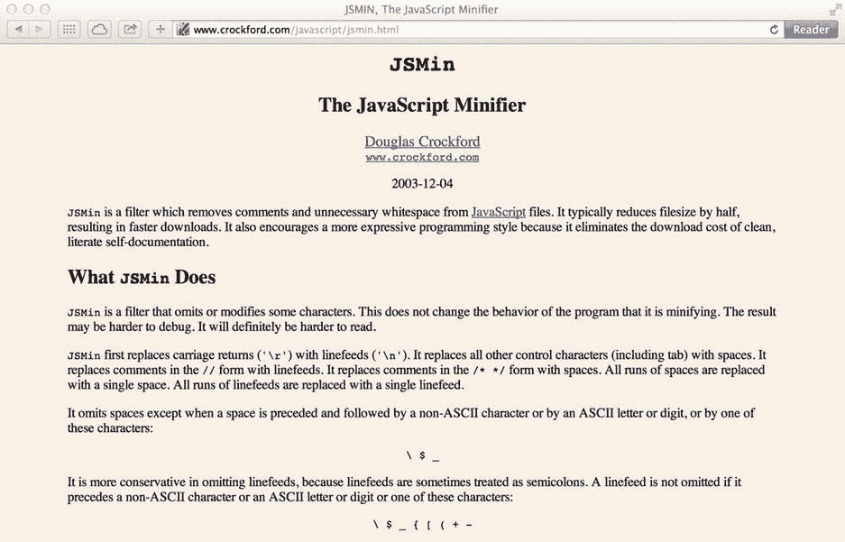
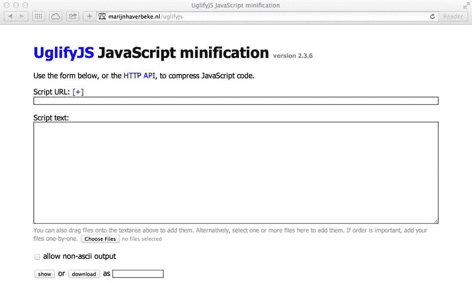
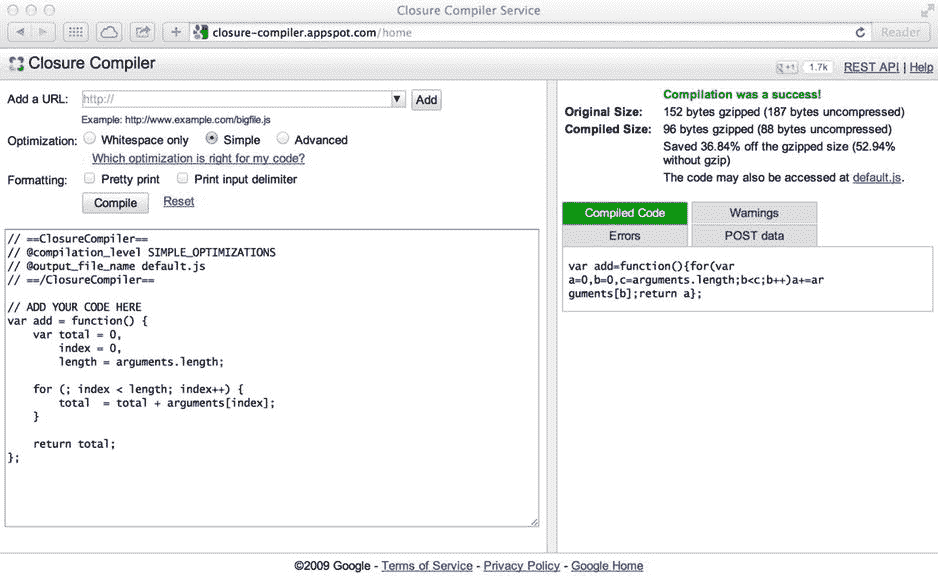

# 四、提升 JavaScript 性能

在这一章中，我们将看看如何通过编码技巧、技术、最佳实践和现代 API 来提高 JavaScript 应用的性能。我从整体上看待性能，这意味着我考虑了整个应用的生命周期。这意味着，我认为，应用的感知性能可以通过更快、更高效的 JavaScript 文件加载，以及更高效的调用、选择器，甚至通过 CSS 和 HTML 优化来提高，而不是仅仅关注执行的代码行数。然而，在这一章中，我们将特别关注如何利用 JavaScript 代码和文件来提高网站和应用的性能。如果你想了解更多关于提高页面渲染性能的信息，可以看看 Addy Osmani 关于这个主题的优秀案例研究，题为“通过 [`http://bit.ly/gone_60`](http://bit.ly/gone_60) 以每秒 60 帧的速度消失”。

## 改善页面加载时间

在我们开始修改任何 JavaScript 代码以提高应用的性能之前，我们需要查看浏览器与 JavaScript 代码的第一次接触，这是通过 HTML ``

`</body>`

`</html>`

清单 4-31 中的代码显示了一个简单的 HTML 页面，包含一个由`image`的`id`引用的图像，允许 JavaScript 轻松定位这个 DOM 元素。然后页面加载清单 4-32 中包含的 JavaScript 代码，如下所示。

清单 4-32。JavaScript 文件来启动图像处理

`// Create a <canvas> element dynamically in JavaScript and get a reference to its`

`// 2d drawing context`

`var canvas = document.createElement("canvas"),`

`context = canvas.getContext("2d"),`

`// Get a reference to the image on the page`

`img = document.getElementById("image");`

`// Define a function to process the image data`

`function processImage() {`

`// Store the image width and height to avoid looking them up each time`

`var imgWidth = img.width,`

`imgHeight = img.height,`

`// Define a new web worker, using the code from the 'Listing4-33.js' file`

`workerThread = new Worker("Listing4-33.js");`

`// Set the new <canvas> element's dimensions to match that of the image`

`canvas.width = imgWidth;`

`canvas.height = imgHeight;`

`// Copy the image to the canvas, starting in the top-left corner`

`context.drawImage(img, 0, 0, imgWidth, imgHeight);`

`// Define the code to execute once a message is received from the web worker, which`

`// will be fired once the image data has been processed`

`workerThread.addEventListener("message", function(e) {`

`// Get the image data sent in the message from the event's data property`

`var imageData = e.data;`

`// Push the new image pixel data to the canvas, starting in the top-left corner`

`context.putImageData(imageData, 0, 0);`

`// Now add the resulting <canvas> element to the page. By performing all the necessary`

`// canvas actions before it's added to the page, we avoid the need for the browser to`

`// repaint the canvas element as we added and then replaced the image displayed on it`

`document.body.appendChild(canvas);`

`}, false);`

`// Kick off the web worker, sending it the raw image data displayed on the canvas`

`workerThread.postMessage(context.getImageData(0,0, imgWidth, imgHeight));`

`}`

`// Execute the processImage function once the image has finished loading`

`img.addEventListener("load", processImage, false);`

清单 4-32 中的代码获取了一个对页面上图像的引用，一旦它被加载，就决定了它的宽度和高度，用来创建一个类似大小的`<canvas>`元素。然后提取原始图像像素数据，并使用清单 4-33 中的代码创建一个 web worker 对象。使用工作线程对象的`postMessage()`方法，像素数据被发送到工作线程，工作线程处理数据。一旦处理完成，worker 调用它自己的`self.postMessage()`方法，该方法是通过调用脚本的`message`事件监听器接收的，在将元素最终添加到页面之前，返回的、经过处理的图像数据被绘制到`<canvas>`元素上。

清单 4-33。Web worker 处理图像—反转其颜色

`// Call the invertImage method when this worker receives a message from the calling script.`

`// The 'self' object contains the only methods a web worker can access apart from those it`

`// defines and creates itself`

`self.addEventListener("message", invertImage, false);`

`// Define a function to take an image and invert it, pixel by pixel, using its raw data`

`function invertImage(e) {`

`// The 'data' property of the 'message' event contains the pixel data passed from`

`// the calling script`

`var message = e.data,`

`// The 'data' property of the message passed contains the raw image pixel data`

`imagePixels = message.data,`

`x = 0,`

`len = imagePixels.length;`

`// Loop through each pixel, inverting its value within the original pixel data array.`

`// Pixel data is arranged in groups of 4 values, representing the red, green, blue, and`

`// opacity values of each visible screen pixel. We therefore loop through in jumps of 4`

`// on each iteration`

`for (; x < len; x += 4) {`

`// To invert a pixel's value, subtract it from the maximum possible value, which is 255`

`imagePixels[x] = 255 - imagePixels[x];`

`imagePixels[x + 1] = 255 - imagePixels[x + 1];`

`imagePixels[x + 2] = 255 - imagePixels[x + 2];`

`}`

`// Finally, post a message containing the updated pixel data back to the calling script`

`self.postMessage(message);`

`}`

该图像处理操作的结果如图 [4-4](#Fig4) 所示，原始图像在左边，由 web worker 处理并绘制成`<canvas>`元素的反转图像在右边。

图 4-4。

Using a web worker and `<canvas>` to invert an image

## 基本性能测量

在这一章中，我们已经研究了很多提高 JavaScript 应用性能的技术，但是由于没有测量性能的方法，我们只能依靠自己的感觉来判断性能是否有所提高。

测量一段代码执行速度的最简单的方法是通过测量计算机时钟在代码执行开始和结束之间的差异来计时，如清单 4-34 所示。

清单 4-34。测量一个函数执行的时间

`// Define variables to calculate the time taken to execute the function`

`var startTime,`

`endTime,`

`duration;`

`// Function to execute which we wish to measure`

`function doSomething() {`

`var index = 0,`

`length = 10000000,`

`counter = 0;`

`for (; index < length; index++) {`

`counter += index;`

`}`

`}`

`// Set the initial time to be the current date/time at this exact point, just before execution`

`// of the function`

`startTime = new Date();`

`// Execute the function`

`doSomething();`

`// Set the end time to be the current date/time just after execution`

`endTime = new Date();`

`// The time taken is the end time minus the first time, with both represented in milliseconds,`

`// the most precise measurement we have with JavaScript times`

`duration = endTime.getTime() - startTime.getTime();`

`alert(duration); // Took ∼700 ms on my machine`

因为 JavaScript date 对象只表示低至毫秒级别的时间，所以使用这种技术我们无法获得任何更精确的度量。在第 14 章的[中，我们将看到`console.time()`，一种更精确的 JavaScript 代码测量形式，使用大多数浏览器内置的开发工具。](14.html)

## 摘要

在这一章中，我们研究了可以用来提高 JavaScript 代码性能的技巧和技术，从脚本文件的初始加载，到处理 DOM 元素和事件，再到处理数组和字符串以提高性能的最佳方式。最后，我们讨论了如何将密集型代码任务卸载到单独的操作系统线程，以便在后台执行大量繁重操作的同时保持用户界面的响应，以及一种测量 JavaScript 代码性能的简单方法。关于 JavaScript 性能的主题，可能还有成千上万的技巧可以写，但是在大多数情况下，实现本章中详细介绍的技巧将会显著提高应用的性能。

在下一章中，我们将探讨 JavaScript 设计模式，解决某些代码问题的常用方法，以及如何组织您的代码，使其易于您和其他开发人员理解。