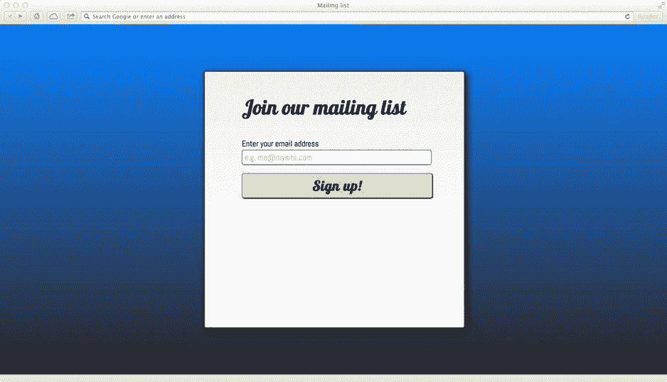
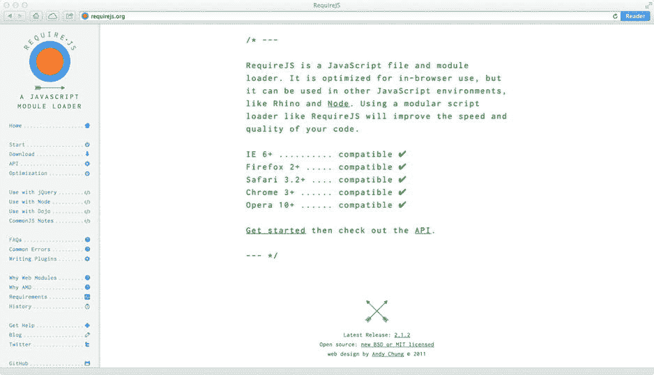
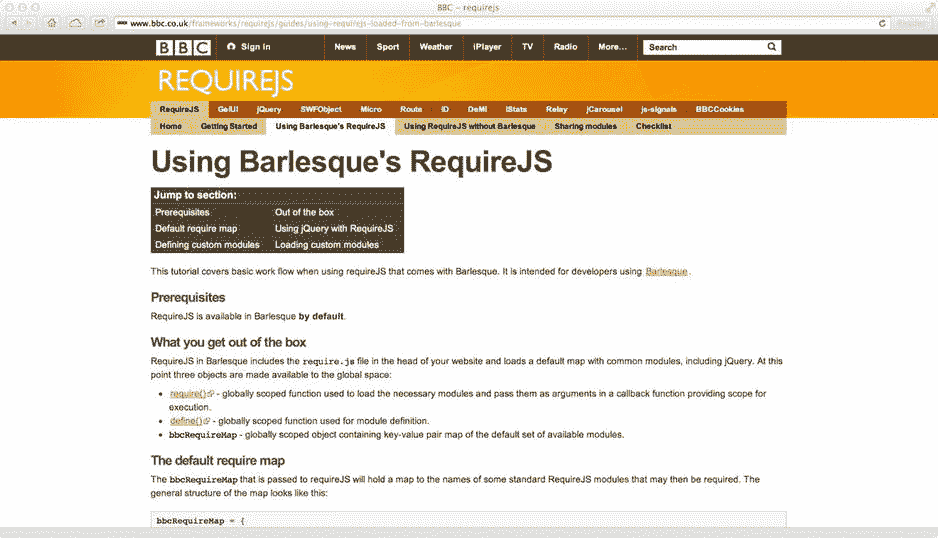

# 9.管理代码文件依赖项

随着时间一年一年地过去，我们开发人员进一步踏入了一个充满 JavaScript 的网站和应用的勇敢新世界。使用 jQuery 之类的代码库、AngularJS ( [`http://angularjs.org`](http://angularjs.org/) )、Backbone ( [`http://backbonejs.org`](http://backbonejs.org/) )或 Ember ( [`http://emberjs.com`](http://emberjs.com/) )之类的框架，以及许多其他高质量、可重用的插件，可以简化 JavaScript 开发的核心方面，使我们能够构建更丰富的用户体验，既实用又有趣。

我们添加到解决方案中的每个额外的 JavaScript 文件都会带来额外的复杂性，特别是我们如何管理该文件与代码库中其余 JavaScript 文件的关系。我们可以在一个文件中编写一些代码，使用一个单独文件中的 jQuery 插件与我们的页面进行交互，这反过来依赖于 jQuery 的存在和从另一个文件中加载。随着解决方案规模的增长，文件之间可能的连接数也在增长。我们说，任何需要另一个文件才能正常运行的 JavaScript 文件都依赖于该文件。

大多数情况下，我们以线性和手动的方式管理我们的依赖关系。在 HTML 文件的末尾，在结束的`</body>`标记之前，我们通常按顺序列出 JavaScript 文件，从最普通的库和框架文件开始，一直到最特定于应用的文件，确保每个文件都列在它的依赖项之后，这样在试图访问其他尚未加载的脚本文件中定义的变量时就不会出现错误。随着我们的解决方案中文件数量的增长，这种依赖关系管理的方法变得越来越难以维护，特别是如果您希望在不影响依赖它的任何其他代码的情况下删除一个文件。

## 使用 RequireJS 管理代码文件依赖项

我们显然需要一种比这更健壮的方法来管理大型网站和应用中的依赖关系。在这一章中，我将解释如何使用 RequireJS 更好地管理您的代码文件依赖性，这是一个 JavaScript 模块加载器，旨在解决这个问题，它具有按需异步脚本文件加载的额外优势，这是我们在第 4 章中提到的一种提高网站性能的方法。

RequireJS 库基于异步模块定义(AMD) API ( [`http://bit.ly/amd_api`](http://bit.ly/amd_api) )，这是一种定义代码块及其依赖关系的跨语言统一方式，在行业中获得了很大的吸引力，并在 BBC、Hallmark、Etsy 和 Instagram 等网站上实现。

为了演示如何将 RequireJS 合并到一个应用中，让我们从清单 9-1 所示的简单的索引 HTML 页面开始，它包含一个非常基本的表单，当提交时，会将一个电子邮件地址发布到一个单独的感谢页面，如清单 9-2 所示。清单 9-3 中的代码显示了应用于这个演示页面的 CSS 样式，我们将把它存储在一个名为`main.css`的文件中。我们使用了谷歌字体( [`http://bit.ly/g_fonts`](http://bit.ly/g_fonts) )中的字体龙虾和亚伯。

清单 9-1。主演示页面的 HTML 代码，包含一个向邮件列表添加电子邮件的表单

`<!doctype html>`

`<html>`

`<head>`

`<meta charset="utf-8">`

`<title>Mailing list</title>`

`<link href="`[`http://fonts.googleapis.com/css?family=Lobster|Abel`](http://fonts.googleapis.com/css?family=Lobster%7cAbel)T2】

`<link rel="stylesheet" href="Listing9-3.css">`

`</head>`

`<body>`

`<form action="Listing9-2.html" id="form" method="post">`

`<h1>Join our mailing list</h1>`

`<label for="email">Enter your email address</label>`

`<input type="text" name="email" id="email" placeholder="e.g. me@mysite.com">`

`<input type="submit" value="Sign up">`

`</form>`

`</body>`

`</html>`

清单 9-2。提交电子邮件地址后，HTML 感谢页面将用户导向

`<!doctype html>`

`<html>`

`<head>`

`<meta charset="utf-8">`

`<title>Thank you</title>`

`<link href="`[`http://fonts.googleapis.com/css?family=Lobster|Abel`](http://fonts.googleapis.com/css?family=Lobster%7CAbel)T2】

`<link rel="stylesheet" href="Listing9-3.css">`

`</head>`

`<body>`

`
`

`<h1>Thank you</h1>`

`
Thank you for joining our mailing list.
`

`
`

`</body>`

`</html>`

清单 9-3。应用于清单 9-1 和清单 9-2 中 HTML 页面的 CSS 样式规则

`html,`

`body {`

`height: 100%;`

`}`

`body {`

`font-size: 62.5%;`

`margin: 0;`

`background: #32534D;`

`background-image: -webkit-gradient(linear, 0% 0%, 0% 100%, from(#1a82f7), to(#2F2727));`

`background-image: -webkit-linear-gradient(top, #1a82f7, #2F2727);`

`background-image: -moz-linear-gradient(top, #1a82f7, #2F2727);`

`background-image: -ms-linear-gradient(top, #1a82f7, #2F2727);`

`background-image: -o-linear-gradient(top, #1a82f7, #2F2727);`

`}`

`body,`

`input {`

`font-family: "Lobster", sans-serif;`

`}`

`h1 {`

`font-size: 4.4em;`

`letter-spacing: -1px;`

`padding-bottom: 0.25em;`

`}`

`form,`

`.card {`

`position: absolute;`

`top: 100px;`

`bottom: 100px;`

`min-height: 250px;`

`left: 50%;`

`margin-left: -280px;`

`width: 400px;`

`padding: 20px 80px 80px;`

`border: 2px solid #333;`

`border-radius: 5px;`

`box-shadow: 5px 5px 15px #000;`

`background: #fff;`

`background-image: -webkit-gradient(linear, 0% 0%, 0% 100%, from(#eee), to(#fff));`

`background-image: -webkit-linear-gradient(top, #eee, #fff);`

`background-image: -moz-linear-gradient(top, #eee, #fff);`

`background-image: -ms-linear-gradient(top, #eee, #fff);`

`background-image: -o-linear-gradient(top, #eee, #fff);`

`}`

`label,`

`input,`

`p {`

`display: block;`

`font-size: 1.8em;`

`width: 100%;`

`}`

`label,`

`input[type=email],`

`p {`

`font-family: "Abel", cursive;`

`}`

`input {`

`margin-bottom: 1em;`

`border: 1px solid #42261B;`

`border-radius: 5px;`

`padding: 0.25em;`

`}`

`input[type=submit] {`

`background: #dda;`

`color: #000;`

`font-weight: bold;`

`width: 103%;`

`font-size: 3em;`

`margin: 0;`

`box-shadow: 1px 1px 2px #000;`

`}`

`.error {`

`border: 1px solid #f99;`

`background: #fff5f5;`

`}`

运行到目前为止我们已经拥有的代码，产生如图 [9-1](#Fig1) 所示的页面布局。

图 9-1。

The final page we’re building represents a newsletter sign-up form, which will only submit if the e-mail address provided is in a valid format

在我们编写任何 JavaScript 代码之前，我们将从项目主页的 [`http://bit.ly/require_dl`](http://bit.ly/require_dl) 下载一份 RequireJS。在撰写本文时，该库的当前版本是 2.1.9，它在所有主流 web 浏览器中都受到支持，包括 Internet Explorer 6、Firefox 2、Safari 3.2、Chrome 3 和 Opera 10。

现在，在我们将 RequireJS 添加到页面之前，我们需要回顾一下我们的应用需要哪些 JavaScript 文件，并将它们组织到适当的文件夹结构中。我们将从主应用脚本文件开始，该文件使用 jQuery 监听 HTML 表单上的提交事件，并在发生时执行表单验证，只有在没有错误的情况下才允许表单继续提交。因此，除了 RequireJS 库之外，我们还有三个 JavaScript 文件，如表 [9-1](#Tab1) 所示。

表 9-1。

The three JavaScript files used in our project, in addition to RequireJS

<colgroup><col> <col></colgroup> 
| 文件名 | 描述 |
| --- | --- |
| `jquery-1.10.2.js` | jQuery 库的最新版本，用于访问和操作页面上的 DOM 元素 |
| `validation-plugin.js` | 作为 jQuery 插件的表单验证脚本 |
| `main.js` | 主应用脚本文件 |

让我们将这些文件与 RequireJS 和项目的其余文件一起整理到一个合理的文件夹结构中，如图 [9-3](#Fig3) 所示，第三方脚本和插件一起分组到`scripts`文件夹中一个名为`lib`的子文件夹中。

图 9-3。

Folder structure for our RequireJS-based project

图 9-2。

The RequireJS homepage at requirejs.org contains the library files plus plenty of documentation

## 加载和初始化要求

让我们借此机会在我们的 HTML 页面上加载并设置 RequireJS，方法是在清单 9-1 中的 HTML 页面的末尾添加一个``

注意，在我们的`data-main`属性中，当引用任何带有 RequireJS 的文件时，可以排除`.js`文件扩展名，因为默认情况下它采用这个扩展名。

具有特定用途或行为的可重用代码块(称为模块)由 RequireJS 使用其内置的`define()`函数定义，该函数遵循此处所示的模式，具有三个输入参数，分别命名模块、定义其依赖项和包含模块代码本身:

`define(`

`moduleName,   // optional, defaults to name of file if parameter is not present`

`dependencies, // optional array listing this file's dependencies`

`function(parameters) {`

`// Function to execute once dependencies have been loaded`

`// parameters contain return values from the dependencies`

`}`

`);`

图 9-4。

The BBC is a proponent of RequireJS and has its own documentation site for their developers to refer to when building JavaScript modules

在对`define()`的调用中所需要的只是一个包含要执行的模块代码的函数。通常，我们会为代码库中的每个模块创建一个单独的文件，默认情况下，模块名称会在 RequireJS 中通过其文件名来标识。如果您的模块依赖于其他代码文件才能正常运行(例如，一个 jQuery 插件需要 jQuery)，您应该在传递给`define()`的数组中列出这些所谓的依赖关系，放在包含模块代码的函数参数之前。在这个数组中使用的名称通常对应于依赖项的文件名，这些依赖项相对于 RequireJS 库文件本身的位置。在我们的项目中，如果我们想将 jQuery 库作为另一个模块的依赖项列出，我们可以将它包含在依赖项数组中，如清单 9-4 所示。

清单 9-4。定义依赖于 jQuery 的模块

`define(["lib/jquery-1.10.2"], function($) {`

`// Module code to execute once jQuery is loaded goes here. The jQuery library`

`// is manifest through the first parameter to this function, here named $`

`});`

回想一下，我们不需要指定文件扩展名`.js`,所以在数组参数中列出依赖项时，我们不考虑这个。顺便提一下，jQuery 的最新版本包含使用`define()`函数将自己注册为模块的代码，如果这个函数出现在页面上，那么我们不需要编写任何特殊的代码来将 jQuery 库转换为我们需要的格式，以便与 RequireJS 一起使用。其他库可能需要一些初始设置才能与 RequireJS 一起使用。通过 [`http://bit.ly/require_shim`](http://bit.ly/require_shim) 阅读关于创建在这种情况下使用的垫片的文档部分。

依赖代码文件提供的任何返回值都通过输入参数传递给模块的函数，如清单 9-4 所示。只有传递给该函数的这些参数才应该在该模块中使用，以便正确地封装代码及其依赖项。这也有轻微的性能优势，因为 JavaScript 访问函数范围内的局部变量比提升到周围的范围以解析变量名和值要快。我们现在有了一种方法来整理我们的模块代码和它所依赖的代码之间的关系，正是这种关系告诉 RequireJS 在执行模块功能之前加载对我们的模块功能至关重要的所有代码。

## 对模块名称使用别名

jQuery 开发团队有一个惯例，用它所代表的发布版本号来命名它的库文件；这里我们使用的是版本`1.10.2`。如果我们在多个文件中大量引用 jQuery 作为依赖项，那么如果我们希望在以后更新我们站点中使用的 jQuery 版本，我们就会给自己制造一个维护问题。我们必须使用 jQuery 作为依赖项对所有这些文件进行修改，以匹配包含更新版本号的新文件名。幸运的是，RequireJS 允许我们通过为某些模块定义替代别名来解决这个问题；我们能够创建一个映射到我们的版本化文件名的单个模块名别名，这样我们就可以在我们的文件中使用该名称来代替直接文件名。这是在 RequireJS 配置对象中设置的。让我们从清单 9-5 所示的代码开始我们的主应用脚本文件(`main.js`)，为 jQuery 创建这个模块别名到文件名的映射。

清单 9-5。通过创建到 jQuery 的别名映射开始主应用脚本文件

`requirejs.config({`

`paths: {`

`"jquery": "lib/jquery-1.10.2"`

`}`

`});`

我们现在可以在模块的依赖数组中使用模块名`jquery`而不是它的文件名，这将映射到 jQuery 的指定版本。

## 内容交付网络和回退

许多开发人员更喜欢参考来自 web 上众多全球内容交付网络(CDN)之一的 jQuery 或其他流行库的副本。在适当的条件下，这将减少下载文件所需的时间，并增加文件可能已经缓存在用户机器上的可能性，如果他们以前访问过从同一 CDN 加载相同版本的 jQuery 的另一个网站。

RequireJS 允许您通过使用依赖关系数组中的 URL 来链接到托管在其他域上的模块，但是我们可以使用前面配置 jQuery 时使用的配置设置来简化外部文件依赖关系的管理。我们将用一个新的代码片段替换最后一个代码片段，以引用来自 Google CDN 的 jQuery，同时仍然允许它在外部文件加载失败时回退到文件的本地版本。我们可以在配置对象中使用一个数组来链接回退脚本列表，如清单 9-6 所示。

清单 9-6。一个有两个可能位置的模块，一个在第一个没有加载的情况下用作后备

`requirejs.config({`

`paths: {`

`"jquery": [`

`"`[`https://ajax.googleapis.com/ajax/libs/jquery/1.10.2/jquery.min`](https://ajax.googleapis.com/ajax/libs/jquery/1.10.2/jquery.min)T2】

`// If the CDN fails, load from this local file instead`

`"lib/jquery-1.10.2"`

`]`

`}`

`});`

## 创建模块

现在我们已经有了文件结构，并需要在页面上加载和配置，是时候考虑应用中的文件是如何相互依赖的了。我们已经确定我们的主应用脚本依赖于 jQuery，以便设置表单提交处理程序和验证脚本来验证表单。因为验证脚本将作为 jQuery 插件构建，所以它也依赖于 jQuery。我们可以用表 [9-2](#Tab2) 中的表格来描述这些依赖关系。

表 9-2。

The code file dependencies for each script in our project

<colgroup><col> <col></colgroup> 
| 脚本文件 | 属国 |
| --- | --- |
| 框架 | 没有依赖关系 |
| 验证外挂程式 | 仅 jQuery |
| 主应用脚本 | jQuery 和验证插件 |

我们现在可以在`validation-plugin.js`文件中为我们的验证 jQuery 插件模块编写代码，指定 jQuery 作为它唯一的依赖项。该模块检查给定字段的值是否是电子邮件地址的典型格式，如果是有效的电子邮件地址，则返回 true，否则返回 false，如清单 9-7 所示。

清单 9-7。作为 jQuery 验证插件的 RequireJS 模块

`define(["jquery"], function($) {`

`$.fn.isValidEmail = function() {`

`var isValid = true,`

`// Regular expression that matches if one or more non-whitespace characters are`

`// followed by an @ symbol, followed by one or more non-whitespace characters,`

`// followed by a dot (.) character, and finally followed by one or more non-`

`// whitespace characters`

`regEx = /\S+@\S+\.\S+/;`

`this.each(function() {`

`if (!regEx.test(this.value)) {`

`isValid = false;`

`}`

`});`

`return isValid;`

`};`

`});`

我们在对`define()`函数的调用中省略了可选的模块名参数，所以模块将用相对于 RequireJS 位置的文件名注册。它可以在其他依赖关系中被模块名`lib/validation-plugin`引用。

现在我们已经建立了依赖关系，是时候完成主应用脚本文件中的代码了。这里我们不打算使用`define()`函数；相反，我们将使用 RequireJS 的`require()`函数和 AMD API。这两种方法具有相同的模式，但是它们的使用方式不同。前者用于声明模块以备后用，而后者用于加载依赖项以便立即执行，而无需从中创建可重用的模块。后一种情况适合我们的主应用脚本，它将只执行一次。

在我们的`main.js`文件中的配置代码下面，我们需要声明附加到 HTML 表单提交事件的代码，如清单 9-8 所示，使用我们新的 jQuery 插件脚本执行验证，如果提供的电子邮件地址有效，允许表单提交。

清单 9-8。添加到我们项目的主应用脚本中，将页面连接到我们的模块

`require(["jquery", "lib/validation-plugin"], function($) {`

`var $form = $("#form"),`

`$email = $("#email");`

`$form.on("submit", function(e) {`

`e.preventDefault();`

`if ($email.isValidEmail()) {`

`$form.get(0).submit();`

`} else {`

`$email.addClass("error").focus();`

`}`

`});`

`$email.on("keyup", function() {`

`$email.removeClass("error");`

`});`

`});`

当清单 9-8 中的代码在清单 9-1 中登录页面的上下文中的浏览器中执行时，jQuery 库将首先被加载，然后是我们的验证插件模块。您还记得，当我们定义验证模块时，我们指定它也依赖于 jQuery。RequireJS 的一个很棒的特性是，如果它遇到一个已经被引用的依赖项，它将使用内存中存储的值，而不是再次下载它，这允许我们正确地定义我们的代码文件依赖项，而不会影响下载的数据量。

一旦加载了依赖项，就执行该函数，并将依赖项的任何返回值作为参数传递。因为我们将验证器模块定义为一个 jQuery 插件，所以我们没有指定返回值；和其他插件一样，它将被添加到 jQuery `$`变量中。

## 按需加载附加脚本

我们可以扩展我们的代码，以利用 RequireJS 可以在您的应用中需要 JavaScript 依赖项的时候按需加载这些依赖项。我们不需要在页面加载时立即加载验证插件(就像我们现在做的)，我们只需要在用户提交表单时加载插件并使其可用。通过减少最初请求页面时下载的数据量和执行的代码量，转移到更高效的按需脚本模型，卸载该脚本的负载将提高页面加载性能。

RequireJS 允许我们在希望下载额外的依赖项时简单地调用`require()`函数。我们可以重写我们的主应用脚本，在初始页面加载时删除对验证插件的依赖，并在用户试图提交表单时将其添加到页面中。如果用户从未提交表单，则不会加载该文件。我在清单 9-9 所示的主应用脚本的更新代码中突出显示了对`require()`函数的额外调用。

清单 9-9。更新了主应用脚本，以便在需要时按需加载验证插件

`require(["jquery"], function($) {`

`var $form = $("#form"),`

`$email = $("#email");`

`$form.on("submit", function(e) {`

`e.preventDefault();`

`require(["lib/validation-plugin"], function() {`

`if ($email.isValidEmail()) {`

`$form.get(0).submit();`

`} else {`

`$email.addClass("error").focus();`

`}`

`});`

`});`

`$email.on("keyup", function() {`

`$email.removeClass("error");`

`});`

`});`

当用户试图使用这个更新的脚本提交表单时，会加载验证器插件并尝试验证。如果用户第二次尝试验证，那么验证器插件已经被加载，所以不会再被下载。图 [9-5](#Fig5) 显示了加载到页面上的脚本的瀑布时间表。第二条垂直线表示页面已经完全加载，而最右边的小圆点表示验证插件脚本加载的时间，此时用户与表单进行交互，从而减少了页面准备使用之前加载的数据量。

图 9-5。

RequireJS supports the loading of JavaScript files dynamically on demand as needed by your application, reducing the number of HTTP requests on page load

当然，表单提交可能要等到文件下载后才会发生，所以如果插件脚本是一个大文件，这可能会影响页面的响应。如果您愿意，您可以通过在用户第一次关注表单中的文本字段时下载验证器插件来抵消这种影响。这应该给浏览器足够的时间来下载插件文件，以便它为用户提交表单做好准备。

## RequireJS 代码优化工具

如果您在开发设置中运行构建工具，或者在编码后打包代码用于部署，您可以利用 [`http://requirejs.org`](http://requirejs.org/) 提供的 RequireJS 优化工具。这结合了相关的脚本，并使用 UglifyJS 或 Google Closure 编译器对它们进行了精简，我们在第 3 章的[中提到过。](03.html)

优化器被构建为在 Java 或 NodeJS 上运行(首选，因为它运行得更快)，因此它可以从命令行或通过自动化工具运行。它研究应用中列出的、与 JavaScript 文件中每个模块相关联的依赖项，并将总是一起使用的依赖项文件合并到一个文件中，动态更新文件中的依赖项列表以进行匹配。这使得代码执行时的 HTTP 请求更少，从而在不改变开发中使用的原始代码的情况下改善了最终用户的体验。

如果您想了解更多关于 RequireJS 优化工具的信息，请通过 [`http://bit.ly/require_opt`](http://bit.ly/require_opt) 查看文档和示例。

## 所需的附加插件

RequireJS 通过将插件脚本与 RequireJS 一起放在 scripts 文件夹中来支持其自身功能的扩展。表 [9-3](#Tab3) 显示了我遇到的一组优秀插件，你可能希望考虑在你的应用中使用它们。

表 9-3。

Plugins for RequireJS

<colgroup><col> <col></colgroup> 
| 插件 | 描述 |
| --- | --- |
| 詹姆斯·伯克的 i18n | 用于应用中文本本地化的插件。通过创建以 ISO 语言环境命名的文件，并且每个文件都包含一个表示 web 应用中与该特定语言和国家相关的文本字符串的相似对象，您可以配置 RequireJS 只加载与用户当前查看的站点的语言环境版本相关的文件。可通过 [`http://bit.ly/req_i18n`](http://bit.ly/req_i18n) 在线获得 |
| 詹姆斯·伯克的文本 | 允许将任何基于文本的文件作为依赖项加载进来(默认情况下，只加载脚本文件)。任何列出的带有模块名前缀`text!`的依赖项将使用 XmlHttpRequest (XHR)加载，并作为代表文件全部内容的字符串传递给模块。这对于从外部文件加载固定的 HTML 标记块以便在您自己的模块中呈现或处理非常方便。可通过 [`http://bit.ly/req_text`](http://bit.ly/req_text) 在线获得 |
| 米勒·梅德罗斯字体 | 允许您通过 Google 的 WebFont Loader API 加载字体，将您需要的字体指定为前缀为字符串`font!`的依赖项。可通过 [`http://bit.ly/req_font`](http://bit.ly/req_font) 在线获得 |
| 亚历克斯·塞顿设计的车把 | 插件加载到`handlebars.js`模板文件中作为模块中的依赖项。返回的模板参数是一个函数，您可以将数据传递给它，也可以将它作为一个依赖项加载进来。执行该函数的结果是一个 HTML 字符串，然后将它注入到页面中。访问 [`http://handlebarsjs.com`](http://handlebarsjs.com/) 了解更多关于车把模板库的信息。可通过 [`http://bit.ly/req_handle`](http://bit.ly/req_handle) 在线获得 |
| 由 Jens Arps 缓存 | 默认情况下，RequireJS 会在加载后将模块存储在内存中，如果发生页面刷新，会再次下载模块。有了这个插件，任何加载的模块都将存储在浏览器的`localStorage`中，并在随后的页面刷新时从那里加载，以减少页面刷新时的 HTTP 请求数量。可通过 [`http://bit.ly/req_cache`](http://bit.ly/req_cache) 在线获得 |

如果你看到你觉得缺少的功能或者没有达到标准(或者你只是想冒险)，你可以通过使用 RequireJS 插件 API 编写你自己的插件，详情通过 [`http://bit.ly/req_plugin`](http://bit.ly/req_plugin) 。

## 要求的替代方案 j

尽管 RequireJS 是浏览器中管理代码依赖关系最常用的库，但它不是唯一可用的选项。因为每一个都是基于 AMD 规范的，所以表 [9-4](#Tab4) 中显示的每一个备选方案都以相似的方式工作，所以，只要稍加协调，它们就可以相互替换使用。

表 9-4。

Browser-based module loaders

<colgroup><col> <col></colgroup> 
| 图书馆 | 统一资源定位器 |
| --- | --- |
| BDLoad | [T2`http://bdframework.org/bdLoad/`](http://bdframework.org/bdLoad/) |
| 狭谷 | [T2`https://github.com/requirejs/cajon`](https://github.com/requirejs/cajon) |
| 卷发 | [T2`https://github.com/cujojs/curl`](https://github.com/cujojs/curl) |
| LoaderJS | [T2`https://github.com/pinf/loader-js`](https://github.com/pinf/loader-js) |
| 要求的 | [T2`http://requirejs.org`](http://requirejs.org/) |
| UMD | [T2`https://github.com/umdjs/umd`](https://github.com/umdjs/umd) |
| Yabble | [T2`https://github.com/jbrantly/yabble`](https://github.com/jbrantly/yabble) |

## 摘要

在这一章中，我已经向你介绍了如何构建一个简单的页面，这个页面使用 RequireJS 来简化代码文件依赖关系的管理，并允许将脚本文件的加载延迟到需要的时候。这种方法不仅使管理不断增长的代码变得更加容易，还允许您通过只在需要的时候加载所需的代码来提高 web 应用的性能。

RequireJS 的能力甚至超过了我在这一章中提到的。我鼓励您通读库主页上的文档:了解如何使用许多有用的配置选项，如何为模块提供替代名称，如何直接从 JSONP web 服务加载和存储数据，以及如何同时加载和管理同一模块的多个版本(以及许多其他功能)。

这种代码依赖管理和脚本文件加载的方法是当今世界中新兴的行业最佳实践，在这个世界中，网站和应用的 JavaScript 代码库不断增长。我全心全意地鼓励你更多地了解这种方法，并在你自己的网站中采用它，为你自己获得好处。

在下一章中，我们将介绍与移动设备相关的 JavaScript 开发，包括以最小的内存占用充分利用您的代码的技术，以及学习如何处理来自当今市场上许多智能手机和平板设备上的传感器的输入。