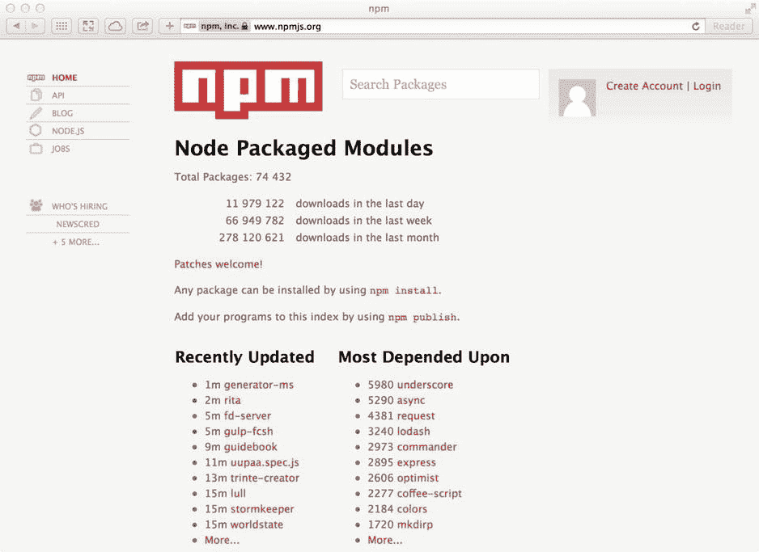
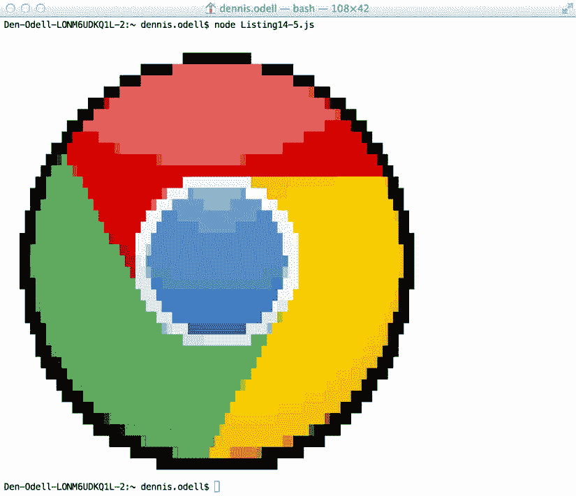
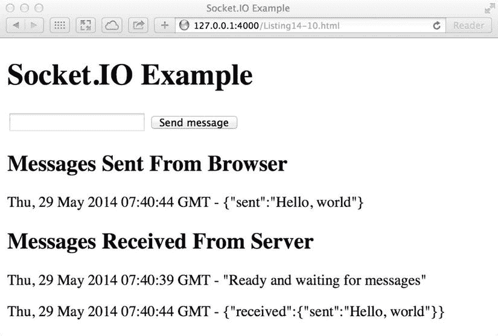

# 14.Node.js 应用平台

在这一章中，我们将有意远离运行在浏览器中的客户端 JavaScript 代码，转而走向服务器端领域，仔细研究一个名为 Node.js 的应用平台，它是由 JavaScript 开发人员设计的，也是为他们设计的。

Note

JavaScript 在服务器端有历史。JavaScript 在产品中的首次使用实际上根本不是在 web 浏览器中；它位于 1994 年发布的服务器产品 Netscape Enterprise Server 中，在该产品中，它作为一种为 HTTP 应用编写服务器端行为的语言。

Node.js 最初是由它的创造者 Ryan Dahl 在 2011 年发布的，这是他构建一个允许开发人员构建轻量级、可扩展的命令行或网络应用的应用平台的愿景的高潮。它基于谷歌 V8 JavaScript 引擎( [`http://bit.ly/google-v8`](http://bit.ly/google-v8) )，这是一个虚拟机，也用于谷歌的 Chrome 浏览器中解析和执行 JavaScript。就像浏览器中的 JavaScript 一样，应用是围绕基于异步事件的模型构建的，这意味着代码应该高效运行，并且看起来为专业 JavaScript 开发人员所熟悉。Node.js 对开发人员的吸引力很大一部分在于，它是为在 Microsoft Windows、Mac OS X、Linux 和 SunOS 操作系统上运行而构建的，这使它成为一个有用的平台，可以交付跨平台运行的命令行应用，而不需要任何额外的开发步骤。因为 Node.js 项目的最初目标之一是允许开发人员轻松地构建支持服务器推送功能的应用，所以很多注意力都集中在它的异步事件驱动 I/O(输入/输出)系统上，与其他一些应用平台不同，该系统不会导致主应用进程在等待写入或读取数据时暂停。这使得它非常适合运行能够处理大量并发连接的可伸缩 web 服务器，以及运行服务器端代码来支持在连接的 web 浏览器中运行的应用或网站。要了解 Node.js 成为现在这个样子背后的技术原因，请查看该项目的网站上的以下页面: [`http://bit.ly/about-node`](http://bit.ly/about-node) 。

## 安装 Node.js

Node.js 可以在 [`http://nodejs.org`](http://nodejs.org/) 从项目主页下载安装包进行安装，如图 [14-1](#Fig1) 所示。按照说明安装节点系统本身(在编写本文时，当前版本是 v0.10.29)和节点包管理器工具(`npm`)，我们将在本章后面更详细地介绍它。

图 14-1。

The Node.js homepage

现在在您的机器上全局安装了`node`命令行工具，您可以导航到包含为 Node.js 编写的合适 JavaScript 应用文件的任何文件夹，并通过执行以下命令来运行它，将`filename.js`替换为要运行的 JavaScript 文件的名称:

`node filename.js`

## 编写 Node.js 应用

让我们通过创建一个基本示例来演示平台的功能和特性，从而熟悉 Node.js 应用的编写。首先，让我们编写世界上最简单的 Node.js 应用，它在命令行窗口中显示`Hello, World`。代码只有一行，如清单 14-1 所示。

清单 14-1。Hello World Node.js 应用

`console.log("Hello, World");`

将它保存到名为`Listing14-1.js`的文件中，并在命令行上用以下命令执行它:

`node Listing14-1.js`

从命令行运行这个新应用会产生如图 [14-2](#Fig2) 所示的输出。完成后，应用将停止运行，并将控制权返回给命令行光标，以执行您希望执行的下一个命令。

图 14-2。

Running the Hello World application

### 控制台

Node.js 本机`console`对象包含将不同类型的消息写出到命令行的方法，`log()`方法是其中最基本的方法——当以这种方式运行时，传递给它的任何字符串、数字、数组或基本对象都将被写出到命令行。通过 [`http://bit.ly/nodejs_console_api`](http://bit.ly/nodejs_console_api) `.`阅读更多关于 API 文档中`console`方法的信息

如果您希望编写一个可以在命令行上传递参数的命令行应用，您可以使用`process.argv`数组，该数组包含在命令行上使用的每个参数，以调用`node`本身和要执行的文件名开始。清单 14-2 中的代码显示了一个简单的应用，它将传递给它的每个参数重复到命令行中。将这段代码保存到一个名为`Listing14-2.js`的文件中。

清单 14-2。访问命令行参数

`var index = 2,`

`length = process.argv.length;`

`// We start from index 2 as the first two arguments are node itself and the filename`

`// we are executing`

`for (; index < length; index++) {`

`console.log(process.argv[index]);`

`}`

在命令行上执行下面的命令来运行清单 14-2 中的代码，向应用传递参数。这产生了如图 [14-3](#Fig3) 所示的结果。

`node Listing14-2.js one 2 three`

图 14-3。

Repeating command line arguments back to the user

有关`process.argv`数组的更多信息，请查看位于 [`http://bit.ly/nodejs_argv`](http://bit.ly/nodejs_argv) `.`的在线 API 文档

### 加载模块

在[第 9 章](09.html)中，我们介绍了异步模块定义(AMD)和 JavaScript 库，它们允许使用名为`require()`的全局方法以清晰和描述性的方式加载文件依赖关系。Node.js 支持 AMD 和开箱即用的`require()`方法，这是处理文件依赖关系加载的首选方式。

为了使 Node.js 保持一个精简的环境，许多不重要的行为包在默认情况下不会被加载，必须作为依赖项专门列出才能被加载。假设您只列出了应用代码中需要的依赖项，这可以确保加载的代码是您实际需要的代码，从而保持最佳性能。

#### http 模块

Node.js 通常被用作一个网络环境，更具体地说，是一个 web 服务器，其精简、简单的方法非常适合它。您显式地包含了减少其他服务器产品中常见的膨胀所需的行为。Node.js' `http`模块依赖包含启动简单 web 服务器所需的方法。清单 14-3 展示了这一点，在一个给定的端口号上创建一个本地 web 服务器，当通过 web 浏览器访问时，它将`Hello, World`作为 HTML 写出到请求浏览器的窗口。

清单 14-3。一个简单的 Node.js web 服务器

`// Define a dependency on the Node.js "http" module which contains methods to allow the`

`// creation of a simple HTTP web server`

`var http = require("http"),`

`// Define a variable to represent our HTTP server`

`server,`

`// Define a constant to represent the HTTP status code for an OK response`

`HTTP_OK = 200,`

`// Define a port number to listen for requests on`

`PORT = 8000;`

`// Call the http.createServer() method to spin up a web server, defining the response to send`

`// to the calling HTTP application (usually a web browser) based on the request received. Here`

`// we ignore the request received (which would contain the URL requested and any data sent`

`// with the request, for example cookie or POST data) and simply respond with a single chunk`

`// of HTML to read "Hello, World" for any request received (try different URLs to prove this).`

`// The callback function passed to the method will be executed once for each request received`

`// at the time it is received, asynchronously.`

`server = http.createServer(``function`T2】

`// Send a HTTP header to the requesting browser to indicate a successful HTTP response`

`// and defining the response body data will be sent as HTML text`

`response.writeHead(HTTP_OK, {`

`"Content-Type": "text/html"`

`});`

`// Send the HTML response`

`response.write("<h1>Hello, World</h1>\n");`

`// Close the connection - without this, the HTTP server will expect to continue to send`

`// more data to the browser, the connection to the server would be kept open unnecessarily,`

`// wasting server resources and potentially preventing others from connecting to that same`

`// server, depending on demand. The end() method tells the connection that we're done`

`// sending our response data. If we knew we were only going to send one string of data and`

`// then close the connection, we could actually pass that string to the response.end()`

`// method, which would call the write() method for us internally in that case`

`response.end();`

`});`

`// The final step is to tell our new web server to start listening for requests on a specific`

`// socket port number. The host name by default will be` `http://localhost` `or` [`http://127.0.0.1`](http://127.0.0.1/)

`// since we are running the application locally on our development machine. The listen() method`

`// is different to many others in that it keeps the Node.js application running - if it didn't`

`// we would no longer be able to listen for requests. You can manually stop the application on`

`// the command line by typing Ctrl+X (Microsoft Windows) or Command-X (Mac OS X) which will`

`// stop the web server from listening on this port`

`server.listen(PORT);`

`// Output a message to the command line to instruct the user that the web server is running`

`// and what address they need to browse in order to view the defined response`

`console.log("Now try browsing`[`http://127.0.0.1`](http://127.0.0.1:8000/)T2】

将清单保存到一个名为`Listing14-3.js`的文件中，并在命令行中执行以下命令来启动简单的 web 服务器。

`node Listing14-3.js`

当执行时，清单 14-3 中的代码将在命令行上产生如图 [14-4](#Fig4) 所示的响应。当在 web 浏览器中访问 URL [`http://127.0.0.1:8000`](http://127.0.0.1:8000/) 时，会输出如图 [14-5](#Fig5) 所示的响应。请注意，您可以在主机名的末尾添加任何额外的路径或查询字符串值，服务器每次都会用完全相同的 HTML 数据进行响应。在这一章的后面，我们将看到 web 服务器框架，它允许我们更容易地创建 web 服务器，以适当地响应不同的路径和查询字符串值。

要了解关于`http`模块的更多信息，请通过 [`http://bit.ly/nodejs_http`](http://bit.ly/nodejs_http) 访问特定的 Node.js API 文档。

图 14-5。

Visiting the simple web server’s URL in a browser outputs “Hello, World” in HTML

图 14-4。

Starting up a simple Node.js web server

现在，我们已经看到了如何创建一个运行在命令行上的简单应用，以及另一个通过 HTTP 打开与连接的 web 浏览器的通信通道的应用，这是任何 web 服务器的基础，也是我们希望编写的任何服务器端代码的基础。要了解更多关于其他可用的低级模块的信息，请访问完整的 API 文档站点。ly/ nodejs_ apidocs 。

## Node.js 包

Node.js 与 Node Package Manager ( `npm`)捆绑在一起，这是一个独立的命令行应用，允许第三方模块(称为包)直接在命令行上作为应用加载和使用，或者作为 Node.js 应用中的代码依赖项来添加额外的功能。在 [`http://npmjs.org`](http://npmjs.org/) 可以在线找到可用套餐的目录，如图 [14-6](#Fig6) 所示，在这里可以搜索你感兴趣的套餐或套餐类型。

图 14-6。

The list of Node.js packaged modules at [`http://npmjs.org`](http://npmjs.org/)

从这个列表安装应用就像在命令行上运行命令`npm install`一样简单，后面跟着目录中列出的包名；例如，要安装 YUIDoc 命令行工具(我们在第二章的[中看到过)用于当前目录，执行以下命令:](02.html)

`npm install yuidocjs`

当这个命令运行时，你会看到一个响应写到命令行，如图 [14-7](#Fig7) 所示，因为这个工具使用 HTTP 下载请求的包及其依赖项。安装完成后，我们可以使用当前文件夹中安装的`yuidoc`应用。你会注意到在当前文件夹中出现了一个`node_modules`文件夹，这是默认位置，`npm`存储所请求的应用的文件和依赖关系，所以请确保不要删除它。

图 14-7。

Installing a package from `npm`on the command line

我们希望能够从我们机器上的任何文件夹中访问某些应用，并且`npm`允许您在安装包时使用`-g`全局选项来实现这一点。Mac 和 Linux 用户可能会发现，他们需要在命令前加上`sudo`，以此方式授予管理员用户全局安装包的权限:

`npm install -g yuidocjs`

一旦全局安装完毕，`yuidoc`应用就可以从你机器上的任何文件夹中运行。

每个 Node.js 包在其根文件夹中都包含一个`package.json`数据文件，该文件包含描述包的结构化元数据。该文件列出了项目的内部包名，该名称不得与 NPM 目录中使用的另一个名称相同，并且必须是 URL 友好的(例如，不包含空格)，以及语义版本化格式的版本号，在 [`http://semver.org`](http://semver.org/) 在线描述，例如`1.0.1`。正是这个文件还列出了项目的依赖项，以便这些依赖项可以随包一起安装。

命令行工具`npm`包含代表您创建一个`package.json`文件来回答几个问题的能力。要在当前目录中创建文件，只需在命令行中执行以下命令:

`npm init`

清单 14-4 显示了一个示例文件`package.json`,它包含了一些公共属性。请注意，在任何应用中使用任何 JSON 格式文件之前，都应该删除注释。

清单 14-4。与`npm`一起使用的示例`package.json`文件

`{`

`// The "name" value is mandatory and must be URL-friendly so cannot contain any spaces`

`// and should be in lower case`

`"name": "my-test-project",`

`// The "version" value is mandatory and must adhere to the semantic versioning format`

`"version": "0.0.1",`

`// An optional friendly description of the project to assist users when searching the npm`

`// directory`

`"description": "This is my test project",`

`// A pointer to the project's homepage online - many use this field to point to the`

`// GitHub (or equivalent hosting service) code repository page`

`"homepage": "`[`https://github.com/denodell/my-test-project`](https://github.com/denodell/my-test-project)T2】

`// Details of the code repository which other developers may find useful if they wish`

`// to contribute to the project`

`"repository": {`

`// The type of repository, e.g. "git" (for Git) or "svn" (for Subversion)`

`"type": "git",`

`// The URL of the repository itself, designed for direct use with software and should`

`// not be a link to the project home page`

`"url": "`[`https://github.com/denodell/my-test-project.git`](https://github.com/denodell/my-test-project.git)T2】

`},`

`// Details of the project author, if there is only one. For multiple authors, this key`

`// name should be changed to "contributors" and its value will be an array of names and`

`// email addresses of those who have worked on the project`

`"author": {`

`"name": "Den Odell",`

`"email": "denodell@me.com"`

`},`

`// List of package dependencies needed to run the project described by this file. Each is`

`// listed by its package name as it is in the npm directory and the version number of the`

`// dependency needed. By specifying the version, we can ensure that future breaking updates`

`// to dependent packages won't impact our package`

`"dependencies": {`

`// Specify the exact version number of the dependency required by using its full`

`// version number`

`"async": "0.9.0",`

`// Versions greater than or equal to specific releases can be specified using >=`

`"request": ">=2.36.0",`

`// Versions reasonably close to a given release can be specific using tilde (∼).`

`// Here, this means any version between 1.6.0 and any future release up to but not`

`// including the next major release (i.e. 1.7.0 in this case)`

`"underscore": "∼1.6.0",`

`// Git URLs can be used in place of version numbers to reference dependencies that`

`// are stored in places outside of the npm directory. The latest contents of the repo`

`// will be downloaded when this package is installed`

`"promise-the-earth": "git+ssh://github.com/denodell/promise-the-earth.git"`

`},`

`// List of additional package dependencies required for developers who wish to contribute`

`// to this project. Often this list includes development build tools, code quality checks`

`// and unit test runners`

`"devDependencies": {`

`"yuidocjs": "∼0.3.50"`

`}`

`}`

欲了解关于`package.` `n`文件的更多信息，并阅读关于`dependencies`和`devDependencies`部分的不同设置，请阅读位于 [`http://bit.ly/package_json`](http://bit.ly/package_json) 的在线文档。

如果您的机器上有一个包含`package.json`文件的本地项目，您可以通过在命令行上导航到该文件夹并执行以下命令来安装该项目及其所有必需的依赖项:

`npm install`

这与我们之前看到的使用命令的行为是一样的，除了省略了包名之外，`npm`工具将查看它运行所在的本地文件夹来发现项目的设置和依赖项。

如果您想将依赖项添加到您的项目中，并在您的`package.json`文件中自动添加对它的引用，您可以通过将`--save`选项添加到通常的 install 命令中来实现，这将把引用添加到包文件的`dependencies`部分并下载该包，例如:

`npm install yuidocjs --save`

要将依赖关系保存到`devDependencies`部分，请使用`--save-dev`选项:

`npm install jshint --save-dev`

如果您已经编写了一个项目，并希望将自己发布到`npm`供其他人用作其项目的依赖项，您只需在包含您的`package.json`文件的项目目录中运行以下命令，将它推送到该目录，使其可供任何其他开发人员使用:

`npm publish`

一旦有了`package.json`文件，并在项目运行之前运行了`npm install`下载了所有项目的依赖项，就可以使用`require()`方法从 Node.js 应用中访问依赖项。假设您有一个`package.json`文件，包含下面的`dependencies`部分，该部分引用了`npm`目录中的`request`和`picture-tube`包:

`"dependencies": {`

`"request": "∼2.36.0",`

`"picture-tube": "∼0.0.4"`

`}`

然后，通过使用`require()`，这些包可以作为应用 JavaScript 文件中的依赖项被引用，如清单 14-5 所示。

清单 14-5。在 Node.js 应用中引用依赖包

`// Reference a dependency on the "request" package, a simple HTTP request client`

`var request = require("request"),`

`// Reference a dependency on the "picture-tube" package, allowing 256 color images to be`

`// rendered out to the command line`

`pictureTube = require("picture-tube"),`

`// Reference an online image URL (PNG format only) to render to the command line`

`imageUrl = "`[`http://upload.wikimedia.org/wikipedia/commons/8/87/Google_Chrome_icon_(2011).png`](http://upload.wikimedia.org/wikipedia/commons/8/87/Google_Chrome_icon_(2011).png)T2】

`// Make a request to download the image URL, then use the Node.js Stream API to "pipe" the`

`// data through the "picture-tube" package to create command line codes representing the image.`

`// Finally pipe the output of that process out to the command line, represented by the`

`// process.stdout stream`

`request(imageUrl).pipe(pictureTube()).pipe(process.stdout);`

安装 depdendencies，然后在命令行上执行清单 14-5 中的代码，结果如图 [14-8](#Fig8) 所示。如您所见，依赖关系的使用允许用相对较少的代码编写高级应用。在撰写本文时，`npm`目录包含超过 85，000 个包，并且每天都在增加，所以我鼓励您在组装自己的应用以保存他人已经编写的重写代码时，先看看这里。

图 14-8。

Referencing dependencies allows us to draw simple images to the command line with very little code

## 将 Node.js 应用拆分为多个文件

到目前为止，在这一章中，我们已经讨论过的应用的类型是简单的，并且，除了它们的依赖关系之外，它们自包含在一个文件中。然而，Node.js 确实支持将一个较大的应用分割成多个文件，然后可以使用`require()`方法相互引用。假设我们有一个名为`app.js`的主应用文件和一个名为`utility.js`的第二个文件，它们位于同一个文件夹中，我们希望在其中存储一些在应用中使用的实用方法。我们可以使用下面的`require()`方法从主应用文件中引用实用程序文件。注意，为了表示这是一个文件，而不是通过`npm`加载的外部依赖项，我们指定了文件夹名和文件名(文件夹名`./`表示与当前文件相同的文件夹)。我们可以排除文件扩展名`.js`，因为这是假设的:

`var utlity = require("./utility");`

然而，在我们可以使用实用程序方法之前，我们需要指定我们的`utility.js`文件中的哪些方法是可公开访问的，因此可以在该文件之外使用。为此，我们使用 Node.js `module.exports`属性，该属性对于每个文件都是本地的，并将我们希望从文件外部可用的方法和属性设置到该属性。我们可以看到清单 14-6 中的`utility.js`文件的简单实现。

清单 14-6。导出用于 Node.js 应用中其他文件的属性和方法

`// Define a function which converts a text string to camel case, with an uppercase letter at`

`// the start of each word`

`function toCamelCase(inputString) {`

`return inputString.replace(/\s+[a-z]/g, function(firstLetter) {`

`return firstLetter.toUpperCase();`

`});`

`}`

`// Define a function which converts a text string from camel case to hyphens, where all letters`

`// become lowercase, and spaces replaced with hyphens`

`function toHyphens(inputString) {`

`return inputString.replace(/\s+([A-Z])/g, '-$1').toLowerCase();`

`}`

`// Export two public methods to any referenced file, toCamelCase(), which internally references`

`// the function of the same name, and toHyphens() which does the same`

`module.exports = {`

`toCamelCase: toCamelCase,`

`toHyphens: toHyphens`

`};`

从清单 14-6 导出的方法，代表我们的`utility.js`文件，可以在我们的主应用文件中使用，如清单 14-7 所示。通过将 JSON 文件名传递给`require()`，观察如何将 JSON 格式文件中的数据作为 JavaScript 对象直接导入 Node.js 应用。

清单 14-7。在 Node.js 应用中使用从单独文件导出的方法

`// Reference our exported utility methods the utility.js file`

`var utility = require("./utility"),`

`// Load the data from our comment-free package.json file (see Listing 14-4)`

`pkg = require("./package.json"),`

`// Use the exported utility method toCamelCase() to convert the description text from the`

`// package.json file into camel case`

`camelCaseDescription = utility.toCamelCase(pkg.description),`

`// Use the utility method toHyphens() to convert the camel case description into a`

`// lower case hyphenated form`

`hyphensDescription = utility.toHyphens(camelCaseDescription);`

`// Write out the description of the package to the command line in its different forms`

`console.log(camelCaseDescription); // outputs: "This Is My Test Project"`

`console.log(hyphensDescription); // outputs: "this-is-my-test-project"`

我们可以使用`module.exports`导出任何类型的标准 JavaScript 数据，包括函数、对象、字符串、数字、日期和数组，然后可以直接在它们的引用文件中使用。要了解 Node.js 中模块的更多信息，请通过 [`http://bit.ly/nodejs_modules`](http://bit.ly/nodejs_modules) 在线查看 API 文档。

## Web 应用的 Node.js 框架

既然我们已经了解了用 JavaScript 编写 Node.js 应用的基础知识，那么让我们来看看一些旨在帮助编写可伸缩的 web 应用的服务器端的框架。请务必阅读每种框架的文档，以确保使用正确的框架来满足您自己的项目需求。

### 表达

最流行的 Node.js web 框架之一是 Express，它简化了设置 web 服务器的过程，该服务器能够使用任何类型的 HTTP 方法(例如 GET 或 POST)来响应对不同 URL 的请求。然后可以用 JavaScript 为每个 URL 编写所需的行为，例如，简单地用 HTML 页面响应，或者处理提交的表单数据。清单 14-8 中的代码展示了一个使用 Express 框架配置的简单 web 服务器，展示了如何响应 HTTP GET 和 POST 方法到不同的 URL。它利用了 Sencha Labs 的 Connect 中间件，该中间件设计用于 Node.js 中的 web 服务器框架，以添加对常见操作的支持，如访问 cookie 数据、解码 HTTP POST 数据和 Gzip 压缩。要了解更多关于连接中间件库的信息，请查看位于 [`http://bit.ly/nodejs_connect`](http://bit.ly/nodejs_connect) 的在线文档。

清单 14-8。使用 Express 框架的简单 Node.js web 服务器

`// Reference the Express framework through the "express" npm package dependency. Ensure`

`// you have a package.json file referencing this dependency`

`var express = require("express"),`

`// Reference the "connect" package which provides a set of middleware for use with other`

`// web server Node.js packages, including Express`

`connect = require("connect"),`

`// Initialize the framework, making its methods available through the app variable`

`app = express(),`

`// Define the port number we will host our web server on`

`PORT = 3000;`

`// The Express use() method allows a piece of middleware to be connected up to the current`

`// server. Here we``connect`T2】

`app.use(connect.bodyParser());`

`// The express.static() middleware allows the contents of a particular directory on the file`

`// system to be made available beneath a particular path name. Here we define a "/assets" path`

`// on our web server which maps to the contents of a "/dist/assets" folder found within the`

`// current directory this application file finds itself in (the __dirname is a Node.js global`

`// variable available to any file. A request to any file within the "/dist/assets" folder can`

`// now be requested, e.g. "/assets/css/styles.css" would return the contents of the file found`

`// at location "/dist/assets/css/styles.css" within the current folder. This is perfect for`

`// serving static files, such as JavaScript CSS, images, and flat HTML required as part of a`

`// web site or application`

`app.use('/assets', express.static(__dirname + "/dist/assets"));`

`// The get() method allows us to respond to a HTTP GET request at a specific URL, in this`

`// case we specify the server root, "/", which will give us our homepage. The callback will`

`// be executed when the given URL is requested using the GET method, passing in the details`

`// of the request in the "request" object, including referer, user agent, and other useful`

`// information. The "response" object contains properties that can be set, and methods that`

`// can be called to alter the output data and headers sent to the requesting browser`

`app.get("/", function(request, response) {`

`// The send() method of the response object allows us the send data to the requesting`

`// browser. This method is smart enough to detect the data type being sent and to adjust`

`// the HTTP response headers accordingly. Here we pass in a string, which is interpreted`

`// as being in HTML format, but if we'd passed in a JavaScript object, this would be`

`// sent as a JSON string to the browser, with the appropriate headers sent. This method`

`// also sets the Content-Length HTTP header according to the length of the data sent,`

`// which informs the browser that there is no more data to be sent back to the browser`

`// besides that passed to the method`

`response.send("<h1>Hello, World</h1>");`

`});`

`// Send a HTML form as a response to a GET request to the URL "/email"`

`app.get("/email", function(request, response) {`

`// Send a HTML form whose action points to the URL "/email" and whose HTTP method is POST.`

`// When the form is submitted, rather than hitting this callback, the callback below will`

`// be called, which is associated specifically with the POST HTTP method. The form here has`

`// one named field, "email", which will be set as the POST data when the form is submitted.`

`response.send("<form method=\"post\" action=\"/email\">\`

`<label for=\"email\">Email address</label>\`

`<input type=\"email\" id=\"email\" name=\"email\" value=\"\">\`

`<input type=\"submit\">\`

`</form>");`

`});`

`// Respond to a HTTP POST of data to the URL "/email", writing out the`

`app.post("/email", function(request, response) {`

`// When the "connect" package is used, and the current Express app is associated with the`

`// bodyParser() middleware method from this package, the request.body property is an object`

`// containing properties that directly correspond to the names of POSTed data values. Since`

`// we posted a form field with the name "email", the request.body.email property contains`

`// the value entered into the form field by that name`

`var email = request.body.email || "";`

`// Show the POSTed email address value within a HTML <h1> tag on the page`

`response.send("<h1>Posted``email`T2】

`});`

`// Just like the listen() method with the "http" package we saw in Listing 14-3, this starts`

`// the process of accepting requests to the web server from a browser on the given port. This`

`// keeps the Node.js application running continuously. If the application is stopped, the`

`// server will no longer be running and won't be able to accept any browser requests`

`app.listen(PORT);`

`// Output a message to the command line to instruct the user that the web server is running`

`console.log("Now try browsing`[`http://127.0.0.1`](http://127.0.0.1:3000/)T2】

清单 14-8 中的代码展示了如何使用 Node.js 的 Express framework 用不到 20 行代码编写一个能够提供静态文件、响应 HTTP GET 和 POST 请求的 web 服务器。在包含这个代码清单的文件夹中，在命令行上运行`npm init`来创建一个基本的`package.json`文件。接下来用以下命令安装依赖项，这也将在`package.json`文件中保存依赖项版本引用:

`npm install express --save`

`npm install connect --save`

现在我们可以在命令行上用下面的命令运行我们的应用(假设您将代码清单保存到一个名为`Listing14-8.js`的文件中):

`npm Listing14-8.js`

要了解更多关于 Express 框架的高级特性，请访问 [`http://bit.ly/nodejs_express_api`](http://bit.ly/nodejs_express_api) `.`查看 API 在线文档

### Socket.IO

尽管 Express framework 非常适合编写使用标准 HTTP 方法(如 GET 和 POST)的强大、可伸缩的 web 服务器应用，但有时您会发现自己想要编写一个实时应用，其中服务器上或浏览器中更新的数据需要立即发送并从其他位置响应，如在聊天消息应用、在线白板或协作游戏体验中。尽管 Ajax 对于这些类型的应用来说是一个相当不错的解决方案，但它只适合定期轮询服务器的数据，服务器无法在新数据可用时通知浏览器有新数据。插座。IO 是一个 web 服务器框架，它在后台使用了许多解决方案，包括 W3C WebSocket API ( [`http://bit.ly/websocket-api`](http://bit.ly/websocket-api) )，所有主流 web 浏览器的最新版本都支持它，包括 Internet Explorer 10 和更高版本，以提供浏览器和服务器之间的双向实时通信。

让我们构建一个简单的应用来演示套接字。IO 框架。我们将创建一个带有单个文本表单字段的 HTML 页面，用于输入消息，当消息被提交时，它将给定的消息发送到服务器，并添加消息以显示在页面上，同时显示当前时间。然后，服务器将立即用一条新消息作出响应，将收到的消息包装在一个对象中，并将其发送回浏览器。然后，浏览器将显示收到的消息和当前时间，这将显示使用 Socket 的服务器的实时响应速度。木卫一不到一秒钟。生成的应用如图 [14-9](#Fig9) 所示，显示了对通过表单提交的`Hello, World`消息的响应。注意每条消息旁边的时间，这表明消息被发送到服务器，并且在不到一秒的时间内再次收到响应。

图 14-9。

A simple Socket.IO application for communicating simple messages in real time with a server

清单 14-9 中的代码显示了 Node.js 服务器应用，它将初始化 web 套接字连接，监听从浏览器客户端发送的消息，并立即用一个新消息响应它们。

清单 14-9。插座。通过浏览器实时交流简单消息的 IO 应用

`// Reference the Express framework through the "express" npm package dependency. Ensure`

`// you have a package.json file referencing this dependency`

`var express = require("express"),`

`// Initialize the framework, making its methods available through the app variable`

`app = express(),`

`// Define a dependency on the Node.js "http" module - required for use with the`

`// Socket.IO framework`

`http = require("http"),`

`// Create a simple web server, ensuring the Express framework handles all the requests by`

`// passing the app variable to the http.createServer() method`

`server = http.createServer(app),`

`// Reference the Socket.IO framework through its "socket.io" npm package dependency.`

`// Ensure this dependency is listed in your package.json file`

`socketIo = require("socket.io"),`

`// Connect the Socket.IO framework up to the web server to piggy back on its connection`

`io = socketIo.listen(server),`

`// Define a port number to listen for requests on`

`PORT = 4000;`

`// Make the contents of the current directory available through our web server so we can`

`// serve up a HTML file`

`app.use("/", express.static(__dirname));`

`// Wait for the Socket.IO connection to the browser to initiate before executing the callback,`

`// passing in a reference to the socket connection`

`io.sockets.on("connection", function(socket) {`

`// Send a message using the emit() method of the socket connection, passing some data to`

`// any connected browser listening for the "new-data-on-server" event sent from the socket`

`socket.emit("new-data-on-server", "Ready and waiting for messages");`

`// When a message named "new-data-on-client" is received from the client, execute the`

`// callback function, passing in the data passed along with the message`

`socket.on("new-data-on-client", function(data) {`

`// Immediate broadcast back out the received message wrapped in a simple JavaScript`

`// object with a property named "received"`

`socket.emit("new-data-on-server", {`

`received: data`

`});`

`});`

`});`

`// Start listening for web requests on the given port number`

`server.listen(PORT);`

`// Output a message to the command line to instruct the user that the web server is running`

`console.log("Now try browsing`[`http://127.0.0.1`](http://127.0.0.1/)T2】

在我们将清单 14-9 中的代码作为 Node.js 应用运行之前，我们需要创建我们的`package.json`文件并安装我们的依赖项。在包含这个代码清单的文件夹中，在命令行上运行`npm init`来创建一个基本的`package.json`文件。接下来用以下命令安装依赖项，这也将在`package.json`文件中保存依赖项版本引用:

`npm install express --save`

`npm install socket.io --save`

现在我们可以在命令行上用下面的命令运行我们的应用(假设您将代码清单保存到一个名为`Listing14-9.js`的文件中):

`npm Listing14-9.js`

接下来，我们需要 HTML 页面的代码，如清单 14-10 所示。该页面将包含一个用于输入消息的表单字段和两个显示区域，以反映发送到服务器的消息和从服务器接收的消息。因为我们的 Node.js web 应用已经被配置为允许通过 web 服务器访问当前文件夹中的任何文件，如果我们将这个文件命名为`Listing14-10.html`，并将其放在与清单 14-9 中的代码清单相同的文件夹中，我们可以通过我们的 web 浏览器导航到 [`http://127.0.0.1:400/Listing14-10.html`](http://127.0.0.1:400/Listing14-10.html) 来访问它。请注意服务器如何自动提供与套接字通信所需的 JavaScript 库。IO 网络服务器通过 URL 路径`/socket.io/socket.io.js`。这简化了编写代码将 HTML 页面连接到 web 服务器的任务。

清单 14-10。用于通过套接字传递实时消息的 HTML 页面。IO web 服务器应用

`<!doctype html>`

`<html>`

`<head>`

`<title>Socket.IO Example</title>`

`<meta charset="utf-8">`

`</head>`

`<body>`

`<h1>Socket.IO Example</h1>`

`<!-- Create a form with a single text field, named "message-field". When the form is`

`submitted, we want to send the field value to the server, and show the message`

`in the 
 element below -->`

`<form method="post" action="/" id="send-message-form">`

`<input type="text" name="message-field" id="message-field">`

`<input type="submit" value="Send message">`

`</form>`

`<!-- Create an element to present messages sent from the browser to the server -->`

`<h2>Messages Sent From Browser</h2>`

`

`

`<!-- Create an element to present messages received from the server -->`

`<h2>Messages Received From Server</h2>`

`

`

`<!-- Load the Socket.IO JavaScript file provided by the server - this is automatically`

`available at this location if Socket.IO is running on the server and provides the`

`necessary web socket connection back to the server. It also supplies the fallback`

`code in case web sockets are not supported by the current browser -->`

``

`<!-- Load the script found in Listing 14-11 to connect the page up to the web socket`

`connection -->`

``

`</body>`

`</html>`

有了我们的 web 服务器和 HTML 页面，我们需要做的就是把它们连接在一起，这就是清单 14-11 中代码的作用，从清单 14-10 中 HTML 页面的底部引用。

清单 14-11。将页面连接到插座。IO web 服务器，用于通信和显示消息

`// This script has a dependency on the "/socket.io/socket.io.js" script provided by the`

`// Socket.IO framework when it is referenced from the web server, which surfaces the global`

`// variable "io"`

`// Establish the web socket connection to the server to enable sending and receiving of`

`// messages`

`var socket = io(),`

`// Get references to the form element and text form field element from the page`

`formElem = document.getElementById("send-message-form"),`

`messageFormFieldElem = document.getElementById("message-field"),`

`// Get references to the empty 
 tags on the page which we will populate with messages`

`// sent to and received from the server`

`messagesSentElem = document.getElementById("messages-sent"),`

`messagesReceivedElem = document.getElementById("messages-received");`

`// Listen for the "new-data-on-server" event sent from the server over the web socket`

`// connection. The callback method will be executed immediately on reception of the message,`

`// passing along the message data sent with the event. We can then append this message to the`

`// current page within the 
 element`

`socket.on("new-data-on-server", function(data) {`

`// Create a new paragraph element`

`var paragraphElem = document.createElement("p");`

`// Populate the new 
 tag with the current time and the message received - use`

`// JSON.stringify() to convert the message from its current type to a string for display`

`paragraphElem.innerHTML = new Date().toUTCString() + " - " + JSON.stringify(data);`

`// Add the message to the 
 element on the page`

`messagesReceivedElem.appendChild(paragraphElem);`

`});`

`// Connect a form handler to the "submit" event of the <form> element to send the message`

`// written in the form field to the server`

`formElem.addEventListener("submit", function(e) {`

`// Define a variable for storing the message to send to the server when the form is`

`// submitted, populating it with the value stored in the form field`

`var message = {`

`sent: messageFormFieldElem.value`

`},`

`// Create a new paragraph element`

`paragraphElem = document.createElement("p");`

`// Prevent the default submit behavior of the <form> element from occurring, to avoid`

`// the page refreshing - we'll send the message data to the server manually`

`e.preventDefault();`

`// Emit a web socket broadcast event to send the message to the server using the event`

`// name "new-data-on-client". The server can then react to this message type as it wishes`

`socket.emit("new-data-on-client", message);`

`// Populate the new 
 tag with the current time and a copy of the sent message - using`

`// JSON.stringify() to convert the message from its current object type to a string for`

`// display`

`paragraphElem.innerHTML = new Date().toUTCString() + " - " + JSON.stringify(message);`

`// Add the message to the 
 element on the page`

`messagesSentElem.appendChild(paragraphElem);`

`// Clear the form field text to allow a new message to be sent`

`messageFormFieldElem.value = "";`

`}, false);`

一起运行清单 14-9 到 14-11 中的代码会产生如图 [14-9](#Fig9) 所示的结果。如果您在多个浏览器窗口中打开页面，您应该会发现在一个窗口中发送和接收的消息与发送到另一个窗口或从另一个窗口接收的消息是分开的。这对于我们在这里讨论的应用来说是理想的；然而，对于其他类型的应用，例如聊天应用或其他需要多个连接用户之间协作的应用，这不是所期望的行为。

对从套接字发送的消息的限制。IO 服务器被包装在`socket.emit()`方法中，该方法用于清单 14-9 中的 web 服务器应用。按原样使用时，消息被本地化到每个单独的浏览器-服务器连接。但是，如果您希望发送一条消息，让任何连接的浏览器(包括发送浏览器)接收，您可以使用`io.emit()`方法，其用法与此相同:

`io.emit("new-data-on-server", "Message Text");`

如果你想发送一个消息到除了一个特定的浏览器之外的所有连接的浏览器，例如，发送消息的浏览器，你可以使用`socket.broadcast.emit()`方法`socket.broadcast.emit()`方法，它发送消息到除了由`socket`对象代表的以外的所有套接字:

`socket.broadcast.emit("new-data-on-server", "Message Text");`

通过创建套接字。IO 应用结合每种类型的`emit()`方法，你能够用少得惊人的代码创建实时多用户连接的在线应用。

了解关于套接字的更多信息。IO 以及如何使用该框架构建特定类型的应用，请通过 [`http://bit.ly/sockdoc`](http://bit.ly/sockdoc) 查看在线文档。

## Node.js 托管

我们已经了解了如何在本地机器上设置和运行 Node.js web 服务器应用，但是在现实世界中，我们无法在本地机器上托管我们的应用。我们需要一个能够在云中运行我们的应用的在线托管解决方案。Joyent 是 Node.js 应用平台的支持者，该公司在 [`http://bit.ly/node_hosting`](http://bit.ly/node_hosting) 在线管理已知主机提供商的最新列表，当您编写好应用并准备就绪时，这可以是一个很好的第一个参考点。许多支持直接从 Git 库部署代码，许多提供免费的基本托管包。一旦你有了一个可以与世界分享的应用，这是一个值得一试的资源。

## 摘要

在本章中，我们已经了解了 Node.js，这是一个应用框架，它允许 JavaScript 开发人员编写命令行应用、web 服务器和服务器端应用。此外，我们还看到了节点包管理器和相关的`npm`工具、`package.json`文件的重要性，以及如何导入相关的代码包用于 Node.js 应用。最后，我们研究了一些流行的框架，以帮助您为标准 HTTP 应用以及现代实时 web 套接字应用编写可伸缩的 web 服务器。

在下一章中，我们将研究一组建立在 Node.js 基础上的自动化工具，您可以将它们应用到您的开发工作流中，使您的日常编码更容易，并且还可以提高您的 JavaScript 的质量。