# 10.在 Windows 应用商店获取你的应用

Abstract

前一章深入探讨了你的应用的货币化。但你还没到那一步。为了让你的应用在 Windows 应用商店中发布，一些管理职责是不容忽视的。注意:你已经完成了与世界分享你的 Windows 8 应用的最后一步。

前一章深入探讨了你的应用的货币化。但你还没到那一步。为了让你的应用在 Windows 应用商店中发布，一些管理职责是不容忽视的。注意:你已经完成了与世界分享你的 Windows 8 应用的最后一步。

作为一名开发人员，在 Windows Store 上下载你的应用可能是旅程中最乏味的部分。但是请放心，遵循前几章提出的指导方针会让你的应用尽可能无缝地被接受发布。本章讨论设置开发者帐户、应用提交、应用跟踪和应用管理。您将了解发布后功能，包括提供销售数据、下载、激活和遥测视图的工具。抓紧了:你就要——你的应用就要——出来了！

## 创建应用包

让我们直接进入 Windows 应用商店提交流程。您熟悉开发人员中心和开发人员仪表板。这就是神奇继续发生的地方——你进入 Windows 应用商店的入口。

若要创建应用包，请在 Visual Studio 2012 的“商店”子菜单中选择“创建应用包”项。如果您选择为 Windows 应用商店构建应用包的选项，系统会提示您使用 Windows 开发人员帐户登录应用商店，您将被定向到“选择应用名称”屏幕。图 [10-1](#Fig1) 显示了 Visual Studio 中的提交应用菜单和子菜单选项。

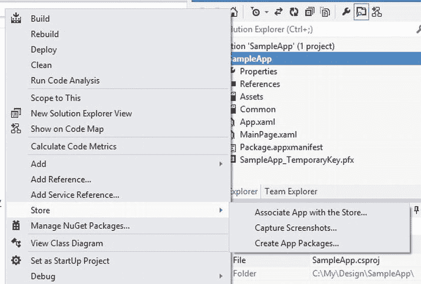

图 10-1。

Visual Studio Submit App drop-down menu and submenu selections

图 [10-2](#Fig2) 显示了选择应用名称屏幕。

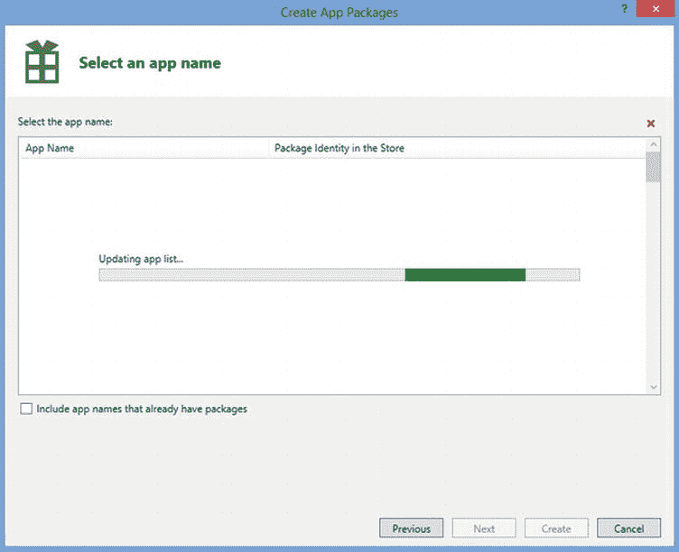

图 10-2。

Visual Studio Select an App Name screen

图 [10-2](#Fig2) 中列出的 Windows 应用商店应用名称是您之前必须通过 Windows 应用商店开发者中心注册的名称。选择其中一个名称会将您正在处理的项目与该特定应用相关联。截至本文撰写之时，您还不能通过 Visual Studio 2012 界面注册应用名称。你将在本章后面了解更多关于注册应用名称的信息；现在，让我们专注于配置您的应用，以便它可以发布到商店。

如果您选择不创建 Windows 应用商店包，则不必登录，但生成的应用包只能安装在开发人员计算机上或支持侧加载的环境中。(侧装是绕过 Windows 商店，直接在 PC 上安装 Windows 8 应用的过程。)点击 Next，你会看到一个 package settings 屏幕，在这里你可以指定包输出位置、版本号和构建配置(见图 [10-3](#Fig3) )。

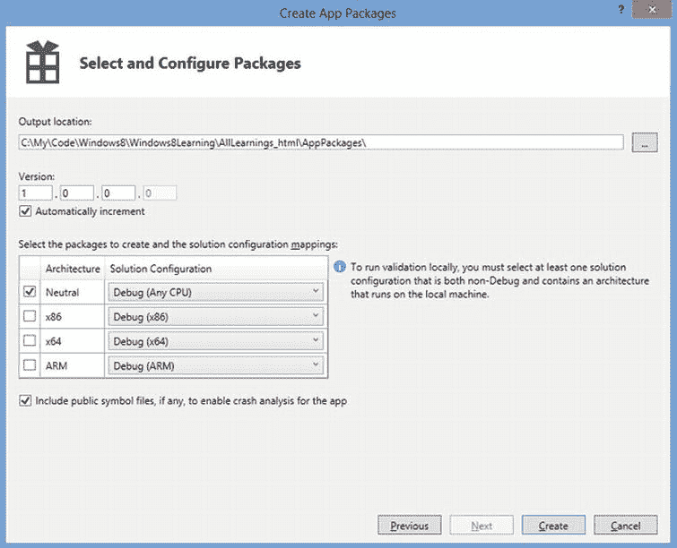

图 10-3。

Package settings screen

应用包使用符合 Windows 8 应用风格指南的`.zip`APPX 打包格式。APPX 包是在您从 Windows 应用商店安装应用时下载到您的计算机上的包，它是您用于提交到 Windows 应用商店的格式。APPX 软件包可以部署为 x86(适用于 32 位操作系统)、x64(适用于 64 位 Windows 8 版本)、ARM(适用于基于 ARM 的平板电脑和 PC，如微软 Surface 和华硕 VivoTab)或 Neutral(适用于所有平台的版本)。

完成应用包创建方式的配置后，单击创建按钮构建包。Visual Studio 将您的项目编译成适当的可执行格式，并将其打包成 APPX(包括证书和包清单)。至此，向导完成。它为您提供了可以找到您创建的包的位置。图 [10-4](#Fig4) 显示了最终屏幕(显示了我机器上所有学习包的路径)。

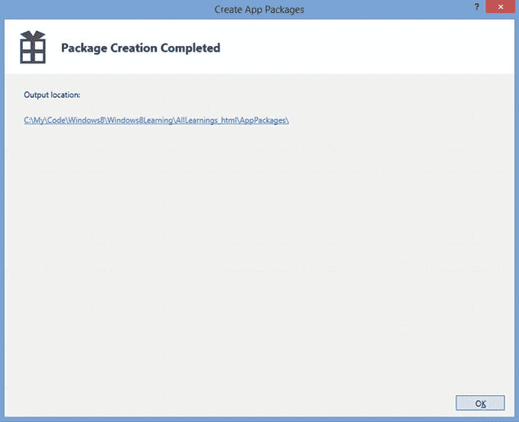

图 10-4。

The wizard’s final screen

## 验证你的应用包

为了让您将应用提交到 Windows 应用商店，它必须满足 Microsoft 确定的特定标准。这确保了 Windows 应用商店中的应用对于最终用户来说是安全的，他们可以在所有目标平台上无缝地安装和工作，没有例外。Microsoft 希望您的应用使用经过批准的标准化 API 外围应用，并遵循与 Windows 应用商店主题相匹配的设计、风格和内容指南。验证内容和样式组件需要人工输入；但作为应用提交过程的一部分，Windows Store 会自动检查应用包，以确定您使用了哪些 API 和编程模式。如果包不满足必要的要求，它不会被接受，并且您不能继续提交过程。

微软提供了一个名为 Windows 应用认证工具包(WACK)的有用的认证工具，它可以在本地运行你的应用，并执行一系列旨在找到常见且容易检测到的应用认证失败的测试。要启动它，只需使用搜索符并输入它的名称。图 [10-5](#Fig5) 显示了 WACK 接口(双关语)。

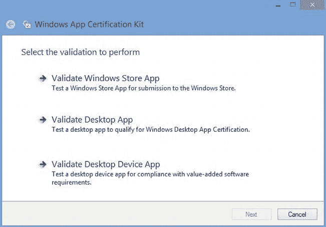

图 10-5。

WACK interface

正如你可能想象的那样，WACK 工具可以帮助你识别和解决应用中的任何问题，否则这些问题会阻止应用提交到 Windows 应用商店。表 [10-1](#Tab1) 列出了 WACK 工具进行的一些测试。

表 10-1。

WACK App Tests

<colgroup><col> <col></colgroup> 
| 试验 | 描述 |
| --- | --- |
| 遵守系统重启消息 | 测试您的应用在收到系统关闭通知时是否尽快退出。 |
| 应用清单策略 | 测试应用清单的内容，以确保其正确无误且格式正确。 |
| 应用清单资源 | 测试应用清单中定义的资源，以确保它们存在并且有效。这包括用适当的图像/字符串来呈现应用的各种状态。 |
| 干净可逆安装 | 确保应用正确安装和卸载，没有残留文件或注册表项。 |
| 兼容性和弹性 | 验证应用没有使用任何 Windows 兼容性修复程序。 |
| 崩溃和挂起 | 通过执行启动、运行和关闭过程来检查应用是否崩溃或挂起。 |
| 调试配置 | 确认应用包是使用发布配置构建的。 |
| 数字签名文件 | 验证有效的数字签名。 |
| 直接 3d 特征级别 | 测试 Microsoft Direct3D 应用，以确保它们可以在所有 Windows 8 图形硬件上运行。 |
| 文件编码 | 确认所有文件编码为 UTF-8。 |
| 安装并写入正确的文件夹 | 确保应用将程序和数据文件写入正确的文件夹。 |
| 表演 | 通过计时应用启动和暂停来确认性能速度。 |
| 支持 Windows 8 商店 API | 确认使用 Windows 8 风格支持的 API。 |
| Windows 安全功能 | 确认没有篡改默认的 Windows 安全保护。 |

WACK 测试要么在后台运行，要么在一个小的应用窗口中运行，这取决于您启动该工具的方式。在 WACK 运行整套测试的几分钟内，您会看到您的应用出现和消失几次。无论你做什么，不要试图在测试期间与你的应用交互，否则你的电脑可能会过热并爆炸。不完全是，但是你的应用将会关闭，你将不能与之互动。一旦 WACK 工具完成测试，就会出现结果屏幕。如果测试失败，WACK tool 报告会传达失败的原因。如果 WACK 测试通过，你可以直接去 Windows 商店继续提交你的应用，或者从结果窗口查看链接的详细报告。

## 提交您的应用

您已经用一个经过验证的应用结束了上一节，您确信可以毫无问题地提交到 App Store。你之所以确定这一点，是因为在尝试提交之前，你使用了 WACK 工具来验证该应用是否符合 Windows 应用商店允许的最低标准。本节介绍了如何使用开发者仪表盘将此经过验证的应用包上传到 Windows 应用商店，以及如何通过提交应用商店认证来完成此过程。

您可以通过导航到 [`http://msdn.microsoft.com/en-US/windows/apps`](http://msdn.microsoft.com/en-US/windows/apps) 来访问 Windows 应用商店开发中心。在那里，你用你的 Windows 应用商店帐户(通常是一个`Hotmail/live/outlook.com`电子邮件地址)登录。图 [10-6](#Fig6) 显示了开发中心登陆页面。

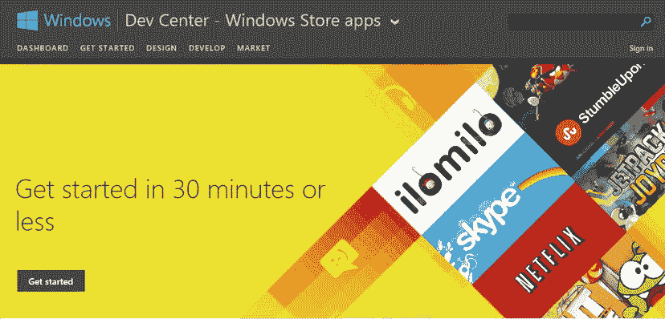

图 10-6。

Dev Center landing page

到目前为止，您所做的一切都不需要您注册任何东西，但您需要一个开发人员帐户来保留应用名称并向 Windows 应用商店提交应用。您可以在以下网站开始注册: [`http://msdn.microsoft.com/en-us/library/windows/apps/jj193592.aspx`](http://msdn.microsoft.com/en-us/library/windows/apps/jj193592.aspx) 。

注册并登录后，单击仪表板链接(如图 [10-6](#Fig6) 所示)将带您进入 Windows 8 应用的 Windows 应用商店仪表板。图 [10-7](#Fig7) 显示了 Windows 应用商店仪表盘。出于隐私原因，登录名(通常出现在屏幕的右上角)和应用列表已被隐藏。

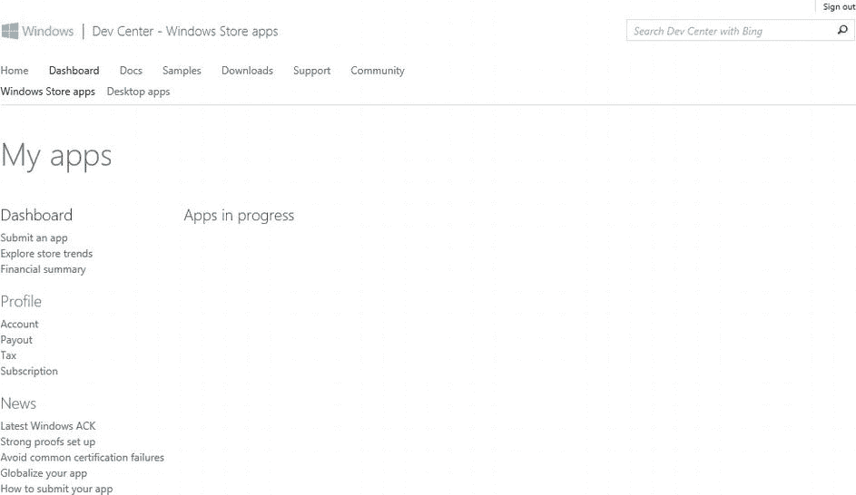

图 10-7。

Windows Store dashboard

向 Windows 应用商店提交应用的主要方式是通过开发中心仪表板中的提交应用链接。单击此链接将进入一个工作流，从为应用命名到提供详细描述。作为提交过程的一部分，你还必须为你的申请提供销售细节——结合你在第 9 章中学到的一切。这意味着不仅要为应用整体定价，还要为应用中的功能定价(应用内优惠包含在该流程的高级功能步骤中)。

作为提交过程的一部分，您还需要提供内容分级信息。这确保了发布到商店的应用可以针对适当的年龄组。你可以指定你的应用使用的任何加密技术，然后通过一个步骤将你的应用上传到商店。如果你的应用已经通过了 WACK 工具的验证，那么这应该是一种形式；否则，这可能会是一个非常令人沮丧的过程，因为运行该工具会增加上传时间。(请注意，应用认证不会在上传过程中进行，而是作为整体提交的一部分在其他任何事情之前运行。)

最后一步，提供你的应用描述，可能看起来微不足道，但它很可能是这个过程中最吸引人的部分(特别是如果你没有一个图形设计师和定义良好的图标)。在这一步中，您不仅要为您的应用提供文本描述，还要包括您正在运行的应用的各种屏幕截图、不同分辨率的宣传图片、隐私政策 URL、电子邮件地址以及更多详细信息。图 [10-8](#Fig8) 显示了提交应用屏幕。

图 10-8。

App submission screen

### 命名您的应用

提交工作流程从命名应用开始。与网络域名一样，应用名称是先到先得的。幸运的是，在应用的世界里，房地产是购买的首选——这与如今的网络域名形成了鲜明的对比。

当你点击应用名称图标或链接时，你会被带到一个简单的屏幕，屏幕上有一个输入框，你可以在其中输入应用的名称(见图 [10-9](#Fig9) )。输入您选择的名称，然后点按“保留应用名称”。如果名称不可用，您会看到一条错误消息。

图 10-9。

Reserving an app name

一旦选定的名称被保留，您有一年的期限来提交您的应用。在那之后，这个名字会回到池中。

### 销售详情

现在，你将进入销售详情页面。图 [10-10](#Fig10) 显示了页面的顶部，在这里你可以选择是将你的应用列为免费还是付费，或者使用基于应用功能/版本的多样化定价，正如在[第 9 章](09.html)中深入讨论的。你还需要提供免费试用的详细信息，以及你想在哪里销售应用的信息。

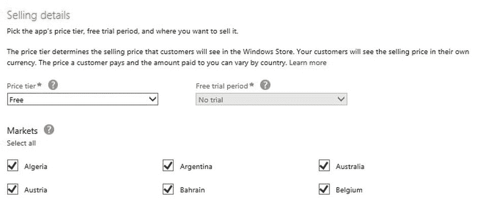

图 10-10。

Upper portion of the Selling Details screen

图 [10-11](#Fig11) 显示了销售详情屏幕的底部。您可以在这里指定您的应用何时发布。您需要提供应用类别和子类别，还需要指定任何硬件要求和辅助功能。

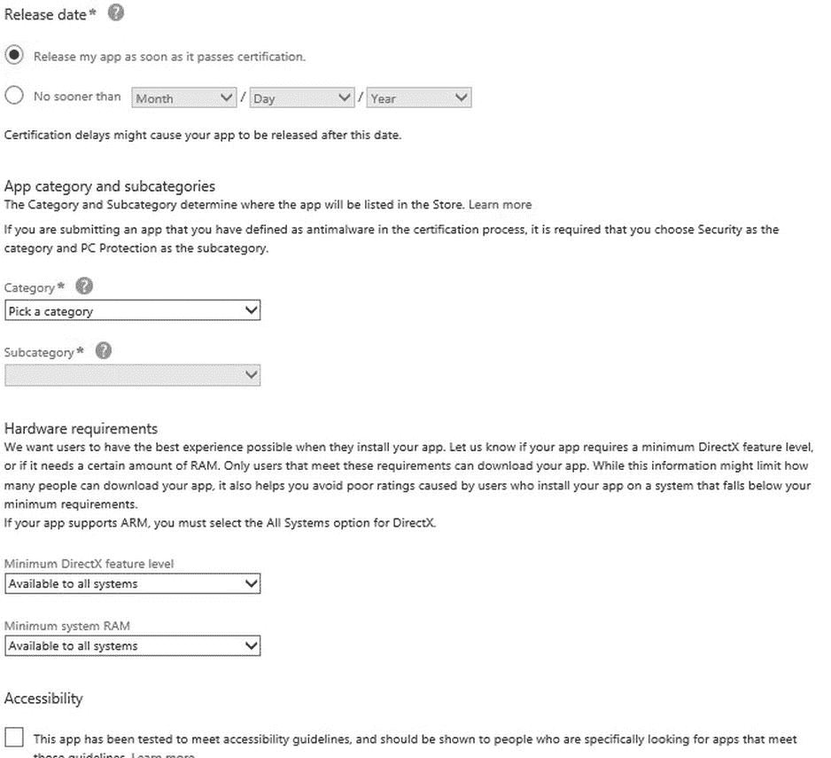

图 10-11。

Lower part of the Selling Details screen

### 高级功能

接下来，系统会提示您指定应用提供的任何高级功能。其中包括背景磁贴更新的推送通知、Live Connect 服务以及将通过 Windows 8 应用提供的任何应用内服务。如果您已经将产品添加到您的应用中(产品是上一章讨论的应用内购买功能的一部分)，您可以在这里指定这些添加内容；它们允许你提供一些功能，用户可以在使用你的应用时购买。图 [10-12](#Fig12) 显示了 Windows 应用商店开发者仪表板的高级功能屏幕。

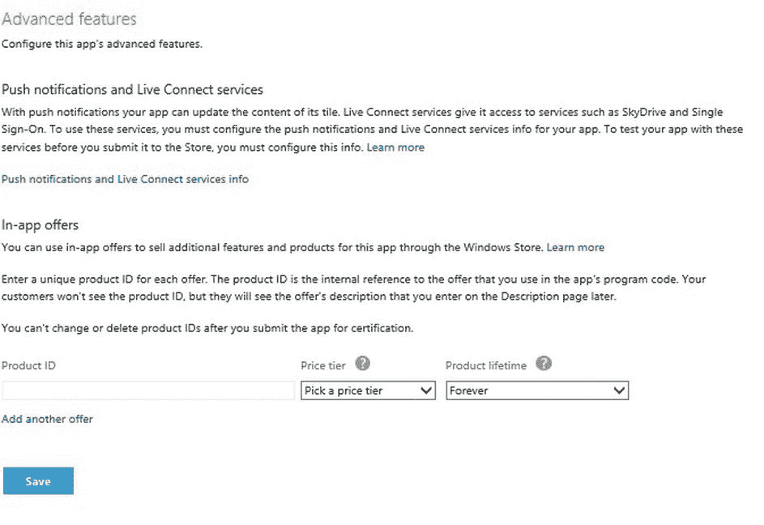

图 10-12。

Advanced Features screen

### 年龄评级和评级证书

接下来，你需要从表 [10-2](#Tab2) 中列出的选项中为你的应用选择一个年龄等级。这些评级是游戏所必需的。然而，即使你的应用不是游戏，如果包含成人内容，最好保持谨慎或保守，并提供评级。这样做将有助于确保你不会仅仅因为没有通过认证而失败。如果您不确定如何对您提供的内容进行分级，我建议使用对所提供的内容有意义的最高年龄分级。(还是那句话，保守有益。)

还要注意的是，对于游戏、在线访问和在线互动等活动，有不同的年龄要求，您可能不会立即意识到这一点(并且可能因国家而异)。例如，尽管社交网络应用本质上是良性的，但它们通常需要更高的评级，因为没有办法完全控制用户最终查看的内容。如果您正在构建这样的应用，如果成人和未成年人之间存在潜在的交互，那么显示明确禁止儿童的警告是很重要的。拥有更高的评级允许父母和监护人限制访问此类应用。

表 10-2。

Windows Store App Ratings

<colgroup><col> <col></colgroup> 
| 评级 | 描述 |
| --- | --- |
| 3+适合幼儿 | 这些应用被认为适合幼儿。在非现实的卡通形式中，可能会有很少的喜剧暴力。角色不应与现实生活中的角色相似或相关联。不应有可能令人恐惧的内容，也不应有裸露或涉及性或犯罪活动。具有此年龄分级的应用也不能启用可能访问不适合幼儿的内容或功能的功能。这包括但不限于访问在线服务、收集个人信息或激活麦克风或网络摄像头等硬件。 |
| 7+适合 7 岁及以上儿童 | 这种年龄分级的应用与 3+应用具有相同的标准，只是这些应用可能包含可能会吓到年轻观众的内容，并且可能包含部分裸体，只要裸体不涉及性活动。 |
| 12 岁以上适合 12 岁及以上儿童 | 如果您不确定要为您的应用选择哪个年龄分级，请选择此分级。具有此年龄分级的应用可能包含更多非性本质的裸露，对非现实人物的轻微图形暴力，或对现实人物或动物角色的非图形暴力。这个年龄等级也可能包括亵渎，但不是性的性质。此外，具有此年龄分级的应用可能包括对在线服务的访问，并启用麦克风和网络摄像头等功能。 |
| 16 岁以上适合 16 岁及以上的人 | 具有这种年龄分级的应用可以用最少的鲜血描绘真实的暴力，并且可以描绘性活动。在认证要求规定的限制范围内，它们还可能包含毒品或烟草使用和犯罪活动，以及比 12+应用允许的更多的亵渎内容。 |
| 18 岁以上仅适合成人。 | 除了适合 16 岁以上的应用的内容之外，具有此年龄分级的应用可能包含激烈、粗俗或特定的暴力，以及只适合成年观众的血腥或血腥。 |

如果你的应用是一个游戏，或者根据判断需要评级，下一步就是提交并保存你的评级。提交的应用内容将根据您在认证过程中给出的评分进行评估。对于归类为游戏的 Windows 8 应用，会显示一个评级板，其中有一个针对该应用列出的每个地理市场的证书。基于这些地理市场，特别是巴西、韩国、南非和台湾，如果您计划在全球范围内提供游戏应用，则必须获得列出的证书。当然，如果获得证书有问题，你可以选择放弃在某些市场的销售。

### 密码系统

如果您的应用使用任何形式的数据文件加密、使用公钥基础架构、使用安全通信通道或使用平台 DRM 功能，系统会要求您回答一系列问题，并验证您对加密的使用仅限于常见情况，如密码、复制保护、数字签名或 DRM。图 [10-13](#Fig13) 显示了该页面。

图 10-13。

Cryptography screen

如果应用的加密超出了这些常见情况，您必须从美国商务部获取、输入并保存出口商品分类编号。(有关此过程的信息可在 [`http://export.gov/logistics/eg_main_018803.asp`](http://export.gov/logistics/eg_main_018803.asp) 找到)。)

## 上传你的应用

您已经到达了实际准备上传您的包的步骤。首先，您需要在 Visual Studio 中恢复您的包。打开应用包的文件夹，找到保存它的文件系统。您可以使用文件对话框找到该文件，或者您可以将当前版本的 APPX 上传文件拖放到软件包页面上的拖放区(参见图 [10-14](#Fig14) )。为了确保所有需要的文件和资源都包含在包中，系统会执行验证，验证完成后会显示一条错误或成功消息。

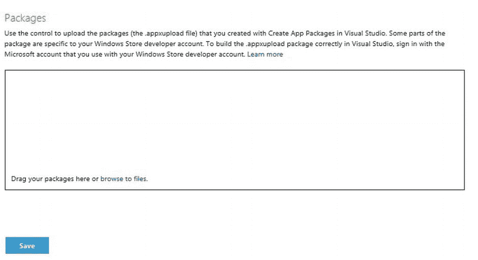

图 10-14。

Packages screen

### 描述

现在是有趣的部分。通过在描述页面上输入对您的应用的描述，为您的辛勤工作感到自豪。系统还会提示您输入应用的功能、关键词和屏幕截图，并附有简短描述。潜在用户和审批者将看到相同的信息，因此内容应该准确、简洁、有说服力。图 [10-15](#Fig15) 显示了描述页面的顶部，在这里您可以提供描述和应用功能。

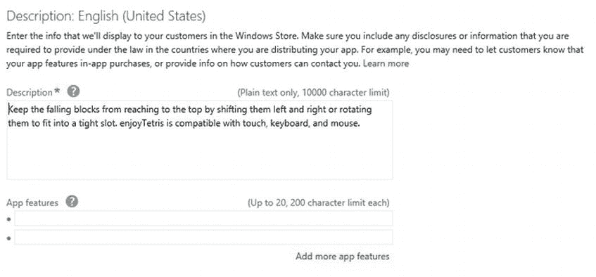

图 10-15。

Top part of the Description page

所有应用必须提供至少一个，最多八个截图。您可以选择使用 Windows 8 模拟器，它也会将图像存储在您的`Pictures` library 文件夹中，方法是在 Visual Studio 中打开您的应用并使用 Capture Screenshots 项。图 [10-16](#Fig16) 显示了描述页面的这一部分。

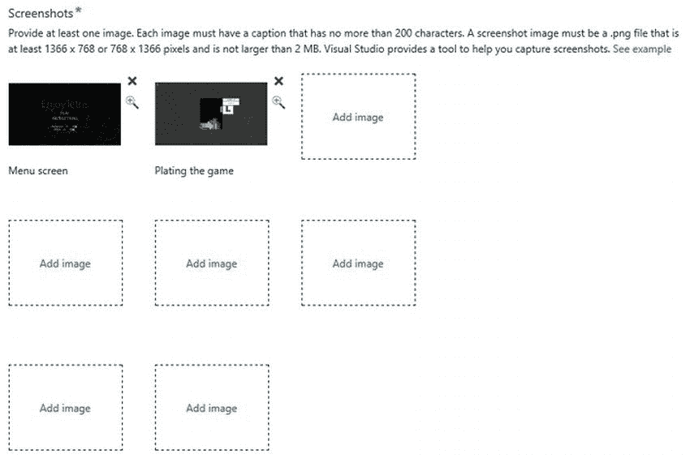

图 10-16。

The screenshots section of the Description page

描述页面的下一部分允许您提供搜索关键字以及额外信息，如应用的许可条款、版权信息以及所需或推荐的硬件。如果你在某个时候返回并编辑你的应用提交(例如，如果你有一个新版本)，你需要包括一个单独的更新描述。硬件字段是您指定应用是否需要传感器或设备才能运行的地方。图 [10-17](#Fig17) 显示了描述页面的这一部分。

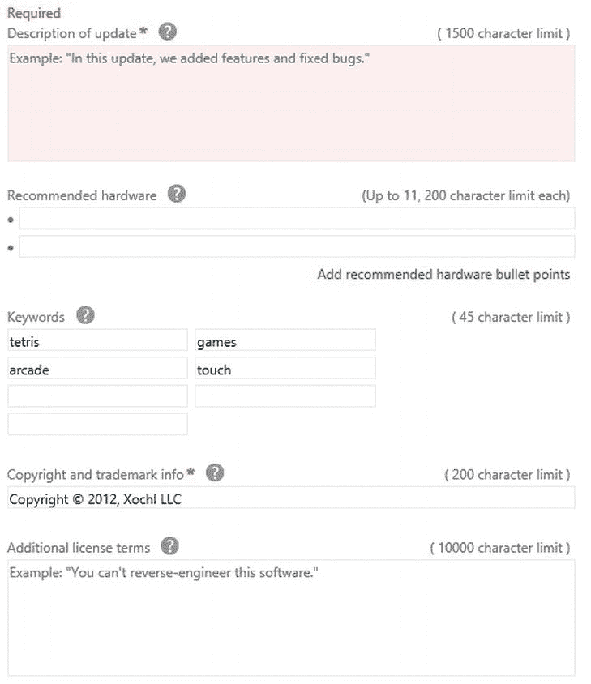

图 10-17。

Extra description information on the Description page

最后，你可以上传你的应用的宣传图片。其中包括任何用于 App Store 营销目的的图片。您可以输入与您的应用或公司关联的网站(如果有)。您还可以提供所有这些最终但重要的详细信息，包括支持联系地址和 URL 以及您的在线隐私声明的链接。参见图 [10-18](#Fig18) 。

图 10-18。

The Promotional Images section of the Description page

### 测试人员注意事项

下一个也是最后一个屏幕，如图 [10-19](#Fig19) 所示，允许您输入您选择提供给测试人员的任何其他信息。请注意，这是输入登录测试凭据的地方。

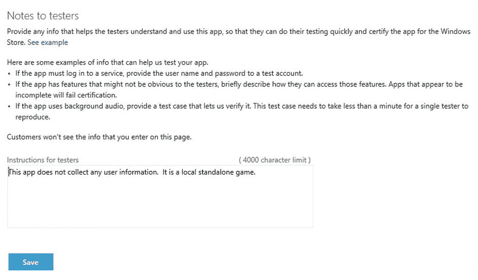

图 10-19。

Notes to Testers screen

## 让您的应用获得认证

现在是最容易的部分——或者最难的部分，取决于你如何看待它——在你等待你的应用的认证和随后的发布时，监控你的仪表板。提交后，您将收到来自 Windows 应用商店团队的确认电子邮件，让您知道这不仅仅是一个梦。这封电子邮件还提供了到您的仪表板的链接，用于跟踪应用在批准过程中的进度。

这个过程需要六个步骤，估计需要六天的等待时间。如果测试失败，您会通过仪表板和电子邮件得到通知，并允许您在解决错误后重新提交:

The submitted app is run through a series of automated tests.   The app proceeds to security testing. (Everyone appreciates downloading secure apps to their Windows 8 devices, after all.)   The app is put through a technical compliance test, which, if you had no problems running the WACK tool, should be smooth sailing, because Microsoft is running the WACK tool on its own servers. This completes the automated testing of the app.   Your humble creation is sent to an actual tester (what a fun job!) for compatibility testing. Your dashboard provides an estimate in terms of days, but because this is the most subjective stage of the approvals, there can be some variance in this estimation. Once it passes this step, your app is ready to be published.   The app receives digital signage and proceeds to the Windows Store servers and on to release in the Windows Store!   But, ugh, there is still a potential for post-publication failure during what’s called the Manual Content Compliance test. In this environment, your app is tested for bugs, security, and appropriateness. You’ll receive an e-mail if the app fails this final step, directing you to the report detailing the fail reasons and actions to resolve in the Dev Center.  

## 更新你的应用

希望你的应用会做得很好，随着技术的进步，更新应用功能的需求也会增加。请放心，亲爱的读者，你会收到忠实用户的反馈——也许比你预想的还要多！这种用户反馈可以提供关于可用性问题的有价值的见解，什么对你的用户有用，什么对你的用户没用，以及你的应用的当前版本中可能缺少什么。

当更新版本的开发完成后，您会发现商店更新流程是初始提交流程的简化版本。Windows 应用商店要求提交新的应用包，应用更新也要经过同样的六步验证过程。您可以再次运行 WACK 工具进行您自己的本地测试。幸运的是，提交更新的应用版本并获得批准应该更简单，只要遵守风格指南，减少错误风险和其他潜在问题。

以下是需要做和记住的事情的快速清单:

*   单击更新按钮，在应用页面上启动新的更新。
*   在提交新版本 2.0 之前，请记住在创建应用包向导中创建新版本号。
*   拿起您更新的应用包，回到仪表板。
*   在提交认证之前，我建议对变更或新增功能进行简要描述。更新页面看起来类似于新应用的提交页面，只是大部分信息已经提供了。
*   如果您需要更新关于您的应用的任何信息，从其功能或许可条款到屏幕截图或应用内购买优惠，您可以重新访问相关部分并相应地更新信息。否则，您可以直接进入上传软件包步骤，上传最新版本的应用。上传完成后，转到“详细信息”步骤，填写“更新描述”字段，这是必填字段。

## 摘要

恭喜你！你不仅完成了这本书，还完成了让你的 Windows 8 应用进入 Windows 应用商店的最后一步。通过阅读这一章，你知道这个过程的步骤是简单明了的；然而，您可能也可以确定，这可能是一个紧张的体验，可能会导致大量的调试或错误修复。但是一旦你走到这一步，不要放弃或沮丧。如果有的话，从你的代码中休息一下，用新鲜的眼光重新审视它。现在，我们来简要回顾一下本章的要点:

*   为您的应用保留名称。此名称保留一年，在此期间，您可以使用此名称发布您的应用。之后，该名称被重新分配到池中。
*   提交您的应用和您在 Windows 应用商店提交过程中使用的工具，包括创建应用包向导、开发中心和您的开发者仪表板。
*   一款名为 Windows 应用认证工具包(WACK)的认证工具，可用于测试你的应用。
*   认证过程，包括自动化测试、人工测试和手动内容合规性测试。
*   通过发布新版本来更新您的应用。这是让你的应用保持相关性，让你的用户满意，并保持应用处于技术进步前沿的一个重要方面。