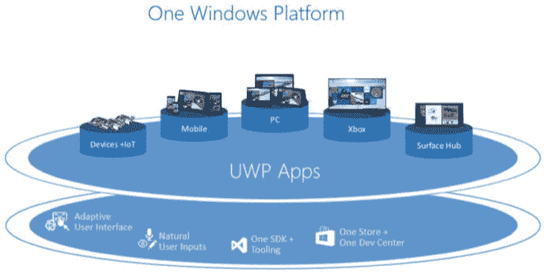
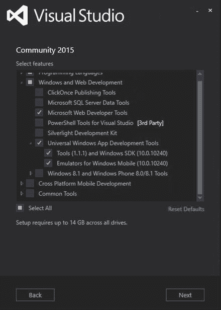
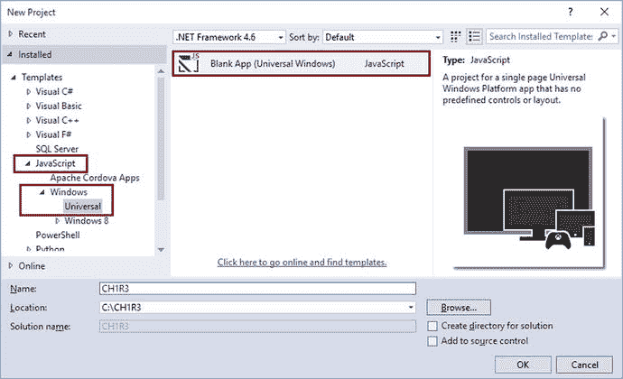
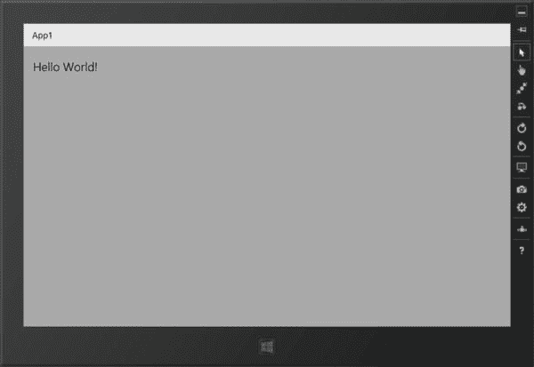
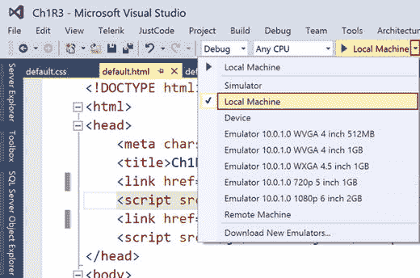
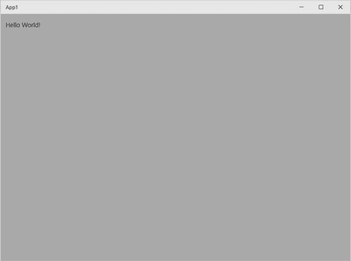
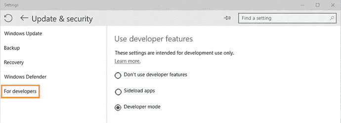
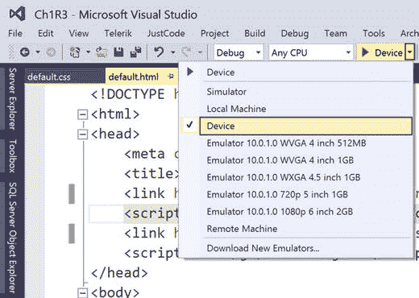

# 第 1 章:Windows 10 应用入门

Windows 10 是微软在 2015 年 7 月 29 日发布的新操作系统。自 Windows 8.1 以来，人们一直在期待它。对于应用开发者(商店和手机)，Windows 8.1 和 Visual Studio 2013 给出了一种独特的编程模型，称为通用 Windows 8 应用。通用 Windows 应用能够从一个共享的代码库同时面向 Windows 和 Windows Phone。Windows 10 超越了 Windows 和 Windows Phone，引入了所谓的通用 Windows 平台(UWP)应用。有了这个新平台，你可以保证在不同的设备上有一个一致的核心 API 层。UWP 开发的单个软件包可以安装在多种设备和设备系列上。设备系列包括桌面操作系统、移动操作系统(手机和平板电脑)、Xbox 和物联网(IoT)设备以及无头设备系列。这意味着您的应用可以在任何设备上运行，包括手机、平板电脑、PC、Xbox 游戏机等。本章介绍 Windows 10 通用 Windows 平台应用开发。

## 1.1 检查通用 Windows 平台

### 问题

你决定开发一个面向 PC、手机、平板电脑和 Xbox 的通用 Windows 平台应用。您想要了解通用 Windows 平台—设备系列和通用控件。

### 解决办法

让我们来看看通用 Windows 平台的一些亮点。

#### 一个 Windows 平台

Windows 10 带来了一个 Windows 平台(见图 [1-1](#Fig1) )。在 Windows 10 中，操作系统已经过重构，现在具有跨不同 Windows 10 平台的通用核心。这意味着您拥有一个通用的 Windows 内核、一个文件 I/O 堆栈和一个应用模型。简单来说，通用 Windows 平台就是联系人和版本的集合。对于 Windows Phone 8.1 和 Windows 8.1 应用，您必须面向操作系统—Windows 或 Windows Phone，而对于通用 Windows 平台应用，您面向设备。

图 1-1。

Universal Windows Platform apps model

UWP 应用可以在各种具有不同外形和输入机制的设备上运行。当您开发 UWP 应用时，您需要确保为每台设备量身定制体验，并利用各自设备的功能。Windows 10 上有一个通用的核心或内核。每个设备都向基础层添加自己的 API。因此，要访问设备的独特 API，您需要编写条件代码来在您的应用中提供设备特定的功能。

#### 设备系列

Windows 和 Windows Phone 是开发人员针对其 Windows 8.1 和 Windows Phone 8 应用的操作系统。但随着 Windows 10 现在在各种设备上可用，UWP 应用针对特定的设备家族。设备系列标识了该系列中设备的 API、特性和行为。它还决定了可以安装应用的设备集。图 [1-2](#Fig2) 展示了器件系列的层次结构。

图 1-2。

Universal device family hierarchy

一组 API 有一个名称和一个版本号。这是设备系列操作系统的基础。例如，个人电脑运行桌面操作系统，并基于桌面设备系列。另一方面，手机和平板电脑拥有基于移动设备家族的移动操作系统。我希望您现在对设备系列有一个确切的概念。

#### 通用控件

借助 UWP，应用可以在不同的外形、屏幕分辨率、dpi 和其他设备特性上运行。应用必须适应这些不同的外形和分辨率。Windows 10 提供了新的通用控件、布局和工具，将帮助您根据运行应用的设备来调整应用 API。Windows 10 包括新的控件，如日历和拆分视图。专用于 Windows Phone 应用的 Pivot control 现在可用于通用 Windows 平台应用。

#### 通用输入处理

通过 UWP 应用，通用控件现在支持各种输入，如鼠标、键盘、触摸、笔和控制器(如 Xbox 控制器)。该平台提供了一些核心 API，可以在您的应用中用来处理各种输入。下面是一些可以使用的输入 API。

*   CoreInput:允许您使用原始输入。
*   PointerInput:将原始触摸、鼠标和笔统一到一个一致的界面中。
*   PointerDevice:一个设备 API，允许您查询设备功能以了解可用的输入类型。

## 1.2 通用 Windows 平台的开发工具

### 问题

你想开始开发通用的 Windows 平台应用。您想知道应该使用哪些工具进行开发。

### 解决办法

您需要在开发计算机上安装 Windows 10 操作系统和 Visual Studio 2015 社区版。

要安装 Windows 10，请访问微软 [`http://windows.microsoft.com/en-us/windows/buy`](http://windows.microsoft.com/en-us/windows/buy) 。如果您已经安装了 Windows 操作系统，您可以免费将操作系统升级到 Windows 10。

要安装 Visual Studio 2015 (VS 2015)社区版，可以访问微软网站 [`https://www.visualstudio.com/en-us/downloads/visual-studio-2015-downloads-vs`](https://www.visualstudio.com/en-us/downloads/visual-studio-2015-downloads-vs) 。安装 VS 2015 时，需要确保选择了通用的 Windows app 开发工具(见图 [1-3](#Fig3) )。这在可选功能列表中。

图 1-3。

Visual Studio 2015 Community Edition installation

## 1.3 创建通用 Windows 平台应用

### 问题

您想要创建一个简单的通用 Windows 平台应用。

### 解决办法

Visual Studio 2015 附带预安装的通用 Windows 平台应用项目模板。您将使用该模板创建您的第一个应用。

### 它是如何工作的

让我们看看如何使用 Visual Studio 2015 创建一个新的通用 Windows 平台应用。

Open Visual Studio 2015 Community edition. Select File ➤ New Project. In the New Project dialog window, select Templates ➤ JavaScript ➤ Windows ➤ Universal from the Installed Templates section. Select Blank App (Universal Windows) from the available project templates (see Figure [1-4](#Fig4)). Provide a name and location for the app and click OK.

图 1-4。

New project template   Visual Studio will prepare the project. Figure [1-5](#Fig5) shows what the new solution looks like.

图 1-5。

Solution Explorer As part of the project template, you get `css`, `images`, `js`, and `WinJS` folders. You also have a pre-created `default.html` page to get started.

*   `css`文件夹是保存定制样式表(`.css`文件)的地方。
*   `images`文件夹包含您想在应用中使用的任何图像。
*   `js`是 JavaScript 文件夹，用于保存与应用相关的 js 文件。您会看到预先创建的`default.js`文件，其中包含以下代码。

`(function () {`         `"use strict";`         `var app = WinJS.Application;`         `var activation = Windows.ApplicationModel.Activation;`         `app.onactivated = function (args) {`                 `if (args.detail.kind === activation.ActivationKind.launch) {`                     `if (args.detail.previousExecutionState !==`                 `activation.ApplicationExecutionState.terminated) {`                             `//App Initilization code`                         `} else {`                                 `//Restore app sessions state`                         `}`                         `args.setPromise(WinJS.UI.processAll());`                 `}`         `};`         `app.oncheckpoint = function (args) {`             `//save any app state here`         `};`         `app.start();` `})();`   The code creates a `WinJS.Application` object instance and starts the application.   Open default.html by double-clicking the file in Solution Explorer. Here is the default code you see in the file: `<!DOCTYPE html>` `<html>` `<head>`     `<meta charset="utf-8" />`     `<title>Ch1R3</title>`     `<link href="WinJS/css/ui-dark.css" rel="stylesheet" />`     ``     `<link href="/css/default.css" rel="stylesheet" />`     `` `</head>` `<body class=”win-type-body”>`     `
Content goes here
` `</body>` `</html>`   It’s pretty much empty with just one line of text that reads, “Content goes here.” Replace this text with “Hello World!” This will be our Hello World application with UWP ☺.   Press Ctrl+Shift+B on your keyboard or select Build ➤ Build solution. Visual Studio builds the project.  

## 1.4 运行通用 Windows 平台应用

### 问题

您已经创建了一个新的 UWP 应用，并希望运行该应用来查看它的运行情况。你想知道怎么做。

### 解决办法

Visual Studio 2015 提供了许多选项来运行您的 UWP 应用:

*   在 Windows Phone 10 模拟器上运行应用
*   在 Windows 10 模拟器上运行应用
*   在本地机器上运行应用
*   在设备上运行应用

### 它是如何工作的

当您安装 Visual Studio 2015 时，它还会安装 Windows Phone 10 模拟器和 Windows 10 模拟器。这些模拟器和仿真器模拟 Windows Phone 和 Windows 中不同的设备和屏幕大小。Visual Studio 2015 允许您选择其中一个选项来部署您的应用。您也可以直接从 Visual Studio 将应用部署到您的计算机上，并将其作为本地应用运行。让我们看一下所有这些选项，一次一个。

#### 在 Windows Phone 10 模拟器上运行应用

在 Visual Studio 中，从目标组合框中选择一个可用的 Windows 10 模拟器。图 [1-6](#Fig6) 显示了可用仿真器的列表。

图 1-6。

Windows Phone 10 emulators target

按 F5 在选定的 Windows Phone 10 模拟器上运行应用。图 [1-7](#Fig7) 显示了 4 英寸 Windows Phone 10 上的截图。

图 1-7。

UWP app on Windows Phone 10 emulator

#### 在 Windows 10 模拟器上运行应用

在 Visual Studio 中，从目标组合框中选择 Simulator。此选项允许您将应用部署到 Windows 10 模拟器(参见图 [1-8](#Fig8) )。

图 1-8。

Windows 10 simulator target

按 F5 在 Windows 10 模拟器上运行应用。图 [1-9](#Fig9) 是该应用在模拟器上的截图。

图 1-9。

UWP app on Windows 10 simulator

#### 在本地机器上运行应用

通常情况下，Windows 10 应用需要从 Windows Store 下载，然后安装在您的机器上。但是这个工作流程只适用于最终用户，不适用于开发人员。在应用开发期间，开发人员可以直接在他们的开发机器上部署和运行他们的应用。

在本地机器上运行应用之前，您需要在机器上启用开发人员模式。

在你的机器上，进入设置➤更新&开发者安全➤，如图 [1-10](#Fig10) 所示。

Select the Developer mode radio button.   In Visual Studio, select Local Machine from the target combo box, as shown in Figure [1-11](#Fig11).

图 1-11。

Local Machine target   Press F5 to run the app on your development machine. Figure [1-12](#Fig12) is a screenshot of the app running on a local machine.

图 1-12。

UWP app on local machine  

图 1-10。

Developer features settings

#### 在设备上运行应用

如果你有 Windows 10 移动设备，你可以直接在上面部署和运行你的 UWP 应用。但是，在您可以将应用直接从 Visual Studio 部署到设备上之前，您需要启用您的手机，以允许在开发期间安装应用。这也被称为下载应用。这种模式被称为开发者模式，它是一种电话设置。在您的 Windows Phone 10 设备上，转到“设置”“➤更新与安全”“面向开发者的➤”。选择开发者模式，如图 [1-13](#Fig13) 所示。完成此步骤后，您的应用可以从 Visual Studio 直接部署到您的设备上。

图 1-13。

Developer Mode setting on Windows Phone device

在 Visual Studio 中，选择 Device 作为目标，如图 [1-14](#Fig14) 所示。

图 1-14。

Device target

接下来，按 F5 在您的设备上运行应用。输出应该类似于您在模拟器中看到的内容。