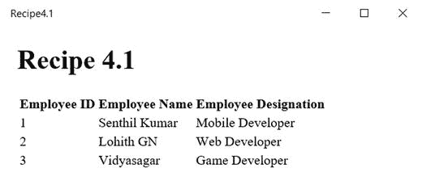
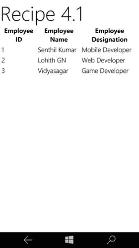
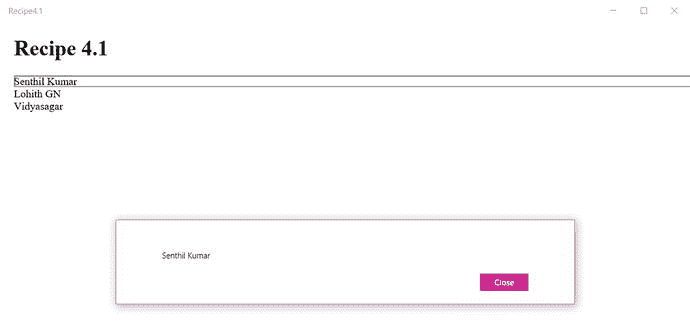
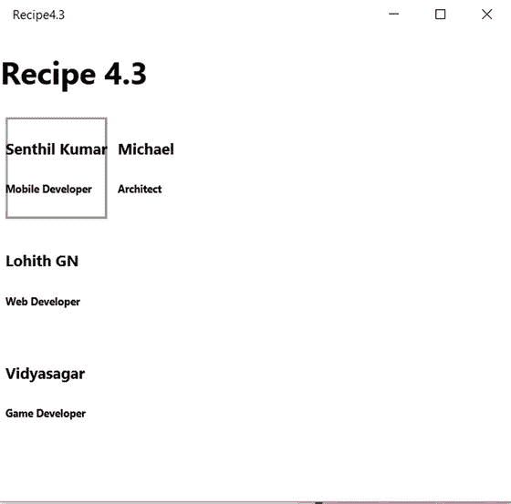
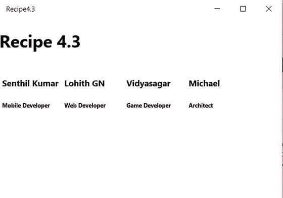
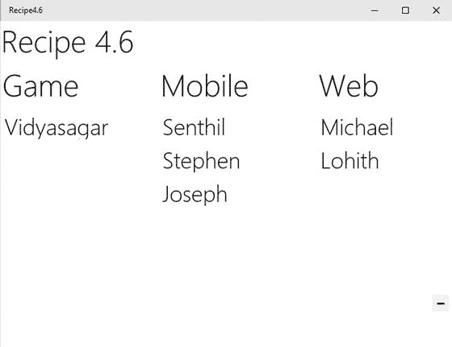
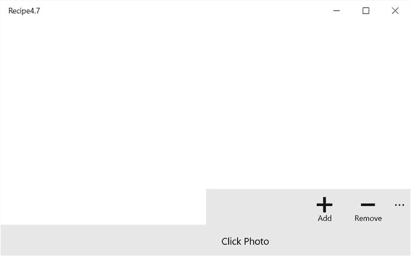
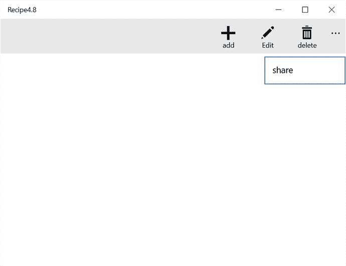

# 第 4 章:列表控件、应用栏和工具栏

本章重点介绍与数据采集相关的控件，包括 Repeater、FlipView 和 ListView。本章还介绍了菜单相关控件的制作方法，如应用栏、工具栏、弹出菜单、上下文菜单和菜单输出。

## 4.1 使用中继器控制

### 问题

您需要使用 WinJS Repeater 控件在用户界面(UI)上显示数据集合。

### 解决办法

Repeater 控件是 WinJS 库中可用于在 UI 上显示集合数据的控件之一。您可以通过将`data-win-control`属性设置为 WinJS 来添加 Repeater 控件。容器的值，然后通过使用`data-win-bind`属性将属性绑定到 UI 中的控件。

### 它是如何工作的

为了演示 Repeater 控件的使用，让我们构建一个通用的 Windows 应用，显示一个雇员列表的 HTML 表，如图 [4-1](#Fig1) 所示。

图 4-1。

HTML table with a Repeater control

启动 Visual Studio 2015，并使用 JavaScript 模板创建一个新的 Windows 通用项目。

打开`default.html`页面，用下面的代码片段替换它。

`<!DOCTYPE html>`

`<html>`

`<head>`

`<meta charset="utf-8" />`

`<title>Recipe4.1</title>`

`<!-- WinJS references -->`

`<link href="WinJS/css/ui-light.css" rel="stylesheet" />`

``

``

`<link href="/css/default.css" rel="stylesheet" />`

``

``

`</head>`

`<body style="margin:20px">`

`<h1>Recipe 4.1</h1>`

`<table>`

`<thead>`

`<tr>`

`<th> Employee ID</th>`

`<th> Employee Name</th>`

`<th> Employee Designation</th>`

`</tr>`

`</thead>`

`<tbody id="repeaterData" data-win-control="WinJS.UI.Repeater">`

`<tr>`

`<td data-win-bind="textContent:id"></td>`

`<td data-win-bind="textContent:name"></td>`

`<td data-win-bind="textContent:designation"></td>`

`</tr>`

`</tbody>`

`</table>`

`</body>`

`</html>`

在前面的代码片段中，Repeater 控件被添加到 body 部分；而 Repeater 控件的内部内容被用作模板。来自 repeater 数据的每一行都显示在 HTML 表的 body 部分。

前面的 HTML 页面引用了一个`data.js`页面。让我们将这个文件添加到项目中。向项目的`js`文件夹中添加一个新的 JavaScript 文件，并将其命名为 data.js。

`(function () {`

`"use strict";`

`function Initialize() {`

`WinJS.UI.processAll().done(function () {`

`var repeaterControl1 = document.getElementById('repeaterData').winControl;`

`var Employees = new WinJS.Binding.List([`

`{ id: 1, name: "Senthil Kumar", designation: "Mobile Developer" },`

`{ id: 2, name: "Lohith GN", designation: "Web Developer" },`

`{ id: 3, name: "Vidyasagar", designation: "Game Developer" }`

`]);`

`repeaterControl1.data = Employees;`

`})`

`}`

`document.addEventListener("DOMContentLoaded", Initialize);`

`})();`

`WinJS.Binding.List`用于绑定中继器控件。在前面的代码片段中，Repeater 控件被绑定到 employees 列表，该列表表示雇员数据的集合。employee 对象包含以下属性:id、姓名和职务。使用 Repeater 控件的 data 属性绑定数据。

在 Windows Mobile 模拟器上运行应用。您应该会看到如图 [4-2](#Fig2) 所示的屏幕。

图 4-2。

Repeater control in Windows Mobile 10

如果希望 Repeater 控件中的项可调用或可选择，其中一个选择是在 Repeater 控件模板中使用 ItemContainer 控件。

下面的示例演示 ItemContainer 在 Repeater 控件中的用法，该控件绑定到雇员列表。

`
`

`
`

`

`

`
`

`
`

ItemContainer 有一个名为`data-win-bind="dataset.name: name"`属性的属性，它将雇员列表中每一项的名称与 ItemContainer 相关联。

Repeater 控件被绑定到 JavaScript 文件中的雇员列表，如下所示。

`(function () {`

`"use strict";`

`function Initialize() {`

`WinJS.UI.processAll().done(function () {`

`var repeaterControl1 = document.getElementById('repeaterData').winControl;`

`var Employees = new WinJS.Binding.List([`

`{ id: 1, name: "Senthil Kumar", designation: "Mobile Developer" },`

`{ id: 2, name: "Lohith GN", designation: "Web Developer" },`

`{ id: 3, name: "Vidyasagar", designation: "Game Developer" }`

`]);`

`repeaterControl1.data = Employees;`

`repeaterControl1.addEventListener("invoked",function(e)`

`{`

`var name = e.target.dataset.name;`

`var message = new Windows.UI.Popups.MessageDialog(name);`

`message.showAsync();`

`})`

`})`

`}`

`document.addEventListener("DOMContentLoaded", Initialize);`

`})();`

当您在 Windows 中运行应用时，您会看到三个项目正在呈现。如果点击一个项目，会显示一个带有项目名称的消息框，如图 [4-3](#Fig3) 所示。

图 4-3。

Item in the Repeater control that is invokable

## 4.2 使用 FlipView 控件

### 问题

您只需要显示集合中的单个项目。

### 解决办法

使用 WinJS 中的 FlipView 控件，该控件一次仅显示集合中的单个项目。FlipView 控件的一个用例是一个照片库应用，用户可以在其中选择一个图像，然后在图像列表中滑动。

虽然一次只显示一项，但 FlipView 控件显示箭头，使您可以移动到数据源中的下一项或上一项。

通过用 WinJS 设置`div`元素的`data-win-control`属性，可以将 ListView 控件添加到页面中。列表视图值。

### 它是如何工作的

让我们在 Visual Studio 2015 中创建新的 Windows 通用项目。在`js`文件夹下将新的 JavaScript 文件命名为 data.js。这个 JavaScript 文件将包含可以在 ListView 中列出的数据。将下面的代码片段添加到`data.js`文件中。

`(function () {`

`"use strict";`

`var Employees = new WinJS.Binding.List([`

`{ id: 1, name: "Senthil Kumar", designation: "Mobile Developer" },`

`{ id: 2, name: "Lohith GN", designation: "Web Developer" },`

`{ id: 3, name: "Vidyasagar", designation: "Game Developer" }`

`]);`

`WinJS.Namespace.define("recipeData",`

`{`

`Employees :Employees`

`});`

`})();`

前面的 JavaScript 包含一个雇员集合；每个雇员都有一个 id、一个姓名和一个指定属性。

现在，您希望在 Windows 应用中一次显示一名员工。下面的 HTML 代码片段说明了如何使用 FlipView 控件显示雇员列表中的单个雇员。

请注意，该页面包含对`data.js`文件的引用，该文件包含 FlipView 控件的数据。

`<!DOCTYPE html>`

`<html>`

`<head>`

`<meta charset="utf-8" />`

`<title>Recipe4.2</title>`

`<!-- WinJS references -->`

`<link href="WinJS/css/ui-light.css" rel="stylesheet" />`

``

``

`<!-- Recipe4.2 references -->`

`<link href="/css/default.css" rel="stylesheet" />`

``

``

`</head>`

`<body class="win-type-body" style="margin:20px">`

`<h1>Recipe 4.2</h1>`

`
`

`
`

`<h4 data-win-bind="innerText: name"></h4>`

`<h6 data-win-bind="innerText: designation"></h6>`

`
`

`
`

`
`

`
`

`</body>`

`</html>`

当您在 Windows 上运行该应用时，您应该会看到如图 [4-4](#Fig4) 所示的页面。

图 4-4。

FlipView in the WinJS app

FlipView 是用下面的 HTML 标记声明的。

`
`

`
`

使用`itemDataSource`属性将 FlipView 绑定到雇员列表。在前面的代码片段中，FlipView 绑定到雇员列表，其类型为 WinJS.Binding.List。

请注意，FlipView 显示来自实现 IListDataSource 接口的数据源的数据。这方面的一个例子包括 WinJS。Binding.List 和 WinJS.UI.StorageDataSource。

此外，FlipView 的`itemTemplate`属性被设置为 id 为`template`的 TemplateControl。它包含用于格式化 ListView 中显示的员工详细信息的模板。在本例中，模板被配置为显示名称和称号。

## 4.3 使用 ListView 控件

### 问题

您需要在页面上显示一个交互式项目列表。

### 解决办法

使用 ListView 控件，它为开发人员提供了许多列出项目的选项，以及其他选项，如选择、排序、筛选、分组等。通过用 WinJS 设置`data-win-bind`属性，可以将 ListView 添加到页面中。列表视图值。

### 它是如何工作的

ListView 控件是 Windows 应用中最常用的控件之一。可以将 ListView 控件绑定到实现 IListDataSource 接口的数据源。目前，WinJS 有两个实现 IListDataSource 接口的对象。

*   WinJS。绑定.列表
*   WinJS。UI.StorageDataSource

在这个食谱中，我们将重点介绍如何使用 WinJS。绑定。列表数据源。

让我们看看如何在 WinJS 中使用 ListView 控件。绑定。列表数据源。

在 Visual Studio 2015 中新建一个 Windows 通用应用，打开`default.html`页面。用下面的代码替换它。

`<!DOCTYPE html>`

`<html>`

`<head>`

`<meta charset="utf-8" />`

`<title>Recipe4.3</title>`

`<!-- WinJS references -->`

`<link href="WinJS/css/ui-light.css" rel="stylesheet" />`

``

``

`<!-- Recipe4.3 references -->`

`<link href="/css/default.css" rel="stylesheet" />`

``

``

`</head>`

`<body class="win-type-body">`

`<h1>Recipe 4.3</h1>`

`
`

`
`

`<h4 data-win-bind="innerText: name"></h4>`

`<h6 data-win-bind="innerText: designation"></h6>`

`
`

`
`

`
`

`
`

`</body>`

`</html>`

下面的代码用于将 ListView 控件添加到页面中。

`
`

`
`

前面的代码片段中显示的 ListView 控件使用模板来显示每个雇员。

注意，您已经在 HTML 页面中引用了`data.js`文件。该文件包含雇员数组。向项目的`js`文件夹中添加一个新的 JavaScript 文件，并将其命名为 data.js。

`(function () {`

`"use strict";`

`function Initialize() {`

`WinJS.UI.processAll().done(function () {`

`var listControl1 = document.getElementById('listView1').winControl;`

`var Employees = new WinJS.Binding.List([`

`{ id: 1, name: "Senthil Kumar", designation: "Mobile Developer" },`

`{ id: 2, name: "Lohith GN", designation: "Web Developer" },`

`{ id: 3, name: "Vidyasagar", designation: "Game Developer" },`

`{ id: 4, name: "Michael", designation: "Architect" }`

`]);`

`listControl1.itemDataSource = Employees.dataSource;`

`listControl1.addEventListener("iteminvoked", function (e) {`

`var index = e.detail.itemIndex;`

`e.detail.itemPromise.then(function (item) {`

`var message = new Windows.UI.Popups.MessageDialog(item.data.name);`

`message.showAsync();`

`})`

`})`

`})`

`}`

`document.addEventListener("DOMContentLoaded", Initialize);`

`})();`

从 employees 数组中创建一个列表，该数组使用`itemDataSource`属性绑定到 ListView 控件。

当您运行应用时，您会看到以列表视图显示的员工数据。

JavaScript 代码还包括处理 ListView 的调用事件的代码，该事件显示从列表中选择的雇员。

ListView 控件在内部对每个 ListView 项使用 ItemContainer 控件。您可以处理 ListView 控件的 item-invoked 事件，以检测何时单击了特定的 ListView 项。

图 [4-5](#Fig5) 显示了在 Windows 中呈现的屏幕，其中包含该食谱中的代码片段。

图 4-5。

ListView control in Windows app with the invoked event handling

ListView 控件支持不同的布局，这些布局可以决定控件的整体外观。这些布局包括

*   网格布局
*   列表布局
*   跨单元布局

网格布局以网格格式显示 ListView 项，包含行和列。列表布局在单个列表中显示列表项。跨单元格布局将列表项显示为网格布局，但支持多列单元格。

要将 ListView 设置为网格布局，请将`layout`属性设置为 WinJS。在`the data-win-options`属性下的 UI.GridLayout，如下所示。

`
`

`
`

图 [4-6](#Fig6) 显示了使用网格布局时呈现的用户界面。

图 4-6。

Grid layout in ListView

您也可以将布局设置为以下值:

*   WinJS.UI .储存格扩充配置
*   WinJS.UI.ListLayout

## 4.4 过滤 ListView 控件中的项目

### 问题

您需要通过从与 ListView 关联的数据源中过滤列表视图中显示的项目来过滤它。

### 解决办法

你可以使用 WinJS。然后使用`createFiltered`方法创建一个新的过滤列表。`createFiltered`函数在列表的输入项上创建一个过滤的投影。

### 它是如何工作的

让我们演示一下 ListView 控件中的过滤功能。

Create a new Universal Windows app in Visual Studio 2015 using the JavaScript template.   Open the `default.html` page from the Solution Explorer and replace it with the following code.  

`<!DOCTYPE html>`

`<html>`

`<head>`

`<meta charset="utf-8" />`

`<title>Recipe4.4</title>`

`<!-- WinJS references -->`

`<link href="WinJS/css/ui-light.css" rel="stylesheet" />`

``

``

`<!-- Recipe4.4 references -->`

`<link href="/css/default.css" rel="stylesheet" />`

``

``

`</head>`

`<body class="win-type-body">`

`<h1>Recipe4.4</h1>`

`
`

`<input id="txtSearch" />`

`
`

`
`

`<h3 data-win-bind="innerText:name"></h3>`

`
`

`
`

`
`

`</body>`

`</html>`

注意包含了设置数据源和执行过滤操作的`data.js`文件。这个 HTML 页面包含一个 id 为`txtSearch`的简单文本框和一个 ListView 控件。ListView 有一个关联的自定义模板，用于以格式化的方式显示数据。

让我们将 JavaScript 文件添加到项目的`js`文件夹中，并将其命名为 data.js。

`(function () {`

`"use strict";`

`// List of Employees to be used a datasource.`

`var lstEmployees = new WinJS.Binding.List([`

`{ id: 1, name: "Senthil Kumar" },`

`{ id: 2, name: "Lohith GN" },`

`{ id: 3, name: "Senthil Kumar B" },`

`{ id: 4, name: "Vidyasagar" },`

`]);`

`function Initialize() {`

`WinJS.UI.processAll().done(function () {`

`// Get the Listview from the DOM`

`var lstControl = document.getElementById('lstEmployees').winControl;`

`// Get the Search Tex from the HTML Page`

`var filterText = document.getElementById('txtSearch');`

`lstControl.itemDataSource = lstEmployees.dataSource;`

`filterText.addEventListener("keyup", function () {`

`filterEmployee(lstControl, filterText.value);`

`});`

`});`

`}`

`// Function to filter the list`

`function filterEmployee(listEmployee,searchtext)`

`{`

`var filtereddata = lstEmployees.createFiltered(function (item) {`

`var result = item.name.toLowerCase().indexOf(searchtext);`

`return item.name.toLowerCase().indexOf(searchtext) == 0;`

`});`

`listEmployee.itemDataSource = filtereddata.dataSource;`

`}`

`document.addEventListener("DOMContentLoaded", Initialize);`

`})();`

这段 JavaScript 代码包含一个名为`filterEmployee`的方法，它接受一个 ListView 控件和一个用于过滤的搜索字符串。该函数过滤 ListView 并显示与搜索字符串匹配的雇员。

下面是`createFiltered`方法中过滤 ListView 控件中数据源的函数。

`var fileteredData = lstEmployees.createFiltered(function (item) {`

`var result = item.name.toLowerCase().indexOf(searchtext);`

`return item.name.toLowerCase().indexOf(searchtext) == 0;`

`});`

该函数的作用类似于一个动态过滤器，当项目以搜索文本字符串开始时返回项目。

在 Windows 上运行应用。您应该会看到如图 [4-7](#Fig7) 所示的屏幕。

图 4-7。

Filtering the ListView

当您开始在文本框中输入文本时，您会看到筛选出的项目显示在屏幕上。

## 4.5 ListView 控件中的分组项目

### 问题

您需要在 ListView 中按类别对项目进行分组，而不是按平面列表进行分组。

### 解决办法

若要对 ListView 中的项目进行分组，需要使用分组的数据源。这可以通过使用 WinJS 中的`WinJS.Binding.List.createGrouped()`函数来实现。

### 它是如何工作的

要在 WinJS 中对 ListView 控件中的项目进行分组，有必要包含两个模板:一个用于组标题，一个用于单个项目。

让我们在 Visual Studio 2015 中创建新的 Windows Universal 项目，打开`default.html`页面。用下面的代码片段替换它。

`<!DOCTYPE html>`

`<html>`

`<head>`

`<meta charset="utf-8" />`

`<title>Recipe4.5</title>`

`<!-- WinJS references -->`

`<link href="WinJS/css/ui-light.css" rel="stylesheet" />`

``

``

`<!-- Recipe4.5 references -->`

`<link href="/css/default.css" rel="stylesheet" />`

``

``

`</head>`

`<body class="win-type-body">`

`<h1>Recipe 4.5</h1>`

`
`

`<h3 data-win-bind="innerText: technology"></h3>`

`
`

`
`

`<h4 data-win-bind="innerText:name"></h4>`

`
`

`
`

`
`

`</body>`

`</html>`

这个代码片段包含一个名为 lvEmployees 的 ListView 控件，它有一个组头模板和与之相关联的`itemTemplate`。

注意对`data.js` JavaScript 文件的引用。

让我们在 Visual Studio 2015 解决方案资源管理器中的`js`文件夹下创建一个新的 JavaScript 文件，并将其命名为 data.js。

`(function () {`

`"use strict";`

`function Initialize() {`

`WinJS.UI.processAll().done(function () {`

`var listView1 = document.getElementById("lvEmployees").winControl;`

`var employeeList = new WinJS.Binding.List([`

`{ id: 1, name: "Senthil Kumar", technology: "Mobile" },`

`{ id: 2, name: "Michael", technology: "Web" },`

`{ id: 3, name: "Lohith", technology: "Web" },`

`{ id: 4, name: "Stephen", technology: "Mobile" },`

`{ id: 5, name: "Vidyasagar", technology: "Game" },`

`{ id: 6, name: "Joseph", technology: "Mobile" },`

`]);`

`var groupedEmployees = employeeList.createGrouped(`

`function (item) {`

`return item.technology;`

`},`

`function (item) {`

`return { technology: item.technology }`

`},`

`function (group1, group2) {`

`return group1 > group2 ? 1 : -1;`

`});`

`listView1.groupDataSource = groupedEmployees.groups.dataSource;`

`listView1.itemDataSource = groupedEmployees.dataSource;`

`});`

`}`

`document.addEventListener("DOMContentLoaded", Initialize);`

`})();`

这段 JavaScript 代码创建了项目数据源和分组数据源。该列表包含雇员记录，每一项都包含属性 id、姓名和技术。

分组的数据源是使用 WinJS 的`createGrouped`方法创建的，该方法需要传递三个函数作为参数。

*   `GroupKey`:该功能用于将列表中的每一项与一个组相关联。前面的示例返回了与每个雇员相关联的技术属性。
*   `GroupData`:该函数返回组头显示的数据项。在前面的示例中，`GroupData`返回标题中显示的组的技术。
*   `GroupSorter`:该函数处理组的顺序；例如，以升序在标题中列出组。

请注意，分组的数据源是活动的，它也可以使用筛选的数据源。

准备好项目数据源和分组数据源后，它们分别被设置为 ListView 的`groupDataSource`属性和`itemDataSource`属性，如下所示。

`listView1.groupDataSource = groupedEmployees.groups.dataSource;`

`listView1.itemDataSource = groupedEmployees.dataSource;`

当您在 Windows 上运行应用时，您应该会看到如图 [4-8](#Fig8) 所示的屏幕。

图 4-8。

ListView with grouped data

请注意，这些项目是按技术分组的，并显示在页面上。

## 4.6 ListView 中的语义缩放

### 问题

当使用 ListView 时，您希望为用户提供一个选项，以两种不同的缩放级别查看数据。

### 解决办法

您可以使用 WinJS 中的 SemanticZoom 控件在您的应用中引入语义缩放功能。SemanticZoom 控件使您能够在使用 ListView 时提供同一数据的两种不同视图。

您可以通过将`div`元素的`data-win-control`属性设置为 WinJS 来添加 SemanticZoom。UI.SemanticZoom 值

### 它是如何工作的

语义缩放可以使用 WinJS 中的 Semantic zoom 控件实现。设想这样一个场景，您有一个员工列表，可以根据他们所使用的技术对其进行分组。为了让用户能够轻松地在技术之间导航，您可以使用语义缩放，默认情况下，您可以看到按类别分组的员工，缩小后，您只能看到技术列表。

在 Visual Studio 2015 中创建新的通用 Windows 应用，打开`default.html`页面。用下面提供的代码替换现有的代码。

`<!DOCTYPE html>`

`<html>`

`<head>`

`<meta charset="utf-8" />`

`<title>Recipe4.6</title>`

`<!-- WinJS references -->`

`<link href="WinJS/css/ui-light.css" rel="stylesheet" />`

``

``

`<!-- Recipe4.6 references -->`

`<link href="/css/default.css" rel="stylesheet" />`

``

``

`</head>`

`<body class="win-type-body">`

`<h1>Recipe 4.6</h1>`

`<!-- Zoom In-->`

`
`

`<h1 data-win-bind="innerText: technology"></h1>`

`
`

`
`

`<h2 data-win-bind="innerText:name"></h2>`

`
`

`<!-- Zoom out-->`

`
`

`<h6 data-win-bind="innerText: technology"></h6>`

`
`

`
`

`<!-- Zoom In-->`

`
`

`
`

`<!-- Zoom Out-->`

`
`

`
`

`
`

`</body>`

`</html>`

上一页包含一个 SemanticZoom 控件，该控件有两个 ListView 控件。下面是使用 SemanticZoom 控件和 ListView 的代码。

`
`

`<!-- Zoom In-->`

`
`

`
`

`<!-- Zoom Out-->`

`
`

`
`

`
`

SemanticZoom 控件包括两个具有不同缩放级别的 ListView 控件。当用户试图放大或缩小时，ListView 控件会相应地切换。

让我们在项目中的`js`文件夹下添加一个新的 JavaScript 文件，并将其命名为 data.js。将以下代码添加到`data.js`文件中。

`(function () {`

`"use strict";`

`function Initialize() {`

`WinJS.UI.processAll().done(function () {`

`var listView1 = document.getElementById("lvEmployees").winControl;`

`var listView2 = document.getElementById("lvTechnologies").winControl;`

`var employeeList = new WinJS.Binding.List([`

`{ id: 1, name: "Senthil Kumar", technology: "Mobile" },`

`{ id: 2, name: "Michael", technology: "Web" },`

`{ id: 3, name: "Lohith", technology: "Web" },`

`{ id: 4, name: "Stephen", technology: "Mobile" },`

`{ id: 5, name: "Vidyasagar", technology: "Game" },`

`{ id: 6, name: "Joseph", technology: "Mobile" },`

`]);`

`// Grouped Datasource`

`var groupedEmployees = employeeList.createGrouped(`

`function (item) {`

`return item.technology;`

`},`

`function (item) {`

`return { technology: item.technology }`

`},`

`function (group1, group2) {`

`return group1 > group2 ? 1 : -1;`

`});`

`listView1.groupDataSource = groupedEmployees.groups.dataSource;`

`listView1.itemDataSource = groupedEmployees.dataSource;`

`listView2.itemDataSource = groupedEmployees.groups.dataSource;`

`});`

`}`

`document.addEventListener("DOMContentLoaded", Initialize);`

`})();`

当您运行应用时，您应该会看到如图 [4-9](#Fig9) 所示的屏幕。

图 4-9。

SemanticZoom in the default view

单击屏幕右上角显示的–按钮，或使用拉伸手势缩小。

替代视图如图 [4-10](#Fig10) 所示。

图 4-10。

Alternate ListView shown using SemanticZoom

## 4.7 使用 AppBar 控件

### 问题

您需要提供对与当前页面或当前选择相关的常见任务的快速访问。

### 解决办法

通过向页面添加应用栏，您可以快速访问与当前页面或当前选择相关的常见任务。通过为`div`元素设置`data-win-control="WinJS.UI.AppBar"`属性，可以将 AppBar 控件添加到页面中。

### 它是如何工作的

应用栏是一行，包含图标按钮和应用屏幕底部的省略号。当用户点击省略号时，它显示可用的带标签的图标按钮和菜单项。

下面是将 AppBar 控件添加到 HTML 页面的语法。

`

`

可以使用 JavaScript 代码以及以下语法添加 AppBar 控件。

`var object = new WinJS.UI.AppBar(element, options);`

AppBar 命令被添加到 app bar 中。这只是显示在应用栏中的命令或按钮。

`<button data-win-control="WinJS.UI.AppBarCommand"></button>`

通过将控件的`data-win-options`属性的 section 属性设置为 secondary，可以指定 AppBarCommand 是否应显示为菜单。

让我们创建一个演示 AppBar 功能的应用，它包括以下功能。

*   演示添加和删除选项的命令(按钮)。
*   appbar 命令(菜单项)演示当用户点击省略号时显示的菜单项。

当用户点击按钮或菜单项时，相应的事件被处理，并显示适当的消息。

在 Visual Studio 2015 中创建新的通用 Windows 项目，打开`default.html`页面。用下面的代码替换它的内容。

`<!DOCTYPE html>`

`<html>`

`<head>`

`<meta charset="utf-8" />`

`<title>Recipe4.7</title>`

`<!-- WinJS references -->`

`<link href="WinJS/css/ui-light.css" rel="stylesheet" />`

``

``

`<!-- Recipe4.7 references -->`

`<link href="/css/default.css" rel="stylesheet" />`

``

``

`</head>`

`<body class="win-type-body">`

`
`

`<button data-win-control="WinJS.UI.AppBarCommand"`

`data-win-options="{id:'cmdAdd', label:'Add', icon:'add', section:'primary', tooltip:'Add'}"></button>`

`<button data-win-control="WinJS.UI.AppBarCommand"`

`data-win-options="{id:'cmdRemove', label:'Remove', icon:'remove', section:'primary', tooltip:'Remove'}"></button>`

`<button data-win-control="WinJS.UI.AppBarCommand"`

`data-win-options="{id:'cmdCamera', label:'Click Photo', icon:'camera', section:'secondary', tooltip:'click'}"></button>`

`
`

`

`

`</body>`

`</html>`

HTML 标记在主要部分添加了两个 appbar command(Add，Remove ),在次级菜单中添加了一个 AppBarCommand (Camera)。属性为控件提供了额外的选项。其中一些属性包括以下内容:

*   `Id`:唯一标识 AppBarCommand。
*   `label`:appbar command 中显示的内容。
*   `icon`:appbar command 的内置图标。
*   `section`:app bar 中应该显示命令的部分。该值可以是主要的或次要的。
*   `tooltip`:鼠标悬停在命令按钮上时显示的文本。

注意，该页面包含对`appbarevents.js` JavaScript 文件的引用。这包含处理 appbar 命令上的事件的逻辑。让我们在项目中的`js`文件夹下创建一个新的 JavaScript 文件，并将其命名为 appbarevents.js。

`(function () {`

`"use strict";`

`WinJS.UI.Pages.define("default.html", {`

`ready: function (element, options) {`

`element.querySelector("#cmdAdd").addEventListener("click", AddMethod, false);`

`element.querySelector("#cmdRemove").addEventListener("click", RemoveMethod, false);`

`element.querySelector("#cmdCamera").addEventListener("click", CameraMethod, false);`

`}`

`});`

`// Command button functions`

`function AddMethod() {`

`var message = new Windows.UI.Popups.MessageDialog("Add Button Pressed");`

`message.showAsync();`

`}`

`function RemoveMethod() {`

`var message = new Windows.UI.Popups.MessageDialog("Remove button pressed");`

`message.showAsync();`

`}`

`function CameraMethod() {`

`var message = new Windows.UI.Popups.MessageDialog("Camera button pressed");`

`message.showAsync();`

`}`

`})();`

前面的 JavaScript 代码处理 AppBarCommand 按钮的 click 事件。单击该按钮时，会显示一条消息。

在 Windows 上运行应用。您应该会看到如图 [4-11](#Fig11) 所示的屏幕。

图 4-11。

Windows app with the AppBar

点击应用栏中的省略号按钮，显示第二部分，如图 [4-12](#Fig12) 所示。

图 4-12。

Windows app with the AppBar and secondary section

当您单击菜单按钮时，它会显示相应的消息。

## 4.8 使用工具栏控件

### 问题

您需要显示一组可以出现在任何位置的命令；例如，屏幕顶部的弹出按钮或应用栏。

### 解决办法

您可以使用工具栏控件在操作区域中显示尽可能多的命令。这种控制不局限于应用中的单一位置。它可以在拆分视图、弹出按钮等中找到。

### 它是如何工作的

使用 JavaScript 模板在 Visual Studio 2015 中创建新的通用 Windows 应用。打开`default.html`页面。

用下面的代码替换`default.html`页面的内容。

`<!DOCTYPE html>`

`<html>`

`<head>`

`<meta charset="utf-8" />`

`<title>Recipe4.8</title>`

`<!-- WinJS references -->`

`<link href="WinJS/css/ui-light.css" rel="stylesheet" />`

``

``

`<!-- Recipe4.8 references -->`

`<link href="/css/default.css" rel="stylesheet" />`

``

`</head>`

`<body class="win-type-body">`

`
`

`<!-- Primary commands -->`

`<button data-win-control="WinJS.UI.Command" data-win-options="{`

`id:'cmdAdd',`

`label:'add',`

`section:'primary',`

`type:'button',`

`icon: 'add',`

`onclick: recipes.clickcommand}"></button>`

`<button data-win-control="WinJS.UI.Command" data-win-options="{`

`id:'cmdEdit',`

`label:'Edit',`

`section:'primary',`

`type:'button',`

`icon: 'edit',`

`onclick: recipes.clickcommand}"></button>`

`<button data-win-control="WinJS.UI.Command" data-win-options="{`

`id:'cmdDelete',`

`label:'delete',`

`section:'primary',`

`type:'button',`

`icon: 'delete',`

`onclick: recipes.clickcommand}"></button>`

`<!-- Secondary command -->`

`<button data-win-control="WinJS.UI.Command" data-win-options="{`

`id:'cmdShare',`

`label:'share',`

`section:'secondary',`

`type:'button',`

`onclick: recipes.clickcommand}"></button>`

`
`

`</body>`

`</html>`

前面的代码片段在主命令中添加了三个按钮，在辅助命令中添加了一个按钮(Share)。默认情况下，辅助命令是隐藏的，当您点击省略号按钮时会显示出来。

通过将`div`元素的`data-win-control`属性设置为 WinJS 来添加工具栏控件。工具栏值。

您可以通过设置 WinJS 的`data-win-control`属性在工具栏中添加按钮。UI .命令值。`data-win-options`属性用于设置命令属性。以下是为该命令设置的一些属性。

*   `id`:定义命令的标识符。
*   `label`:定义命令显示的文本。
*   `section`:定义工具栏中命令应该出现的区域。这可以采用主值或次值。
*   `type`:设置为“button”显示按钮控件。
*   `onClick`:触发并调用相应 JavaScript 方法的事件。
*   `icon`:显示命令的内置图标。

注意，我们已经为该命令设置了`OnClick`事件。让我们为它添加事件。

打开项目的`js`文件夹下的`default.js`文件。在`args.setPromise`方法之前添加以下代码。

`WinJS.Namespace.define("recipes", {`

`clickcommand: WinJS.UI.eventHandler(function (ev) {`

`var command = ev.currentTarget;`

`if (command.winControl) {`

`var message = Windows.UI.Popups.MessageDialog(command.winControl.label);`

`message.showAsync();`

`}`

`})`

`});`

前面的代码片段定义了名为`recipe`的名称空间，并添加了一个名为`clickcommand`的事件处理程序。这将在调用事件时显示一个 MessageDialog。

现在，让我们在 Windows 上运行应用。您应该会看到如图 [4-13](#Fig13) 所示的屏幕。

图 4-13。

Toolbar in Windows app

当您单击命令按钮时，您会看到一个消息对话框，描述所单击的按钮。