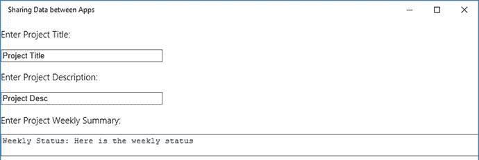
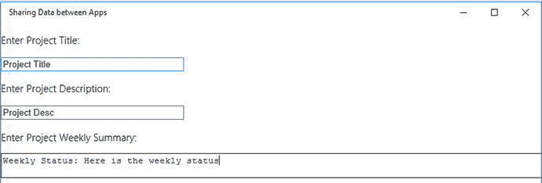
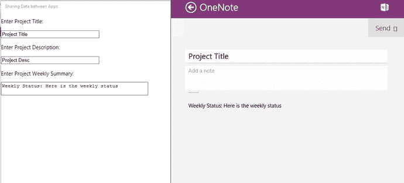
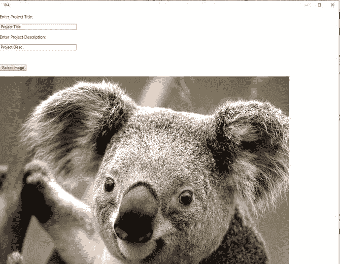
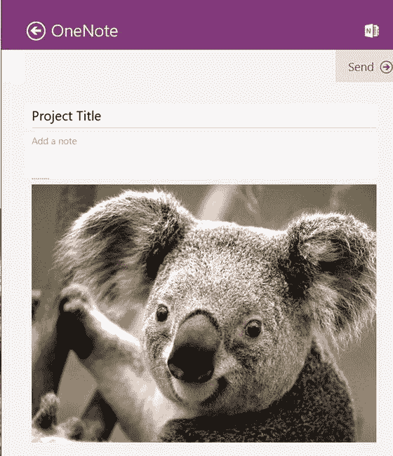
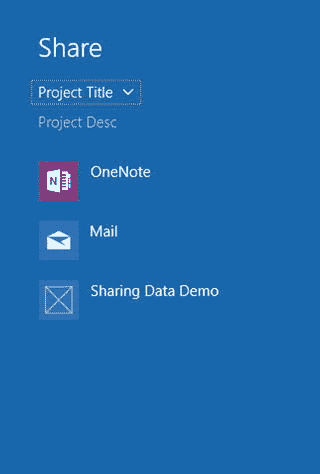
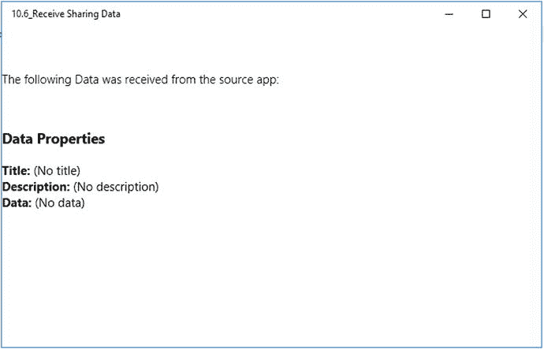
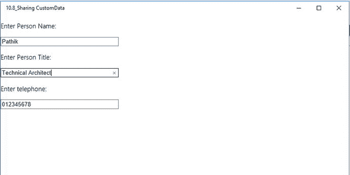
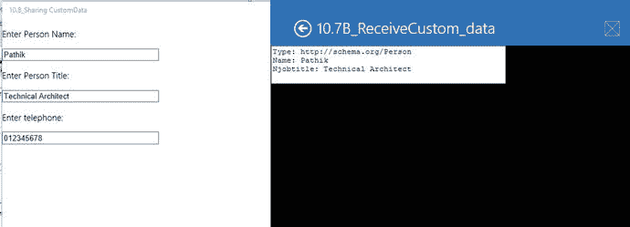

# 第 10 章:共享数据

本章介绍如何在通用 Windows 平台应用之间共享数据。共享数据使开发人员能够构建允许用户共享信息、复制/粘贴以及从一个应用拖放到另一个应用的功能。例如，用户可能想要从一个应用中复制一些文本或图像，并将其粘贴到另一个应用中。用户也寻找共享信息/社交网站的链接。

Windows 10 应用支持以两种不同的方式共享数据。

*   源应用允许用户将应用中的数据共享给其他应用。
*   目标应用允许用户将一个应用声明为目标应用，该应用可以从其他应用检索共享数据。声明为目标应用的应用允许用户在共享数据时选择它作为目标应用。

通过使用共享数据选项，用户可以与其他应用共享纯文本、网络链接、照片和视频。在本章中，您将学习如何实现从源应用共享数据和声明目标应用。

## 共享联系人

为了共享数据或接收数据，每个应用都需要作为源应用或目标应用实现共享契约。数据共享包括以下三个部分:

*   源 app:源 app 实现共享契约作为源 app 共享数据。此应用注册数据传输管理器，并填充要共享的数据包。
*   Share broker:Share broker 是 Share charm，支持源应用和目标应用之间的通信。
*   目标应用:目标应用作为目标应用实现共享契约，以接收其他应用共享的数据。

## 10.1 为源应用的共享选项设置事件处理程序

### 问题

您需要为源应用的共享选项设置事件处理程序。

### 解决办法

你需要使用`Windows.ApplicationModel.DataTransfer.DataTransferManager`的`datarequested`事件监听器。

### 它是如何工作的

当用户调用共享时，`Windows.ApplicationModel.DataTransfer.DataTransferManager`类的`datarequested`事件监听器方法被触发。此事件可以由用户操作触发，也可以在特定情况下自动触发；例如，当用户完成一项调查，应用想要分享调查结果。

要用`DataTransferManager`对象注册事件处理程序，可以使用下面的代码:

`var dataTransferManager = Windows.ApplicationModel.DataTransfer.DataTransferManager.getForCurrentView();`

`dataTransferManager.addEventListener("datarequested", dataRequested_Share);`

在前面的代码中，您做的第一件事是使用`DataTransferManager.getForCurrentView()`函数获取当前页面的`DataTransferManager`对象。

接下来的一行代码将为`datarequested`事件添加一个事件监听器到`DataTransferManager`对象中。在前面的代码中，`dataRequested_Share`是监听器，`datarequested`是事件。然后，您可以定义接收方，如下面的代码所示。

`function dataRequested_Share () {`

`// Your code for the sharing data`

`}`

让我们使用前面的代码创建一个通用的 Windows 应用，为源应用的共享选项设置事件处理程序。

在 Microsoft Visual Studio 2015 中使用 Windows 通用(空白应用)模板创建一个新项目。

在解决方案资源管理器中右键单击项目的`js`文件夹，并选择添加➤新 JavaScript 文件。提供文件的名称。在本例中，我们将文件命名为 DataSharingDemo。js。

`(function () {`

`"use strict";`

`function GetControl() {`

`WinJS.UI.processAll().done(function () {`

`var dataTransferManager = Windows.ApplicationModel.DataTransfer.DataTransferManager.getForCurrentView();`

`dataTransferManager.addEventListener("datarequested", shareDataHandler);`

`});`

`}`

`document.addEventListener("DOMContentLoaded", GetControl);`

`})();`

`function shareDataHandler(e) {`

`// Your code to share the text, image etc`

`}`

前面的代码使用`DataTransferManager.getForCurrentView()`函数获取当前页面的`DataTransferManager`对象，然后向其添加一个事件侦听器，如前所述。

现在，将`DataSharingDemo.js`引用添加到`default.html`，如下所示:

`<!DOCTYPE html>`

`<html>`

`<head>`

`<meta charset="utf-8" />`

`<title>_10.1</title>`

`<!-- WinJS references -->`

`<link href="WinJS/css/ui-dark.css" rel="stylesheet" />`

``

``

`<!-- _10.1 references -->`

`<link href="/css/default.css" rel="stylesheet" />`

``

``

`</head>`

`<body class="win-type-body">`

`
Content goes here
`

`</body>`

`</html>`

## 10.2 将纯文本数据共享给其他应用

### 问题

你需要开发一个功能，允许用户将纯文本数据分享给其他 Windows 10 应用。

### 解决办法

使用`request.data.setText`和`request.Data.Properties.description`共享数据。request.data.title 是必填字段。

### 它是如何工作的

在前面的菜谱中，您了解到当用户使用 Share charm 开始共享会话时，会触发`datarequested`事件监听器。所以现在我们将在监听器中编写代码来共享数据。侦听器接受一个参数，该参数是事件参数。首先，您需要从事件参数中检索请求对象，如下所示:

`function shareDataHandler(e) {`

`//Start your code to share data`

`var request = e.request;`

`}`

您需要为请求对象设置属性。为了共享纯文本，您需要填充以下属性:

`request.Data.Properties.Title = "Title of the Data";`

`request.Data.Properties.Description = "Description of the Data";`

太好了，看起来很简单，不是吗？让我们实现它，看看在应用之间共享数据的现场演示。

在 Microsoft Visual Studio 2015 中使用 Windows 通用(空白应用)模板创建一个新项目。

首先，将下面的代码添加到`default.html`中。您需要用以下代码替换 body 标记:

`<body class="win-type-body" style="background-color:white">`

`
`

`
Enter Project Title:
`

`<input class="text-box" id="txttitle" value="Project Title" size="40"/>`

`
Enter Project Description:
`

`<input class="text-box" id="txtdesc" value="Project Desc" size="40" />`

`
Enter Project Weekly Summary:
`

`<textarea id="txttext" maxlength="1000" style="width:50%">Weekly Status: Here is the weekly status</textarea>`

` `

` `

`
`

`</body>`

这段代码为共享数据演示定义了一个用户界面。用户界面如图 [10-1](#Fig1) 所示。

图 10-1。

Sharing Data user interface

现在，在解决方案浏览器中右键单击项目的`js`文件夹，并选择添加➤新 JavaScript 文件。提供文件的名称。在本例中，我们将文件命名为 DataSharingDemo.js。

`(function () {`

`"use strict";`

`function GetControl() {`

`WinJS.UI.processAll().done(function () {`

`var dataTransferManager = Windows.ApplicationModel.DataTransfer.DataTransferManager.getForCurrentView();`

`dataTransferManager.addEventListener("datarequested", shareDataHandler);`

`});`

`}`

`document.addEventListener("DOMContentLoaded", GetControl);`

`})();`

还将以下代码添加到`default.html`中，以引用`DataSharingDemo.js`文件:

``

这样，您就有了想要共享的数据的用户界面。您还为`datarequested`事件添加了事件监听器。现在，共享数据特性最重要的部分是实现填充请求对象的代码。因此，将函数`shareDataHandler`的以下代码添加到`DataSharingDemo.js`文件中。

`function shareDataHandler(e) {`

`var request = e.request;`

`// The request.data.properties.title is mandatory`

`var ShareInfoTitle = document.getElementById("txttitle").value;`

`if (ShareInfoTitle !== "") {`

`var ShareInfoDesc = document.getElementById("txtdesc").value;`

`if (ShareInfoDesc !== "") {`

`request.data.properties.title = ShareInfoTitle;`

`request.data.properties.description = ShareInfoDesc;`

`var ShareInfoFullText = document.getElementById("txttext").value;`

`if (ShareInfoFullText !== "") {`

`request.data.setText(ShareInfoFullText);`

`}`

`} else {`

`request.failWithDisplayText("Please Enter the Project Details you would like to share.");`

`}`

`} else {`

`request.failWithDisplayText("Error Occured!!");`

`}`

`}`

前面的代码首先从事件参数中检索请求对象。该函数填充如下:

`request.data.properties.title = ShareInfoTitle;`

`request.data.properties.description = ShareInfoDesc;`

最后，添加以下代码:

`request.data.setText(ShareInfoFullText);`

这个函数检查标题是否为空，因为请求的 title 属性是必需的。

当您在 Windows 10 上运行该应用时，您会看到如图 [10-2](#Fig2) 所示的屏幕。

图 10-2。

Sharing Data demo

现在点击共享图标或按下 Windows 徽标键 + H。您将看到如图 [10-3](#Fig3) 所示的屏幕。

图 10-3。

The Share charm windows showing the project title as a sharing data object

现在，从列表中单击 OneNote。你会看到一个屏幕，如图 [10-4](#Fig4) 所示。

图 10-4。

OneNote showing the shared data from the Universal Windows app

## 10.3 共享其他应用的网络链接

### 问题

你需要开发一个功能，允许用户与其他 Windows 10 应用共享网页链接。

### 解决办法

使用`request.data.setWebLink`以及标题和描述字段。

### 它是如何工作的

要共享 web 链接，需要使用`request`对象的`request.data.setWebLink()`方法。

在 Microsoft Visual Studio 2015 中使用 Windows 通用(空白应用)模板创建一个新项目。

首先，将下面的代码添加到`default.html`中。您需要用以下代码替换 body 标记:

`<!DOCTYPE html>`

`<html>`

`<head>`

`<meta charset="utf-8" />`

`<title>_10.3</title>`

`<!-- WinJS references -->`

`<link href="WinJS/css/ui-dark.css" rel="stylesheet" />`

``

``

`<!-- _10.3 references -->`

`<link href="/css/default.css" rel="stylesheet" />`

``

``

`</head>`

`<body class="win-type-body" style="background-color:white">`

`
`

`
Enter Project Title:
`

`<input class="text-box" id="txttitle" value="Project Title" size="40" />`

`
Enter Project Description:
`

`<input class="text-box" id="txtdesc" value="Project Desc" size="40" />`

`
Enter Project Site URL
`

`<input class="text-box" id="txtURL" value="Enter Project Site URL" size="40" />`

` `

` `

`
`

`</body>`

`</html>`

现在，在解决方案资源管理器中右键单击项目的`js`文件夹，并选择添加➤新 JavaScript 文件。提供文件的名称。在本例中，我们将文件命名为 DataSharingDemo。js。

`(function () {`

`"use strict";`

`function GetControl() {`

`WinJS.UI.processAll().done(function () {`

`var dataTransferManager = Windows.ApplicationModel.DataTransfer.DataTransferManager.getForCurrentView();`

`dataTransferManager.addEventListener("datarequested", shareDataHandler);`

`});`

`}`

`document.addEventListener("DOMContentLoaded", GetControl);`

`})();`

还将以下代码添加到`default.html`中，以引用`DataSharingDemo.js`文件:

``

给`DataSharingDemo.js`增加一个新的`shareDataHandler`函数。完整的`shareDataHandler`函数如下所示。下面使用`request.data.setWebLink()`功能来设置正在共享的网页链接。

`function shareDataHandler(e) {`

`var request = e.request;`

`// The request.data.properties.title is mandate`

`var ShareInfoTitle = document.getElementById("txttitle").value;`

`if (ShareInfoTitle !== "") {`

`var ShareInfoDesc = document.getElementById("txtdesc").value;`

`if (ShareInfoDesc !== "") {`

`request.data.properties.title = ShareInfoTitle;`

`request.data.properties.description = ShareInfoDesc;`

`var ShareURL = document.getElementById("txtURL").value;`

`if (ShareURL !== "") {`

`request.data.setWebLink(new Windows.Foundation.Uri(ShareURL));`

`}`

`} else {`

`request.failWithDisplayText("Please Enter the Project Details you would like to share.");`

`}`

`} else {`

`request.failWithDisplayText("Error Occured!!");`

`}`

`}`

`request.data.setWebLink()`方法接受一个 URI 类型的参数，这就是为什么在把它传递给函数之前，从字符串到`Windows.Foundation.Uri`的转换是必要的。

## 10.4 将图片分享给其他应用

### 问题

你需要开发一个功能，允许用户与其他 Windows 10 应用共享图像。

### 解决办法

使用`request.data.setStorageItems`或`request.data.setBitmap`以及标题和描述字段。您也可以使用这两种方式来共享图像，因为您不知道目标应用支持哪种方式。

### 它是如何工作的

通用 Windows 应用还允许您与其他应用共享图像。您可以允许用户从本地设备选择图像，然后使用“共享”功能与其他应用共享。让我们看看图片分享的实际应用。

首先，将下面的代码添加到`default.html`中。您需要用以下代码替换 body 标记:

`<body class="win-type-body" style="background-color:white">`

`
`

`
Enter Project Title:
`

`<input class="text-box" id="txttitle" value="Project Title" size="40" />`

`
Enter Project Description:
`

`<input class="text-box" id="txtdesc" value="Project Desc" size="40" />`

`
Select the image to share
`

`<button class="action" id="selectImageButton">Select image</button>`

` `

` `

`
`

`
`

``

`
`

`</body>`

前面的代码定义了一个带有图像拾取器按钮的共享图像的用户界面。

现在在`DataSharingDemo.js`文件中添加以下函数。

`(function () {`

`"use strict";`

`var objimgFile;`

`function GetControl() {`

`WinJS.UI.processAll().done(function () {`

`var objimgFile = null;`

`var dataTransferManager = Windows.ApplicationModel.DataTransfer.DataTransferManager.getForCurrentView();`

`dataTransferManager.addEventListener("datarequested", shareDataHandler);`

`document.getElementById("selectImageButton").addEventListener("click", selectImage, false);`

`});`

`}`

`document.addEventListener("DOMContentLoaded", GetControl);`

`})();`

前面的代码向`selectImageButton`控件添加了一个监听器，如粗体行所示。

除了添加一个侦听器之外，它还声明了一个名为`objimgFile`的变量，该变量保存您将在下面的函数中使用的图像对象。

添加一个`selectImage`函数，它是 Select Image 按钮的 click 事件的监听器。该功能使用`FileOpenPicker`方法，允许用户从设备中选择图像。

`function selectImage() {`

`var picker = new Windows.Storage.Pickers.FileOpenPicker();`

`picker.fileTypeFilter.replaceAll([".jpg", ".bmp", ".gif", ".png"]);`

`picker.viewMode = Windows.Storage.Pickers.PickerViewMode.thumbnail;`

`picker.pickSingleFileAsync().done(function (file) {`

`if (file) {`

`// Display the image to the user`

`document.getElementById("imageHolder").src = URL.createObjectURL(file, { oneTimeOnly: true });`

`// The imageFile variable will be set to shareValue when the user clicks Set`

`objimgFile = file;`

`}`

`});`

`}`

一旦选取器成功选择了单个文件，它就调用`async`方法，然后设置`src`属性。

现在，让我们将`shareDataHandler()`方法添加到`js`文件中，如下所示:

`function shareDataHandler(e) {`

`var request = e.request;`

`// The request.data.properties.title is mandate`

`var ShareInfoTitle = document.getElementById("txttitle").value;`

`if (ShareInfoTitle !== "") {`

`var ShareInfoDesc = document.getElementById("txtdesc").value;`

`if (ShareInfoDesc !== "") {`

`request.data.properties.title = ShareInfoTitle;`

`request.data.properties.description = ShareInfoDesc;`

`if (objimgFile != null) {`

`//Create a stream variable and using randomStreamReference.createFromFile //function create the stream for the image file object "objimgFile"`

`var imageStream = Windows.Storage.Streams.RandomAccessStreamReference.createFromFile(objimgFile);`

`request.data.setStorageItems([objimgFile]);`

`// The setBitmap method requires a stream object`

`request.data.setBitmap(imageStream);`

`}`

`} else {`

`request.failWithDisplayText("Please Enter the Project Details you would like to share.");`

`}`

`} else {`

`request.failWithDisplayText("Error Occured!!");`

`}`

`}`

`shareDataHandler`函数首先设置`request.data`对象的标题和描述。为了设置图像，它使用 stream 对象，如下面的代码所示:

`var imageStream = Windows.Storage.Streams.RandomAccessStreamReference.createFromFile(objimgFile);`

这一行创建一个流变量，并使用`createFromFile`函数为图像文件`objimgFile`对象创建流。

下一行通过传递 image 对象来调用`request.data`对象的`setStorageItems`函数。`objimgfile`对象被设置为`selectImage()`文件夹中的一个文件。

`request.data.setStorageItems([objimgFile]);`

前面代码中的下一行是`request.data`对象的`setBitMap`方法，它将图像设置为共享的数据对象:

`// pass the stream imageStream to the setBitMap method`

`request.data.setBitmap(imageStream);`

当您在 Windows 10 上使用 Share charm 功能运行应用时，您会看到选择图像按钮，如图 [10-5](#Fig5) 所示。

图 10-5。

Sharing image demo

点按“选择图像”按钮，并从设备相机文件夹或照片文件夹中选择图像。一旦你选择了照片，你就会在你的`default.html`文件中看到该图像，如图 [10-6](#Fig6) 所示。

图 10-6。

Sharing Image demo

现在单击共享图标或按下 Windows 徽标键 + H。当您从列表中选择 OneNote 时，应用将与 OneNote 共享数据，您将看到如图 [10-7](#Fig7) 所示的屏幕。

图 10-7。

Image shared along with project title

## 10.5 将应用声明为共享目标

### 问题

当用户使用 Share charm 功能时，您需要在列表中声明一个应用作为共享目标。

### 解决办法

在`package.appxmanifest`文件中配置共享目标，使共享契约成为共享目标 app。

### 它是如何工作的

当用户使用 Share charm 调用共享时，Windows 10 会显示一个可能的目标应用列表。目标共享应用是可以接收其他应用共享的数据的应用。您需要将您的应用声明为目标应用，并实现接收数据并将其存储在正确的位置或显示在屏幕上的功能。例如，您有两个应用:一个用于时间管理报告，另一个用于组织中的项目列表。如果你想把时间管理报告的数据分享给项目列表应用，该怎么办？时间管理报告应用将成为源应用，项目列表应用将成为目标应用。

当您将一个应用声明为可以接收其他应用共享的数据的目标应用时，您的应用遵守共享契约。通过将您的应用声明为目标应用，您可以为您的应用用户提供良好的体验，从而增强与其他应用的社交连接。

如果您希望通过共享选项从其他应用接收数据或支持共享契约，则需要将您的应用声明为共享目标。

要将您的应用声明为共享目标，请遵循以下准则:

Open the manifest file (`package.appxmanifest`), which is available in the root folder of the project.   Click the Declaration tab.   From the available declarations, select Share Target.   On the right side of the screen, enter Sharing Description.   Select the data format by clicking Add new.   Define two data formats: Text and Image.  

申报设置窗口应如图 [10-8](#Fig8) 所示。

图 10-8。

Image shared along with project title

当你在 Windows 10 中运行应用并使用 Share charm 功能时，你会看到你的应用出现在列表中，如图 [10-9](#Fig9) 所示。

图 10-9。

Share Charm windows

让我们回顾一下共享契约支持的数据类型。表 [10-1](#Tab1) 列出了使用共享契约的共享数据中支持的数据类型。

表 10-1。

Data Types in Share Contract

<colgroup><col> <col></colgroup> 
| 数据类型 | 描述 |
| --- | --- |
| 文本 | 纯文本字符串 |
| 上呼吸道感染 | 一个网页链接(例如， [`http://www.apress.com`](http://www.apress.com) ) |
| 图像 | 位图图像 |
| 超文本标记语言 | HTML 内容 |
| 文件 | 作为存储项目的文件 |
| 自定义数据 | 使用 JSON 格式的自定义数据 |
| 多信息文本 | 富文本格式的字符串 |

## 10.6 处理共享激活并接收纯文本

### 问题

您需要将共享激活作为共享目标应用来处理。

### 解决办法

当您的应用出现在 Share charm 的目标应用列表中时，用户可以从列表中选择您的应用来共享数据。当用户选择您的应用来共享数据时，会触发`Application.OnShareTargetActivated`事件。

### 它是如何工作的

当您的应用被选择用于共享数据时，会触发一个 [`Application.OnShareTargetActivated`](https://msdn.microsoft.com/en-us/library/windows/apps/windows.ui.xaml.application.onsharetargetactivated.aspx) 事件。您的应用需要实现此事件来接收用户从其他应用共享的数据。

让我们在一个通用的 Windows 应用中实现这个事件，以便从其他应用接收数据。

在 Microsoft Visual Studio 2015 中使用 Windows 通用(空白应用)模板创建一个新项目。

首先，将下面的代码添加到`default.html`中。您需要用以下代码替换 body 标记:

`<body class="win-type-body">`

`
`

`  `

`
The following Data  was received from the source app:
`

` `

`<h3>Data Properties</h3>`

`<strong>Title: </strong>(No title) `

`<strong>Description: </strong>(No description) `

`<strong>Data: </strong>(No data) `

`
`

`</body>`

这段代码为共享数据演示定义了一个用户界面。用户界面如图 [10-10](#Fig10) 所示。

图 10-10。

Share Charm windows

现在，右键单击解决方案资源管理器中的项目，并选择添加➤新 JavaScript 文件。提供文件的名称。在本例中，我们将文件命名为 DataSharingDemo。js。

`(function () {`

`"use strict";`

`function GetControl() {`

`WinJS.UI.processAll().done(function () {`

`// Initialize the activation handler`

`WinJS.Application.addEventListener("activated", activatedShareHandler, false);`

`});`

`}`

`document.addEventListener("DOMContentLoaded", GetControl);`

`})();`

上述代码将一个激活的事件侦听器添加到 application 对象中。名为`activatedShareHandler`的事件监听器函数提供如下:将该函数添加到`js`文件中。

`/// 
`

`/// Function to handle the activation`

`/// 
`

`/// <param name="eventArgs">`

`/// Arguments of the event. In the case of the Share contract, it has the ShareOperation`

`/// </param>`

`function activatedShareHandler(eventObject) {`

`// Check if the Share Contract was the cuase of this sharing`

`if (eventObject.detail.kind === Windows.ApplicationModel.Activation.ActivationKind.shareTarget) {`

`eventObject.setPromise(WinJS.UI.processAll());`

`// ShareOperation object in initiliaze with the eventObject event arugment`

`shareOperation = eventObject.detail.shareOperation;`

`//check if shareOperation has text Sharing enable or data shared using text`

`if (shareOperation.data.contains(Windows.ApplicationModel.DataTransfer.StandardDataFormats.text)) {`

`shareOperation.data.getTextAsync().done(function (text) {`

`dispReceivedContent(text);`

`}, function (e) {`

`displayError("Text: ", "Error retrieving data: " + e);`

`});`

`}`

`}`

`}`

前面的代码接收`activatedShareHandler`事件监听器的共享数据。这段代码首先检查共享是否是由共享契约触发的。然后，它从事件参数创建一个`shareOperation`对象，如以下代码所示:

`// ShareOperation object in initiliaze with the eventObject event arugment`

`shareOperation = eventObject.detail.shareOperation;`

然后，代码使用`shareOperation.data.getTextAsync`函数异步获取文本。在异步调用的 success 方法中，接收到的文本然后被传递给`dispReceivedContent()`函数，该函数然后在目标应用上显示文本。以下是显示共享内容功能的代码:

`function dispReceivedContent(content) {`

`document.getElementById("txttitle").innerText = shareOperation.data.properties.title;`

`document.getElementById("txtdescription").innerText = shareOperation.data.properties.description;`

`document.getElementById("txtdata").innerText = content;`

`}`

这里显示了`DataSharingDemo.js`文件的完整代码:

`(function () {`

`"use strict";`

`function GetControl() {`

`WinJS.UI.processAll().done(function () {`

`// Initialize the activation handler`

`WinJS.Application.addEventListener("activated", activatedShareHandler, false);`

`});`

`}`

`document.addEventListener("DOMContentLoaded", GetControl);`

`})();`

`/// 
`

`/// Function to handle the activation`

`/// 
`

`/// <param name="eventArgs">`

`/// Arguments of the event. In the case of the Share contract, it has the ShareOperation`

`/// </param>`

`function activatedShareHandler(eventObject) {`

`// Check if the Share Contract was the cause of this sharing`

`if (eventObject.detail.kind === Windows.ApplicationModel.Activation.ActivationKind.shareTarget) {`

`eventObject.setPromise(WinJS.UI.processAll());`

`// ShareOperation object in initiliaze with the eventObject event argument`

`shareOperation = eventObject.detail.shareOperation;`

`//check if shareOperation has text Sharing enable or data shared using text`

`if (shareOperation.data.contains(Windows.ApplicationModel.DataTransfer.StandardDataFormats.text)) {`

`shareOperation.data.getTextAsync().done(function (text) {`

`dispReceivedContent(text);`

`}, function (e) {`

`displayError("Text: ", "Error retrieving data: " + e);`

`});`

`}`

`}`

`}`

`function dispReceivedContent(content) {`

`document.getElementById("txttitle").innerText = shareOperation.data.properties.title;`

`document.getElementById("txtdescription").innerText = shareOperation.data.properties.description;`

`document.getElementById("txtdata").innerText = content;`

`}`

当您在 Windows 10 中运行一个源应用时(我们正在运行我们在 Recipe 10.2 中开发的另一个应用)，您会看到如图 [10-11](#Fig11) 所示的屏幕。

图 10-11。

Share charm windows showing the target app

如图 [10-11](#Fig11) 所示，app 10.6 _ 接收分享数据列在 app 的分享魅力分享目标列表中。当您选择应用时，您会看到从源应用共享的数据(标题、描述和文本)，如图 [10-12](#Fig12) 中突出显示的。

图 10-12。

Share Charm windows showing the target app

## 10.7 接收其他应用共享的图像

### 问题

你需要开发一个功能，允许用户接收另一个 Windows 10 应用共享的图像。

### 解决办法

使用`shareOperation.data.getBitmapAsync`接收其他应用共享的图像。

### 它是如何工作的

源应用也可以与其他应用共享图像，如你在 Recipe 10.4 中看到的。为了共享位图图像，源应用使用`request.data.setBitmap(imageStream)`方法，通过传递图像流将位图图像设置为正在共享的请求对象。

为了接收位图图像，目标应用使用数据包视图的`shareOperation.data.getBitmapAsync()`方法。接收位图图像的完整代码如下所示:

`// ShareOperation object in initiliaze with the eventObject event arugment`

`shareOperation = eventObject.detail.shareOperation;`

`if (shareOperation.data.contains(Windows.ApplicationModel.DataTransfer.StandardDataFormats.bitmap)) {`

`shareOperation.data.getBitmapAsync().done(function (bitmapStreamReference` `) {`

`bitmapStreamReference.openReadAsync().done(function (bitmapStream) {`

`if (bitmapStream) {`

`document.getElementById("imageHolder").src = URL.createObjectURL(bitmapStream, { oneTimeOnly: true });`

`}`

`}, function (e) {`

`displayError("Bitmap: ", "Error reading image stream:  " + e);`

`});`

`}, function (e) {`

`displayError("Bitmap: ", "Error retrieving data: " + e);`

`});`

`}`

这段代码首先检查`shareOperation`对象是否包含位图图像。然后它调用`getBitmapAsync()`方法从请求对象接收图像。最后，在异步调用的成功方法中，调用另一个对`bitmapStreamReference.openReadAsync()`的异步调用来读取流对象。`openReadAsync`返回流对象。然后，`URL.createObjectURL(bitmapStream, { oneTimeOnly: true })`行代码创建对象的 URL，然后将其分配给`imageHolder`作为 HTML `img`标签的源。

让我们在一个通用的 Windows 应用中实现这个事件，从其他应用接收位图。

在 Microsoft Visual Studio 2015 中使用 Windows 通用(空白应用)模板创建一个新项目。

首先，将下面的代码添加到`default.html`中。您需要用以下代码替换 body 标记:

`<body class="win-type-body" style="background-color:white" >`

`
`

`  `

`

The following Data  was received from the source app:

`

` `

`<h3 style="color:black">Data Properties</h3>`

`<strong style="color:black">Title: </strong>(No title) `

`<strong style="color:black">Description: </strong>(No description) `

`<strong style="color:black">Data: </strong>(No data) `

`
`

``

`
`

`
`

`</body>`

现在，右键单击解决方案资源管理器中的项目，并选择添加➤新 JavaScript 文件。提供文件的名称。在本例中，我们将文件命名为 DataSharingDemo.js。

`(function () {`

`"use strict";`

`function GetControl() {`

`WinJS.UI.processAll().done(function () {`

`// Initialize the activation handler`

`WinJS.Application.addEventListener("activated", activatedHandler, false);`

`});`

`}`

`document.addEventListener("DOMContentLoaded", GetControl);`

`})();`

上述代码将一个激活的事件侦听器添加到 application 对象中。下面是名为`activatedShareHandler`的事件监听器函数。将这段代码添加到`js`文件中。

`/// 
`

`/// Function to handle the activation`

`/// 
`

`/// <param name="eventArgs">`

`/// Arguments of the event. In the case of the Share contract, it has the ShareOperation`

`/// </param>`

`function activatedShareHandler(eventObject) {`

`// Check if the Share Contract was the cuase of this sharing`

`if (eventObject.detail.kind === Windows.ApplicationModel.Activation.ActivationKind.shareTarget) {`

`eventObject.setPromise(WinJS.UI.processAll());`

`// ShareOperation object in initiliaze with the eventObject event arugment`

`shareOperation = eventObject.detail.shareOperation;`

`if (shareOperation.data.contains(Windows.ApplicationModel.DataTransfer.StandardDataFormats.bitmap)) {`

`shareOperation.data.getBitmapAsync().done(function (bitmapStreamReference) {`

`bitmapStreamReference.openReadAsync().done(function (bitmapStream) {`

`if (bitmapStream) {`

`document.getElementById("imageHolder").src = URL.createObjectURL(bitmapStream, { oneTimeOnly: true });`

`}`

`}, function (e) {`

`displayError("Bitmap: ", "Error reading image stream:  " + e);`

`});`

`}, function (e) {`

`displayError("Bitmap: ", "Error retrieving data: " + e);`

`});`

`}`

`}`

`}`

最后，使用`package.appxmanifest`将该 app 声明为目标 app，如图 [10-13](#Fig13) 所示。

图 10-13。

Share Charm windows showing the target app

就是这样。现在，使用 Visual Studio 中的项目部署菜单部署应用。

您不必运行此应用来接收图像，因为这是注册的目标应用。Share charm 将此应用列为 Share charm 窗口中的目标应用，当用户从列表中选择该应用时，将为此应用激活一个新实例。激活的事件将被调用，然后接收源应用共享的图像。

## 10.8 共享自定义数据类型

### 问题

您需要开发一个允许用户共享自定义数据格式的特性，比如一个人的姓名和职务。

### 解决办法

如下使用`request.data.setData`功能:

`request.data.setData("Schema", "ObjectName");`

### 它是如何工作的

共享契约还允许开发人员构建应用来共享定制格式的数据，例如一本书(书名、出版商、作者姓名等)。)或一个人，带有姓名、职务、个人资料图片等属性。

Windows 10 通用 Windows 应用支持的自定义格式可以基于 [`http://schema.org`](http://schema.org) 定义的模式，如 [`http://schema.org/person`](http://schema.org/person) 或 [h `ttp://schema.org/Book`](http://schema.org/Book) 。set data 方法接受以下两个参数:

`request.data.setData("`[`http://schema.org/Person`](http://schema.org/Person)T2】

第一个参数是模式格式 id，第二个参数是对象本身。

让我们在一个通用的 Windows 应用中实现共享自定义数据。

在 Microsoft Visual Studio 2015 中使用 Windows 通用(空白应用)模板创建一个新项目。

首先，在`default.html`中添加以下代码。您需要用以下代码替换 body 标记:

`<body class="win-type-body" style="background-color:white">`

`
`

`
Enter Person  Name:
`

`<input class="text-box" id="txttitle" value="Name" size="40" />`

`
Enter Person Title:
`

`<input class="text-box" id="txtjobtitle" value="Job Title" size="40" />`

`
Enter telephone:
`

`<input class="text-box" id="txtphone" value="Telephone" size="40" />`

` `

` `

`
`

`</body>`

现在，右键单击解决方案资源管理器中的项目，并选择添加➤新 JavaScript 文件。提供文件的名称。在本例中，我们将文件命名为 DataSharingDemo.js。

`(function () {`

`"use strict";`

`function GetControl() {`

`WinJS.UI.processAll().done(function () {`

`var dataTransferManager = Windows.ApplicationModel.DataTransfer.DataTransferManager.getForCurrentView();`

`dataTransferManager.addEventListener("datarequested", shareDataHandler);`

`});`

`}`

`document.addEventListener("DOMContentLoaded", GetControl);`

`})();`

通过复制以下代码实现`shareDataHandler`功能:

`function shareDataHandler(e) {`

`var request = e.request;`

`;`

`// The request.data.properties.title is mandate`

`var name = document.getElementById("txttitle").value;`

`var person = {`

`"type": "`[`http://schema.org/Person`](http://schema.org/Person)T2】

`"properties":`

`{`

`"name": name,`

`"jobtitle": document.getElementById("txtjobtitle").value`

`}`

`};`

`person = JSON.stringify(person);`

`request.data.properties.title = name;`

`request.data.properties.description = name;`

`request.data.setData("`[`http://schema.org/Person`](http://schema.org/Person)T2】

`}`

上述函数中的代码实现了自定义数据的共享。由于 schema.org 支持 JSON 和 XML 格式，因此`person`对象被定义为一个 JSON 字符串，用于设置姓名和职位等属性。

现在让我们创建另一个项目并实现代码来接收定制数据。

在 Microsoft Visual Studio 2015 中使用 Windows 通用(空白应用)模板创建一个新项目。

首先，将下面的代码添加到`default.html`中。您需要用下面的代码替换 body 标记。

`<body class="win-type-body">`

`<textarea class="text-box" id="txtconent" rows="4" cols="50" />`

` `

` `

`</body>`

现在，右键单击解决方案资源管理器中的项目，并选择添加➤新 JavaScript 文件。提供文件的名称。在本例中，我们将文件命名为 DataSharingDemo.js。

`(function () {`

`"use strict";`

`function GetControl() {`

`WinJS.UI.processAll().done(function () {`

`// Initialize the activation handler`

`WinJS.Application.addEventListener("activated", activatedShareHandler, false);`

`});`

`}`

`document.addEventListener("DOMContentLoaded", GetControl);`

`})();`

通过复制以下代码实现`activatedShareHandler`功能:

`function activatedShareHandler(eventObject) {`

`if (eventObject.detail.kind === Windows.ApplicationModel.Activation.ActivationKind.shareTarget) {`

`eventObject.setPromise(WinJS.UI.processAll());`

`// ShareOperation object is initiliaze with the eventObject event argument`

`shareOperation = eventObject.detail.shareOperation;`

`if (shareOperation.data.contains("`[`http://schema.org/Person`](http://schema.org/Person)T2】

`shareOperation.data.getTextAsync("`[`http://schema.org/Person").done(function`](http://schema.org/Person%22).done(function)T2】

`var customFormatObject = JSON.parse(customFormatString);`

`if (customFormatObject) {`

`// This sample expects the custom format to be of type`[`http://schema.org/Person`T3】](http://schema.org/Person)

`if (customFormatObject.type === "`[`http://schema.org/Person`](http://schema.org/Person)T2】

`customFormatString = "Type: " + customFormatObject.type;`

`if (customFormatObject.properties) {`

`customFormatString += "\nName: " + customFormatObject.properties.name,`

`customFormatString += "\nNjobtitle: " + customFormatObject.properties.jobtitle;`

`}`

`}`

`}`

`document.getElementById("txtconent").value = customFormatString;`

`}, function (e) {`

`});`

`}`

`}`

`}`

这段代码首先检查共享操作是否触发了事件。然后它初始化`shareOperation = eventObject.detail.shareOperation`。然后检查`shareOperation.data.contains(` [`http://schema.org/Person`](http://schema.org/Person) `)`。如果它包含一个 Person 对象，那么它调用`shareOperation.data.getTextAsync`方法来检索定制数据属性。在 success 方法中，它将 JSON 字符串解析为一个变量，如下所示:

`var customFormatObject = JSON.parse(customFormatString);`

最后，它读取这些属性并在文本区域显示出来。您需要使用 Visual Studio 部署选项来部署此应用。

现在运行共享自定义数据的应用。出现一个屏幕，如图 [10-14](#Fig14) 所示。

图 10-14。

The app UI that shares a custom data format

现在点击 Share charm 或者按下 Windows logo 键 + H，当你从列表中选择 10.7B_ReceiveCustom_data app 时，你会看到如图 [10-15](#Fig15) 所示的屏幕。

图 10-15。

The receiver app for the custom data in the Share charm

当您选择应用时，会在 Share charm 窗口中显示接收者应用的用户界面，如图 [10-16](#Fig16) 所示。

图 10-16。

The receiver app with the received custom data